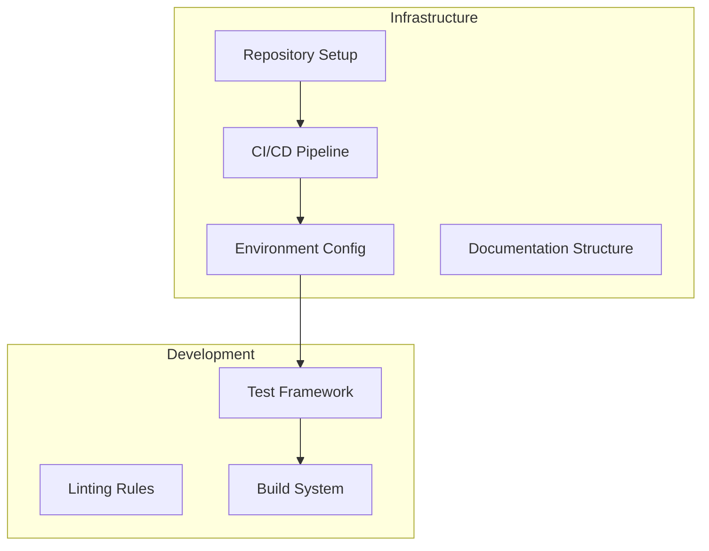
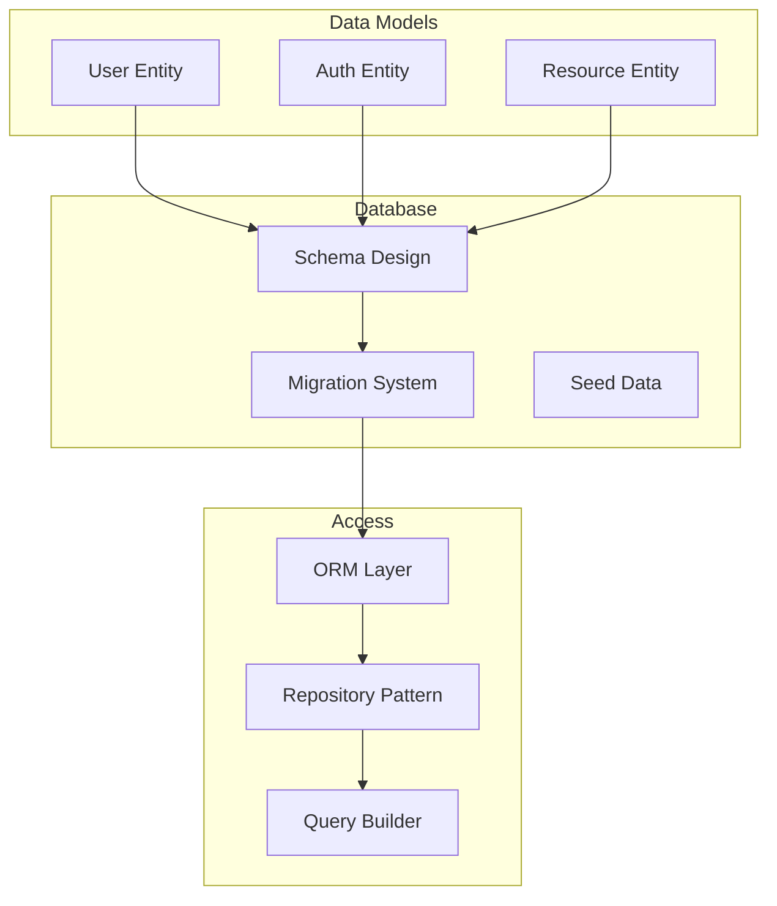

# PHASE 1 ARCHITECTURE PLAN - Foundation

---
created: 2025-01-24 10:00:00 PST
modified: 2025-01-24 10:00:00 PST
agent: architect
state: PHASE_PLANNING
phase: 1
version: 1.0.0
---

## Phase Overview

### Objectives
- Establish core infrastructure
- Implement foundational components
- Set up development and testing environment
- Create basic data models and APIs

### Architectural Focus
This phase establishes the architectural foundation that all subsequent phases will build upon. Priority is on correctness, extensibility, and establishing patterns.

## Phase 1 Components

### Wave 1: Infrastructure Setup


#### Key Decisions
- **Repository Structure**: Monorepo vs Multi-repo
- **CI/CD Tool**: GitHub Actions / Jenkins / GitLab CI
- **Container Strategy**: Docker / Podman
- **Package Manager**: npm / yarn / pnpm

### Wave 2: Data Layer


#### Technical Specifications
```yaml
database:
  type: PostgreSQL
  version: "14+"

models:
  user:
    fields:
      - id: UUID PRIMARY KEY
      - email: VARCHAR(255) UNIQUE NOT NULL
      - password_hash: VARCHAR(255) NOT NULL
      - created_at: TIMESTAMP DEFAULT NOW()
      - updated_at: TIMESTAMP DEFAULT NOW()

  auth_token:
    fields:
      - id: UUID PRIMARY KEY
      - user_id: UUID REFERENCES users(id)
      - token: VARCHAR(512) UNIQUE NOT NULL
      - expires_at: TIMESTAMP NOT NULL
      - created_at: TIMESTAMP DEFAULT NOW()
```

### Wave 3: API Foundation
```mermaid
graph TB
    subgraph "API Layer"
        ROUTE[Routing]
        MIDDLE[Middleware]
        VALID[Validation]
        ERROR[Error Handling]
    end

    subgraph "Endpoints"
        AUTH_EP[/auth/*]
        USER_EP[/users/*]
        HEALTH[/health]
    end

    ROUTE --> AUTH_EP
    ROUTE --> USER_EP
    ROUTE --> HEALTH
    MIDDLE --> ROUTE
    VALID --> MIDDLE
    ERROR --> VALID
```

#### API Standards
- **Protocol**: REST with JSON
- **Versioning**: URL path (v1, v2)
- **Authentication**: Bearer token
- **Documentation**: OpenAPI 3.0

## Integration Points

### Internal Integration
- Database ↔ ORM
- ORM ↔ Services
- Services ↔ API
- API ↔ Middleware

### External Integration (Prepared)
- Authentication provider hookpoints
- Payment gateway interface
- Email service interface
- Storage service interface

## Quality Attributes

### Performance Requirements
| Component | Metric | Target | Measurement |
|-----------|--------|--------|-------------|
| API Response | p95 latency | <200ms | Per endpoint |
| Database Query | p95 latency | <50ms | Per query |
| Build Time | Duration | <2min | CI/CD |
| Test Suite | Duration | <5min | All tests |

### Security Requirements
- All passwords bcrypt hashed (cost factor 12)
- API rate limiting (100 req/min default)
- SQL injection prevention via parameterized queries
- XSS prevention via output encoding

### Scalability Considerations
- Stateless API design
- Database connection pooling
- Horizontal scaling ready
- Cache preparation (Redis hookpoints)

## Technical Debt & Risks

### Accepted Debt
- Basic error messages (enhance in Phase 2)
- Simple logging (structured logging in Phase 2)
- Minimal monitoring (full observability in Phase 3)

### Mitigated Risks
| Risk | Mitigation |
|------|------------|
| Database schema changes | Migration system from start |
| API breaking changes | Versioning from v1 |
| Security vulnerabilities | Security testing in CI/CD |
| Performance issues | Benchmarks in test suite |

## Validation Criteria

### Wave Completion
- [ ] All components implemented
- [ ] Tests passing (>80% coverage)
- [ ] Documentation complete
- [ ] Performance targets met
- [ ] Security scan passed

### Phase Completion
- [ ] All waves integrated
- [ ] E2E tests passing
- [ ] Deployment successful
- [ ] Architecture review passed
- [ ] Ready for Phase 2

## Architectural Patterns

### Design Patterns Used
1. **Repository Pattern**: Data access abstraction
2. **Factory Pattern**: Object creation
3. **Strategy Pattern**: Authentication methods
4. **Chain of Responsibility**: Middleware pipeline

### Code Organization
```
src/
├── api/
│   ├── routes/
│   ├── middleware/
│   └── validators/
├── services/
│   ├── auth/
│   └── user/
├── data/
│   ├── models/
│   ├── repositories/
│   └── migrations/
├── utils/
│   ├── logger/
│   └── errors/
└── config/
    └── database.js
```

## Dependencies

### Core Dependencies
```json
{
  "production": {
    "express": "^4.18.0",
    "pg": "^8.11.0",
    "bcrypt": "^5.1.0",
    "jsonwebtoken": "^9.0.0"
  },
  "development": {
    "jest": "^29.0.0",
    "eslint": "^8.0.0",
    "prettier": "^3.0.0",
    "typescript": "^5.0.0"
  }
}
```

## Review Checklist

### Code Review Focus
- [ ] Consistent error handling
- [ ] Proper async/await usage
- [ ] SQL injection prevention
- [ ] Input validation complete
- [ ] Test coverage adequate

### Architecture Review Focus
- [ ] Patterns correctly implemented
- [ ] Separation of concerns maintained
- [ ] Extensibility preserved
- [ ] Performance optimizations applied
- [ ] Security best practices followed

---
*This is an example Phase 1 Architecture Plan. Adapt based on your specific technology stack and requirements.*