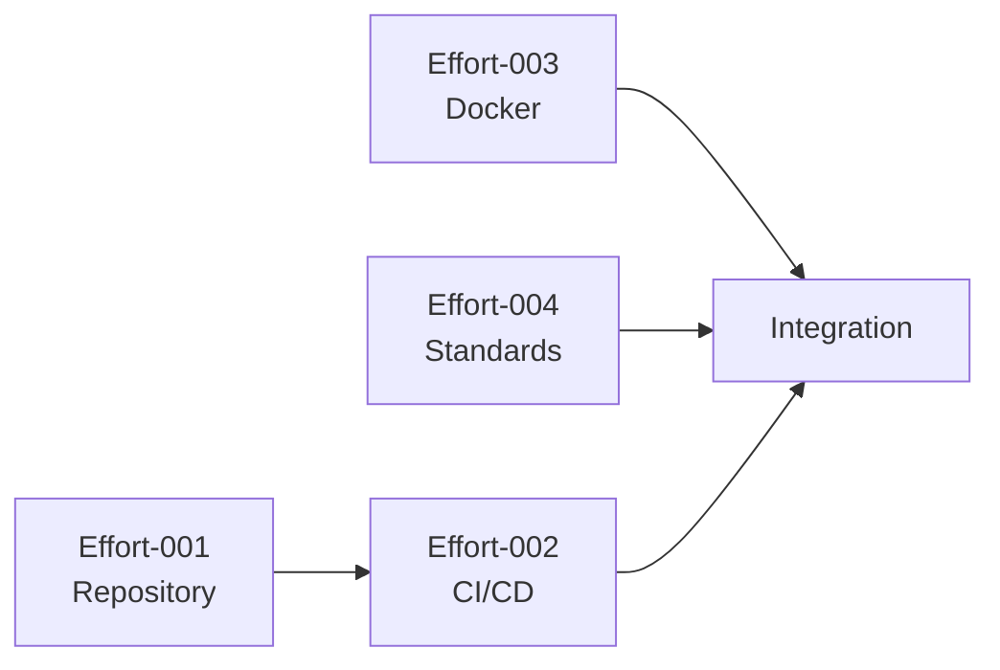

# EFFORT PLANS SUMMARY - Phase 1, Wave 1

---
created: 2025-01-24 10:00:00 PST
modified: 2025-01-24 10:00:00 PST
agent: orchestrator
state: CREATE_NEXT_INFRASTRUCTURE
phase: 1
wave: 1
version: 1.0.0
---

## Wave Overview

**Total Efforts**: 4
**Estimated Total Lines**: 600-750
**Parallelization Slots**: 2
**Estimated Duration**: 2-3 days

## Effort Matrix

| ID | Name | Size | Dependencies | Parallel | Agent | Status |
|----|------|------|--------------|----------|-------|--------|
| 001 | Repository Initialization | 150-200 | None | Yes | sw-engineer-01 | PENDING |
| 002 | CI/CD Pipeline Setup | 250-300 | 001 | No | sw-engineer-02 | PENDING |
| 003 | Development Environment | 200-250 | None | Yes | sw-engineer-01 | PENDING |
| 004 | Coding Standards | 100-150 | None | Yes | sw-engineer-03 | PENDING |

## Effort Details

### Effort 001: Repository Initialization
**Branch**: `phase1/wave1/effort-001-repository-init`
**Priority**: P0 (Blocking)

#### Key Deliverables
- Project structure
- Package configuration
- Git setup
- Basic documentation

#### Size Breakdown
- Directory structure: 30 lines
- Package.json: 40 lines
- Git config: 20 lines
- Entry point: 30 lines
- Documentation: 50 lines
- **Total**: ~170 lines

#### Risk Factors
- None (foundational effort)

---

### Effort 002: CI/CD Pipeline Setup
**Branch**: `phase1/wave1/effort-002-cicd-pipeline`
**Priority**: P0 (Blocking)

#### Key Deliverables
- GitHub Actions workflows
- Build pipeline
- Test automation
- Deployment configuration

#### Size Breakdown
- CI workflow: 100 lines
- CD workflow: 80 lines
- PR checks: 50 lines
- Scripts: 40 lines
- **Total**: ~270 lines

#### Risk Factors
- Dependency on effort 001
- Complex YAML configuration

---

### Effort 003: Development Environment
**Branch**: `phase1/wave1/effort-003-dev-environment`
**Priority**: P1 (High)

#### Key Deliverables
- Docker configuration
- Docker Compose setup
- Development scripts
- Environment documentation

#### Size Breakdown
- Dockerfile: 60 lines
- Docker Compose: 80 lines
- Scripts: 60 lines
- Documentation: 30 lines
- **Total**: ~230 lines

#### Risk Factors
- Docker complexity
- Cross-platform compatibility

---

### Effort 004: Coding Standards
**Branch**: `phase1/wave1/effort-004-coding-standards`
**Priority**: P1 (High)

#### Key Deliverables
- Linting configuration
- Formatting setup
- Pre-commit hooks
- Contributing guidelines

#### Size Breakdown
- ESLint config: 40 lines
- Prettier config: 20 lines
- Hooks setup: 30 lines
- Guidelines: 40 lines
- **Total**: ~130 lines

#### Risk Factors
- Tool compatibility
- Team agreement on standards

## Parallelization Strategy

### Execution Timeline
```
Time  | Slot 1         | Slot 2         | Slot 3
------|----------------|----------------|----------------
T+0h  | Effort-001 ▶️  | Effort-003 ▶️  | (waiting)
T+2h  | Effort-001 ✅  | Effort-003 ⏳  | Effort-004 ▶️
T+3h  | Effort-002 ▶️  | Effort-003 ✅  | Effort-004 ⏳
T+4h  | Effort-002 ⏳  | (idle)         | Effort-004 ✅
T+6h  | Effort-002 ✅  | (complete)     | (complete)
```

### Dependencies Graph


## Resource Allocation

### Agent Assignments
```yaml
sw-engineer-01:
  capacity: 2 sequential efforts
  assigned: [001, 003]

sw-engineer-02:
  capacity: 1 dedicated effort
  assigned: [002]

sw-engineer-03:
  capacity: 1 dedicated effort
  assigned: [004]

code-reviewer-01:
  capacity: All reviews
  timing: Post-completion
```

### Review Schedule
- Effort-001: T+2h review
- Effort-003: T+3h review
- Effort-004: T+4h review
- Effort-002: T+6h review

## Integration Plan

### Branch Strategy
```bash
# Base branch
main

# Wave integration branch
phase1-wave1-integration

# Effort branches
phase1/wave1/effort-001-repository-init
phase1/wave1/effort-002-cicd-pipeline
phase1/wave1/effort-003-dev-environment
phase1/wave1/effort-004-coding-standards
```

### Merge Sequence
1. Effort-001 → integration (required first)
2. Effort-003 → integration (parallel)
3. Effort-004 → integration (parallel)
4. Effort-002 → integration (depends on 001)
5. Integration → main (after architect review)

## Quality Metrics

### Size Compliance
```yaml
thresholds:
  warning: 700 lines
  error: 800 lines

monitoring:
  frequency: After each commit
  tool: line-counter.sh
```

### Review Metrics
```yaml
targets:
  first_pass_rate: 80%
  review_turnaround: <2 hours
  issues_per_kloc: <10
```

## Risk Management

### Wave Risks
| Risk | Impact | Probability | Mitigation |
|------|--------|-------------|------------|
| Effort overflow | High | Low | Frequent size checks |
| Integration conflicts | Medium | Low | Clear boundaries |
| Review bottleneck | Medium | Medium | Parallel reviews |
| Agent availability | High | Low | Backup assignments |

### Contingency Plans
- **Size overflow**: Immediate split into sub-efforts
- **Failed integration**: Rollback and fix in isolation
- **Review delays**: Escalate to orchestrator
- **Agent failure**: Reassign to available agent

## Success Criteria

### Wave Completion Requirements
- [ ] All 4 efforts completed
- [ ] Total size <800 lines per effort
- [ ] All tests passing
- [ ] Code reviews approved
- [ ] Successful integration
- [ ] Architect sign-off

### Quality Gates
- Coverage ≥85% per effort
- No critical security issues
- Performance benchmarks met
- Documentation complete

## Communication Protocol

### Status Updates
```json
{
  "wave": "phase1-wave1",
  "timestamp": "2025-01-24T10:00:00Z",
  "efforts": {
    "001": "COMPLETE",
    "002": "IN_PROGRESS",
    "003": "COMPLETE",
    "004": "IN_REVIEW"
  },
  "blockers": [],
  "next_milestone": "Integration"
}
```

### Escalation Path
1. Size violation → Immediate stop
2. Test failure → Fix in effort branch
3. Review rejection → Address feedback
4. Integration conflict → Orchestrator resolution

---
*This is an example Effort Plans Summary. Update with actual effort details as planning progresses.*