# WAVE IMPLEMENTATION PLAN - Phase 1, Wave 1

---
created: 2025-01-24 10:00:00 PST
modified: 2025-01-24 10:00:00 PST
agent: orchestrator
state: CREATE_NEXT_INFRASTRUCTURE
phase: 1
wave: 1
version: 1.0.0
---

## Wave Overview

**Wave ID**: phase1-wave1
**Title**: Infrastructure Setup
**Duration**: 2-3 days
**Effort Count**: 3-4 efforts
**Parallelization**: 2 concurrent efforts

### Wave Objectives
1. Initialize repository structure
2. Set up CI/CD pipeline
3. Configure development environment
4. Establish coding standards

## Effort Breakdown

### Effort 001: Repository Initialization
**Size Estimate**: 150-200 lines
**Dependencies**: None
**Parallel Safe**: Yes
**Agent**: sw-engineer-01

#### Scope
- Create repository structure
- Initialize package.json
- Set up .gitignore
- Create README.md structure
- Set up branch protection rules

#### Deliverables
```
project/
├── src/
│   └── index.js
├── tests/
│   └── setup.js
├── docs/
│   └── README.md
├── scripts/
│   └── setup.sh
├── .gitignore
├── package.json
└── README.md
```

### Effort 002: CI/CD Pipeline Setup
**Size Estimate**: 250-300 lines
**Dependencies**: effort-001
**Parallel Safe**: No
**Agent**: sw-engineer-02

#### Scope
- Create GitHub Actions workflows
- Set up build pipeline
- Configure test automation
- Add deployment stages
- Set up environment secrets

#### Deliverables
```
.github/
├── workflows/
│   ├── ci.yml          # Continuous Integration
│   ├── cd.yml          # Continuous Deployment
│   └── pr-check.yml    # PR validation
├── CODEOWNERS
└── PULL_REQUEST_TEMPLATE.md
```

### Effort 003: Development Environment
**Size Estimate**: 200-250 lines
**Dependencies**: None
**Parallel Safe**: Yes
**Agent**: sw-engineer-01

#### Scope
- Docker configuration
- Docker Compose setup
- Environment variables
- Development scripts
- Local setup documentation

#### Deliverables
```
docker/
├── Dockerfile
├── docker-compose.yml
└── .env.example

scripts/
├── dev-setup.sh
├── run-local.sh
└── run-tests.sh
```

### Effort 004: Coding Standards
**Size Estimate**: 100-150 lines
**Dependencies**: None
**Parallel Safe**: Yes
**Agent**: sw-engineer-03

#### Scope
- ESLint configuration
- Prettier setup
- Husky pre-commit hooks
- Editor config
- Contributing guidelines

#### Deliverables
```
.eslintrc.json
.prettierrc
.editorconfig
.husky/
├── pre-commit
└── pre-push
CONTRIBUTING.md
```

## Execution Schedule

### Day 1

```mermaid
gantt
    title Wave 1 Execution Schedule
    dateFormat HH:mm
    section Morning
    Effort 001 (Repo)     :active, e001, 09:00, 2h
    Effort 003 (Docker)   :active, e003, 09:00, 3h
    section Afternoon
    Effort 002 (CI/CD)    :e002, 13:00, 3h
    Effort 004 (Standards):e004, 13:00, 2h
```


### Parallelization Strategy
- **Slot 1**: effort-001, effort-003 (parallel start)
- **Slot 2**: effort-002 (depends on effort-001)
- **Slot 3**: effort-004 (independent)

## Resource Allocation

### Agent Assignment
```yaml
agents:
  sw-engineer-01:
    efforts: [001, 003]
    capacity: sequential

  sw-engineer-02:
    efforts: [002]
    capacity: dedicated

  sw-engineer-03:
    efforts: [004]
    capacity: dedicated

  code-reviewer-01:
    efforts: all
    timing: post-completion
```

## Integration Plan

### Integration Sequence
1. Merge effort-001 (repository base)
2. Merge effort-003 (can parallel with 001)
3. Merge effort-002 (needs 001)
4. Merge effort-004 (independent)

### Integration Branch
- Name: `phase1-wave1-integration`
- Base: `main`
- Strategy: Squash and merge

## Quality Gates

### Per-Effort Validation
- [ ] Size ≤800 lines (line-counter.sh)
- [ ] Tests passing
- [ ] Linting passing
- [ ] Code review approved
- [ ] Documentation updated

### Wave Completion Criteria
- [ ] All efforts merged to integration branch
- [ ] Integration tests passing
- [ ] No merge conflicts
- [ ] Architect review completed
- [ ] Performance benchmarks met

## Risk Management

### Identified Risks
| Risk | Impact | Probability | Mitigation |
|------|--------|-------------|------------|
| CI/CD complexity | High | Medium | Start simple, iterate |
| Docker issues | Medium | Low | Fallback to local dev |
| Merge conflicts | Low | Low | Clear effort boundaries |

### Contingency Plans
- If effort exceeds 800 lines → Split immediately
- If parallel conflicts occur → Sequential execution
- If integration fails → Rollback and fix

## Success Metrics

### Wave Metrics
- **Velocity**: 4 efforts / 2 days
- **Quality**: First-pass review rate >80%
- **Size Compliance**: 100% under limit
- **Integration Success**: Zero rollbacks

### Tracking
```yaml
metrics:
  lines_of_code:
    target: <1000
    actual: [TO BE MEASURED]

  test_coverage:
    target: 80%
    actual: [TO BE MEASURED]

  review_turnaround:
    target: <2 hours
    actual: [TO BE MEASURED]
```

## Communication Plan

### Status Updates
- **Frequency**: Every 4 hours
- **Channel**: orchestrator-state-v3.json
- **Format**: Structured JSON update

### Escalation Path
1. Size violation → Immediate stop
2. Blocking issue → Architect consultation
3. Integration failure → Orchestrator intervention

## Post-Wave Activities

### Documentation
- Update wave completion report
- Document lessons learned
- Update effort estimates

### Preparation for Wave 2
- Review Wave 2 requirements
- Allocate agents
- Prepare integration branch

---
*This is an example Wave Implementation Plan. Actual efforts and dependencies will vary based on your project.*