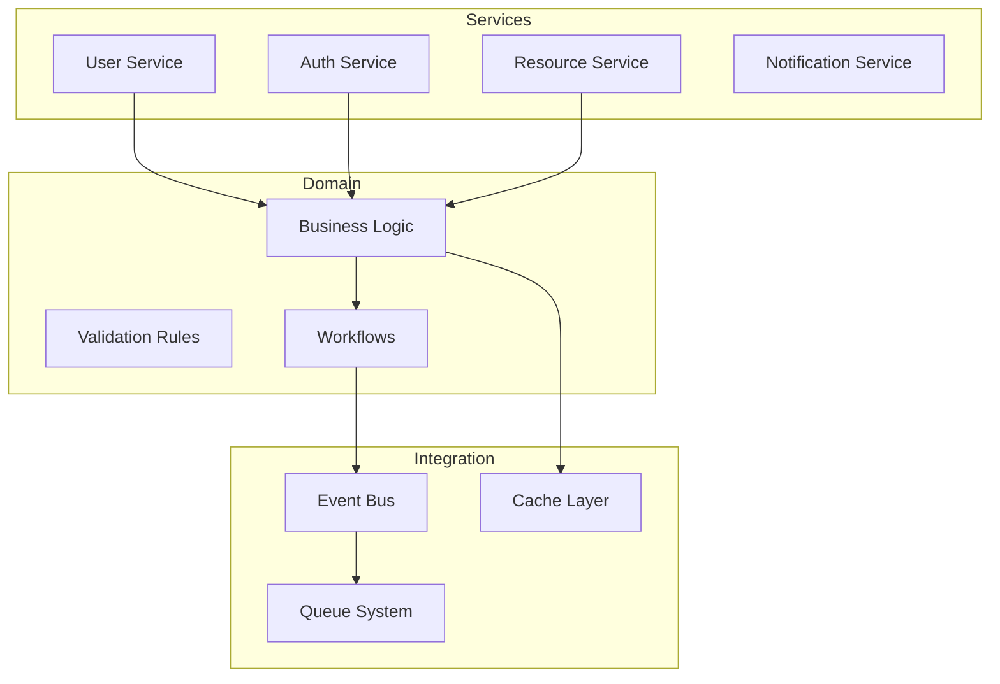
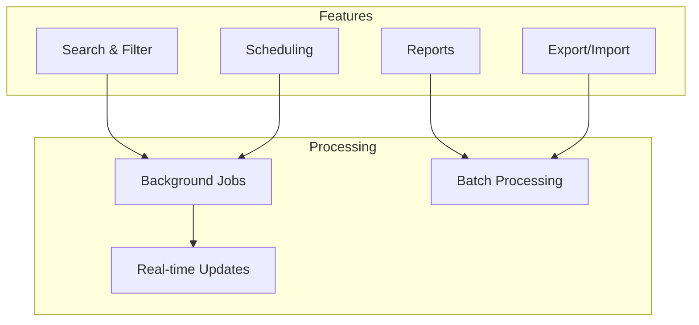
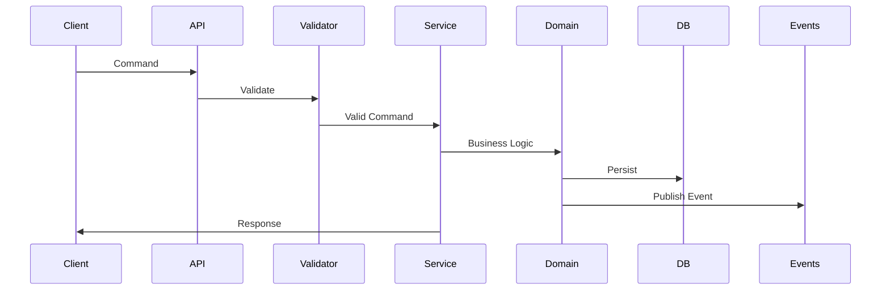
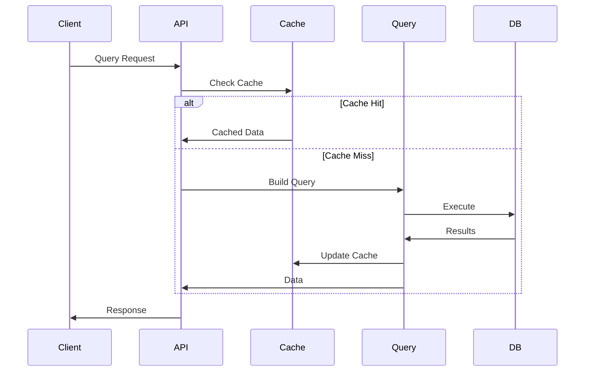

# PHASE 2 ARCHITECTURE PLAN - Core Features

---
created: 2025-01-24 10:00:00 PST
modified: 2025-01-24 10:00:00 PST
agent: architect
state: PHASE_PLANNING
phase: 2
version: 1.0.0
---

## Phase Overview

### Objectives
- Implement core business logic
- Build primary features
- Establish service layer
- Integrate with external systems

### Architectural Focus
Phase 2 builds upon the foundation established in Phase 1, adding the core business functionality that delivers primary value to users.

## Phase 2 Components

### Wave 1: Business Logic Layer


### Wave 2: Advanced Features


## Integration Architecture

### Internal Services
```yaml
services:
  user_service:
    type: REST API
    port: 3001
    dependencies: [auth_service, database]

  auth_service:
    type: REST API
    port: 3002
    dependencies: [database, cache]

  notification_service:
    type: Event-driven
    dependencies: [queue, email_provider]

  background_processor:
    type: Worker
    dependencies: [queue, database]
```

### External Integrations
```yaml
integrations:
  payment:
    provider: Stripe
    pattern: API Gateway
    auth: OAuth 2.0

  email:
    provider: SendGrid
    pattern: SMTP/API
    fallback: Local queue

  storage:
    provider: S3/MinIO
    pattern: Direct API
    caching: CloudFront/Local

  analytics:
    provider: Segment
    pattern: Event streaming
    batching: 100 events
```

## Data Flow Architecture

### Command Flow (Write Path)


### Query Flow (Read Path)


## Service Layer Patterns

### Service Design
```typescript
interface Service<T> {
  create(data: CreateDTO): Promise<T>
  update(id: string, data: UpdateDTO): Promise<T>
  delete(id: string): Promise<void>
  findById(id: string): Promise<T>
  findMany(filter: FilterDTO): Promise<T[]>
}

abstract class BaseService<T> implements Service<T> {
  constructor(
    protected repository: Repository<T>,
    protected validator: Validator,
    protected eventBus: EventBus
  ) {}

  async create(data: CreateDTO): Promise<T> {
    await this.validator.validate(data)
    const entity = await this.repository.create(data)
    await this.eventBus.publish('created', entity)
    return entity
  }
}
```

### Repository Pattern
```typescript
interface Repository<T> {
  create(data: any): Promise<T>
  update(id: string, data: any): Promise<T>
  delete(id: string): Promise<void>
  findById(id: string): Promise<T | null>
  findMany(filter: any): Promise<T[]>
}
```

## Caching Strategy

### Cache Layers
1. **L1 - Application Cache**
   - In-memory cache
   - TTL: 5 minutes
   - Size: 100MB

2. **L2 - Distributed Cache**
   - Redis cluster
   - TTL: 1 hour
   - Size: 10GB

3. **L3 - CDN Cache**
   - Static assets
   - TTL: 24 hours
   - Geographic distribution

### Cache Patterns
```yaml
patterns:
  cache_aside:
    - User profiles
    - Resource metadata

  write_through:
    - Session data
    - Configuration

  write_behind:
    - Analytics events
    - Audit logs
```

## Queue Architecture

### Queue Configuration
```yaml
queues:
  high_priority:
    type: FIFO
    max_retries: 3
    timeout: 30s
    dlq: true

  default:
    type: Standard
    max_retries: 5
    timeout: 60s
    dlq: true

  bulk_processing:
    type: Batch
    batch_size: 100
    timeout: 300s
    dlq: true
```

### Job Types
```yaml
jobs:
  email_notification:
    queue: high_priority
    processor: NotificationWorker

  report_generation:
    queue: default
    processor: ReportWorker

  data_import:
    queue: bulk_processing
    processor: ImportWorker
```

## Security Enhancements

### Authentication Improvements
- Multi-factor authentication (MFA)
- OAuth2/OIDC providers
- JWT refresh token rotation
- Session management

### Authorization Framework
```yaml
rbac:
  roles:
    - admin
    - manager
    - user
    - guest

  permissions:
    - resource:create
    - resource:read
    - resource:update
    - resource:delete

  policies:
    - name: owner_only
      condition: user.id == resource.owner_id
    - name: admin_override
      condition: user.role == 'admin'
```

## Performance Optimizations

### Database Optimizations
- Query optimization
- Index strategy
- Connection pooling
- Read replicas

### Application Optimizations
- Lazy loading
- Pagination
- Response compression
- Request batching

## Monitoring & Observability

### Metrics Collection
```yaml
metrics:
  application:
    - request_rate
    - error_rate
    - response_time

  business:
    - user_signups
    - resource_created
    - revenue_processed

  infrastructure:
    - cpu_usage
    - memory_usage
    - disk_io
```

### Distributed Tracing
- Request correlation IDs
- Service-to-service tracing
- Performance bottleneck identification

## Technical Debt Management

### Identified Debt from Phase 1
- Basic error messages → Structured error responses
- Simple logging → Structured logging with context
- Manual deployment → Automated CD pipeline

### Debt Mitigation Plan
- Allocate 20% of effort to debt reduction
- Track debt in backlog
- Regular refactoring sessions

---
*This is an example Phase 2 Architecture Plan. Adapt based on your specific requirements.*