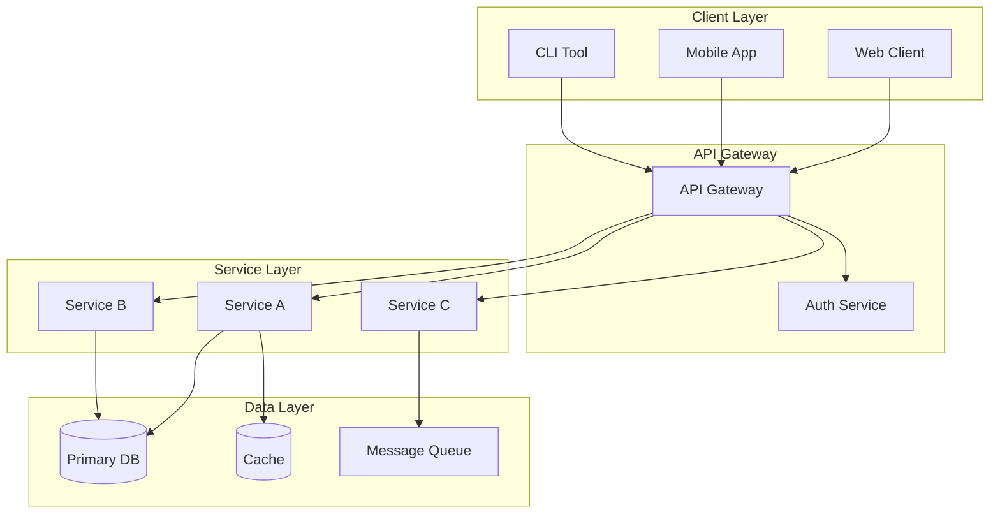
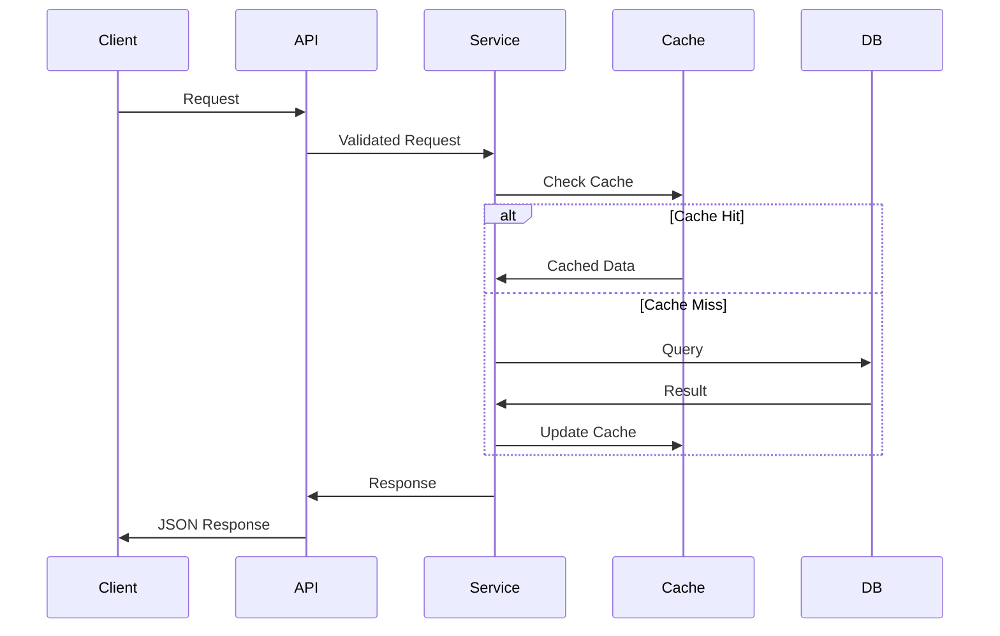

# PROJECT ARCHITECTURE PLAN - [PROJECT_NAME]

---
created: 2025-01-24 10:00:00 PST
modified: 2025-01-24 10:00:00 PST
agent: architect
state: PLANNING
version: 1.0.0
---

## Architecture Vision

### System Overview
[PROJECT_NAME] is a [TYPE] system designed to [PRIMARY_PURPOSE]. It follows a [ARCHITECTURE_PATTERN] architecture with emphasis on [KEY_PRINCIPLES].

### Core Principles
1. **Modularity**: Clear separation of concerns
2. **Scalability**: Horizontal scaling capability
3. **Testability**: Dependency injection, mocking support
4. **Security**: Defense in depth, zero trust
5. **Observability**: Comprehensive logging and metrics

## High-Level Architecture



## Component Architecture

### 1. Presentation Layer
**Responsibility**: User interface and experience
**Technologies**: [FRONTEND_STACK]
**Key Patterns**:
- MVC/MVVM pattern
- Responsive design
- Progressive enhancement

### 2. API Layer
**Responsibility**: External communication interface
**Technologies**: REST/GraphQL over HTTPS
**Key Patterns**:
- OpenAPI specification
- Rate limiting
- Request validation
- CORS handling

### 3. Service Layer
**Responsibility**: Business logic implementation
**Technologies**: [BACKEND_STACK]
**Key Patterns**:
- Domain-driven design
- Service repository pattern
- Dependency injection
- Transaction management

### 4. Data Access Layer
**Responsibility**: Data persistence and retrieval
**Technologies**: [DATABASE_STACK]
**Key Patterns**:
- Repository pattern
- Unit of work
- Query optimization
- Connection pooling

## Data Architecture

### Data Flow


### Data Models
```yaml
entities:
  User:
    - id: UUID
    - email: String
    - created_at: Timestamp
    - updated_at: Timestamp

  Resource:
    - id: UUID
    - name: String
    - owner_id: UUID (FK -> User)
    - status: Enum
    - metadata: JSONB
```

## Security Architecture

### Authentication & Authorization
- **Method**: JWT/OAuth2
- **Storage**: Secure HTTP-only cookies
- **Rotation**: Token refresh mechanism
- **RBAC**: Role-based access control

### Security Layers
1. **Network**: TLS 1.3, firewall rules
2. **Application**: Input validation, output encoding
3. **Data**: Encryption at rest, in transit
4. **Audit**: Comprehensive logging, monitoring

## Deployment Architecture

### Container Strategy
```yaml
services:
  api:
    image: app/api:latest
    replicas: 3
    resources:
      cpu: 500m
      memory: 512Mi

  worker:
    image: app/worker:latest
    replicas: 2
    resources:
      cpu: 1000m
      memory: 1Gi
```

### Infrastructure
- **Orchestration**: Kubernetes/Docker Swarm
- **Service Mesh**: Istio/Linkerd (optional)
- **Ingress**: Nginx/Traefik
- **Monitoring**: Prometheus + Grafana

## Performance Architecture

### Caching Strategy
- **L1 Cache**: Application memory (5min TTL)
- **L2 Cache**: Redis (1hr TTL)
- **CDN**: Static assets (24hr TTL)

### Optimization Points
- Database query optimization
- Connection pooling
- Lazy loading
- Pagination
- Compression

## Integration Architecture

### External Systems
```yaml
integrations:
  payment:
    provider: Stripe
    protocol: REST API
    auth: API Key

  email:
    provider: SendGrid
    protocol: SMTP/API
    auth: API Key

  storage:
    provider: S3
    protocol: S3 API
    auth: IAM Role
```

### Event Architecture
- **Message Broker**: RabbitMQ/Kafka
- **Pattern**: Publish-Subscribe
- **Delivery**: At-least-once guarantee
- **Serialization**: JSON/Protobuf

## Observability Architecture

### Monitoring Stack
- **Metrics**: Prometheus
- **Visualization**: Grafana
- **Logging**: ELK Stack
- **Tracing**: Jaeger/Zipkin
- **Alerting**: AlertManager

### Key Metrics
- Request rate, error rate, duration (RED)
- CPU, memory, disk, network (USE)
- Business metrics (custom)

## Development Architecture

### Repository Structure
```
project/
├── api/              # API service
├── web/              # Web frontend
├── mobile/           # Mobile app
├── shared/           # Shared libraries
├── infra/            # Infrastructure code
├── docs/             # Documentation
└── scripts/          # Automation scripts
```

### CI/CD Pipeline
1. **Build**: Compile, transpile
2. **Test**: Unit, integration, E2E
3. **Security**: SAST, dependency scan
4. **Package**: Container build
5. **Deploy**: Progressive rollout

## Architecture Decisions (ADRs)

### ADR-001: Microservices vs Monolith
**Decision**: Start with modular monolith
**Rationale**: Faster initial development, easier refactoring

### ADR-002: Database Selection
**Decision**: PostgreSQL for primary storage
**Rationale**: ACID compliance, JSON support, proven reliability

### ADR-003: Authentication Method
**Decision**: JWT with refresh tokens
**Rationale**: Stateless, scalable, industry standard

## Compliance & Standards

### Coding Standards
- Language style guides enforced
- Linting on pre-commit
- Code review mandatory
- Test coverage >80%

### Documentation Standards
- OpenAPI for all endpoints
- README for all services
- Inline code documentation
- Architecture diagrams updated

## Risk Analysis

### Technical Debt
- Identify and track in backlog
- Regular refactoring sprints
- Dependency updates quarterly

### Scalability Risks
- Database bottlenecks → Read replicas
- API rate limits → Caching, CDN
- Memory leaks → Monitoring, profiling

## Migration Strategy

### Phase 1: Foundation
- Core services implementation
- Basic functionality
- Development environment

### Phase 2: Features
- Business logic
- Integrations
- Advanced features

### Phase 3: Production
- Performance optimization
- Security hardening
- Monitoring setup

---
*This is an example file. Replace [PLACEHOLDERS] with actual architecture details for your project.*