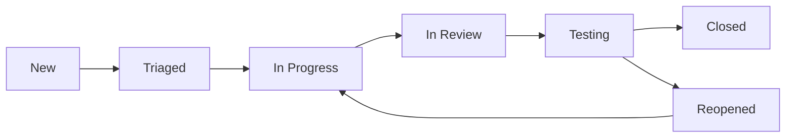

# PROJECT TEST PLAN - [PROJECT_NAME]

---
created: 2025-01-24 10:00:00 PST
modified: 2025-01-24 10:00:00 PST
agent: orchestrator
state: PLANNING
version: 1.0.0
---

## Test Strategy Overview

### Testing Philosophy
- **Shift Left**: Test early and often
- **Automation First**: Automate all repeatable tests
- **Risk-Based**: Focus on high-risk areas
- **Continuous**: Test in every phase of development

### Coverage Goals
| Type | Target | Priority |
|------|--------|----------|
| Unit Tests | 80% | Critical |
| Integration Tests | 70% | High |
| E2E Tests | 60% | Medium |
| Performance Tests | Key Paths | High |
| Security Tests | All Endpoints | Critical |

## Test Pyramid

```
        /\
       /E2E\        (5%) - Critical user journeys
      /------\
     /  API   \     (15%) - Contract testing
    /----------\
   /Integration \   (30%) - Service integration
  /--------------\
 /   Unit Tests   \ (50%) - Business logic
/------------------\
```

## Test Types & Scope

### 1. Unit Testing
**Scope**: Individual functions/methods
**Tools**: [TEST_FRAMEWORK]
**Execution**: On every commit

#### What to Test
- Pure functions
- Business logic
- Data transformations
- Validation rules
- Error handling

#### Example Structure
```javascript
describe('UserService', () => {
  describe('validateEmail', () => {
    it('should accept valid email', () => {
      // Test implementation
    });
    it('should reject invalid email', () => {
      // Test implementation
    });
  });
});
```

### 2. Integration Testing
**Scope**: Component interactions
**Tools**: [INTEGRATE_WAVE_EFFORTS_FRAMEWORK]
**Execution**: On PR creation

#### What to Test
- Database operations
- API endpoints
- Service communication
- External service mocking
- Transaction boundaries

### 3. End-to-End Testing
**Scope**: Complete user workflows
**Tools**: [E2E_FRAMEWORK]
**Execution**: Before deployment

#### Critical Paths
1. User Registration → Login → Profile Update
2. Create Resource → Edit → Delete
3. Payment Flow (if applicable)
4. Error Recovery Scenarios

### 4. Performance Testing
**Scope**: Load and stress testing
**Tools**: [PERF_FRAMEWORK]
**Execution**: Weekly/Before release

#### Metrics
- Response time (p50, p95, p99)
- Throughput (requests/second)
- Error rate under load
- Resource utilization

#### Scenarios
```yaml
scenarios:
  normal_load:
    users: 100
    duration: 5m
    ramp_up: 30s

  peak_load:
    users: 1000
    duration: 15m
    ramp_up: 2m

  stress_test:
    users: 5000
    duration: 30m
    ramp_up: 5m
```

### 5. Security Testing
**Scope**: Vulnerability assessment
**Tools**: [SECURITY_TOOLS]
**Execution**: Before each release

#### Test Categories
- Authentication bypass attempts
- SQL injection
- XSS attacks
- CSRF protection
- Rate limiting
- Input validation

## Test Environments

### Development
- **Purpose**: Developer testing
- **Data**: Synthetic test data
- **Access**: All developers
- **Refresh**: Daily

### Staging
- **Purpose**: Pre-production validation
- **Data**: Production-like data
- **Access**: QA team
- **Refresh**: Weekly

### Production
- **Purpose**: Smoke tests only
- **Data**: Real data
- **Access**: Limited
- **Tests**: Health checks, monitoring

## Test Data Management

### Strategy
```yaml
test_data:
  generation:
    method: Factories/Fixtures
    tool: [DATA_GENERATOR]

  isolation:
    method: Transaction rollback
    cleanup: After each test

  security:
    pii_handling: Anonymized
    credentials: Environment variables
```

### Data Categories
1. **Static Data**: Reference data, configurations
2. **Dynamic Data**: User-generated content
3. **Edge Cases**: Boundary values, special characters
4. **Performance Data**: Large datasets

## Test Automation

### CI/CD Integration
```yaml
pipeline:
  - stage: build
    script: npm run build

  - stage: unit_test
    script: npm run test:unit
    coverage: 80%

  - stage: integration_test
    script: npm run test:integration
    parallel: true

  - stage: e2e_test
    script: npm run test:e2e
    environment: staging

  - stage: security_scan
    script: npm audit
```

### Test Execution Matrix
| Test Type | Trigger | Duration | Blocking |
|-----------|---------|----------|----------|
| Unit | Every commit | <2 min | Yes |
| Integration | PR creation | <5 min | Yes |
| E2E | Pre-deploy | <15 min | Yes |
| Performance | Weekly | <30 min | No |
| Security | Pre-release | <20 min | Yes |

## Test Documentation

### Test Case Template
```markdown
## Test ID: TC-XXX
**Feature**: [Feature Name]
**Scenario**: [What is being tested]

### Preconditions
- [Required setup]

### Test Steps
1. [Step 1]
2. [Step 2]
3. [Step 3]

### Expected Results
- [Expected outcome]

### Actual Results
- [To be filled during execution]

### Status: [Pass/Fail]
```

## Bug Management

### Severity Levels
- **P0 (Critical)**: System down, data loss
- **P1 (High)**: Major feature broken
- **P2 (Medium)**: Minor feature issue
- **P3 (Low)**: Cosmetic issue

### Bug Workflow


## Test Metrics & Reporting

### Key Metrics
- **Test Coverage**: Lines, branches, functions
- **Test Execution Time**: By type and suite
- **Defect Density**: Bugs per KLOC
- **Test Effectiveness**: Bugs found in testing vs production
- **Automation Rate**: Automated vs manual tests

### Reporting Schedule
- **Daily**: Test execution status
- **Weekly**: Coverage trends
- **Sprint**: Quality metrics
- **Release**: Comprehensive report

## Risk-Based Testing

### High-Risk Areas
| Area | Risk Level | Test Priority | Coverage Target |
|------|------------|---------------|-----------------|
| Payment Processing | Critical | P0 | 95% |
| User Authentication | Critical | P0 | 90% |
| Data Processing | High | P1 | 85% |
| UI Components | Medium | P2 | 70% |

## Test Maintenance

### Review Schedule
- Test cases: Quarterly
- Test data: Monthly
- Test environments: Weekly
- Test tools: Semi-annually

### Cleanup Activities
- Remove obsolete tests
- Update test documentation
- Refactor test code
- Archive old test results

## Contingency Planning

### Rollback Criteria
- P0 bug in production
- >5% increase in error rate
- Performance degradation >20%
- Security vulnerability discovered

### Emergency Procedures
1. Immediate notification to stakeholders
2. Rollback to previous version
3. Root cause analysis
4. Hotfix development and testing
5. Controlled re-deployment

---
*This is an example file. Customize for your specific project requirements.*