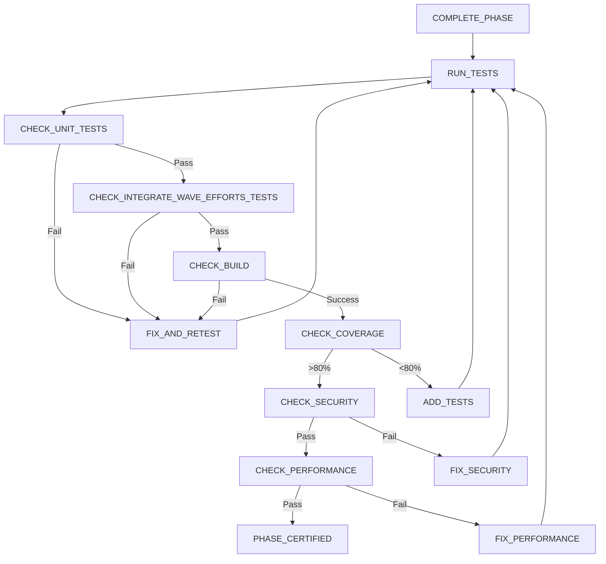

# 🚨🚨🚨 R035: Phase Completion Testing 🚨🚨🚨

**Category:** Quality Assurance Rules  
**Agents:** orchestrator (coordinator), code-reviewer (validator), architect (assessor)  
**Criticality:** BLOCKING - No phase proceeds without passing all tests  
**State:** COMPLETE_PHASE, FUNCTIONAL_TEST

## CORE PROTOCOL

### 1. MANDATORY TESTING REQUIREMENTS

Before ANY phase can be marked complete:
- **ALL** unit tests must pass (100% pass rate)
- **ALL** integration tests must pass (100% pass rate)
- Build must succeed on phase integration branch
- Coverage requirements must be met (>80% new code)
- Performance benchmarks must pass (if defined)
- Security scan must show no critical/high vulnerabilities
- No known blocking issues can remain

### 2. PHASE TESTING SEQUENCE

```bash
# Complete phase testing protocol
run_phase_completion_tests() {
    local PHASE=$1
    local PHASE_BRANCH="phase-${PHASE}-integration"
    local TEST_REPORT="phase-${PHASE}-test-report.md"
    
    echo "🧪 Starting Phase $PHASE completion testing..."
    
    # Checkout phase integration branch
    cd $CLAUDE_PROJECT_DIR
    git checkout "$PHASE_BRANCH"
    git pull origin "$PHASE_BRANCH"
    
    # Initialize test results
    local ALL_TESTS_PASS=true
    
    # 1. Run unit tests
    echo "📋 Running unit tests..."
    go test ./... -v -cover > unit-test-results.log 2>&1
    local UNIT_TEST_RESULT=$?
    
    if [[ $UNIT_TEST_RESULT -ne 0 ]]; then
        echo "❌ Unit tests FAILED"
        ALL_TESTS_PASS=false
    else
        echo "✅ Unit tests PASSED"
    fi
    
    # 2. Run integration tests
    echo "📋 Running integration tests..."
    go test ./... -tags=integration -v > integration-test-results.log 2>&1
    local INTEGRATE_WAVE_EFFORTS_TEST_RESULT=$?
    
    if [[ $INTEGRATE_WAVE_EFFORTS_TEST_RESULT -ne 0 ]]; then
        echo "❌ Integration tests FAILED"
        ALL_TESTS_PASS=false
    else
        echo "✅ Integration tests PASSED"
    fi
    
    # 3. Check build
    echo "📋 Verifying build..."
    go build -o phase-${PHASE}-binary ./...
    local BUILD_RESULT=$?
    
    if [[ $BUILD_RESULT -ne 0 ]]; then
        echo "❌ Build FAILED"
        ALL_TESTS_PASS=false
    else
        echo "✅ Build SUCCEEDED"
    fi
    
    # 4. Check test coverage
    echo "📋 Analyzing test coverage..."
    go test ./... -coverprofile=coverage.out
    local COVERAGE=$(go tool cover -func=coverage.out | grep total | awk '{print $3}' | sed 's/%//')
    
    if (( $(echo "$COVERAGE < 80" | bc -l) )); then
        echo "❌ Coverage too low: ${COVERAGE}% (required: 80%)"
        ALL_TESTS_PASS=false
    else
        echo "✅ Coverage acceptable: ${COVERAGE}%"
    fi
    
    # 5. Run security scan
    echo "📋 Running security scan..."
    gosec -fmt json -out security-report.json ./... 2>/dev/null
    local CRITICAL_ISSUES=$(jq '[.Issues[] | select(.severity == "HIGH" or .severity == "CRITICAL")] | length' security-report.json)
    
    if [[ $CRITICAL_ISSUES -gt 0 ]]; then
        echo "❌ Security scan found $CRITICAL_ISSUES critical/high issues"
        ALL_TESTS_PASS=false
    else
        echo "✅ Security scan PASSED"
    fi
    
    # 6. Performance benchmarks (if exists)
    if [ -f "benchmarks.sh" ]; then
        echo "📋 Running performance benchmarks..."
        ./benchmarks.sh > benchmark-results.log 2>&1
        local BENCHMARK_RESULT=$?
        
        if [[ $BENCHMARK_RESULT -ne 0 ]]; then
            echo "❌ Performance benchmarks FAILED"
            ALL_TESTS_PASS=false
        else
            echo "✅ Performance benchmarks PASSED"
        fi
    fi
    
    # Generate test report
    generate_phase_test_report "$PHASE" "$ALL_TESTS_PASS"
    
    # Return overall result
    if [[ "$ALL_TESTS_PASS" == "true" ]]; then
        echo "✅ Phase $PHASE testing COMPLETE - ALL TESTS PASSED"
        return 0
    else
        echo "❌ Phase $PHASE testing FAILED - See report for details"
        return 1
    fi
}
```

### 3. TEST REPORT GENERATION

```bash
generate_phase_test_report() {
    local PHASE=$1
    local ALL_PASSED=$2
    local REPORT_FILE="test-reports/phase-${PHASE}-test-report.md"
    
    mkdir -p test-reports
    
    cat > "$REPORT_FILE" << EOF
# Phase ${PHASE} Test Completion Report

## Test Summary
**Date**: $(date -Iseconds)
**Phase**: ${PHASE}
**Branch**: phase-${PHASE}-integration
**Overall Status**: $([ "$ALL_PASSED" == "true" ] && echo "✅ PASSED" || echo "❌ FAILED")

## Test Results

### Unit Tests
- **Status**: $([ $UNIT_TEST_RESULT -eq 0 ] && echo "PASSED" || echo "FAILED")
- **Test Count**: $(grep -c "^=== RUN" unit-test-results.log)
- **Pass Count**: $(grep -c "^--- PASS" unit-test-results.log)
- **Fail Count**: $(grep -c "^--- FAIL" unit-test-results.log)
- **Duration**: $(grep "^PASS\|^FAIL" unit-test-results.log | tail -1 | awk '{print $2}')

### Integration Tests
- **Status**: $([ $INTEGRATE_WAVE_EFFORTS_TEST_RESULT -eq 0 ] && echo "PASSED" || echo "FAILED")
- **Test Count**: $(grep -c "^=== RUN" integration-test-results.log)
- **Pass Count**: $(grep -c "^--- PASS" integration-test-results.log)
- **Fail Count**: $(grep -c "^--- FAIL" integration-test-results.log)

### Build Verification
- **Status**: $([ $BUILD_RESULT -eq 0 ] && echo "PROJECT_DONE" || echo "FAILED")
- **Binary Created**: phase-${PHASE}-binary
- **Build Time**: $(stat -c %y phase-${PHASE}-binary 2>/dev/null || echo "N/A")

### Code Coverage
- **Overall Coverage**: ${COVERAGE}%
- **Required Coverage**: 80%
- **Status**: $([ $(echo "$COVERAGE >= 80" | bc -l) -eq 1 ] && echo "PASSED" || echo "FAILED")

### Security Scan
- **Critical Issues**: $(jq '[.Issues[] | select(.severity == "CRITICAL")] | length' security-report.json)
- **High Issues**: $(jq '[.Issues[] | select(.severity == "HIGH")] | length' security-report.json)
- **Medium Issues**: $(jq '[.Issues[] | select(.severity == "MEDIUM")] | length' security-report.json)
- **Status**: $([ $CRITICAL_ISSUES -eq 0 ] && echo "PASSED" || echo "FAILED")

### Performance Benchmarks
- **Status**: $([ -f "benchmarks.sh" ] && ([ $BENCHMARK_RESULT -eq 0 ] && echo "PASSED" || echo "FAILED") || echo "N/A")

## Failed Tests Details
$(if [ "$ALL_PASSED" != "true" ]; then
    echo "### Unit Test Failures"
    grep -A 5 "^--- FAIL" unit-test-results.log || echo "None"
    echo ""
    echo "### Integration Test Failures"
    grep -A 5 "^--- FAIL" integration-test-results.log || echo "None"
fi)

## Action Items
$(if [ "$ALL_PASSED" != "true" ]; then
    echo "- [ ] Fix failing unit tests"
    echo "- [ ] Fix failing integration tests"
    [ $BUILD_RESULT -ne 0 ] && echo "- [ ] Fix build errors"
    [ $(echo "$COVERAGE < 80" | bc -l) -eq 1 ] && echo "- [ ] Increase test coverage to 80%"
    [ $CRITICAL_ISSUES -gt 0 ] && echo "- [ ] Fix critical/high security issues"
    [ $BENCHMARK_RESULT -ne 0 ] && echo "- [ ] Fix performance regressions"
else
    echo "✅ No action items - all tests passed"
fi)

## Certification
**Phase ${PHASE} is $([ "$ALL_PASSED" == "true" ] && echo "READY" || echo "NOT READY") for production.**

---
Generated: $(date -Iseconds)
Report Hash: $(sha256sum "$REPORT_FILE" | cut -d' ' -f1)
EOF
    
    # Commit report
    git add "$REPORT_FILE"
    git commit -m "test: Phase $PHASE completion test report - $([ "$ALL_PASSED" == "true" ] && echo "PASSED" || echo "FAILED")"
    git push
    
    echo "📄 Test report generated: $REPORT_FILE"
}
```

### 4. TEST CATEGORIES AND REQUIREMENTS

#### Unit Tests
```yaml
unit_test_requirements:
  pass_rate: 100%  # ALL must pass
  timeout: 10m
  parallel: true
  coverage_contribution: true
  failure_action: BLOCK_PHASE_COMPLETION
```

#### Integration Tests
```yaml
integration_test_requirements:
  pass_rate: 100%  # ALL must pass
  timeout: 30m
  parallel: false  # Run sequentially
  environment: integration_test_env
  failure_action: BLOCK_PHASE_COMPLETION
```

#### Security Requirements
```yaml
security_requirements:
  critical_vulnerabilities: 0  # NONE allowed
  high_vulnerabilities: 0      # NONE allowed
  scan_tools:
    - gosec
    - dependency-check
    - license-scanner
  failure_action: BLOCK_PHASE_COMPLETION
```

#### Performance Requirements
```yaml
performance_requirements:
  response_time_p95: "<500ms"
  memory_usage: "<512MB"
  cpu_usage: "<80%"
  benchmarks_must_pass: true
  regression_tolerance: 5%
```

### 5. PHASE TESTING GATES



### 6. RECOVERY PROCEDURES

```bash
handle_test_failures() {
    local failure_type=$1
    local phase=$2
    
    case "$failure_type" in
        UNIT_TEST_FAILURE)
            echo "🔧 Initiating unit test fix protocol..."
            # Identify failing tests
            grep "^--- FAIL" unit-test-results.log > failing-tests.txt
            # Create fix tasks
            create_test_fix_tasks "unit" "$phase"
            transition_to "FIX_PHASE_TESTS"
            ;;
            
        INTEGRATE_WAVE_EFFORTS_TEST_FAILURE)
            echo "🔧 Initiating integration test fix protocol..."
            grep "^--- FAIL" integration-test-results.log > failing-integration-tests.txt
            create_test_fix_tasks "integration" "$phase"
            transition_to "FIX_PHASE_TESTS"
            ;;
            
        COVERAGE_FAILURE)
            echo "📝 Coverage below threshold - adding tests..."
            identify_uncovered_code
            create_test_writing_tasks "$phase"
            transition_to "ADD_PHASE_TESTS"
            ;;
            
        SECURITY_FAILURE)
            echo "🔒 Security issues found - creating fixes..."
            parse_security_report
            create_security_fix_tasks "$phase"
            transition_to "FIX_SECURITY_ISSUES"
            ;;
            
        PERFORMANCE_FAILURE)
            echo "⚡ Performance regression detected..."
            analyze_performance_bottlenecks
            create_performance_fix_tasks "$phase"
            transition_to "FIX_PERFORMANCE_ISSUES"
            ;;
    esac
}
```

### 7. VALIDATION CHECKLIST

```markdown
## Phase Testing Validation Checklist

### Pre-Test Requirements
- [ ] All waves in phase completed
- [ ] Phase integration branch exists
- [ ] All wave branches merged to phase branch
- [ ] No merge conflicts present

### Test Execution
- [ ] Unit tests executed
- [ ] Integration tests executed
- [ ] Build verification completed
- [ ] Coverage analysis completed
- [ ] Security scan completed
- [ ] Performance benchmarks run (if applicable)

### Test Results
- [ ] All unit tests passed (100%)
- [ ] All integration tests passed (100%)
- [ ] Build successful
- [ ] Coverage >80%
- [ ] No critical/high security issues
- [ ] Performance within limits

### Documentation
- [ ] Test report generated
- [ ] Failed tests documented
- [ ] Action items created
- [ ] Report committed to repository

### Certification
- [ ] Phase certified for production
- [ ] Test artifacts preserved
- [ ] Metrics recorded
```

### 8. GRADING IMPACT

```yaml
phase_testing_violations:
  skipping_tests: -40%           # Critical violation
  proceeding_with_failures: -50% # Severe violation
  ignoring_security_issues: -45% # Critical security violation
  coverage_below_threshold: -20% # Quality violation
  missing_test_report: -15%      # Documentation violation
  performance_regression: -25%    # Quality violation
```

### 9. INTEGRATE_WAVE_EFFORTS WITH OTHER RULES

- **R256**: Mandatory Phase Assessment Gate
- **R257**: Mandatory Phase Assessment Report
- **R259**: Mandatory Phase Integration After Fixes
- **R265**: Integration Testing Requirements
- **R271**: Mandatory Production Ready Validation
- **R273**: Runtime Specific Validation
- **R277**: Continuous Build Verification

### 10. STATE MACHINE TRANSITIONS

```yaml
from: COMPLETE_PHASE
to: FUNCTIONAL_TEST
trigger: Phase integration ready

from: FUNCTIONAL_TEST
to: NEXT_PHASE
trigger: All tests pass
condition: More phases exist

from: FUNCTIONAL_TEST
to: PROJECT_DONE
trigger: All tests pass
condition: Final phase

from: FUNCTIONAL_TEST
to: FIX_AND_RETEST
trigger: Any test fails

from: FIX_AND_RETEST
to: FUNCTIONAL_TEST
trigger: Fixes complete
```

## ENFORCEMENT

This rule is enforced by:
- Automated test execution in CI/CD
- State machine blocking progression without passing tests
- Test report requirement before phase completion
- Grading penalties for violations
- Manual verification by architect

## SUMMARY

**R035 Core Mandate: Every phase MUST pass ALL tests before completion!**

- 100% unit test pass rate required
- 100% integration test pass rate required
- Build must succeed
- Coverage must exceed 80%
- No critical security issues allowed
- Performance must meet benchmarks
- Complete test report required
- No exceptions or overrides permitted

---
**Created**: Phase completion testing protocol for Software Factory 2.0
**Purpose**: Ensure production-ready quality at phase boundaries
**Enforcement**: BLOCKING - Absolute requirement