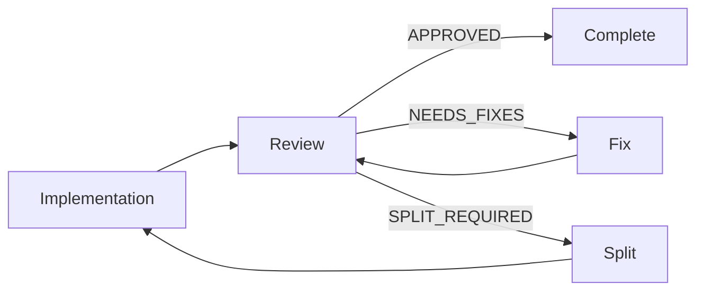

# 🚨🚨🚨 R108: Code Review Protocol 🚨🚨🚨

**Category:** State-Specific Rules  
**Agents:** code-reviewer (primary), orchestrator (spawn management)  
**Criticality:** BLOCKING - No code proceeds without review  
**State:** CODE_REVIEW

## CORE PROTOCOL

### 1. MANDATORY REVIEW TRIGGERS

Code review is **MANDATORY** when:
- SW-Engineer completes implementation
- After every logical change group  
- Before any PR creation
- After split implementation
- When effort exceeds 200 lines

### 2. REVIEW SEQUENCE

```bash
# 1. Measure the implementation size
cd $REVIEW_DIR && $CLAUDE_PROJECT_DIR/tools/line-counter.sh

# 2. Analyze the changeset
cd $REVIEW_DIR && git diff main...HEAD

# 3. Run static analysis
cd $REVIEW_DIR && go vet ./...
cd $REVIEW_DIR && staticcheck ./...

# 4. Check test coverage
cd $REVIEW_DIR && go test -cover ./...

# 5. Generate review report
```

### 3. REVIEW CRITERIA

#### Code Quality Checks
- **Architecture Compliance**: Follows prescribed patterns
- **Error Handling**: All errors properly handled
- **Resource Management**: No leaks, proper cleanup
- **Concurrency Safety**: No race conditions
- **Security**: No vulnerabilities introduced

#### 🔴🔴🔴 Independence Verification (R307 - PARAMOUNT) 🔴🔴🔴
- **Builds Independently**: PR compiles when merged alone to main
- **No Breaking Changes**: Existing functionality remains intact
- **Feature Flags Present**: All incomplete features behind flags
- **Graceful Degradation**: Handles missing dependencies
- **Future-Proof**: Could merge years from now

#### Size Compliance (CRITICAL)
```yaml
size_limits:
  soft_limit: 700 lines
  hard_limit: 800 lines  # AUTOMATIC FAILURE if exceeded
  measurement: Only changed lines, excluding generated
```

#### Testing Requirements
- Unit tests for new functionality
- Integration tests for API changes
- Test coverage >80% for new code
- All tests must pass

### 4. REVIEW OUTPUT FORMAT

Code review reports MUST use timestamps in the filename:
```bash
# Generate timestamped report filename
TIMESTAMP=$(date +%Y%m%d-%H%M%S)
REPORT_FILE="CODE-REVIEW-REPORT-${TIMESTAMP}.md"
```

Report content format:
```markdown
# CODE REVIEW REPORT
**Effort**: [effort-name]  
**Reviewer**: code-reviewer
**Date**: [timestamp]
**Status**: APPROVED | NEEDS_FIXES | SPLIT_REQUIRED

## Size Compliance
- Lines Changed: ###
- Limit Status: WITHIN_LIMIT | SOFT_VIOLATION | HARD_VIOLATION

## Architecture Compliance
- Pattern Adherence: COMPLIANT | VIOLATIONS_FOUND
- Details: [specific issues]

## 🔴 Independence Verification (R307)
- Builds Alone: PASS | FAIL
- Breaks Existing: NO | YES
- Feature Flags: PRESENT | MISSING
- Can Merge Anytime: YES | NO

## Issues Found
### BLOCKING (Must fix)
1. [Issue description with file:line]
2. [Issue description with file:line]

### WARNINGS (Should fix)
1. [Warning description]
2. [Warning description]

### SUGGESTIONS (Consider)
1. [Suggestion]
2. [Suggestion]

## Test Coverage
- Overall: ##%
- New Code: ##%
- Missing Tests: [list files]

## Security Review
- SQL Injection: SAFE | VULNERABLE
- XSS: SAFE | VULNERABLE  
- Auth: PROPER | ISSUES
- Secrets: NONE_EXPOSED | FOUND_SECRETS

## Action Required
- [ ] Fix blocking issues
- [ ] Add missing tests
- [ ] Split into smaller efforts (if >700 lines)
```

### 5. SPLIT PLANNING TRIGGER

If effort exceeds size limit:
```bash
# Immediate transition to CREATE_SPLIT_PLAN state
echo "🚨 Size limit exceeded - initiating split planning"

# Create timestamped split plan
TIMESTAMP=$(date +%Y%m%d-%H%M%S)
SPLIT_PLAN_FILE="SPLIT-PLAN-${TIMESTAMP}.md"

cat > "$SPLIT_PLAN_FILE" << 'EOF'
# SPLIT PLAN
## Current Size: [lines]
## Target Splits: [number]
## Created: [timestamp]

### Split 1: [name]
- Files: [list]
- Estimated Size: [lines]
- Dependencies: none

### Split 2: [name]  
- Files: [list]
- Estimated Size: [lines]
- Dependencies: split-1
EOF

echo "✅ Created split plan: $SPLIT_PLAN_FILE"
```

### 6. ORCHESTRATOR RESPONSIBILITIES

The orchestrator MUST:
```bash
# Spawn reviewer immediately after SWE completion
cd $EFFORT_DIR && claude_spawn code-reviewer

# Wait for review completion
wait_for_review_complete

# Read the latest review report
get_latest_review_report() {
    # Check for new timestamped format first
    LATEST_REPORT=$(ls -t CODE-REVIEW-REPORT-*.md 2>/dev/null | head -n1)
    
    # Fallback to old format if no timestamped versions
    if [ -z "$LATEST_REPORT" ] && [ -f "CODE-REVIEW-REPORT.md" ]; then
        LATEST_REPORT="CODE-REVIEW-REPORT.md"
        echo "⚠️ Using legacy report format: $LATEST_REPORT"
    fi
    
    if [ -z "$LATEST_REPORT" ]; then
        echo "❌ ERROR: No review report found!"
        exit 1
    fi
    
    echo "✅ Reading review report: $LATEST_REPORT"
    REVIEW_STATUS=$(grep "Status:" "$LATEST_REPORT" | cut -d: -f2 | tr -d ' ')
}

get_latest_review_report

# Check review status
if [[ "$REVIEW_STATUS" == "SPLIT_REQUIRED" ]]; then
    # Execute split protocol
    initiate_split_protocol
elif [[ "$REVIEW_STATUS" == "NEEDS_FIXES" ]]; then
    # Re-spawn SWE for fixes
    cd $EFFORT_DIR && claude_spawn sw-engineer --state FIX_ISSUES
fi
```

### 7. REVIEW-FIX CYCLE



### 8. GRADING IMPACT

```yaml
review_violations:
  skipping_review: -25%  # Major violation
  ignoring_blocking_issues: -30%  # Critical violation
  proceeding_with_failed_tests: -20%
  size_limit_violation_unaddressed: -40%
  no_review_report_created: -15%
```

### 9. INTEGRATE_WAVE_EFFORTS WITH OTHER RULES

- **R007**: Size limit compliance (800 lines)
- **R031**: Mandatory code review requirement
- **R153**: Review turnaround metrics
- **R199**: Single reviewer for split planning
- **R269**: Code reviewer doesn't execute merges

### 10. STATE MACHINE TRANSITIONS

```yaml
from: IMPLEMENTATION
to: CODE_REVIEW
trigger: Implementation complete

from: CODE_REVIEW  
to: CREATE_SPLIT_PLAN
trigger: Size limit exceeded

from: CODE_REVIEW
to: FIX_ISSUES
trigger: Issues found

from: CODE_REVIEW
to: COMPLETE
trigger: Review approved
```

## ENFORCEMENT

This rule is enforced by:
- Orchestrator spawning reviewer after implementation
- Reviewer following this protocol exactly
- State machine preventing progress without review
- Grading penalties for violations

## SUMMARY

**R108 Core Mandate: Every implementation MUST be reviewed!**

- No code proceeds without review
- Size limits strictly enforced
- Issues must be fixed before proceeding
- Split if too large
- Document everything in review report

---
**Created**: Core review protocol for Software Factory 2.0
**Purpose**: Ensure code quality and size compliance
**Enforcement**: BLOCKING - No exceptions