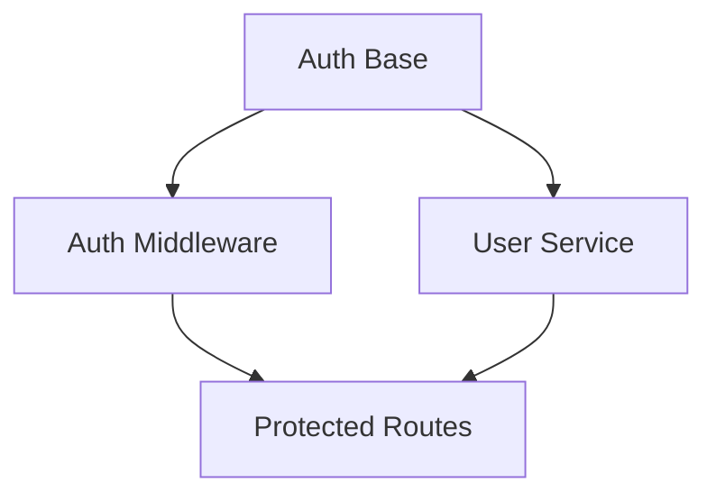

# ⚠️⚠️⚠️ R109: Planning Rules ⚠️⚠️⚠️

**Category:** State-Specific Rules  
**Agents:** orchestrator, code-reviewer, architect  
**Criticality:** WARNING - Poor planning causes cascade failures  
**State:** PLANNING

## PLANNING HIERARCHY

### 1. PROJECT IMPLEMENTATION PLAN (Top Level)
```markdown
# PROJECT IMPLEMENTATION PLAN
## Project: [Name]
## Phases: [Count]
## Estimated Efforts: [Total]

### Phase 1: [Foundation/Core]
- Waves: [Count]
- Focus: [Description]

### Phase 2: [Feature Development]
- Waves: [Count]  
- Focus: [Description]

### Phase 3: [Integration/Polish]
- Waves: [Count]
- Focus: [Description]
```

### 2. PHASE PLANNING

Each phase MUST:
- Have clear objectives
- Define success criteria
- List dependencies
- Estimate 3-5 waves
- Stay under 10,000 total lines

```yaml
phase_structure:
  max_waves: 5
  max_efforts_per_wave: 10
  max_lines_per_effort: 800
  max_lines_per_wave: 5000
  max_lines_per_phase: 10000
```

### 3. WAVE PLANNING

Waves group related efforts:
```markdown
# WAVE PLAN - Phase X Wave Y
## Objective: [Clear goal]
## Efforts: [Count]

### Effort 1: [name]
- Size Estimate: [lines]
- Dependencies: none
- Parallelizable: yes

### Effort 2: [name]
- Size Estimate: [lines]
- Dependencies: effort-1
- Parallelizable: no
```

### 4. EFFORT PLANNING

Each effort MUST have:
```markdown
# EFFORT PLAN
## Name: [descriptive-name]
## Size Estimate: [lines] (MUST be <800)
## Dependencies: [list or none]

### Files to Create/Modify
- pkg/[module]/[file].go
- pkg/[module]/[file]_test.go

### Implementation Steps
1. [Specific step]
2. [Specific step]
3. [Specific step]

### Testing Requirements
- Unit tests for [components]
- Integration tests for [features]

### Success Criteria
- [ ] All tests pass
- [ ] No linting errors
- [ ] Size under limit
```

### 5. DEPENDENCY MANAGEMENT



Rules for dependencies:
- **Explicit Declaration**: Every dependency listed
- **No Circular**: A cannot depend on B if B depends on A
- **Sequential Execution**: Dependent efforts run after dependencies
- **Parallel Opportunity**: Independent efforts can run simultaneously

### 6. SIZE ESTIMATION RULES

```python
# Estimation formula
def estimate_effort_size(effort):
    base_size = 0
    
    # Add for each file
    for file in effort.files:
        if file.is_new:
            base_size += 100  # New file base
        else:
            base_size += 30   # Modification base
            
    # Add for complexity
    if effort.has_api:
        base_size += 150
    if effort.has_database:
        base_size += 100
    if effort.has_tests:
        base_size += effort.num_files * 50
        
    # Add buffer
    return base_size * 1.2  # 20% buffer
```

### 7. PARALLELIZATION PLANNING

Identify parallel opportunities:
```yaml
wave_1_parallelization:
  parallel_group_1:
    - auth-base
    - user-model
    - config-loader
  parallel_group_2:  # After group 1
    - auth-middleware
    - user-service
  sequential:  # Must run alone
    - database-migration
```

### 8. SPLIT CONTINGENCY PLANNING

Pre-plan potential splits:
```markdown
## Split Contingency
If [effort-name] exceeds 700 lines:
- Split Point 1: Separate tests into own effort
- Split Point 2: Extract utilities to shared effort
- Split Point 3: Divide by feature boundaries
```

### 9. PLANNING VALIDATION

Before execution, validate:
- [ ] No effort exceeds 800 lines estimate
- [ ] Dependencies form valid DAG (no cycles)
- [ ] Parallel groups identified
- [ ] Total wave size <5000 lines
- [ ] Split contingencies defined
- [ ] Success criteria clear

### 10. PLANNING TOOLS

Use templates from:
```bash
templates/
├── PROJECT-IMPLEMENTATION-PLAN-TEMPLATE.md
├── PHASE-PLAN-TEMPLATE.md
├── WAVE-PLAN-TEMPLATE.md
└── EFFORT-PLAN-TEMPLATE.md
```

### 11. COMMON PLANNING FAILURES

**AVOID THESE:**
- ❌ Vague effort names ("implement stuff")
- ❌ Missing size estimates
- ❌ Circular dependencies
- ❌ No parallelization identified
- ❌ Missing test requirements
- ❌ Estimates >800 lines

### 12. PLANNING STATE TRANSITIONS

```yaml
from: INIT
to: PLANNING
trigger: Project start

from: PLANNING
to: CREATE_NEXT_INFRASTRUCTURE  
trigger: Plan approved

from: PLANNING
to: ERROR_RECOVERY
trigger: Invalid plan detected
```

## GRADING IMPACT

```yaml
planning_violations:
  no_plan_created: -20%
  effort_over_800_lines_planned: -15%
  missing_dependencies: -10%
  no_parallelization_identified: -10%
  vague_specifications: -5%
```

## INTEGRATE_WAVE_EFFORTS WITH OTHER RULES

- **R054**: Implementation plan creation
- **R056**: Split plan creation  
- **R219**: Dependency-aware planning
- **R261**: Integration planning requirements

## SUMMARY

**R109 Core Mandate: Plan thoroughly before implementation!**

- Every effort <800 lines
- Clear dependencies
- Identified parallelization
- Documented success criteria
- Split contingencies ready

---
**Created**: Foundation planning rule for Software Factory 2.0
**Purpose**: Ensure organized, size-compliant development
**Enforcement**: WARNING - Planning failures cascade