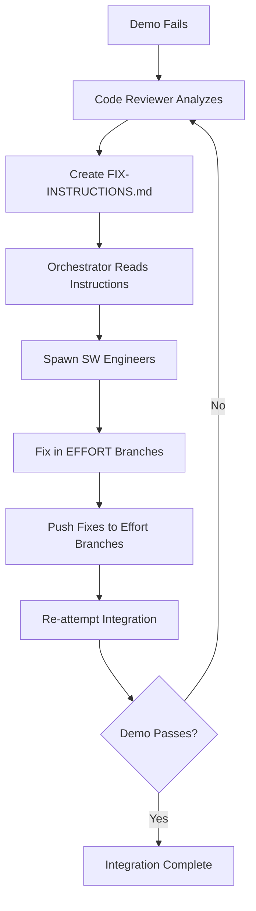

# 🚨🚨🚨 RULE R291: Integration Demo Requirement

## Classification
- **Category**: Integration Management
- **Criticality Level**: 🚨🚨🚨 BLOCKING
- **Enforcement**: MANDATORY for all integrations
- **Penalty**: -50% to -75% for missing demos, -100% for simulated demos (R331)
- **Modified**: 2025-10-06 (Added R331 compliance requirement - no simulation allowed)

## The Rule

**EVERY integration at EVERY level (Wave, Phase, Project) MUST produce a working build, automated test harness, and demonstrable functionality before marking integration as complete.**

**ALL demos MUST comply with R331 (Demo Validation Protocol) - NO SIMULATION ALLOWED. Demos must execute real code, verify external side effects, and be capable of failing when implementation is broken. Simulated demos result in IMMEDIATE FAILURE (-100%).**

### Integration Levels Covered by This Rule

**ALL of these integration points require demos:**

1. **Wave Integration** (wave-level demos):
   - Demonstrates all efforts within a wave working together
   - Created by Integration Agent during wave integration
   - Planned in WAVE-MERGE-PLAN.md by Code Reviewer

2. **Phase Integration** (phase-level demos):
   - Demonstrates all waves within a phase working together as a cohesive unit
   - Created by Integration Agent during phase integration
   - **MUST be planned in PHASE-MERGE-PLAN.md by Code Reviewer** (R291 requirement)

3. **Project Integration** (project-level demos):
   - Demonstrates all phases working together as complete, production-ready system
   - Created by Integration Agent during project integration
   - **MUST be planned in PROJECT-MERGE-PLAN.md by Code Reviewer** (R291 requirement)
   - **MUST include end-to-end scenario testing** (R291 project requirement)

**NO EXCEPTIONS**: Every level needs demos. This rule applies universally.

**CRITICAL CLARIFICATION (per R363/R364):**
- Integration demos happen in TESTING branches
- Integration branches validate but NEVER merge to main
- After successful testing, efforts merge to main SEQUENTIALLY
- Testing success ≠ Merging the integration branch

## 🔴🔴🔴 INTEGRATE_WAVE_EFFORTS AGENT AUTHORITY TO CREATE DEMOS 🔴🔴🔴

**EXPLICIT AUTHORITY - NO AMBIGUITY:**

The Integration Agent has **FULL AUTHORITY** to create wave/phase/project level demos. This is:
- ✅ **REQUIRED** by R291 (this rule)
- ✅ **ALLOWED** by R361 (demo exception explicitly carved out)
- ✅ **PRE-PLANNED** by R504 (demo paths in orchestrator-state-v3.json)
- ✅ **DESIGNED** by R330 (demo plans created before integration)

**Integration agents MUST create demos - it is their responsibility, not a violation.**

### Why This is NOT an R361 Violation:

1. **Demos are INTEGRATE_WAVE_EFFORTS ARTIFACTS**, not feature code
2. **R291 EXPLICITLY REQUIRES** demos at all integration levels
3. **Creation is PRE-PLANNED** in orchestrator-state-v3.json (R504)
4. **Demo infrastructure ≠ new packages/adapters/wrappers**

**Integration agents should confidently create demos without hesitation.**

### What Integration Agents Create (ALLOWED):
```bash
# ✅ Integration demo script (≤200 lines)
demos/phase1/wave1/integration/integration-demo.sh

# ✅ Demo documentation
demos/phase1/wave1/integration/DEMO.md

# ✅ Demo plan reference
demos/phase1/wave1/integration/DEMO-PLAN.md  # Optional
```

### What Integration Agents CANNOT Create (PROHIBITED):
```bash
# ❌ Adapters/wrappers (R361 violation)
pkg/gitea/adapter.go

# ❌ New packages (R361 violation)
pkg/integration/compatibility.go

# ❌ Glue code (R361 violation)
internal/integration/helpers.go
```

**Clear Distinction**: Demos call existing code. Adapters/wrappers create new code. Integration agents create demos, not adapters.

**See R521 for complete integration agent scope definition.**

## 🔴🔴🔴 SUPREME GATE: BUILD/TEST/DEMO MUST PASS OR ERROR_RECOVERY 🔴🔴🔴

**ABSOLUTE REQUIREMENT - NO EXCEPTIONS:**
Every integration at wave/phase/project level MUST:
1. ✅ **BUILD PROJECT_DONEFULLY** - Compilation completes without errors
2. ✅ **PASS ALL TESTS** - Unit, integration, and E2E tests pass
3. ✅ **PRODUCE WORKING OUTPUT** - Binary/package/dist created
4. ✅ **DEMO FUNCTIONALITY** - Integrated features actually work

**🚨🚨🚨 MANDATORY ERROR_RECOVERY TRIGGERS 🚨🚨🚨**

**If ANY of these fail, you MUST:**
- 🔴 **IMMEDIATELY STOP** - No proceeding whatsoever
- 🔴 **TRANSITION TO ERROR_RECOVERY** - This is MANDATORY, not optional
- 🔴 **DOCUMENT FAILURE** - Record exact error in state file
- 🔴 **INITIATE FIX PROTOCOL** - Follow R300 for fixes in effort branches

**Specific Failure → ERROR_RECOVERY Mappings:**
- Build failure (make/npm build/cargo build returns non-zero) → **ERROR_RECOVERY**
- Test failure (ANY test fails) → **ERROR_RECOVERY**
- No output produced (missing dist/build/target) → **ERROR_RECOVERY**
- Demo script fails (exit code != 0) → **ERROR_RECOVERY**
- Feature doesn't work as expected → **ERROR_RECOVERY**

**VIOLATION = -100% AUTOMATIC FAILURE**

Marking integration complete without passing build/test/demo = **IMMEDIATE DISQUALIFICATION**

**THIS IS AN ABSOLUTE GATE!** The code must build, test, and run successfully or you CANNOT proceed!

## Requirements

### 1. 🏗️ MANDATORY BUILD VERIFICATION WITH ERROR_RECOVERY TRIGGER

**NO INTEGRATE_WAVE_EFFORTS IS COMPLETE WITHOUT A WORKING BUILD:**

```bash
# MANDATORY VERIFICATION - MUST RUN FOR EVERY INTEGRATE_WAVE_EFFORTS
verify_integration_gates() {
    echo "🔴🔴🔴 R291 MANDATORY GATES CHECK 🔴🔴🔴"
    local FAILED=false
    local FAILURE_REASON=""
    
    # 1. BUILD GATE - MUST PASS OR ERROR_RECOVERY
    echo "🏗️ [GATE 1] Build Verification..."
    rm -rf dist/ build/ out/ target/
    
    if make build 2>&1 | tee build.log || \
       npm run build 2>&1 | tee build.log || \
       cargo build 2>&1 | tee build.log; then
        echo "✅ BUILD GATE: PASSED"
    else
        echo "🔴 BUILD GATE: FAILED - MUST ENTER ERROR_RECOVERY"
        FAILED=true
        FAILURE_REASON="Build compilation failed"
    fi
    
    # 2. ARTIFACT GATE - MUST EXIST OR ERROR_RECOVERY
    echo "📦 [GATE 2] Artifact Verification..."
    if [ -d "dist" ] || [ -d "build" ] || [ -d "out" ] || [ -d "target" ]; then
        echo "✅ ARTIFACT GATE: PASSED"
        ls -la dist/ build/ out/ target/ 2>/dev/null | tee artifacts.log
    else
        echo "🔴 ARTIFACT GATE: FAILED - MUST ENTER ERROR_RECOVERY"
        FAILED=true
        FAILURE_REASON="No build artifacts produced"
    fi
    
    # 3. TEST GATE - ALL MUST PASS OR ERROR_RECOVERY
    echo "🧪 [GATE 3] Test Verification..."
    if make test 2>&1 | tee test.log || \
       npm test 2>&1 | tee test.log || \
       cargo test 2>&1 | tee test.log || \
       pytest 2>&1 | tee test.log; then
        echo "✅ TEST GATE: PASSED"
    else
        echo "🔴 TEST GATE: FAILED - MUST ENTER ERROR_RECOVERY"
        FAILED=true
        FAILURE_REASON="Tests failed"
    fi
    
    # 4. DEMO GATE - MUST WORK OR ERROR_RECOVERY (R331 VALIDATION)
    echo "🎬 [GATE 4] Demo Verification (R331 Protocol)..."

    # R331: Validate demo is real (not simulated)
    if [ -f "$CLAUDE_PROJECT_DIR/rule-library/R331-demo-validation-protocol.md" ]; then
        echo "🔍 Running R331 validation on demo..."
        # Pre-demo implementation scan
        if find src/ pkg/ internal/ -type f \( -name "*.go" -o -name "*.ts" -o -name "*.py" \) \
            -exec grep -l "TODO\|FIXME\|XXX" {} \; 2>/dev/null | grep -q .; then
            echo "🔴 R331 VIOLATION: TODO found in implementation"
            FAILED=true
            FAILURE_REASON="Implementation incomplete (R331 violation)"
        fi
    fi

    # Execute demo
    if [ -f "./demo-features.sh" ] && ./demo-features.sh; then
        echo "✅ DEMO GATE: PASSED (R331 compliant)"
    else
        echo "🔴 DEMO GATE: FAILED - MUST ENTER ERROR_RECOVERY"
        FAILED=true
        FAILURE_REASON="Demo script failed or missing"
    fi
    
    # FINAL VERDICT - ERROR_RECOVERY IF ANY GATE FAILED
    if [ "$FAILED" = true ]; then
        echo "🔴🔴🔴 INTEGRATE_WAVE_EFFORTS GATES FAILED 🔴🔴🔴"
        echo "FAILURE REASON: $FAILURE_REASON"
        echo "MANDATORY ACTION: Transition to ERROR_RECOVERY state"
        
        # Update state file to ERROR_RECOVERY
        jq ".state_machine.current_state = \"ERROR_RECOVERY\"" -i orchestrator-state-v3.json
        jq ".error_recovery.trigger = \"R291_BUILD_TEST_GATE_FAILURE\"" -i orchestrator-state-v3.json
        jq ".error_recovery.reason = \"$FAILURE_REASON\"" -i orchestrator-state-v3.json
        jq ".error_recovery.timestamp = \"$(date -u +%Y-%m-%dT%H:%M:%SZ)\"" -i orchestrator-state-v3.json
        
        git add orchestrator-state-v3.json
        git commit -m "error: R291 gate failure - entering ERROR_RECOVERY: $FAILURE_REASON"
        git push
        
        exit 1  # STOP IMMEDIATELY
    fi
    
    echo "✅✅✅ ALL GATES PASSED - Integration may proceed ✅✅✅"
    return 0
}
```

**Build Requirements:**
- Must compile/build successfully
- Must produce verifiable artifacts
- Must capture build logs
- Must be runnable/executable
- Build failures = integration incomplete

### 2. 🧪 MANDATORY TEST HARNESS

**EVERY INTEGRATE_WAVE_EFFORTS MUST HAVE AN AUTOMATED TEST HARNESS:**

```bash
# Template for test-harness.sh
cat > test-harness.sh << 'EOF'
#!/bin/bash
# Integration Test Harness
echo "🧪 Starting Integration Test Suite"
echo "=================================="

FAILED=0

# Unit tests (REQUIRED)
echo "📦 Running unit tests..."
if npm test 2>&1 | tee unit-tests.log; then
    echo "✅ Unit tests passed"
else
    echo "❌ Unit tests failed"
    ((FAILED++))
fi

# Integration tests (REQUIRED)
echo "🔗 Running integration tests..."
if npm run test:integration 2>&1 | tee integration-tests.log; then
    echo "✅ Integration tests passed"
else
    echo "❌ Integration tests failed"
    ((FAILED++))
fi

# Feature verification (REQUIRED)
echo "🎯 Verifying new features..."
if ./verify-features.sh; then
    echo "✅ Features verified"
else
    echo "❌ Feature verification failed"
    ((FAILED++))
fi

echo "=================================="
if [ $FAILED -eq 0 ]; then
    echo "✅ ALL TESTS PASSED!"
    exit 0
else
    echo "❌ $FAILED test suites failed!"
    exit 1
fi
EOF

chmod +x test-harness.sh
```

**Test Harness Requirements:**
- Must be automated and repeatable
- Must test integrated functionality
- Must clearly show pass/fail status
- Must capture test logs
- Must verify new features work

### 3. 🎬 MANDATORY DEMO (R331 COMPLIANT)

**EVERY INTEGRATE_WAVE_EFFORTS MUST DEMONSTRATE WORKING FUNCTIONALITY:**

**🚨🚨🚨 CRITICAL: All demos MUST pass R331 validation (no simulation allowed) 🚨🚨🚨**

```bash
# Demo documentation template with timestamp
TIMESTAMP=$(date +%Y%m%d-%H%M%S)
DEMO_FILE="INTEGRATE_WAVE_EFFORTS-DEMO-${TIMESTAMP}.md"

cat > "$DEMO_FILE" << 'EOF'
# Integration Demo

## Build Status
- Build: ✅ PASSING
- Tests: ✅ ALL PASSING
- Integration: ✅ COMPLETE
- Created: [timestamp]

## Features Demonstrated
1. [Feature 1]: Working implementation with evidence
2. [Feature 2]: Integration verified with test results
3. [Feature 3]: Functionality demonstrated

## How to Run Demo
```bash
# Start application
npm start

# Run demo script
./demo-features.sh

# Verify outputs
curl http://localhost:3000/api/new-feature
```

## Evidence
- Build log: build.log
- Test results: test-results.log
- Screenshots: demos/integration/
- Demo script: demo-features.sh
EOF
```

**Demo Requirements (R331 Compliance):**
- Must create demo documentation
- Must show actual functionality working (NO SIMULATION - R331)
- Must provide reproduction steps
- Must capture evidence (logs/screenshots)
- Must prove integration delivers value
- **Must pass R331 validation checklist:**
  - ✅ No TODO/FIXME in implementation execution path
  - ✅ All flags validated against --help output
  - ✅ External side effects verified (registry, files, database, etc.)
  - ✅ Demo capable of failing when implementation broken
  - ✅ No simulation patterns (hardcoded success without execution)

### 4. Level-Specific Requirements

#### Wave Integration Demo (MANDATORY even for single-effort waves)
```bash
# Wave level requirements
- Demonstrate wave-specific features
- Show integration of all efforts in wave
- Verify no regression in previous features
- Create WAVE-DEMO.md
- Create wave-test-harness.sh
# NOTE: Single-effort waves STILL need integration demos!
# The integration might be trivial but MUST be validated
```

#### Phase Integration Demo (MANDATORY even for single-wave phases)
```bash
# Phase level requirements
- Demonstrate all waves integrated
- Show phase-level functionality complete
- Run comprehensive test suite
- Create PHASE-${N}-DEMO.md
- Create phase${N}-test-harness.sh
- Verify against phase plan deliverables
# NOTE: Single-wave phases STILL need integration demos!
# May reuse wave demo content but MUST run at phase level
```

#### Project Integration Demo
```bash
# Project level requirements
- Demonstrate complete project functionality
- Show all phases working together
- Run full E2E test suite
- Create PROJECT-DEMO.md
- Create project-test-harness.sh
- Include performance metrics
- Include security scan results
```

## 🔧 FAILED DEMO FIX PROTOCOL

**When integration demo fails, follow this EXACT process:**

### 1. Code Reviewer Creates Fix Instructions
When demo fails (build errors, test failures, runtime issues):
```bash
# Code Reviewer analyzes failures
analyze_demo_failure() {
    echo "🔍 Analyzing demo failure..."
    
    # Check build logs
    grep -i "error\|fail" build.log > build-errors.txt
    
    # Check test logs
    grep -i "fail\|error" test-results.log > test-failures.txt
    
    # Identify affected efforts
    echo "Affected efforts:" > affected-efforts.txt
    # Trace errors back to source efforts
}

# Create timestamped fix instructions
TIMESTAMP=$(date +%Y%m%d-%H%M%S)
FIX_FILE="FIX-INSTRUCTIONS-${TIMESTAMP}.md"

cat > "$FIX_FILE" << 'EOF'
# INTEGRATE_WAVE_EFFORTS DEMO FIX INSTRUCTIONS

## Demo Failure Summary
- Build Status: ❌ FAILED
- Test Status: ❌ FAILED
- Error Type: [compilation/runtime/test]
- Created: [timestamp]

## Root Cause Analysis
1. [Error 1]: Located in effort-X, file Y, line Z
2. [Error 2]: Located in effort-Y, file A, line B

## Required Fixes

### Effort: [effort-name-1]
**Branch**: feature/effort-name-1
**Issues**:
- [ ] Fix compilation error in src/module.ts line 45
- [ ] Update test expectations in tests/module.test.ts
- [ ] Add missing dependency to package.json

### Effort: [effort-name-2]
**Branch**: feature/effort-name-2
**Issues**:
- [ ] Fix API integration error
- [ ] Update configuration for new endpoint

## Verification Steps
1. Fix issues in effort branches
2. Run local build and tests
3. Push fixes to effort branches
4. Re-attempt integration
EOF
```

### 2. Orchestrator Receives Instructions
```bash
# Orchestrator reads fix instructions
read_fix_instructions() {
    # Find the latest fix instructions file
    LATEST_FIX=$(ls -t FIX-INSTRUCTIONS-*.md 2>/dev/null | head -n1)
    
    # Fallback to old format if needed
    if [ -z "$LATEST_FIX" ] && [ -f "FIX-INSTRUCTIONS.md" ]; then
        LATEST_FIX="FIX-INSTRUCTIONS.md"
        echo "⚠️ Using legacy fix instructions format"
    fi
    
    if [ -f "$LATEST_FIX" ]; then
        echo "📋 Processing fix instructions: $LATEST_FIX"
        
        # Extract affected efforts
        grep "^### Effort:" "$LATEST_FIX" | cut -d: -f2
        
        # Spawn SW Engineers for each effort
        for effort in $(get_affected_efforts); do
            spawn_sw_engineer_for_fixes "$effort"
        done
    fi
}
```

### 3. SW Engineers Fix in EFFORT BRANCHES

**⚠️⚠️⚠️ CRITICAL: ALL FIXES MUST BE IN EFFORT BRANCHES ⚠️⚠️⚠️**

```bash
# SW Engineer fixes in EFFORT branch
fix_in_effort_branch() {
    local effort_name="$1"
    local effort_branch="feature/${effort_name}"
    
    # ✅ CORRECT: Fix in effort branch
    git checkout "$effort_branch"
    
    # ❌ WRONG: Never fix in integration branch!
    # git checkout integration-wave-1  # NEVER DO THIS!
    
    # Apply fixes
    implement_fixes_from_instructions
    
    # Test locally
    npm test
    npm run build
    
    # Commit and push to effort branch
    git add -A
    git commit -m "fix: resolve integration demo failures for $effort_name"
    git push origin "$effort_branch"
}
```

**Why effort branch fixes are MANDATORY:**
- ✅ Ensures source branches are correct
- ✅ Makes future integrations work
- ✅ Prevents drift between effort and integration branches
- ✅ Maintains clean git history
- ✅ Allows proper PR reviews
- ✅ Enables rollback if needed

**NEVER fix directly in integration branch because:**
- ❌ Creates divergence from source branches
- ❌ Makes future merges conflict
- ❌ Hides problems in effort code
- ❌ Breaks traceability
- ❌ Violates CD principles

### 4. Re-attempt Integration

```bash
# After fixes are pushed to effort branches
retry_integration() {
    echo "🔄 Re-attempting integration with fixed code..."

    # Create fresh TEST integration branch (per R364)
    git checkout main
    git pull origin main
    TEST_BRANCH="integration-wave-X-test-$(date +%s)"
    git checkout -b "$TEST_BRANCH"

    # Merge fixed effort branches FOR TESTING
    for effort_branch in $(get_effort_branches); do
        echo "Merging fixed $effort_branch for testing..."
        git merge "origin/$effort_branch" --no-ff
    done

    # Build and test again
    npm install
    npm run build | tee build.log
    ./test-harness.sh | tee test-results.log

    # Demo must now pass!
    if ./demo-features.sh; then
        echo "✅ Demo passes! Integration testing complete"
        echo "🗑️ Deleting test branch (per R364)"
        git checkout main
        git branch -D "$TEST_BRANCH"

        echo "📋 Now merging efforts to main SEQUENTIALLY (per R363)"
        merge_efforts_sequentially_to_main
    else
        echo "❌ Demo still failing - repeat fix protocol"
        git checkout main
        git branch -D "$TEST_BRANCH"
    fi
}

# CRITICAL: After testing passes, merge SEQUENTIALLY to main
merge_efforts_sequentially_to_main() {
    echo "🔄 Starting sequential merges to main (R363)..."

    for effort_branch in $(get_effort_branches_in_order); do
        echo "Merging $effort_branch directly to main..."
        git checkout main
        git pull origin main
        git merge "origin/$effort_branch" --no-ff
        git push origin main

        echo "⏳ Waiting for CI/CD before next merge..."
        sleep 30
    done

    echo "✅ All efforts merged to main sequentially"
    echo "❌ Integration branch was NOT merged (R364)"
}
```

### 5. Fix Protocol State Machine



## Implementation Process

### Step 1: Build Verification
```bash
# Clean and build
make clean && make build
# or
npm run build:clean && npm run build:prod
```

### Step 2: Test Harness Creation
```bash
# Create and run test harness
./create-test-harness.sh [wave|phase|project]
./test-harness.sh
```

### Step 3: Demo Creation
```bash
# Create demo artifacts
./create-demo.sh [wave|phase|project]
# Run demo
./demo-features.sh
```

### Step 4: Verification
```bash
# Verify all requirements met
verify_integration_complete() {
    [ -f "build.log" ] || { echo "❌ Missing build log"; return 1; }
    [ -f "test-harness.sh" ] || { echo "❌ Missing test harness"; return 1; }
    [ -f "*-DEMO.md" ] || { echo "❌ Missing demo documentation"; return 1; }
    [ -d "dist" ] || [ -d "build" ] || { echo "❌ Missing build artifacts"; return 1; }
    
    echo "✅ All integration requirements met"
    return 0
}
```

## Failure Conditions

### Critical Failures (Immediate Stop)
- 🚨 No build artifacts = FAIL
- 🚨 Build doesn't compile = FAIL
- 🚨 No test harness = FAIL
- 🚨 Tests not passing = FAIL
- 🚨 No demo created = FAIL

### Grading Penalties
- Missing build verification: **-25%**
- Missing test harness: **-25%**
- Missing demo: **-25%**
- Tests failing but ignored: **-50%**
- Build broken but claimed complete: **-75%**

## Success Criteria

Before marking ANY integration complete:
- ✅ Build compiles and runs successfully
- ✅ Build artifacts verified to exist
- ✅ Test harness created and executed
- ✅ All tests passing (unit + integration)
- ✅ Demo documentation created
- ✅ Demo script functional
- ✅ Features verified working
- ✅ Evidence captured (logs, screenshots)

## Examples

### ✅ CORRECT: Complete integration
```bash
# 1. Build verification
npm run build:prod | tee build.log
ls -la dist/

# 2. Test harness
./create-test-harness.sh wave
./test-harness.sh

# 3. Demo creation
./create-demo.sh wave
./demo-wave-features.sh

# 4. Verification
./verify-integration-complete.sh
```

### ❌ WRONG: Incomplete integration
```bash
# Just merging branches without verification
git merge feature-branch
git push
echo "Integration complete"  # NO BUILD, NO TESTS, NO DEMO!
```

## Related Rules
- **R331**: Demo Validation Protocol (BLOCKING - defines how to validate demos are real)
- R363: Sequential Direct Mergeability (FUNDAMENTAL - defines merge strategy)
- R364: Integration Testing Only Branches (FUNDAMENTAL - defines testing strategy)
- R330: Demo Planning Requirements (demos must be planned before creation)
- R034: Integration Requirements
- R282: Phase Integration Protocol
- R283: Project Integration Protocol
- R265: Integration Testing Requirements
- R263: Integration Documentation Requirements

## Enforcement

This rule is enforced at:
1. **Wave Integration** - Every wave must demo (including single-effort waves)
2. **Phase Integration** - Every phase must demo (including single-wave phases)
3. **Project Integration** - Final project must demo
4. **PR Reviews** - No merge without demo evidence
5. **State Transitions** - Cannot proceed without demo

**CRITICAL**: Demos are NOT required at individual effort level, only at integration points!

## Remember

**"If it doesn't build, it doesn't work"**
**"If it doesn't test, it's not verified"**
**"If it doesn't demo, it's not complete"**
**"Every integration needs a demo, even trivial ones"**

Integration demos happen at wave/phase/project levels ONLY. Individual efforts don't need demos, but their integrations ALWAYS do - even single-effort waves and single-wave phases!
## 🔴🔴🔴 STATE MACHINE ENFORCEMENT (NEW - 2025-10-04) 🔴🔴🔴

**CRITICAL UPDATE:** Demo validation is now enforced through DEDICATED ORCHESTRATOR STATES.

### New Mandatory Demo Validation States

**Direct transitions from code review to completion are now PROHIBITED.**

Integration now follows this MANDATORY flow:

```
WAITING_FOR_REVIEW_WAVE_INTEGRATION (code review approved)
  ↓ (REQUIRED - cannot skip)
SPAWN_CODE_REVIEWER_DEMO_VALIDATION
  ↓ (spawns Code Reviewer to RUN demos)
WAITING_FOR_DEMO_VALIDATION
  ↓ (enforces R291 Gate 4)
  ├─ Demos PASSED → REVIEW_WAVE_ARCHITECTURE / COMPLETE_PHASE / PROJECT_INTEGRATE_WAVE_EFFORTS_FINALIZATION
  └─ Demos FAILED → ERROR_RECOVERY (MANDATORY!)
```

### State Descriptions

#### SPAWN_CODE_REVIEWER_DEMO_VALIDATION
- **Purpose**: Spawn Code Reviewer to execute and validate demos
- **State File**: `agent-states/software-factory/orchestrator/SPAWN_CODE_REVIEWER_DEMO_VALIDATION/rules.md`
- **Responsibilities**:
  - Verify demo infrastructure exists
  - Create demo validation task file
  - Spawn Code Reviewer in DEMO_VALIDATION state
  - Update orchestrator state to WAITING_FOR_DEMO_VALIDATION
- **Cannot be skipped**: State machine enforces this transition

#### WAITING_FOR_DEMO_VALIDATION
- **Purpose**: Wait for demo validation results and enforce R291 Gate 4
- **State File**: `agent-states/software-factory/orchestrator/WAITING_FOR_DEMO_VALIDATION/rules.md`
- **Responsibilities**:
  - Monitor for demo evaluation report
  - Read demo validation results
  - Enforce R291 Gate 4 based on results
  - Transition to completion (if passed) or ERROR_RECOVERY (if failed)
- **R291 Enforcement Point**: This state IS the Gate 4 enforcement mechanism

#### Code Reviewer DEMO_VALIDATION State
- **Purpose**: Actually execute demos and report results
- **State File**: `agent-states/code-reviewer/DEMO_VALIDATION/rules.md`
- **Responsibilities**:
  - Find all demo scripts in demos/ directory
  - Execute ALL demo scripts
  - Capture execution results
  - Create demo-evaluation-report.md
  - Save execution logs to demo-evaluation.log
  - Commit results to repository

### Demo Creation by Integration Agent

Integration agent creates demos in `INTEGRATE_WAVE_EFFORTS_BUILD_VALIDATION` state:

**Location**: `agent-states/integration/INTEGRATE_WAVE_EFFORTS_BUILD_VALIDATION/rules.md`

**Process**:
1. After successful build
2. Create demo directory: `demos/phase{X}/wave{Y}/integration/`
3. Create demo script: `integration-demo.sh`
4. Create demo documentation: `DEMO.md`
5. Commit demos with integration code
6. Demos are part of integration branch, not separate

### Why This State-Based Approach

**Problem Identified**: Projects reached PROJECT_DONE without ANY demos being run, despite R291 requirements.

**Root Cause**: No dedicated state for demo validation. Integration code review transitioned directly to completion, assuming demos would be "checked somewhere." They weren't.

**Solution**: Dedicated states that CANNOT be bypassed:

1. **Separation of Concerns**:
   - Code review = verify code quality
   - Demo validation = verify demos work
   - These are SEPARATE responsibilities requiring SEPARATE states

2. **State Machine Enforcement**:
   - No direct path from code review → completion
   - Demo validation is MANDATORY intermediate state
   - Cannot skip via state manipulation

3. **Clear Accountability**:
   - Code Reviewer RUNS demos (DEMO_VALIDATION state)
   - Orchestrator ENFORCES results (WAITING_FOR_DEMO_VALIDATION state)
   - Integration Agent CREATES demos (INTEGRATE_WAVE_EFFORTS_BUILD_VALIDATION state)

### Enforcement Mechanism

**Per R291 line 44:**
> "Marking integration complete without passing build/test/demo = IMMEDIATE DISQUALIFICATION"

**State machine enforcement**:
- Attempting to skip SPAWN_CODE_REVIEWER_DEMO_VALIDATION = -100%
- Attempting to skip WAITING_FOR_DEMO_VALIDATION = -100%
- Proceeding to completion when demos failed = -100%
- Not transitioning to ERROR_RECOVERY when demos failed = -100%

**This is NOT optional. This is NOT negotiable. This is MANDATORY.**

### Demo Validation Report Format

Code Reviewer creates structured report that orchestrator reads:

```markdown
# Demo Validation Report - {integration_type} Integration

## Summary
- Integration Type: wave/phase/project
- Demo Directory: demos/phase{X}/wave{Y}/integration/
- Validation Date: {ISO timestamp}

## Results
- Demos Passed: {count}
- Demos Failed: {count}
- Total Demos: {count}

Demo Validation Status: PASSED or FAILED

## R291 Gate 4 Compliance
✅ GATE 4: PASSED - All demos executed successfully
OR
🔴 GATE 4: FAILED - Demo execution failed

## Individual Demo Results
- ✅ demo1.sh: PASSED
- 🔴 demo2.sh: FAILED

## Demo Execution Log
See: .software-factory/phase{X}/wave{Y}/integration/demo-evaluation.log

## Recommendation
Integration may proceed to completion
OR
MUST enter ERROR_RECOVERY per R291 - demos are MANDATORY
```

### Integration with Existing R291 Requirements

All previous R291 requirements remain in effect:

- ✅ Build must pass (Gate 1 & 2)
- ✅ Tests must pass (Gate 3)
- ✅ **Demos must pass** (Gate 4 - NOW STATE-ENFORCED)
- ✅ Demo failures trigger ERROR_RECOVERY
- ✅ Fixes go to effort branches (per R300)

**What changed**: Demo validation now has DEDICATED STATES ensuring it cannot be skipped.

**What stayed the same**: All other R291 requirements remain unchanged.

### State Machine Reference

See: `state-machines/software-factory-3.0-state-machine.json` for complete state definitions and transitions.

**Added States**:
- SPAWN_CODE_REVIEWER_DEMO_VALIDATION (orchestrator)
- WAITING_FOR_DEMO_VALIDATION (orchestrator)
- DEMO_VALIDATION (code reviewer)

**Modified Transitions**:
- WAITING_FOR_REVIEW_WAVE_INTEGRATION → SPAWN_CODE_REVIEWER_DEMO_VALIDATION (not REVIEW_WAVE_ARCHITECTURE)
- WAITING_FOR_DEMO_VALIDATION → REVIEW_WAVE_ARCHITECTURE/COMPLETE_PHASE/etc. (based on demo results)

## Updated: 2025-10-04

**Changelog**:
- Added dedicated state-based enforcement mechanism
- Demo validation now uses SPAWN_CODE_REVIEWER_DEMO_VALIDATION and WAITING_FOR_DEMO_VALIDATION states
- Code Reviewer executes demos in DEMO_VALIDATION state
- Integration agent creates demos in INTEGRATE_WAVE_EFFORTS_BUILD_VALIDATION state
- State machine enforces R291 Gate 4 - cannot be bypassed
- Demo failures MUST trigger ERROR_RECOVERY per state machine

**This update makes demo bypass IMPOSSIBLE.**
