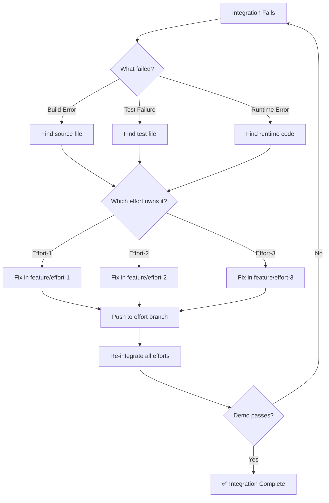

# ⚠️ DEPRECATED - SUPERSEDED BY R300 ⚠️
**This rule has been consolidated into R300: Comprehensive Fix Management Protocol**
**Please use R300 for all fix management requirements**

# 🚨🚨🚨 RULE R292: Integration Fixes MUST Be In Effort Branches

## Classification
- **Category**: Integration Management
- **Criticality Level**: 🚨🚨🚨 BLOCKING
- **Enforcement**: MANDATORY for all integration fixes
- **Penalty**: -50% for violations, -100% for direct integration branch edits

## The Rule

**ALL fixes for integration failures MUST be made in the ORIGINAL EFFORT BRANCHES, never directly in integration branches.**

## 🔴🔴🔴 ABSOLUTE REQUIREMENT 🔴🔴🔴

**When integration fails (build, test, or demo):**
1. ✅ ALWAYS fix in effort/feature branches FIRST
2. ✅ ALWAYS push fixes to remote effort branches
3. ✅ ALWAYS verify fixes exist in effort branches before re-integration
4. ✅ ALWAYS re-merge from fixed effort branches
5. ✅ ALWAYS use fresh integration branch from main (per R271)
6. ❌ NEVER edit integration branch directly
7. ❌ NEVER commit fixes to integration branch
8. ❌ NEVER proceed without verifying effort branches have fixes

## Why This Is Critical

### Correct Approach Benefits
When you fix in effort branches:
- ✅ **Source branches stay correct** - Future integrations will work
- ✅ **Clean merge history** - Can trace all changes to source
- ✅ **PR reviews work** - Each effort fix can be reviewed
- ✅ **Rollback possible** - Can revert individual efforts
- ✅ **No drift** - Effort and integration stay synchronized
- ✅ **CD compliance** - Maintains continuous delivery flow

### Wrong Approach Disasters
When you fix directly in integration branch:
- ❌ **Source branches stay broken** - Next integration fails again
- ❌ **Divergence created** - Integration differs from sources
- ❌ **Merge conflicts** - Future merges will conflict
- ❌ **Lost traceability** - Can't track fixes to efforts
- ❌ **No rollback** - Can't revert individual changes
- ❌ **CD violation** - Breaks continuous delivery principles

## 🔴🔴🔴 CRITICAL WORKFLOW - MUST FOLLOW 🔴🔴🔴

### THE ONLY CORRECT FIX WORKFLOW:
```
1. Integration fails (build/test/demo)
   ↓
2. Identify which effort caused failure
   ↓
3. Switch to that effort's branch
   ↓
4. Apply fix in effort branch
   ↓
5. Commit and push to effort branch
   ↓
6. Verify fix is in remote effort branch
   ↓
7. Create NEW integration branch from main
   ↓
8. Merge ALL effort branches (including fixed)
   ↓
9. Test integration again
```

**ANY DEVIATION FROM THIS WORKFLOW = AUTOMATIC FAILURE**

## Implementation Protocol

### Step 1: Identify Failed Integration
```bash
# Integration demo fails
./demo-features.sh
# Output: ❌ Build failed / Tests failed / Runtime error
```

### Step 2: Trace Failure to Effort
```bash
# Analyze which effort caused the failure
analyze_failure() {
    echo "🔍 Tracing failure to source effort..."
    
    # Check git blame for error location
    git blame src/failed-module.ts | grep "effort"
    
    # Check commit history
    git log --oneline --grep="effort"
    
    # Identify effort branch
    echo "Failure traced to: feature/effort-name"
}
```

### Step 3: Fix in Effort Branch
```bash
# ✅ CORRECT: Switch to effort branch
fix_in_effort_branch() {
    local effort_branch="feature/effort-name"
    
    # Checkout effort branch
    git checkout "$effort_branch"
    git pull origin "$effort_branch"
    
    # Apply fixes
    edit src/module.ts  # Fix the actual issue
    
    # Test locally
    npm test
    npm run build
    
    # Commit to effort branch
    git add -A
    git commit -m "fix: resolve integration failure in effort-name"
    git push origin "$effort_branch"
}

# ❌ WRONG: Never do this!
wrong_approach() {
    git checkout integration-wave-1
    edit src/module.ts  # NEVER EDIT IN INTEGRATE_WAVE_EFFORTS BRANCH!
    git commit -m "fix: patch integration"  # VIOLATION!
}
```

### Step 4: Re-integrate Fixed Effort
```bash
# Create new integration attempt with fixed code
reintegrate_fixed_effort() {
    # Start fresh
    git checkout main
    git pull origin main
    git checkout -b integration-wave-1-fix-$(date +%s)
    
    # Merge all efforts including fixed one
    git merge origin/feature/effort-1 --no-ff
    git merge origin/feature/effort-2-FIXED --no-ff  # With fix
    git merge origin/feature/effort-3 --no-ff
    
    # Test integration again
    npm install
    npm run build
    ./test-harness.sh
    ./demo-features.sh
}
```

## Fix Location Decision Tree



## Common Scenarios

### Scenario 1: Build Compilation Error
```bash
# Error: TypeScript compilation failed in module from effort-2
# ✅ CORRECT:
git checkout feature/effort-2
# Fix TypeScript error
git push origin feature/effort-2
# Re-integrate

# ❌ WRONG:
git checkout integration-wave-1
# Fix TypeScript error directly
```

### Scenario 2: Test Failure
```bash
# Error: Integration test fails due to effort-3 API change
# ✅ CORRECT:
git checkout feature/effort-3
# Update API and tests
git push origin feature/effort-3
# Re-integrate

# ❌ WRONG:
git checkout integration-wave-1
# Patch test to pass
```

### Scenario 3: Missing Dependency
```bash
# Error: Module from effort-1 missing dependency
# ✅ CORRECT:
git checkout feature/effort-1
# Add dependency to package.json
git push origin feature/effort-1
# Re-integrate

# ❌ WRONG:
git checkout integration-wave-1
# Add dependency directly
```

## Enforcement Checkpoints

### 1. Code Reviewer Verification
```bash
# Code reviewer MUST verify fixes are in effort branches
verify_fix_location() {
    # Check no direct commits to integration
    git log integration-wave-1 --format="%s" | grep -i "fix:" && {
        echo "❌ VIOLATION: Fixes found in integration branch!"
        exit 1
    }
    
    # Verify effort branches have fixes
    for effort in effort-1 effort-2 effort-3; do
        git log "feature/$effort" --format="%s" | grep -i "fix:" || {
            echo "⚠️ No fixes in $effort branch"
        }
    done
}
```

### 2. Orchestrator Enforcement
```bash
# Orchestrator MUST spawn SWEs to fix in effort branches
spawn_for_fixes() {
    # NEVER allow direct integration fixes
    if [[ "$TARGET_BRANCH" == "integration-"* ]]; then
        echo "❌ BLOCKED: Cannot spawn SWE for integration branch!"
        echo "Must fix in effort branch instead"
        exit 1
    fi
}
```

### 3. State Machine Enforcement
```yaml
# State machine blocks progression if fixes not in effort branches
MONITORING_INTEGRATE_WAVE_EFFORTS:
  on_demo_failure:
    - verify_no_integration_edits()
    - require_effort_branch_fixes()
    - block_if_violated()
```

## Grading Penalties

- Fix directly in integration branch: **-50%**
- Claim fix but effort branch still broken: **-50%**
- Integration branch diverged from efforts: **-75%**
- Repeated violations: **-100% (FAIL)**

## Success Criteria

Before any integration fix is complete:
- ✅ Original effort branch has fix committed
- ✅ Fix is pushed to remote effort branch
- ✅ Integration branch has NO direct fixes
- ✅ Re-integration merges fixed effort branches
- ✅ Demo passes with properly fixed code
- ✅ All effort branches remain deployable

## Related Rules
- R291: Integration Demo Requirement
- R034: Integration Requirements
- R265: Integration Testing Requirements
- R282: Phase Integration Protocol
- R283: Project Integration Protocol

## Remember

**"Fix at the source, not at the symptom"**
**"Effort branches are the truth, integration is the proof"**
**"A fix in integration is a future failure waiting to happen"**

Direct integration fixes are TECHNICAL DEBT that WILL cause future failures!