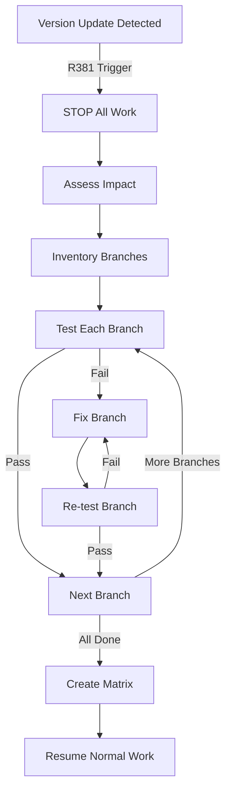

# 🔴🔴🔴 RULE R382 - Version Update Fix Cascade Requirement

**Criticality:** SUPREME LAW - Mandatory When Version Updates Occur
**Grading Impact:** -100% for incomplete cascade, -50% per branch not tested
**Enforcement:** TRIGGERED - Activates on any version update

## Rule Statement

When a library version MUST be updated (rare), a MANDATORY fix cascade is triggered. ALL previous branches using the old version MUST be tested and validated with the new version before ANY new work proceeds.

## Cascade Trigger Conditions

### Valid Triggers (User Approved):
1. **Critical Security Vulnerability** (CVE HIGH/CRITICAL)
2. **Breaking Bug** (blocks core functionality)
3. **Forced Deprecation** (upstream removing support)
4. **Explicit User Directive** (documented requirement)

### Process When Triggered:
```yaml
VERSION_UPDATE_CASCADE:
  1_STOP: "ALL work stops immediately"
  2_INVENTORY: "Find ALL branches using old version"
  3_PLAN: "Create cascade execution plan"
  4_TEST: "Test each branch with new version"
  5_FIX: "Fix any breakages found"
  6_VALIDATE: "Ensure ALL branches work"
  7_DOCUMENT: "Create compatibility matrix"
  8_RESUME: "Only after ALL branches validated"
```

## Cascade Execution Protocol

### Phase 1: Impact Assessment
```bash
assess_version_impact() {
    local package="$1"
    local old_version="$2"
    local new_version="$3"

    echo "🔴 VERSION CASCADE TRIGGERED"
    echo "Package: $package"
    echo "Change: $old_version → $new_version"

    # Find all affected branches
    affected_branches=$(find_branches_using_version "$package" "$old_version")

    # Count impact
    echo "Affected branches: $(echo "$affected_branches" | wc -l)"
    echo "Estimated cascade time: $(calculate_cascade_time)"
}
```

### Phase 2: Branch Inventory
```json
{
  "version_cascade": {
    "trigger": "CVE-2025-12345",
    "package": "github.com/vulnerable/lib",
    "old_version": "v1.2.3",
    "new_version": "v1.2.4",
    "affected_branches": [
      {
        "branch": "phase1-wave1-effort1",
        "status": "pending_test",
        "uses_in_files": ["cmd/main.go", "pkg/handler/api.go"]
      },
      {
        "branch": "phase1-wave1-effort2",
        "status": "pending_test",
        "uses_in_files": ["internal/service/auth.go"]
      },
      {
        "branch": "phase1-wave2-effort1",
        "status": "pending_test",
        "uses_in_files": ["pkg/client/client.go"]
      }
    ],
    "cascade_status": "IN_PROGRESS"
  }
}
```

### Phase 3: Sequential Testing
```bash
execute_cascade_test() {
    local branch="$1"
    local new_version="$2"

    echo "📋 Testing $branch with $new_version"

    # Create test branch
    git checkout -b "cascade-test/$branch" "$branch"

    # Update version
    update_version_in_metadata "$new_version"

    # Run tests
    if run_all_tests; then
        echo "✅ $branch compatible with $new_version"
        mark_branch_compatible "$branch"
    else
        echo "❌ $branch BREAKS with $new_version"
        mark_branch_incompatible "$branch"
        create_fix_ticket "$branch"
    fi
}
```

### Phase 4: Fix Application
```bash
apply_cascade_fixes() {
    local incompatible_branches=("$@")

    for branch in "${incompatible_branches[@]}"; do
        echo "🔧 Fixing $branch for version compatibility"

        # Spawn SW Engineer for fixes
        spawn_sw_engineer \
            --branch "$branch" \
            --task "FIX_VERSION_COMPATIBILITY" \
            --version "$new_version"

        # Wait for completion
        wait_for_fix_completion "$branch"

        # Re-test
        execute_cascade_test "$branch" "$new_version"
    done
}
```

### Phase 5: Validation Matrix
```markdown
## Version Compatibility Matrix

| Branch | Old Version (v1.2.3) | New Version (v1.2.4) | Test Status | Fix Required |
|--------|---------------------|----------------------|-------------|--------------|
| phase1-wave1-effort1 | ✅ Working | ✅ Compatible | PASS | No |
| phase1-wave1-effort2 | ✅ Working | ❌ Breaking | FIXED | Yes - API change |
| phase1-wave2-effort1 | ✅ Working | ✅ Compatible | PASS | No |
| phase1-wave2-effort2 | ✅ Working | ❌ Breaking | FIXED | Yes - Import path |

**Cascade Result**: ALL BRANCHES NOW COMPATIBLE ✅
```

## Cascade State Machine



## Blocking Requirements

### Work Suspension
```yaml
DURING_CASCADE:
  - ❌ NO new efforts started
  - ❌ NO new features added
  - ❌ NO unrelated changes
  - ✅ ONLY cascade fixes
  - ✅ ONLY compatibility work
```

### Completion Criteria
```bash
cascade_complete_check() {
    # ALL branches must be tested
    if [ "$untested_branches" -gt 0 ]; then
        echo "❌ Cannot resume - $untested_branches branches untested"
        return 1
    fi

    # ALL branches must be compatible
    if [ "$incompatible_branches" -gt 0 ]; then
        echo "❌ Cannot resume - $incompatible_branches branches incompatible"
        return 1
    fi

    # Matrix must be documented
    if [ ! -f "version-cascade-matrix.md" ]; then
        echo "❌ Cannot resume - compatibility matrix not documented"
        return 1
    fi

    echo "✅ CASCADE COMPLETE - Work may resume"
}
```

## Documentation Requirements

### 1. Cascade Trigger Document
```markdown
# Version Update Cascade - [Date]

## Trigger
- Package: [package name]
- Reason: [CVE/Bug/Deprecation]
- Old Version: [version]
- New Version: [version]
- Approved By: [user]

## Impact
- Branches Affected: [count]
- Estimated Time: [hours]
- Risk Level: [HIGH/MEDIUM/LOW]
```

### 2. Cascade Execution Log
```markdown
# Cascade Execution Log

## Timeline
- Started: [timestamp]
- Phase 1 Complete: [timestamp]
- Phase 2 Complete: [timestamp]
- All Fixes Applied: [timestamp]
- Validation Complete: [timestamp]
- Resumed Normal Work: [timestamp]

## Issues Found
1. [Branch]: [Issue description]
2. [Branch]: [Issue description]

## Fixes Applied
1. [Branch]: [Fix description]
2. [Branch]: [Fix description]
```

## Integration with R381

```bash
# R381 detects unauthorized change
detect_version_change() {
    if version_changed_without_approval; then
        echo "🔴 R381 VIOLATION - Triggering R382 Cascade"
        trigger_cascade_protocol
    fi
}

# R382 enforces complete testing
enforce_cascade() {
    suspend_all_work
    execute_full_cascade
    validate_all_branches
    document_results
    resume_only_when_complete
}
```

## Grading Penalties

### Automatic Failures (-100%)
- Continuing work during cascade
- Skipping cascade when required
- Incomplete branch testing
- Missing compatibility documentation

### Major Penalties (-50%)
- Each branch not tested
- Missing fixes for incompatibilities
- Incomplete validation matrix
- Resuming before all compatible

### Minor Penalties (-20%)
- Poor cascade documentation
- Inefficient testing order
- Missing execution timeline

## Examples

### ✅ GOOD: Proper Cascade Execution
```bash
# Security vulnerability requires update
echo "🔴 CVE-2025-12345 requires updating lib to v1.2.4"

# Stop all work
update_state "CASCADE_VERSION_UPDATE"

# Test all branches
for branch in $(list_affected_branches); do
    test_with_new_version "$branch"
done

# Fix incompatibilities
fix_all_breaking_changes

# Document and resume
create_compatibility_matrix
resume_normal_operations
```

### ❌ BAD: Skipping Cascade
```bash
# Just update and hope for the best
sed -i 's/v1.2.3/v1.2.4/' go.mod
git commit -m "update vulnerable lib"
# OTHER BRANCHES STILL VULNERABLE/BROKEN!
```

## Recovery from Incomplete Cascade

If cascade was skipped or incomplete:
1. **IMMEDIATE STOP** - Cease all operations
2. **Inventory Damage** - Find all affected branches
3. **Execute Full Cascade** - No shortcuts
4. **Fix All Issues** - Every branch must work
5. **Document Thoroughly** - Complete audit trail
6. **Gradual Resume** - Verify stability first

---

**REMEMBER**: Version updates are RARE but CRITICAL events. The cascade ensures no branch is left behind and no functionality is broken. COMPLETE THE CASCADE!