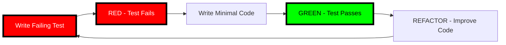

# 🔴🔴🔴 RULE R400: Test-Driven Development MANDATORY (SUPREME LAW)

## Classification
- **Category**: Development Process
- **Criticality Level**: 🔴🔴🔴 SUPREME LAW
- **Enforcement**: MANDATORY at ALL levels
- **Penalty**: -100% for violations (AUTOMATIC FAILURE)
- **Related Rules**: R341, R401, R402, R403, R404, R291

## The Rule

**TEST-DRIVEN DEVELOPMENT IS ABSOLUTELY MANDATORY - NO EXCEPTIONS!**

TDD is not optional, it is not a suggestion, it is THE LAW. Every single line of implementation code MUST be written to make a failing test pass. This is non-negotiable.

## 🔴🔴🔴 SUPREME LAW: RED-GREEN-REFACTOR CYCLE 🔴🔴🔴

**THE TDD CYCLE IS INVIOLABLE:**



**CRITICAL ENFORCEMENT:**
1. **NO CODE WITHOUT A TEST** - Implementation without test = FAILURE
2. **TEST MUST FAIL FIRST** - Test that passes immediately = VIOLATION
3. **MINIMAL CODE TO PASS** - Over-implementation = VIOLATION
4. **REFACTOR WITH GREEN TESTS** - Breaking tests during refactor = VIOLATION

**VIOLATION = IMMEDIATE FAILURE = -100% GRADE**

## Absolute Requirements

### 1. Every Feature Starts with Tests
```bash
# ✅ CORRECT TDD Flow
write_test()    # FIRST - Define what success looks like
run_test()      # VERIFY it fails (RED phase)
write_code()    # THEN - Implement minimal solution
run_test()      # VERIFY it passes (GREEN phase)
refactor()      # FINALLY - Improve while keeping tests green

# ❌ WRONG Traditional Flow
write_code()    # NEVER write code first!
write_test()    # Tests after code = NOT TDD
```

### 2. Tests Define the Specification
- Tests ARE the requirements
- Tests ARE the documentation
- Tests ARE the contract
- No test = No feature

### 3. Coverage Requirements
- Unit Test Coverage: ≥80% (MANDATORY)
- Integration Test Coverage: ≥70% (MANDATORY)
- E2E Test Coverage: Critical paths 100% (MANDATORY)
- Uncovered code = Untrusted code

## Implementation Levels

### Project Level
- Master test plan created BEFORE Phase 1
- End-to-end tests define success
- All phases must pass project tests

### Phase Level
- Phase tests created AFTER architecture, BEFORE implementation
- Define phase success criteria
- All waves contribute to phase tests

### Wave Level
- Wave tests created AFTER architecture, BEFORE implementation
- Complement phase tests
- All efforts target wave tests

### Effort Level
- Each effort implements to pass assigned tests
- No new features without corresponding tests
- Success = All assigned tests passing

### Split Level (R403)
- Tests MUST accompany code during splits
- Each split must have passing tests
- Test coverage maintained across splits

## Enforcement Mechanisms

### 1. State Machine Enforcement
```bash
# Architecture complete → Test Planning (MANDATORY)
WAITING_FOR_ARCHITECTURE_PLAN → SPAWN_CODE_REVIEWER_TEST_PLANNING

# Test Planning complete → Implementation Planning
WAITING_FOR_TEST_PLAN → SPAWN_CODE_REVIEWER_IMPL_PLANNING

# ❌ FORBIDDEN: Skipping test planning
WAITING_FOR_ARCHITECTURE_PLAN → SPAWN_CODE_REVIEWER_IMPL_PLANNING # VIOLATION!
```

### 2. Build Gate Enforcement
```bash
# CI/CD pipeline MUST enforce:
test_coverage_gate() {
    local coverage=$(npm test -- --coverage | grep "All files" | awk '{print $10}' | tr -d '%')

    if [ "$coverage" -lt 80 ]; then
        echo "❌ TDD VIOLATION: Coverage $coverage% < 80%"
        exit 1
    fi

    echo "✅ TDD COMPLIANT: Coverage $coverage%"
}
```

### 3. PR Review Enforcement
- Every PR must show tests were written first
- Git history must show test commits before implementation
- Coverage must meet or exceed requirements

## Common Violations

### ❌ VIOLATION: Implementation First
```bash
git log --oneline
# abc123 feat: add payment processing
# def456 test: add payment tests  # WRONG ORDER!
```

### ❌ VIOLATION: Missing Tests
```bash
# New feature added but no tests
src/payment.js     # 500 lines added
test/payment.test.js # 0 lines added
```

### ❌ VIOLATION: Tests After the Fact
```javascript
// Implementation already complete, then...
describe('payment', () => {
    it('should work', () => {
        // Retrofitted test - NOT TDD!
    });
});
```

### ✅ CORRECT: True TDD
```bash
git log --oneline
# ghi789 test: define payment processing behavior
# jkl012 feat: implement payment to pass tests
# mno345 refactor: improve payment performance
```

## Grading Impact

| Violation | Penalty |
|-----------|---------|
| No tests for feature | -100% FAIL |
| Tests written after code | -75% |
| Low coverage (<80%) | -50% |
| Tests don't fail first | -30% |
| Over-implementation | -20% |
| No refactor phase | -10% |

## Success Criteria

### For Every Implementation
- ✅ Test exists BEFORE code
- ✅ Test fails before implementation (RED)
- ✅ Implementation makes test pass (GREEN)
- ✅ Code improved with passing tests (REFACTOR)
- ✅ Coverage meets requirements
- ✅ Tests are meaningful (not trivial)

### For Every Integration
- ✅ All unit tests pass
- ✅ All integration tests pass
- ✅ All E2E tests pass
- ✅ No regressions introduced
- ✅ Coverage maintained or improved

## Related Rules
- **R341**: Test Planning State Requirements
- **R401**: Tests First Enforcement
- **R402**: Test Gate Requirements
- **R403**: Split Test Preservation
- **R404**: Test Coverage Requirements
- **R291**: Integration Demo (must pass tests)

## Remember

**"RED, GREEN, REFACTOR"** - The sacred TDD cycle
**"No test, no code"** - The fundamental law
**"Tests are the specification"** - Tests define the system
**"Coverage is trust"** - Untested code is untrustworthy

**TEST-DRIVEN DEVELOPMENT IS THE LAW - VIOLATION IS FAILURE!**

---

*This is a SUPREME LAW. Failure to follow TDD will result in immediate project failure and -100% grade.*