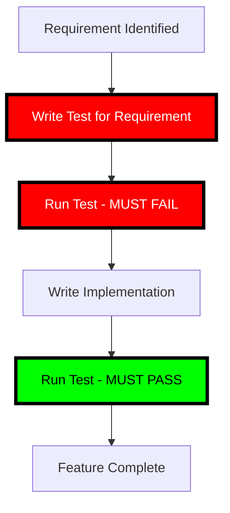

# 🔴🔴🔴 RULE R401: Tests MUST Be Written FIRST (SUPREME LAW)

## Classification
- **Category**: Development Process
- **Criticality Level**: 🔴🔴🔴 SUPREME LAW
- **Enforcement**: MANDATORY at ALL stages
- **Penalty**: -100% for violations (AUTOMATIC FAILURE)
- **Related Rules**: R400, R341, R402, R403, R404

## The Rule

**TESTS MUST BE WRITTEN BEFORE ANY IMPLEMENTATION CODE - NO EXCEPTIONS!**

Writing tests after implementation is NOT Test-Driven Development. It is test-after development, which is FORBIDDEN. Tests come FIRST, always, without exception.

## 🔴🔴🔴 SUPREME LAW: TEST-FIRST SEQUENCE 🔴🔴🔴

**THE SEQUENCE IS ABSOLUTE:**



**CRITICAL VIOLATIONS:**
1. **Writing ANY implementation before test** = IMMEDIATE FAILURE
2. **Test that passes without implementation** = INVALID TEST
3. **Commenting out failing tests** = CHEATING = FAILURE
4. **Writing stub tests to be "filled in later"** = NOT TDD

## Enforcement at Every Level

### 1. Architecture → Test Planning → Implementation Planning

```bash
# ✅ CORRECT SEQUENCE (R341 compliant)
Phase Architecture Complete
    ↓
SPAWN_CODE_REVIEWER_PHASE_TEST_PLANNING  # Tests FIRST!
    ↓
Tests Created (Failing)
    ↓
SPAWN_CODE_REVIEWER_PHASE_IMPL_PLANNING  # Plan to make tests pass
    ↓
Implementation Begins

# ❌ WRONG SEQUENCE (VIOLATION!)
Phase Architecture Complete
    ↓
SPAWN_CODE_REVIEWER_PHASE_IMPL_PLANNING  # NO TESTS!
    ↓
Implementation Begins
    ↓
"We'll add tests later"  # FAILURE!
```

### 2. Git Commit Sequence Verification

```bash
# Verification script (automated checking)
verify_test_first_commits() {
    local feature_branch=$1

    # Get first test commit
    TEST_COMMIT=$(git log --oneline --grep="test:" | tail -1 | cut -d' ' -f1)

    # Get first implementation commit
    IMPL_COMMIT=$(git log --oneline --grep="feat:\|fix:" | tail -1 | cut -d' ' -f1)

    # Test commit MUST be older
    if git merge-base --is-ancestor $IMPL_COMMIT $TEST_COMMIT; then
        echo "❌ VIOLATION: Implementation before test!"
        echo "Test commit: $TEST_COMMIT"
        echo "Impl commit: $IMPL_COMMIT"
        exit 1
    fi

    echo "✅ Test-first verified"
}
```

### 3. File Creation Timestamp Verification

```bash
# Tests MUST exist before implementation files
verify_file_timestamps() {
    local test_file=$1
    local impl_file=$2

    if [ ! -f "$test_file" ]; then
        echo "❌ VIOLATION: No test file!"
        exit 1
    fi

    if [ -f "$impl_file" ] && [ "$impl_file" -ot "$test_file" ]; then
        echo "❌ VIOLATION: Implementation file older than test!"
        exit 1
    fi

    echo "✅ Test file created first"
}
```

## Required Evidence

### 1. Test Failure Evidence
Every test MUST have evidence it failed first:

```bash
# MANDATORY: Capture initial test failure
npm test > initial-test-failure.log 2>&1

# Log MUST show:
# ✗ should process payment (5ms)
#   Expected: success
#   Received: undefined
# Tests: 1 failed, 0 passed
```

### 2. Implementation Commit References Test

```bash
# Every implementation commit MUST reference the test it satisfies
git commit -m "feat: implement payment processing to satisfy test_payment_success"

# Commit message MUST indicate which test is being satisfied
```

### 3. Coverage Reports Show Test-First

```bash
# Coverage timeline must show tests before implementation
Day 1: coverage/payment.test.js (100% coverage of test)
Day 1: coverage/payment.js (0% - doesn't exist)
Day 2: coverage/payment.js (85% - implementation added)
```

## State Machine Requirements

### SW Engineer States (MUST BE FIXED)
Current WRONG sequence:
```
IMPLEMENTATION → MEASURE_SIZE → TEST_WRITING  # ❌ VIOLATION!
```

CORRECT sequence:
```
TEST_WRITING → IMPLEMENTATION → MEASURE_SIZE  # ✅ TDD COMPLIANT
```

### Code Reviewer States (ALREADY CORRECT)
```
PHASE_TEST_PLANNING → PHASE_IMPLEMENTATION_PLANNING  # ✅ Tests first
WAVE_TEST_PLANNING → WAVE_IMPLEMENTATION_PLANNING    # ✅ Tests first
```

## Common Violations and Penalties

### ❌ CRITICAL VIOLATION: "We'll add tests later"
```javascript
// payment.js - 500 lines of implementation
function processPayment() {
    // Complex implementation...
}

// payment.test.js - Created AFTER implementation
describe('payment', () => {
    it('TODO: add tests');  // AUTOMATIC FAILURE!
});
```
**Penalty: -100% IMMEDIATE FAILURE**

### ❌ MAJOR VIOLATION: Fake test-first
```bash
# Creating empty test files to pretend TDD
touch test/payment.test.js  # Empty file
# Then implementing
# Then filling in tests
```
**Penalty: -75% for dishonesty**

### ❌ VIOLATION: Test doesn't fail first
```javascript
// Test that passes immediately (no implementation needed)
it('should return true', () => {
    expect(true).toBe(true);  // Useless test!
});
```
**Penalty: -50% for invalid TDD**

## Success Patterns

### ✅ CORRECT: True Test-First Development

```bash
# 1. Write failing test
cat > test/payment.test.js << 'EOF'
describe('Payment Processing', () => {
    it('should process valid credit card', () => {
        const result = processPayment({
            card: '4111111111111111',
            amount: 100
        });
        expect(result.status).toBe('success');
        expect(result.transactionId).toBeDefined();
    });
});
EOF

# 2. Run test - MUST FAIL
npm test
# Error: processPayment is not defined

# 3. Write minimal implementation
cat > src/payment.js << 'EOF'
function processPayment(data) {
    return {
        status: 'success',
        transactionId: generateId()
    };
}
EOF

# 4. Test passes
npm test
# ✓ should process valid credit card (3ms)
```

## Verification Checklist

Before ANY code review:
- [ ] Test files created BEFORE implementation files
- [ ] Test commits BEFORE implementation commits
- [ ] Evidence of initial test failure captured
- [ ] Implementation explicitly targets test requirements
- [ ] No implementation without corresponding test
- [ ] Tests are meaningful (not trivial)

## Grading Impact

| Violation | Penalty |
|-----------|---------|
| Implementation before test | -100% FAIL |
| No evidence of test failure | -75% |
| Test created after implementation | -100% FAIL |
| Empty/stub tests | -50% |
| Trivial tests | -30% |
| No test-implementation link | -20% |

## Integration with Other Rules

- **R400**: Enforces TDD methodology
- **R341**: Defines test planning states
- **R402**: Enforces test gates
- **R403**: Preserves tests during splits
- **R404**: Defines coverage requirements

## Remember

**"Test first, code second"** - The only way
**"Red before green"** - Tests must fail first
**"No test, no code"** - Absolute law
**"Tests are the specification"** - Tests define behavior

**TESTS COME FIRST - THIS IS NOT NEGOTIABLE!**

---

*This is a SUPREME LAW. Writing implementation before tests will result in immediate project failure and -100% grade.*