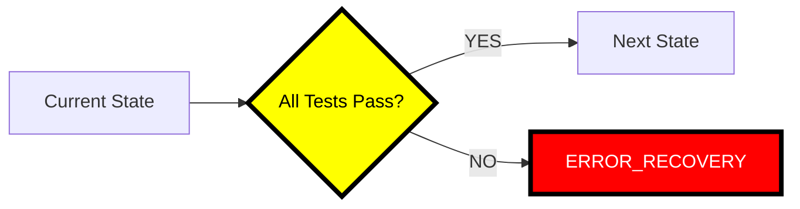

# 🚨🚨🚨 RULE R402: Test Gate Requirements (BLOCKING)

## Classification
- **Category**: Quality Assurance
- **Criticality Level**: 🚨🚨🚨 BLOCKING
- **Enforcement**: MANDATORY at ALL transitions
- **Penalty**: -50% to -100% for violations
- **Related Rules**: R400, R401, R291, R403, R404

## The Rule

**ALL TESTS MUST PASS BEFORE ANY STATE TRANSITION OR COMPLETION!**

No effort, wave, phase, or project can proceed to the next stage with failing tests. Test passage is a HARD GATE that cannot be bypassed, overridden, or ignored.

## 🚨🚨🚨 BLOCKING GATES: NO PASSAGE WITHOUT PASSING TESTS 🚨🚨🚨

**TEST GATES ARE ABSOLUTE:**



**CRITICAL GATES:**
1. **Effort Completion** → All unit tests MUST pass
2. **Wave Completion** → All integration tests MUST pass
3. **Phase Completion** → All functional tests MUST pass
4. **Project Completion** → All E2E tests MUST pass

**FAILING TESTS = BLOCKED TRANSITION = ERROR_RECOVERY**

## Mandatory Test Gates

### 1. Effort-Level Gates

```bash
# BEFORE marking effort complete
verify_effort_tests() {
    echo "🚨 EFFORT TEST GATE VERIFICATION"

    # Run unit tests
    if ! npm test 2>&1 | tee test-results.log; then
        echo "❌ GATE BLOCKED: Unit tests failing!"
        echo "MANDATORY: Transition to FIX_ISSUES state"

        # Update state to ERROR_RECOVERY
        jq '.state_machine.current_state = "ERROR_RECOVERY"' orchestrator-state-v3.json > tmp.json
        mv tmp.json orchestrator-state-v3.json

        exit 1
    fi

    echo "✅ GATE PASSED: All unit tests passing"
    return 0
}
```

### 2. Wave-Level Gates

```bash
# BEFORE wave integration
verify_wave_tests() {
    echo "🚨 WAVE TEST GATE VERIFICATION"

    # Run all wave tests
    if ! ./wave-test-harness.sh; then
        echo "❌ GATE BLOCKED: Wave tests failing!"
        echo "MANDATORY: Cannot proceed to integration"

        # Document failures
        echo "WAVE TEST FAILURES:" > WAVE-TEST-FAILURES.md
        grep "FAIL\|ERROR" test-results.log >> WAVE-TEST-FAILURES.md

        # Transition to ERROR_RECOVERY
        update_state "ERROR_RECOVERY"
        exit 1
    fi

    echo "✅ GATE PASSED: All wave tests passing"
}
```

### 3. Phase-Level Gates

```bash
# BEFORE phase completion
verify_phase_tests() {
    echo "🚨 PHASE TEST GATE VERIFICATION"

    # Run comprehensive phase test suite
    if ! ./phase-test-harness.sh --comprehensive; then
        echo "❌ GATE BLOCKED: Phase tests failing!"
        echo "MANDATORY: Phase cannot be marked complete"

        # Generate failure report
        generate_phase_test_failure_report

        # BLOCK phase transition
        exit 1
    fi

    # Verify coverage requirements
    COVERAGE=$(get_test_coverage)
    if [ "$COVERAGE" -lt 80 ]; then
        echo "❌ GATE BLOCKED: Coverage $COVERAGE% < 80%"
        exit 1
    fi

    echo "✅ GATE PASSED: Phase tests and coverage passing"
}
```

### 4. Project-Level Gates

```bash
# BEFORE project completion
verify_project_tests() {
    echo "🚨 PROJECT TEST GATE VERIFICATION"

    # Run ENTIRE test suite
    if ! npm run test:all; then
        echo "❌ PROJECT BLOCKED: Tests failing!"
        echo "PROJECT CANNOT BE DELIVERED WITH FAILING TESTS"
        exit 1
    fi

    # Run E2E tests
    if ! npm run test:e2e; then
        echo "❌ PROJECT BLOCKED: E2E tests failing!"
        exit 1
    fi

    # Verify no regressions
    if ! ./verify-no-regressions.sh; then
        echo "❌ PROJECT BLOCKED: Regressions detected!"
        exit 1
    fi

    echo "✅ PROJECT READY: All tests passing"
}
```

## State Transition Gates

### SW Engineer State Transitions

```bash
# Gate enforcement at each transition
IMPLEMENTATION → MEASURE_SIZE:
    Prerequisite: All new tests passing

MEASURE_SIZE → COMPLETED:
    Prerequisite: All tests still passing

FIX_ISSUES → REQUEST_REVIEW:
    Prerequisite: All tests passing after fixes

SPLIT_IMPLEMENTATION → MEASURE_SIZE:
    Prerequisite: Split tests passing
```

### Orchestrator State Transitions

```bash
SPAWN_SW_ENGINEERS → MONITOR:
    Prerequisite: Agent test harnesses verified

WAVE_COMPLETE → INTEGRATE_WAVE_EFFORTS:
    Prerequisite: All wave tests passing

INTEGRATE_WAVE_EFFORTS → COMPLETE_PHASE:
    Prerequisite: Integration tests passing

ANY → ERROR_RECOVERY:
    Trigger: ANY test failure
```

## Test Failure Response Protocol

### When Tests Fail at Gate

```bash
handle_test_gate_failure() {
    local gate_type=$1  # effort|wave|phase|project
    local failure_log=$2

    echo "🚨🚨🚨 TEST GATE FAILURE DETECTED 🚨🚨🚨"
    echo "Gate Type: $gate_type"
    echo "Failures logged in: $failure_log"

    # 1. IMMEDIATE STOP
    echo "❌ STOPPING: Cannot proceed with failing tests"

    # 2. Document failures
    create_test_failure_report "$gate_type" "$failure_log"

    # 3. Transition to ERROR_RECOVERY
    transition_to_error_recovery "TEST_GATE_FAILURE"

    # 4. Create fix instructions
    generate_fix_instructions_from_failures "$failure_log"

    # 5. Notify team
    echo "📢 ATTENTION: Test gate blocked at $gate_type level"

    exit 1
}
```

## Coverage Gate Requirements

### Minimum Coverage Thresholds

| Level | Unit Tests | Integration Tests | E2E Tests |
|-------|------------|------------------|-----------|
| Effort | 80% | N/A | N/A |
| Wave | 80% | 70% | N/A |
| Phase | 85% | 75% | Key paths |
| Project | 90% | 80% | All paths |

```bash
# Coverage gate enforcement
verify_coverage_gate() {
    local level=$1
    local required_coverage=$2

    COVERAGE=$(npm test -- --coverage | grep "All files" | awk '{print $10}' | tr -d '%')

    if [ "$COVERAGE" -lt "$required_coverage" ]; then
        echo "❌ COVERAGE GATE FAILED: $COVERAGE% < $required_coverage%"
        echo "Cannot proceed without adequate test coverage"
        exit 1
    fi

    echo "✅ Coverage gate passed: $COVERAGE%"
}
```

## Test Gate Bypass Prevention

### FORBIDDEN Actions

```bash
# ❌ NEVER DO THIS - Skipping tests
git commit -m "feat: add feature" --no-verify  # FORBIDDEN!

# ❌ NEVER DO THIS - Ignoring failures
npm test || true  # FORBIDDEN!

# ❌ NEVER DO THIS - Commenting out failing tests
// it.skip('should work', () => {  # FORBIDDEN!

# ❌ NEVER DO THIS - Marking as complete with failures
echo "Tests are mostly passing"  # NOT ACCEPTABLE!
```

### Required Actions

```bash
# ✅ ALWAYS - Run full test suite
npm test && echo "✅ All tests pass"

# ✅ ALWAYS - Fix failing tests before proceeding
fix_failing_tests && verify_all_pass

# ✅ ALWAYS - Maintain test coverage
maintain_coverage_above_threshold

# ✅ ALWAYS - Document test status
generate_test_report > test-status.md
```

## Grading Impact

| Violation | Penalty |
|-----------|---------|
| Proceeding with failing tests | -100% FAIL |
| Skipping test gates | -75% |
| Ignoring coverage requirements | -50% |
| Not documenting test failures | -30% |
| Delayed test fixes | -20% |
| Missing test reports | -10% |

## Integration with CI/CD

### Pipeline Gates

```yaml
# CI/CD Pipeline Configuration
stages:
  - test
  - coverage
  - gate

test:
  script:
    - npm test
  allow_failure: false  # HARD STOP on failure

coverage:
  script:
    - npm test -- --coverage
    - verify_coverage_threshold 80
  allow_failure: false

gate:
  script:
    - verify_all_gates_pass
  only:
    - merge_requests
```

## Success Criteria

Before ANY transition:
- ✅ All unit tests passing
- ✅ All integration tests passing (if applicable)
- ✅ All E2E tests passing (if applicable)
- ✅ Coverage meets requirements
- ✅ No test regressions
- ✅ Test report generated

## Remember

**"No passing tests, no progress"** - The gate law
**"Red tests = STOP"** - No exceptions
**"Coverage is confidence"** - Maintain thresholds
**"Gates protect quality"** - Never bypass

**TEST GATES ARE ABSOLUTE - FAILING TESTS BLOCK EVERYTHING!**

---

*Test gates are BLOCKING requirements. Attempting to proceed with failing tests will result in immediate ERROR_RECOVERY state and potential project failure.*