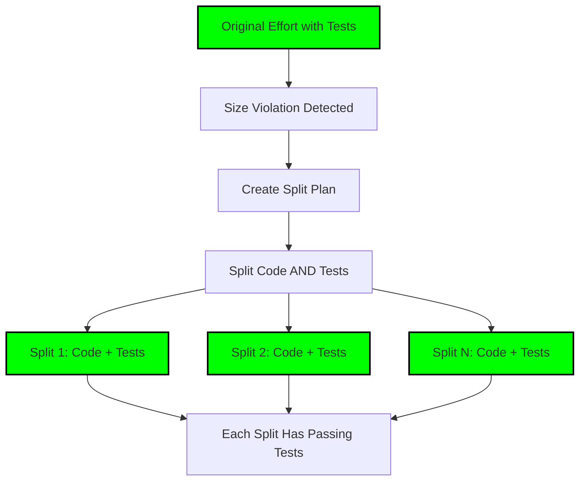

# 🚨🚨🚨 RULE R403: Split Test Preservation Requirements (BLOCKING)

## Classification
- **Category**: Split Management
- **Criticality Level**: 🚨🚨🚨 BLOCKING
- **Enforcement**: MANDATORY during all splits
- **Penalty**: -50% to -75% for violations
- **Related Rules**: R007, R400, R401, R402, R404, R307

## The Rule

**WHEN CODE IS SPLIT, TESTS MUST BE PRESERVED, SPLIT, AND MAINTAINED!**

When an effort exceeds size limits and must be split, the tests MUST accompany their code. Each split must have its own passing tests, and the original test coverage must be maintained or improved across all splits.

## 🚨🚨🚨 BLOCKING: TEST INTEGRITY DURING SPLITS 🚨🚨🚨

**TEST PRESERVATION IS MANDATORY:**



**CRITICAL REQUIREMENTS:**
1. **Tests MUST accompany their code** - Never separate tests from implementation
2. **Each split MUST have passing tests** - No split without test coverage
3. **Coverage MUST be maintained** - Total coverage across splits ≥ original
4. **Tests MUST be meaningful** - No dummy tests to meet requirements

## Split Test Distribution

### 1. Test Assignment Protocol

```bash
# When splitting effort into N parts
assign_tests_to_splits() {
    local original_tests="test/original_*.test.js"
    local split_count=$1

    echo "📋 TEST DISTRIBUTION PLAN"
    echo "========================="

    # Map each test to its tested code
    for test_file in $original_tests; do
        # Determine which split gets this test
        tested_module=$(extract_tested_module "$test_file")
        assigned_split=$(determine_split_for_module "$tested_module")

        echo "Test: $test_file"
        echo "  Tests: $tested_module"
        echo "  Assigned to: Split $assigned_split"
    done

    # Verify coverage maintained
    verify_split_coverage
}
```

### 2. Test Migration Rules

```markdown
## Test Migration During Splits

### Split 1: Authentication Core
**Code Files:**
- src/auth/core.js
- src/auth/validator.js

**Test Files (MUST INCLUDE):**
- test/auth/core.test.js
- test/auth/validator.test.js
- test/integration/auth-basic.test.js

**Coverage Requirement:** ≥80%

### Split 2: OAuth Extension
**Code Files:**
- src/auth/oauth.js
- src/auth/providers/

**Test Files (MUST INCLUDE):**
- test/auth/oauth.test.js
- test/auth/providers/*.test.js
- test/integration/auth-oauth.test.js

**Coverage Requirement:** ≥80%
```

### 3. Test Independence Requirements

```javascript
// Each split's tests MUST be independent
// Split 1 tests must pass WITHOUT Split 2
describe('Split 1: Core Authentication', () => {
    it('should work independently', () => {
        // Test ONLY Split 1 functionality
        // Must pass even if Split 2 never merges
    });
});

// Split 2 tests can depend on Split 1 (sequential)
describe('Split 2: OAuth Enhancement', () => {
    it('should enhance core authentication', () => {
        // Can assume Split 1 is merged
        // But must work without Split 3
    });
});
```

## Coverage Preservation Requirements

### 1. Coverage Calculation

```bash
# Original effort coverage
calculate_original_coverage() {
    echo "📊 Original Effort Coverage:"
    npm test -- --coverage > original-coverage.txt
    ORIGINAL_COV=$(grep "All files" original-coverage.txt | awk '{print $10}')
    echo "Total Coverage: $ORIGINAL_COV"
    return $ORIGINAL_COV
}

# Split coverage verification
verify_split_coverage() {
    local split_num=$1
    local original_coverage=$2

    echo "📊 Verifying Split $split_num Coverage:"

    # Run split tests
    cd "split-$split_num"
    npm test -- --coverage > "split-$split_num-coverage.txt"
    SPLIT_COV=$(grep "All files" "split-$split_num-coverage.txt" | awk '{print $10}')

    if [ "$SPLIT_COV" -lt "$original_coverage" ]; then
        echo "❌ VIOLATION: Split coverage $SPLIT_COV% < Original $original_coverage%"
        exit 1
    fi

    echo "✅ Split coverage maintained: $SPLIT_COV%"
}
```

### 2. Aggregate Coverage

```bash
# Total coverage across all splits
calculate_aggregate_coverage() {
    echo "📊 Aggregate Coverage Across Splits:"

    local total_lines=0
    local covered_lines=0

    for split_dir in split-*; do
        # Get split coverage data
        lines=$(get_total_lines "$split_dir")
        covered=$(get_covered_lines "$split_dir")

        total_lines=$((total_lines + lines))
        covered_lines=$((covered_lines + covered))
    done

    AGGREGATE_COV=$((covered_lines * 100 / total_lines))
    echo "Aggregate Coverage: $AGGREGATE_COV%"

    if [ "$AGGREGATE_COV" -lt 80 ]; then
        echo "❌ VIOLATION: Aggregate coverage below threshold"
        exit 1
    fi
}
```

## Split Test Execution

### 1. Sequential Split Testing

```bash
# Splits execute sequentially, tests build on previous
test_split_sequence() {
    echo "🧪 Testing Split Sequence"

    # Test Split 1 in isolation
    echo "Testing Split 1 (isolated)..."
    cd split-1
    npm test || exit 1

    # Merge Split 1, then test Split 2
    echo "Testing Split 2 (with Split 1)..."
    git merge split-1
    cd split-2
    npm test || exit 1

    # Continue for all splits
    echo "✅ All splits pass sequentially"
}
```

### 2. Feature Flag Test Preservation

```javascript
// Tests must respect feature flags across splits
describe('Feature behind flag', () => {
    beforeEach(() => {
        // Feature may be split across multiple PRs
        process.env.FEATURE_ENABLED = 'false';
    });

    it('should not break when feature is disabled', () => {
        // Test stability with feature flag off
        expect(system.isStable()).toBe(true);
    });

    it('should work when feature is enabled', () => {
        process.env.FEATURE_ENABLED = 'true';
        // Test new functionality
        expect(feature.works()).toBe(true);
    });
});
```

## Common Violations

### ❌ VIOLATION: Tests Left Behind

```bash
# Original effort: 500 lines code, 200 lines tests
# Split 1: 250 lines code, 0 lines tests  # VIOLATION!
# Split 2: 250 lines code, 200 lines tests  # WRONG!
```

### ❌ VIOLATION: Coverage Dropped

```bash
# Original: 85% coverage
# Split 1: 60% coverage  # VIOLATION!
# Split 2: 65% coverage  # VIOLATION!
# Must maintain ≥85% in EACH split
```

### ❌ VIOLATION: Tests Don't Match Code

```javascript
// split-1/src/auth.js - Authentication implementation
// split-1/test/payment.test.js - Wrong tests!  # VIOLATION!
```

## Success Patterns

### ✅ CORRECT: Proper Test Distribution

```bash
# Original Effort (820 lines)
src/auth/ (400 lines)
src/oauth/ (420 lines)
test/auth/ (150 lines)
test/oauth/ (180 lines)
Coverage: 82%

# Split 1: Core Auth (400 + 150 = 550 lines)
src/auth/ (400 lines)
test/auth/ (150 lines)
Coverage: 83%  ✅

# Split 2: OAuth (420 + 180 = 600 lines)
src/oauth/ (420 lines)
test/oauth/ (180 lines)
Coverage: 81%  ✅
```

## Enforcement Checklist

Before approving ANY split:
- [ ] Each split has accompanying tests
- [ ] Each split's tests pass independently
- [ ] Coverage maintained or improved
- [ ] Tests match split functionality
- [ ] Feature flags tested in each split
- [ ] Integration tests updated for splits
- [ ] No orphaned tests
- [ ] No untested code

## Grading Impact

| Violation | Penalty |
|-----------|---------|
| Split without tests | -75% |
| Coverage degradation | -50% |
| Tests don't match code | -40% |
| Tests not independent | -30% |
| Missing integration tests | -20% |
| Poor test distribution | -15% |

## Integration Requirements

### With R007 (Size Limits)
- Tests don't count toward 800-line limit
- But tests MUST accompany their code in splits

### With R307 (Independent Mergeability)
- Each split must be independently mergeable WITH its tests
- Tests ensure splits don't break functionality

### With R400-R402 (TDD Requirements)
- Split tests follow TDD methodology
- Tests existed before original implementation
- Tests continue to enforce behavior

## Remember

**"Tests travel with code"** - Never separate
**"Coverage never decreases"** - Maintain standards
**"Each split stands alone"** - Independent testing
**"Tests prove correctness"** - Essential for splits

**TEST PRESERVATION DURING SPLITS IS MANDATORY!**

---

*Failure to preserve tests during splits will result in split rejection and significant grading penalties. Tests are not optional additions - they are integral parts of the code.*