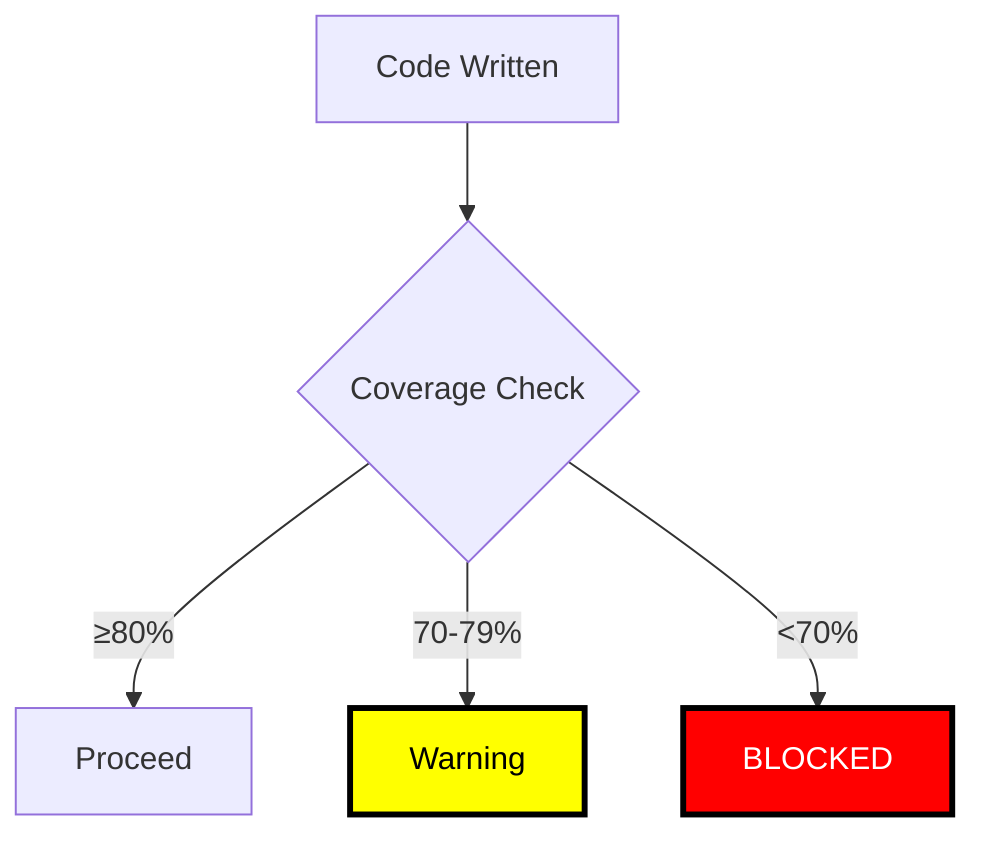

# ⚠️⚠️⚠️ RULE R404: Test Coverage Requirements (WARNING)

## Classification
- **Category**: Quality Assurance
- **Criticality Level**: ⚠️⚠️⚠️ WARNING (escalates to BLOCKING at gates)
- **Enforcement**: CONTINUOUS monitoring, MANDATORY at gates
- **Penalty**: -20% to -50% for violations
- **Related Rules**: R400, R401, R402, R403, R291

## The Rule

**MINIMUM TEST COVERAGE REQUIREMENTS ARE MANDATORY AT ALL LEVELS!**

Test coverage is not a suggestion - it is a measurable requirement that must be met before any integration, completion, or state transition. Low coverage indicates untested code, which is untrustworthy code.

## ⚠️⚠️⚠️ WARNING: COVERAGE THRESHOLDS ARE ENFORCED ⚠️⚠️⚠️

**COVERAGE REQUIREMENTS BY LEVEL:**



## Mandatory Coverage Thresholds

### Level-Based Requirements

| Level | Unit Tests | Integration | E2E | Total Coverage |
|-------|-----------|-------------|-----|----------------|
| **Effort** | 80% | N/A | N/A | 80% |
| **Wave** | 80% | 70% | Key paths | 85% |
| **Phase** | 85% | 75% | Critical paths | 87% |
| **Project** | 90% | 80% | All paths | 90% |

### File-Type Requirements

| File Type | Required Coverage | Critical? |
|-----------|------------------|-----------|
| Core Logic | 95% | YES |
| API Handlers | 90% | YES |
| Utilities | 85% | YES |
| UI Components | 80% | NO |
| Configuration | 60% | NO |
| Generated Code | 0% (excluded) | N/A |

## Coverage Measurement

### 1. Automated Coverage Collection

```bash
# Coverage must be collected automatically
setup_coverage_collection() {
    # Jest configuration
    cat > jest.config.js << 'EOF'
module.exports = {
    collectCoverage: true,
    coverageDirectory: 'coverage',
    coverageReporters: ['text', 'lcov', 'html'],
    coverageThreshold: {
        global: {
            branches: 80,
            functions: 80,
            lines: 80,
            statements: 80
        }
    },
    collectCoverageFrom: [
        'src/**/*.{js,jsx,ts,tsx}',
        '!src/**/*.generated.*',
        '!src/**/*.test.*'
    ]
};
EOF
}
```

### 2. Coverage Enforcement Script

```bash
#!/bin/bash
# enforce-coverage.sh - Run before any commit/merge

enforce_coverage_requirements() {
    echo "📊 COVERAGE ENFORCEMENT CHECK"
    echo "=============================="

    # Run tests with coverage
    npm test -- --coverage --coverageReporters=json-summary

    # Extract coverage percentages
    COVERAGE_FILE="coverage/coverage-summary.json"

    LINES=$(jq '.total.lines.pct' $COVERAGE_FILE)
    BRANCHES=$(jq '.total.branches.pct' $COVERAGE_FILE)
    FUNCTIONS=$(jq '.total.functions.pct' $COVERAGE_FILE)
    STATEMENTS=$(jq '.total.statements.pct' $COVERAGE_FILE)

    echo "Coverage Results:"
    echo "  Lines:      ${LINES}%"
    echo "  Branches:   ${BRANCHES}%"
    echo "  Functions:  ${FUNCTIONS}%"
    echo "  Statements: ${STATEMENTS}%"

    # Check against thresholds
    THRESHOLD=80
    FAILED=false

    if (( $(echo "$LINES < $THRESHOLD" | bc -l) )); then
        echo "❌ Line coverage below threshold: ${LINES}% < ${THRESHOLD}%"
        FAILED=true
    fi

    if (( $(echo "$BRANCHES < $THRESHOLD" | bc -l) )); then
        echo "❌ Branch coverage below threshold: ${BRANCHES}% < ${THRESHOLD}%"
        FAILED=true
    fi

    if (( $(echo "$FUNCTIONS < $THRESHOLD" | bc -l) )); then
        echo "❌ Function coverage below threshold: ${FUNCTIONS}% < ${THRESHOLD}%"
        FAILED=true
    fi

    if [ "$FAILED" = true ]; then
        echo ""
        echo "⚠️⚠️⚠️ COVERAGE REQUIREMENTS NOT MET ⚠️⚠️⚠️"
        echo "Add more tests to meet the ${THRESHOLD}% threshold"
        exit 1
    fi

    echo ""
    echo "✅ All coverage requirements met!"
    return 0
}
```

### 3. Uncovered Code Detection

```bash
# Identify and report uncovered code
find_uncovered_code() {
    echo "🔍 UNCOVERED CODE REPORT"
    echo "========================"

    # Generate detailed coverage report
    npm test -- --coverage --coverageReporters=lcov

    # Parse lcov to find uncovered lines
    lcov_file="coverage/lcov.info"

    current_file=""
    while IFS= read -r line; do
        if [[ $line == SF:* ]]; then
            current_file="${line:3}"
            echo "File: $current_file"
        elif [[ $line == DA:* ]]; then
            IFS=',' read -r line_num hit_count <<< "${line:3}"
            if [ "$hit_count" -eq 0 ]; then
                echo "  Uncovered line: $line_num"
            fi
        fi
    done < "$lcov_file"

    echo ""
    echo "Action Required: Write tests for uncovered lines"
}
```

## Coverage Quality Requirements

### 1. Meaningful Test Coverage

```javascript
// ❌ BAD: Trivial coverage inflation
test('exists', () => {
    expect(myFunction).toBeDefined();  // Doesn't test behavior!
});

// ✅ GOOD: Meaningful behavior testing
test('calculates tax correctly', () => {
    expect(calculateTax(100, 0.10)).toBe(10);
    expect(calculateTax(200, 0.15)).toBe(30);
    expect(calculateTax(0, 0.10)).toBe(0);
});
```

### 2. Edge Case Coverage

```javascript
// All edge cases MUST be covered
describe('Edge cases', () => {
    test('handles null input', () => {
        expect(() => process(null)).toThrow('Invalid input');
    });

    test('handles empty array', () => {
        expect(process([])).toEqual([]);
    });

    test('handles maximum values', () => {
        expect(process(Number.MAX_VALUE)).toBeDefined();
    });
});
```

### 3. Error Path Coverage

```javascript
// Error paths count toward coverage requirements
test('handles network errors', async () => {
    mockApi.get.mockRejectedValue(new Error('Network error'));

    await expect(fetchData()).rejects.toThrow('Network error');
    expect(logger.error).toHaveBeenCalled();
});
```

## Coverage Reporting

### 1. Continuous Coverage Tracking

```bash
# Generate coverage report after every test run
generate_coverage_report() {
    TIMESTAMP=$(date +%Y%m%d-%H%M%S)
    REPORT_FILE="coverage-report-${TIMESTAMP}.md"

    cat > "$REPORT_FILE" << EOF
# Coverage Report
Generated: ${TIMESTAMP}

## Summary
| Metric | Coverage | Threshold | Status |
|--------|----------|-----------|--------|
| Lines | ${LINES}% | 80% | $([ $LINES -ge 80 ] && echo "✅" || echo "❌") |
| Branches | ${BRANCHES}% | 80% | $([ $BRANCHES -ge 80 ] && echo "✅" || echo "❌") |
| Functions | ${FUNCTIONS}% | 80% | $([ $FUNCTIONS -ge 80 ] && echo "✅" || echo "❌") |
| Statements | ${STATEMENTS}% | 80% | $([ $STATEMENTS -ge 80 ] && echo "✅" || echo "❌") |

## Uncovered Files
$(find_files_below_threshold)

## Next Steps
$(generate_coverage_improvement_tasks)
EOF

    echo "📊 Coverage report saved: $REPORT_FILE"
}
```

### 2. Coverage Trend Tracking

```bash
# Track coverage over time
track_coverage_trend() {
    COVERAGE_LOG="coverage-trend.csv"

    # Initialize if not exists
    if [ ! -f "$COVERAGE_LOG" ]; then
        echo "date,lines,branches,functions,statements" > "$COVERAGE_LOG"
    fi

    # Append current coverage
    echo "$(date +%Y-%m-%d),$LINES,$BRANCHES,$FUNCTIONS,$STATEMENTS" >> "$COVERAGE_LOG"

    # Check trend (last 5 entries)
    tail -5 "$COVERAGE_LOG" | awk -F',' '{print $2}' | \
    awk '{if(NR>1 && $1<prev){down++} prev=$1} END {
        if(down>2) {
            print "⚠️ WARNING: Coverage trending DOWN!"
            exit 1
        }
    }'
}
```

## Coverage Recovery Protocol

### When Coverage Falls Below Threshold

```bash
recover_coverage() {
    echo "🚨 COVERAGE RECOVERY PROTOCOL INITIATED"

    # 1. Identify biggest gaps
    echo "Step 1: Identifying coverage gaps..."
    find_uncovered_code > uncovered-code.txt

    # 2. Prioritize critical paths
    echo "Step 2: Prioritizing critical paths..."
    prioritize_critical_uncovered_code

    # 3. Create test tasks
    echo "Step 3: Creating test tasks..."
    create_test_writing_tasks

    # 4. Block further development
    echo "Step 4: Blocking non-test development..."
    echo "BLOCKED: Coverage below threshold" > .coverage-block

    # 5. Monitor recovery
    echo "Step 5: Monitoring coverage recovery..."
    while [ -f .coverage-block ]; do
        enforce_coverage_requirements && rm .coverage-block
        sleep 60
    done
}
```

## Grading Impact

| Coverage Level | Impact |
|----------------|--------|
| ≥90% | Bonus: +5% |
| 80-89% | Normal: 0% |
| 70-79% | Warning: -10% |
| 60-69% | Penalty: -25% |
| 50-59% | Severe: -40% |
| <50% | Critical: -50% |

## Integration with CI/CD

```yaml
# .github/workflows/coverage.yml
name: Coverage Check

on: [push, pull_request]

jobs:
  coverage:
    runs-on: ubuntu-latest
    steps:
      - uses: actions/checkout@v2

      - name: Run tests with coverage
        run: npm test -- --coverage

      - name: Check coverage thresholds
        run: |
          coverage=$(cat coverage/coverage-summary.json | jq '.total.lines.pct')
          if (( $(echo "$coverage < 80" | bc -l) )); then
            echo "Coverage $coverage% is below 80% threshold"
            exit 1
          fi

      - name: Upload coverage reports
        uses: codecov/codecov-action@v2
        with:
          fail_ci_if_error: true
          threshold: 80
```

## Success Criteria

For EVERY code submission:
- ✅ Coverage meets or exceeds thresholds
- ✅ All critical paths tested
- ✅ Edge cases covered
- ✅ Error paths tested
- ✅ No trivial tests for coverage inflation
- ✅ Coverage trend stable or improving
- ✅ Coverage report generated

## Remember

**"Untested code is broken code"** - Assume the worst
**"Coverage is confidence"** - Higher is better
**"Quality over quantity"** - Meaningful tests
**"Trends matter"** - Don't let coverage decay

**TEST COVERAGE IS NOT OPTIONAL - IT'S A REQUIREMENT!**

---

*Coverage requirements escalate from WARNING to BLOCKING at integration gates. Persistent low coverage will result in development blocks and grading penalties.*