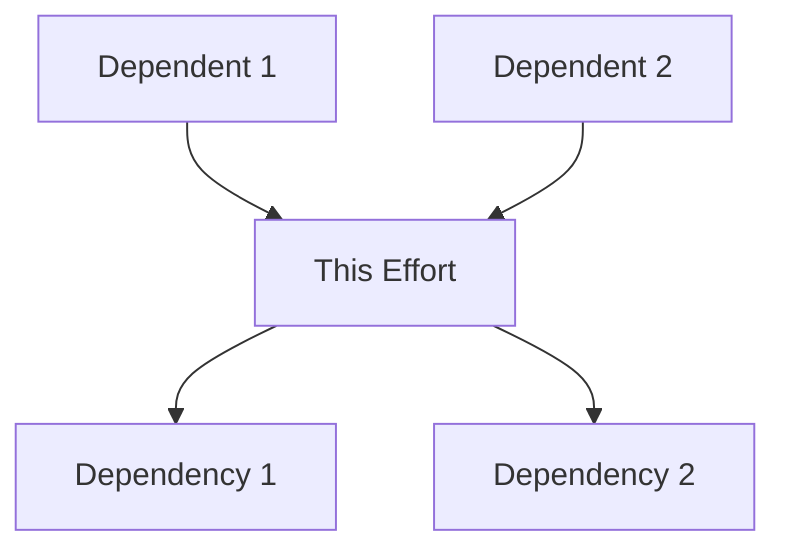

# Effort Implementation Plan

**Effort ID**: E[PHASE].[WAVE].[EFFORT]  
**Effort Name**: [NAME]  
**Phase**: [PHASE_NUMBER] - [PHASE_NAME]  
**Wave**: [WAVE_NUMBER] - [WAVE_NAME]  
**Created By**: Code Reviewer [ID]  
**Date Created**: [DATE]  
**Assigned To**: SW Engineer [ID]  

## 📋 Effort Overview

### Description
[2-3 sentences describing what this effort accomplishes and why it's needed]

### Size Estimate
- **Estimated Lines**: [NUMBER] (must be ≤800)
- **Confidence Level**: [High/Medium/Low]
- **Split Risk**: [High/Medium/Low]

### Dependencies
- **Requires**: [List any efforts that must complete first]
- **Blocks**: [List any efforts waiting on this]
- **External**: [List any external dependencies]

## 🎯 Requirements

### Functional Requirements
- [ ] [REQUIREMENT_1]
- [ ] [REQUIREMENT_2]
- [ ] [REQUIREMENT_3]
- [ ] [REQUIREMENT_4]
- [ ] [REQUIREMENT_5]

### Non-Functional Requirements
- [ ] Performance: [SPECIFIC_METRIC]
- [ ] Security: [SPECIFIC_REQUIREMENT]
- [ ] Maintainability: [SPECIFIC_STANDARD]
- [ ] Scalability: [SPECIFIC_TARGET]

### Acceptance Criteria
- [ ] All unit tests passing
- [ ] Test coverage ≥ [PERCENT]%
- [ ] Code review approved
- [ ] Size ≤ 800 lines (measured)
- [ ] No critical TODOs
- [ ] Documentation complete
- [ ] Scope boundaries followed (R311)

## 🚨 EXPLICIT SCOPE DEFINITION (R311 MANDATORY)

### IMPLEMENT EXACTLY
**BE SPECIFIC - List exact function names, counts, and purposes**

#### Functions (EXACTLY [N] functions)
```
1. FunctionName1(params) ReturnType  // ~30 lines - [specific purpose]
2. FunctionName2(params) ReturnType  // ~45 lines - [specific purpose]
3. FunctionName3(params) ReturnType  // ~60 lines - [specific purpose]
TOTAL: 3 functions, ~135 lines
```

#### Types/Models (EXACTLY [N] types)
```
1. TypeName1 - [purpose] - [N] fields, NO methods
2. TypeName2 - [purpose] - [N] fields, [N] methods ONLY
TOTAL: 2 types, ~80 lines
```

#### API Endpoints (if applicable)
```
POST /api/v1/resource - Create resource (~100 lines)
GET  /api/v1/resource/:id - Get resource (~80 lines)
// NO OTHER ENDPOINTS IN THIS EFFORT
```

### 🛑 DO NOT IMPLEMENT
**CRITICAL: These are FORBIDDEN in this effort**

- ❌ DO NOT implement [feature X] - future effort
- ❌ DO NOT add validation beyond nil checks
- ❌ DO NOT implement Update/Delete operations
- ❌ DO NOT add caching or optimization
- ❌ DO NOT implement authentication
- ❌ DO NOT create utility/helper functions
- ❌ DO NOT add comprehensive logging
- ❌ DO NOT write edge case tests
- ❌ DO NOT refactor existing code

### SIZE BREAKDOWN
```
Production Code:
- Functions: [N] × [avg] = [TOTAL] lines
- Types:     [N] × [avg] = [TOTAL] lines
- Other:                    [TOTAL] lines
Subtotal:                   [TOTAL] lines

Test Code:
- Unit tests: [N] × 30 = [TOTAL] lines
- Integration: [N] × 50 = [TOTAL] lines
Subtotal:                  [TOTAL] lines

Demo Artifacts (R330 MANDATORY):
- Demo script: ~50 lines
- Demo documentation: ~80 lines
- Test data files: ~20 lines
Subtotal:                   ~150 lines

GRAND TOTAL: [TOTAL] lines (must be <800 INCLUDING demos)
```

## 📁 Implementation Details

### Files to Create
| File Path | Purpose | Estimated Lines |
|-----------|---------|-----------------|
| `path/to/file1.ext` | [PURPOSE] | [NUMBER] |
| `path/to/file2.ext` | [PURPOSE] | [NUMBER] |
| `path/to/file3.ext` | [PURPOSE] | [NUMBER] |
| **Total** | | [NUMBER] |

### Files to Modify
| File Path | Changes | Estimated Lines |
|-----------|---------|-----------------|
| `path/to/existing1.ext` | [CHANGES] | +[NUMBER] |
| `path/to/existing2.ext` | [CHANGES] | +[NUMBER] |
| **Total** | | +[NUMBER] |

### Key Components

#### Component 1: [NAME]
**Purpose**: [Description]  
**Location**: `path/to/component`  
**Lines**: ~[NUMBER]  

```[LANGUAGE]
// Pseudo-code or interface definition
interface [NAME] {
    method1(): ReturnType
    method2(param: Type): ReturnType
}
```

#### Component 2: [NAME]
**Purpose**: [Description]  
**Location**: `path/to/component`  
**Lines**: ~[NUMBER]  

```[LANGUAGE]
// Pseudo-code or structure definition
struct [NAME] {
    field1: Type
    field2: Type
}
```

## 🧪 Testing Strategy

### Unit Tests Required (MINIMAL SCOPE)
- [ ] Test file: `tests/unit/test_[NAME].ext`
- [ ] Coverage target: [PERCENT]%
- [ ] Test cases (BASIC ONLY):
  - [ ] Happy path scenarios (1-2 per function)
  - [ ] Basic error handling (nil/empty only)
  - [ ] NO edge cases unless critical
  - [ ] NO comprehensive boundary testing
  - [ ] NO performance/benchmark tests

### Integration Tests
- [ ] Test file: `tests/integration/test_[NAME].ext`
- [ ] Scenarios to test:
  - [ ] Integration with [COMPONENT]
  - [ ] End-to-end workflow
  - [ ] Performance under load

### Test Data Requirements
- Sample data location: `tests/fixtures/[NAME]/`
- Mock requirements: [List what needs mocking]
- External service stubs: [List any service stubs needed]

## 🎬 Demo Requirements (R330 & R291 MANDATORY)

### Demo Objectives
List 3-5 specific features/behaviors that MUST be demonstrated:
- [ ] [Feature 1]: [What specifically to demonstrate]
- [ ] [Feature 2]: [What behavior to verify]
- [ ] [Error handling]: [What error scenario to show]
- [ ] [Integration point]: [What connection to prove]
- [ ] [Performance aspect]: [What metric to display]

### Demo Scenarios (IMPLEMENT EXACTLY THESE)

#### Scenario 1: [Primary Feature Demo]
- **Setup**: [Initial conditions, e.g., clean database]
- **Input**: [Exact input data or command]
- **Action**: `[exact command or API call]`
- **Expected Output**: 
  ```
  [Expected output format/content]
  ```
- **Verification**: [How to verify success]
- **Script Lines**: ~[N] lines

#### Scenario 2: [Error Handling Demo]
- **Setup**: [Initial conditions]
- **Input**: [Invalid/error input]
- **Action**: `[exact command or API call]`
- **Expected Output**:
  ```
  [Expected error message/response]
  ```
- **Verification**: [How to verify proper error handling]
- **Script Lines**: ~[N] lines

#### Scenario 3: [Integration Demo]
- **Setup**: [Required services/dependencies]
- **Action**: [Integration test command]
- **Expected**: [Integration behavior]
- **Verification**: [How to verify integration works]
- **Script Lines**: ~[N] lines

### Demo Size Impact
```
demo-features.sh:     50 lines  # Main executable script
DEMO.md:             80 lines  # Documentation per template
test-data/:          20 lines  # Sample data files
integration-hook:    10 lines  # Wave integration hook
────────────────────────────────
TOTAL DEMO OVERHEAD: 160 lines (INCLUDED in 800-line limit!)
```

### Demo Deliverables
Required files that MUST be created:
- [ ] `demo-features.sh` - Executable demo script
- [ ] `DEMO.md` - Demo documentation (use template)
- [ ] `test-data/valid.json` - Valid input examples
- [ ] `test-data/invalid.json` - Invalid input examples
- [ ] `.demo-ready` - Flag file for integration

### Integration Hooks
For wave/phase integration demos:
- Export `DEMO_READY=true` when complete
- Provide entry point: `./demo-features.sh`
- Include cleanup: `./demo-cleanup.sh`
- Support batch mode: `DEMO_BATCH=true ./demo-features.sh`

## 🔄 Implementation Approach

### Step 1: Setup and Structure
- [ ] Create directory structure
- [ ] Set up base files
- [ ] Add necessary imports/dependencies
- **Estimated Time**: [NUMBER] hours
- **Lines**: ~[NUMBER]

### Step 2: Core Implementation
- [ ] Implement [FEATURE_1]
- [ ] Implement [FEATURE_2]
- [ ] Implement [FEATURE_3]
- **Estimated Time**: [NUMBER] hours
- **Lines**: ~[NUMBER]

### Step 3: Error Handling
- [ ] Add input validation
- [ ] Implement error types
- [ ] Add recovery mechanisms
- **Estimated Time**: [NUMBER] hours
- **Lines**: ~[NUMBER]

### Step 4: Testing
- [ ] Write unit tests
- [ ] Write integration tests
- [ ] Achieve coverage target
- **Estimated Time**: [NUMBER] hours
- **Lines**: ~[NUMBER]

### Step 5: Documentation
- [ ] Add inline comments
- [ ] Write docstrings
- [ ] Update README if needed
- **Estimated Time**: [NUMBER] hours
- **Lines**: ~[NUMBER]

## 📊 Size Management

### Size Breakdown
```
Core Logic:        [NUMBER] lines ([PERCENT]%)
Error Handling:    [NUMBER] lines ([PERCENT]%)
Tests:            [NUMBER] lines ([PERCENT]%)
Documentation:    [NUMBER] lines ([PERCENT]%)
-----------------------------------
Total Estimated:  [NUMBER] lines
Buffer (10%):     [NUMBER] lines
-----------------------------------
Final Estimate:   [NUMBER] lines
```

### Split Contingency Plan
If effort exceeds 700 lines during implementation:

**Split Option 1**: By functionality
- Split 1: [DESCRIPTION] (~[NUMBER] lines)
- Split 2: [DESCRIPTION] (~[NUMBER] lines)

**Split Option 2**: By layer
- Split 1: Core logic (~[NUMBER] lines)
- Split 2: Tests and documentation (~[NUMBER] lines)

## 🚨 Risk Assessment

### Technical Risks
| Risk | Probability | Impact | Mitigation |
|------|------------|--------|------------|
| Size overrun | [H/M/L] | High | Early split decision |
| Complex dependencies | [H/M/L] | [H/M/L] | [STRATEGY] |
| Performance issues | [H/M/L] | [H/M/L] | [STRATEGY] |

### Implementation Risks
- **Ambiguous Requirements**: [Clarification needed on...]
- **Technical Debt**: [Existing issues that might impact...]
- **Knowledge Gaps**: [Areas requiring research...]

## 🔗 Integration Points

### APIs/Interfaces
- **Consumes**: [List APIs this effort uses]
- **Provides**: [List APIs this effort exposes]
- **Modifies**: [List APIs this effort changes]

### Data Structures
- **Uses**: [List data structures consumed]
- **Creates**: [List new data structures]
- **Modifies**: [List structure changes]

### Dependencies


## 📈 Success Metrics

### Code Quality Metrics
- Cyclomatic complexity: <[NUMBER]
- Code duplication: <[PERCENT]%
- Linting errors: 0
- Type checking: 100% pass

### Performance Metrics
- Execution time: <[NUMBER]ms
- Memory usage: <[NUMBER]MB
- Database queries: <[NUMBER]
- API response time: <[NUMBER]ms

## 📚 Documentation Requirements

### Code Documentation
- [ ] All public functions have docstrings
- [ ] Complex logic has inline comments
- [ ] README updated with new features
- [ ] API documentation generated

### User Documentation
- [ ] User guide updated
- [ ] API reference updated
- [ ] Migration guide (if breaking changes)
- [ ] Examples provided

## ✅ Review Checklist

### For Implementation
- [ ] All requirements implemented
- [ ] Tests written and passing
- [ ] Size under 800 lines
- [ ] No hardcoded values
- [ ] Error handling complete
- [ ] Documentation complete

### For Code Review
- [ ] Measure size with line-counter.sh
- [ ] Verify test coverage
- [ ] Check code style compliance
- [ ] Review error handling
- [ ] Validate integration points
- [ ] Approve or request changes

## 📝 Notes

### Implementation Notes
[Any specific notes about the implementation approach]

### Assumptions
[List any assumptions made in this plan]

### Open Questions
[List any questions that need answers]

---

**Status**: Planning Complete  
**Ready for Implementation**: [Yes/No]  
**Approved By**: [Code Reviewer ID]  
**Approval Date**: [DATE]  

**Remember**: This plan is the contract between Code Reviewer and SW Engineer!