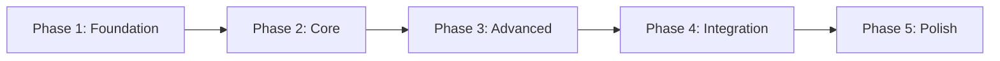

# Master Implementation Plan for [PROJECT_NAME]

## 🎯 Project Overview

**Project Name**: [PROJECT_NAME]  
**Project Type**: [e.g., Kubernetes Controller, Web Application, CLI Tool, API Service]  
**Primary Language**: [LANGUAGE]  
**Repository**: [GITHUB_URL]  
**Start Date**: [DATE]  
**Target Completion**: [DATE]  

### Executive Summary
[2-3 sentences describing the project's purpose, key features, and business value]

### Success Metrics
- **Code Quality**: All efforts ≤800 lines (measured by line-counter.sh)
- **Test Coverage**: Minimum [TEST_COVERAGE]% per phase
- **Review Success**: First-pass review rate ≥80%
- **Integration Success**: Zero breaking changes during phase integration
- **Performance**: [Define specific performance targets]

## 📊 Project Statistics

| Metric | Value |
|--------|-------|
| **Total Phases** | [NUMBER] |
| **Total Waves** | [NUMBER] |
| **Total Efforts** | [NUMBER] |
| **Estimated Lines** | [NUMBER] |
| **Team Size** | [NUMBER] agents |
| **Parallel Capacity** | [NUMBER] concurrent efforts |

## 🏗️ Technology Stack

### Core Technologies
- **Language**: [PRIMARY_LANGUAGE]
- **Framework**: [PRIMARY_FRAMEWORK]
- **Database**: [DATABASE_TYPE]
- **Testing**: [TEST_FRAMEWORK]

### Infrastructure
- **Container**: [Docker/Podman/etc]
- **Orchestration**: [Kubernetes/Docker Compose/etc]
- **CI/CD**: [GitHub Actions/Jenkins/etc]
- **Monitoring**: [Prometheus/Grafana/etc]

### Dependencies
```yaml
critical_dependencies:
  - name: [DEPENDENCY_1]
    version: [VERSION]
    purpose: [WHY_NEEDED]
  
optional_dependencies:
  - name: [DEPENDENCY_2]
    version: [VERSION]
    purpose: [WHY_NEEDED]
```

## 🔧 Configuration

```yaml
# Software Factory 2.0 Configuration
size_limits:
  warning_threshold: 700
  error_threshold: 800
  split_threshold: 600  # Proactively split if approaching

test_coverage:
  phase_1: [PERCENT]%
  phase_2: [PERCENT]%
  phase_3: [PERCENT]%
  phase_4: [PERCENT]%
  phase_5: [PERCENT]%

parallelization:
  max_parallel_efforts: [NUMBER]
  max_parallel_agents: [NUMBER]
  allow_parallel_waves: [true/false]

review_requirements:
  code_review: mandatory
  architect_review: mandatory  
  security_review: [mandatory/optional]
  performance_review: [mandatory/optional]

grading_thresholds:
  parallel_spawn_delta: 5.0  # seconds
  review_first_pass: 80     # percent
  test_coverage_min: [PERCENT]
  integration_success: 95   # percent
```

## 📋 Phase Overview

### Phase Distribution
```
Phase 1: Foundation     ([PERCENT]% - ~[LINES] lines)
Phase 2: Core Features  ([PERCENT]% - ~[LINES] lines)
Phase 3: Advanced       ([PERCENT]% - ~[LINES] lines)
Phase 4: Integration    ([PERCENT]% - ~[LINES] lines)
Phase 5: Polish         ([PERCENT]% - ~[LINES] lines)
```

### Phase Dependencies


## 🚀 Phase 1: Foundation
**Scope**: [DESCRIBE SCOPE]  
**Target Lines**: [NUMBER]  
**Test Coverage**: [PERCENT]%  

### Goals
- [ ] Establish project structure
- [ ] Define core types and interfaces
- [ ] Implement basic infrastructure
- [ ] Set up CI/CD pipeline
- [ ] Create development environment

### Success Criteria
- All core types compile without errors
- Basic CRUD operations functional
- Unit test framework operational
- CI/CD pipeline triggers on commits
- Documentation structure in place

### Waves
- **Wave 1**: Core Types ([NUMBER] efforts, can parallelize)
- **Wave 2**: Basic Infrastructure ([NUMBER] efforts, sequential)
- **Wave 3**: Development Tools ([NUMBER] efforts, can parallelize)

### Risk Factors
- **Technical**: [Identify technical risks]
- **Dependencies**: [External dependency risks]
- **Sequencing**: [Dependency and ordering risks]

## 🎯 Phase 2: Core Features
**Scope**: [DESCRIBE SCOPE]  
**Target Lines**: [NUMBER]  
**Test Coverage**: [PERCENT]%  

### Goals
- [ ] Implement primary business logic
- [ ] Create user-facing APIs
- [ ] Establish data persistence layer
- [ ] Implement authentication/authorization
- [ ] Create core workflows

### Success Criteria
- All core features functional
- API endpoints documented and tested
- Database operations optimized
- Security measures implemented
- Integration tests passing

### Waves
- **Wave 1**: Business Logic ([NUMBER] efforts)
- **Wave 2**: API Layer ([NUMBER] efforts)  
- **Wave 3**: Data Layer ([NUMBER] efforts)
- **Wave 4**: Security ([NUMBER] efforts)

### Risk Factors
- **Complexity**: [Feature complexity risks]
- **Performance**: [Performance bottleneck risks]
- **Security**: [Security vulnerability risks]

## 🔬 Phase 3: Advanced Features
**Scope**: [DESCRIBE SCOPE]  
**Target Lines**: [NUMBER]  
**Test Coverage**: [PERCENT]%  

### Goals
- [ ] Implement advanced algorithms
- [ ] Add third-party integrations
- [ ] Create monitoring/observability
- [ ] Implement caching strategies
- [ ] Add advanced error handling

### Success Criteria
- Advanced features stable
- Integrations tested end-to-end
- Monitoring dashboards operational
- Performance benchmarks met
- Error recovery procedures tested

### Waves
- **Wave 1**: Advanced Algorithms ([NUMBER] efforts)
- **Wave 2**: Integrations ([NUMBER] efforts)
- **Wave 3**: Observability ([NUMBER] efforts)

### Risk Factors
- **Integration**: [Third-party API risks]
- **Scalability**: [Scaling risks]
- **Compatibility**: [Version compatibility risks]

## 🔄 Phase 4: Integration & Optimization
**Scope**: [DESCRIBE SCOPE]  
**Target Lines**: [NUMBER]  
**Test Coverage**: [PERCENT]%  

### Goals
- [ ] Optimize performance bottlenecks
- [ ] Implement horizontal scaling
- [ ] Add resilience patterns
- [ ] Complete security hardening
- [ ] Implement deployment automation

### Success Criteria
- Performance targets achieved
- System scales to [NUMBER] users
- Failover mechanisms tested
- Security audit passed
- Zero-downtime deployment working

### Waves
- **Wave 1**: Performance ([NUMBER] efforts)
- **Wave 2**: Scaling ([NUMBER] efforts)
- **Wave 3**: Resilience ([NUMBER] efforts)

### Risk Factors
- **Breaking Changes**: [Backward compatibility risks]
- **Performance**: [Optimization risks]
- **Deployment**: [Production deployment risks]

## ✨ Phase 5: Polish & Documentation
**Scope**: [DESCRIBE SCOPE]  
**Target Lines**: [NUMBER]  
**Test Coverage**: [PERCENT]%  

### Goals
- [ ] Complete user documentation
- [ ] Create developer guides
- [ ] Polish UI/UX elements
- [ ] Add telemetry and analytics
- [ ] Prepare for production release

### Success Criteria
- Documentation coverage 100%
- All user journeys tested
- Accessibility standards met
- Analytics dashboard operational
- Release notes prepared

### Waves
- **Wave 1**: Documentation ([NUMBER] efforts)
- **Wave 2**: UI/UX Polish ([NUMBER] efforts)
- **Wave 3**: Release Prep ([NUMBER] efforts)

### Risk Factors
- **Documentation Debt**: [Documentation completeness risks]
- **User Experience**: [UX issues risks]
- **Release**: [Release coordination risks]

## 🗺️ Detailed Wave Breakdown

### Critical Path
The following waves are on the critical path and cannot be delayed:
1. Phase 1, Wave 1: Core Types (blocks everything)
2. Phase 1, Wave 2: Infrastructure (blocks Phase 2)
3. Phase 2, Wave 1: Business Logic (blocks Phase 3)
4. Phase 4, Wave 3: Resilience (blocks production)

### Parallelization Opportunities
Maximum parallel execution points:
- Phase 1, Wave 1: Up to [NUMBER] efforts
- Phase 2, Wave 2-3: Can run simultaneously
- Phase 3, Wave 1-2: Can run simultaneously
- Phase 5, All Waves: Can run simultaneously

## 📊 Resource Allocation

### Agent Assignments
```yaml
orchestrator:
  responsibilities:
    - Overall coordination
    - State management
    - Integration oversight
    - Grading and metrics

software_engineers:
  count: [NUMBER]
  responsibilities:
    - Implementation
    - Unit testing
    - Documentation

code_reviewers:
  count: [NUMBER]
  responsibilities:
    - Implementation planning
    - Code review
    - Split planning

architect:
  responsibilities:
    - Wave reviews
    - Phase assessments
    - Integration approval
```

### Effort Distribution
| Phase | Small (<300) | Medium (300-600) | Large (600-800) |
|-------|--------------|------------------|-----------------|
| 1 | [NUMBER] | [NUMBER] | [NUMBER] |
| 2 | [NUMBER] | [NUMBER] | [NUMBER] |
| 3 | [NUMBER] | [NUMBER] | [NUMBER] |
| 4 | [NUMBER] | [NUMBER] | [NUMBER] |
| 5 | [NUMBER] | [NUMBER] | [NUMBER] |

## 🚨 Risk Management

### High-Priority Risks
1. **[RISK_NAME]**
   - Probability: [High/Medium/Low]
   - Impact: [Critical/High/Medium/Low]
   - Mitigation: [STRATEGY]

2. **[RISK_NAME]**
   - Probability: [High/Medium/Low]
   - Impact: [Critical/High/Medium/Low]
   - Mitigation: [STRATEGY]

### Contingency Plans
- **Effort Overrun**: Automatic split protocol activates
- **Integration Failure**: Rollback to previous integration point
- **Review Rejection**: Immediate SW Engineer assignment
- **Performance Issues**: Dedicated optimization sprint

## 📈 Success Metrics Tracking

### Phase Completion Criteria
Each phase must meet:
- [ ] All efforts completed and under size limit
- [ ] Test coverage target achieved
- [ ] All code reviews passed
- [ ] Architect approval received
- [ ] Integration branch created and tested
- [ ] Performance benchmarks met
- [ ] Documentation updated

### Key Performance Indicators
```yaml
kpis:
  velocity:
    target: [NUMBER] lines/day
    measure: rolling_7_day_average
  
  quality:
    review_pass_rate: [PERCENT]%
    bug_rate: < [NUMBER] per KLOC
    test_coverage: > [PERCENT]%
  
  efficiency:
    parallel_utilization: > [PERCENT]%
    context_switches: < [NUMBER] per day
    integration_success: > [PERCENT]%
```

## 🔄 Integration Strategy

### Branch Strategy
```
main
  └── phase-1-integration
        ├── phase1/wave1-integration  
        ├── phase1/wave2-integration
        └── phase1/wave3-integration
              ├── effort-1-branch
              ├── effort-2-branch
              └── effort-3-branch
```

### Integration Checkpoints
1. **Effort Complete**: Measure, review, approve
2. **Wave Complete**: Integrate efforts, architect review
3. **Phase Complete**: Full integration, performance test
4. **Project Complete**: Final integration, release prep

## 📝 Documentation Requirements

### Required Documentation
- [ ] README.md with quick start
- [ ] API documentation (OpenAPI/Swagger)
- [ ] Architecture diagrams
- [ ] Deployment guide
- [ ] Developer guide
- [ ] User manual
- [ ] Troubleshooting guide

### Documentation Standards
- All code must have inline comments
- Public APIs must have docstrings
- Complex algorithms need explanation
- Configuration options documented
- Error codes and messages catalogued

## 🎯 Definition of Done

### Effort Level
- [ ] Code implemented and compiles
- [ ] Unit tests written and passing
- [ ] Size under 800 lines (measured)
- [ ] Code review completed
- [ ] Documentation updated
- [ ] Merged to wave branch

### Wave Level
- [ ] All efforts integrated
- [ ] Integration tests passing
- [ ] Architect review passed
- [ ] Performance acceptable
- [ ] Wave branch created

### Phase Level
- [ ] All waves integrated
- [ ] End-to-end tests passing
- [ ] Performance targets met
- [ ] Security review passed
- [ ] Documentation complete
- [ ] Phase branch merged

## 📅 Implementation Sequence

### Phase Progression
```
Phase 1:    Foundation (Waves 1-3) ████████
Phase 2:    Core Features (Waves 1-4) ████████████
Phase 3:    Advanced Features (Waves 1-3) ████████
Phase 4:    Performance & Scale (All Waves) ████████
Phase 5:    Production Readiness (All Waves) ████████
Final:      Integration & Release ████
```

### Milestones
- **Phase 1 Complete**: Foundation ready
- **Phase 2 Complete**: Core features operational
- **Phase 3 Complete**: Advanced features integrated
- **Phase 4 Complete**: Performance targets met
- **Phase 5 Complete**: Production ready

## 🚀 Getting Started

### For Orchestrator
1. Load this plan: `/load-implementation-plan`
2. Initialize state: `/init-orchestrator-state`
3. Begin Phase 1: `/start-phase 1`

### For Developers
1. Review assigned efforts in phase plans
2. Check wave dependencies
3. Follow size constraints strictly
4. Maintain test coverage requirements

### For Reviewers
1. Verify size compliance first
2. Check test coverage
3. Review code quality
4. Validate integration readiness

## 📎 Appendices

### A. Effort Naming Convention
```
E[PHASE].[WAVE].[EFFORT]
Example: E2.3.1 = Phase 2, Wave 3, Effort 1
```

### B. Branch Naming Convention
```
phase[N]/wave[N]-[description]
phase[N]/wave[N]/effort[N]-[description]
```

### C. Commit Message Format
```
[PHASE.WAVE.EFFORT] type: description

- Detail 1
- Detail 2

Refs: #issue-number
```

### D. File Structure
```
project-root/
├── efforts/
│   └── phase[N]/
│       └── wave[N]/
│           └── effort[N]/
├── integration/
│   └── phase[N]/
├── docs/
├── tests/
└── tools/
```

---

**Document Version**: 2.0  
**Template Version**: Software Factory 2.0  
**Last Updated**: [DATE]  
**Next Review**: [DATE]  

**Remember**: This is a living document. Update it as the project evolves!