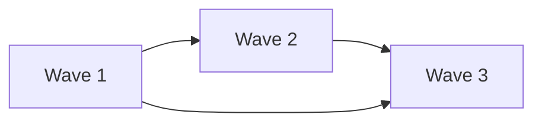

# Phase [NUMBER]: [PHASE_NAME] Implementation Plan

## 📌 Phase Overview

**Phase Number**: [NUMBER]  
**Phase Name**: [NAME]  
**Duration**: [NUMBER] weeks  
**Start Date**: [DATE]  
**Target Completion**: [DATE]  
**Total Waves**: [NUMBER]  
**Total Efforts**: [NUMBER]  
**Target Lines**: [NUMBER] (±10%)  

### Phase Mission
[1-2 sentences describing what this phase achieves and why it's critical]

### Phase Dependencies
- **Requires**: Phase [NUMBER] complete (if applicable)
- **Blocks**: Phase [NUMBER] (if applicable)
- **External**: [Any external dependencies]

## 🎯 Success Criteria

### Mandatory Requirements
- [ ] All efforts under 800 lines (measured by line-counter.sh)
- [ ] Test coverage ≥ [PERCENT]%
- [ ] All code reviews passed
- [ ] Architect review passed
- [ ] Integration tests passing
- [ ] Performance benchmarks met

### Deliverables
- [ ] [DELIVERABLE_1]
- [ ] [DELIVERABLE_2]
- [ ] [DELIVERABLE_3]
- [ ] [DELIVERABLE_4]
- [ ] [DELIVERABLE_5]

### Quality Gates
| Gate | Threshold | Current | Status |
|------|-----------|---------|--------|
| Code Coverage | [PERCENT]% | - | 🔴 |
| Review Pass Rate | 80% | - | 🔴 |
| Build Success | 100% | - | 🔴 |
| Integration Tests | 100% | - | 🔴 |
| Performance | [METRIC] | - | 🔴 |

## 🌊 Wave Structure

### Wave Sequence
```
Wave 1: [NAME] ──────── (Parallel: Yes)
Wave 2: [NAME] ──────── (Parallel: No) [Depends on Wave 1]
Wave 3: [NAME] ──────── (Parallel: Yes) [Depends on Wave 2]
```

### Wave Dependencies


## 🌊 Wave 1: [WAVE_NAME]

**Scope**: [DESCRIPTION]  
**Can Parallelize**: [Yes/No]  
**Max Parallel Efforts**: [NUMBER]  
**Total Efforts**: [NUMBER]  
**Estimated Lines**: [NUMBER]  

### Objectives
- [OBJECTIVE_1]
- [OBJECTIVE_2]
- [OBJECTIVE_3]

### Dependencies
- **Internal**: None / [List dependencies]
- **External**: None / [List dependencies]

### Effort Breakdown

#### E[PHASE].[WAVE].1: [EFFORT_NAME]
**Estimated Size**: [NUMBER] lines  
**Assignee**: SW Engineer [NUMBER]  
**Reviewer**: Code Reviewer [NUMBER]  

**Requirements**:
- [ ] [REQUIREMENT_1]
- [ ] [REQUIREMENT_2]
- [ ] [REQUIREMENT_3]

**Deliverables**:
- `path/to/file1.ext` - [Description]
- `path/to/file2.ext` - [Description]

**Test Requirements**:
- Unit tests for all public functions
- Integration test for [FEATURE]
- Performance test for [OPERATION]

**Success Metrics**:
- Test coverage ≥ [PERCENT]%
- No TODO comments remaining
- All linting rules pass

#### E[PHASE].[WAVE].2: [EFFORT_NAME]
**Estimated Size**: [NUMBER] lines  
**Assignee**: SW Engineer [NUMBER]  
**Reviewer**: Code Reviewer [NUMBER]  

**Requirements**:
- [ ] [REQUIREMENT_1]
- [ ] [REQUIREMENT_2]
- [ ] [REQUIREMENT_3]

**Deliverables**:
- `path/to/file3.ext` - [Description]
- `path/to/file4.ext` - [Description]

**Test Requirements**:
- Unit tests with [PERCENT]% coverage
- Error handling tests
- Boundary condition tests

#### E[PHASE].[WAVE].3: [EFFORT_NAME]
**Estimated Size**: [NUMBER] lines  
**Assignee**: SW Engineer [NUMBER]  
**Reviewer**: Code Reviewer [NUMBER]  

**Requirements**:
- [ ] [REQUIREMENT_1]
- [ ] [REQUIREMENT_2]
- [ ] [REQUIREMENT_3]

**Deliverables**:
- `path/to/file5.ext` - [Description]
- `path/to/file6.ext` - [Description]

**Test Requirements**:
- Comprehensive test suite
- Mock external dependencies
- Concurrent operation tests

### Wave 1 Integration Plan
1. Merge all effort branches to `phase[N]/wave1-integration`
2. Run integration test suite
3. Perform architect review
4. Address any issues
5. Merge to `phase[N]-integration`

## 🌊 Wave 2: [WAVE_NAME]

**Scope**: [DESCRIPTION]  
**Can Parallelize**: [Yes/No]  
**Max Parallel Efforts**: [NUMBER]  
**Total Efforts**: [NUMBER]  
**Estimated Lines**: [NUMBER]  

### Objectives
- [OBJECTIVE_1]
- [OBJECTIVE_2]
- [OBJECTIVE_3]

### Dependencies
- **Internal**: Wave 1 complete
- **External**: None / [List dependencies]

### Effort Breakdown

#### E[PHASE].[WAVE].1: [EFFORT_NAME]
**Estimated Size**: [NUMBER] lines  
**Assignee**: SW Engineer [NUMBER]  
**Reviewer**: Code Reviewer [NUMBER]  

**Requirements**:
- [ ] [REQUIREMENT_1]
- [ ] [REQUIREMENT_2]
- [ ] [REQUIREMENT_3]

**Deliverables**:
- `path/to/file7.ext` - [Description]
- `path/to/file8.ext` - [Description]

**Test Requirements**:
- Full test coverage
- Integration with Wave 1 components
- Load testing

#### E[PHASE].[WAVE].2: [EFFORT_NAME]
**Estimated Size**: [NUMBER] lines  
**Assignee**: SW Engineer [NUMBER]  
**Reviewer**: Code Reviewer [NUMBER]  

**Requirements**:
- [ ] [REQUIREMENT_1]
- [ ] [REQUIREMENT_2]
- [ ] [REQUIREMENT_3]

**Deliverables**:
- `path/to/file9.ext` - [Description]
- `path/to/file10.ext` - [Description]

**Test Requirements**:
- Security testing
- Failure scenario testing
- Recovery testing

### Wave 2 Integration Plan
1. Verify Wave 1 integration stable
2. Merge effort branches sequentially
3. Run regression tests after each merge
4. Perform security review
5. Update documentation

## 🌊 Wave 3: [WAVE_NAME]

**Scope**: [DESCRIPTION]  
**Can Parallelize**: [Yes/No]  
**Max Parallel Efforts**: [NUMBER]  
**Total Efforts**: [NUMBER]  
**Estimated Lines**: [NUMBER]  

### Objectives
- [OBJECTIVE_1]
- [OBJECTIVE_2]
- [OBJECTIVE_3]

### Dependencies
- **Internal**: Waves 1-2 complete
- **External**: None / [List dependencies]

### Effort Breakdown

#### E[PHASE].[WAVE].1: [EFFORT_NAME]
**Estimated Size**: [NUMBER] lines  
**Assignee**: SW Engineer [NUMBER]  
**Reviewer**: Code Reviewer [NUMBER]  

**Requirements**:
- [ ] [REQUIREMENT_1]
- [ ] [REQUIREMENT_2]
- [ ] [REQUIREMENT_3]

**Deliverables**:
- `path/to/file11.ext` - [Description]
- `path/to/file12.ext` - [Description]

**Test Requirements**:
- End-to-end testing
- Performance benchmarking
- Stress testing

### Wave 3 Integration Plan
1. Final integration of all waves
2. Complete test suite execution
3. Performance validation
4. Architect final review
5. Prepare for phase integration

## 🔄 Phase Integration Strategy

### Pre-Integration Checklist
- [ ] All waves complete and integrated
- [ ] All tests passing (unit, integration, e2e)
- [ ] Performance benchmarks met
- [ ] No critical TODOs remaining
- [ ] Documentation updated
- [ ] Security review complete

### Integration Steps
1. **Create Phase Branch**
   ```bash
   git checkout -b phase[N]-integration
   ```

2. **Merge Wave Branches**
   ```bash
   git merge phase[N]/wave1-integration
   git merge phase[N]/wave2-integration
   git merge phase[N]/wave3-integration
   ```

3. **Run Full Test Suite**
   ```bash
   make test-all
   make test-integration
   make test-performance
   ```

4. **Architect Review**
   - Request architect review
   - Present integration
   - Address feedback
   - Get approval

5. **Merge to Main Integration**
   ```bash
   git checkout main-integration
   git merge phase[N]-integration
   ```

## 📊 Risk Analysis

### Technical Risks
| Risk | Probability | Impact | Mitigation |
|------|------------|--------|------------|
| [RISK_1] | [H/M/L] | [H/M/L] | [STRATEGY] |
| [RISK_2] | [H/M/L] | [H/M/L] | [STRATEGY] |
| [RISK_3] | [H/M/L] | [H/M/L] | [STRATEGY] |

### Sequencing Risks
- **Wave 1 Incomplete**: Blocks Wave 2 start
- **Integration Issues**: May require additional wave
- **Review Rejections**: Could trigger effort splits

### Mitigation Strategies
1. **Proactive Splitting**: Split efforts approaching 700 lines
2. **Early Integration**: Test integration after each effort
3. **Parallel Reviews**: Start reviews before completion
4. **Buffer Time**: Include 20% schedule buffer

## 📈 Metrics and Tracking

### Progress Tracking
```yaml
wave_1:
  efforts_planned: [NUMBER]
  efforts_completed: 0
  efforts_in_progress: 0
  lines_estimated: [NUMBER]
  lines_actual: 0
  
wave_2:
  efforts_planned: [NUMBER]
  efforts_completed: 0
  efforts_in_progress: 0
  lines_estimated: [NUMBER]
  lines_actual: 0
  
wave_3:
  efforts_planned: [NUMBER]
  efforts_completed: 0
  efforts_in_progress: 0
  lines_estimated: [NUMBER]
  lines_actual: 0
```

### Quality Metrics
- **Code Coverage**: Target [PERCENT]%, Current: 0%
- **Review Pass Rate**: Target 80%, Current: 0%
- **Bug Density**: Target <[NUMBER]/KLOC, Current: 0
- **Technical Debt**: Target <[NUMBER] hours, Current: 0

### Performance Metrics
- **Build Time**: Target <[NUMBER] minutes
- **Test Execution**: Target <[NUMBER] minutes
- **Memory Usage**: Target <[NUMBER] MB
- **Response Time**: Target <[NUMBER] ms

## 🧪 Testing Strategy

### Test Levels
1. **Unit Tests** (Effort Level)
   - Coverage target: [PERCENT]%
   - Framework: [TEST_FRAMEWORK]
   - Location: `tests/unit/`

2. **Integration Tests** (Wave Level)
   - Coverage target: [PERCENT]%
   - Framework: [TEST_FRAMEWORK]
   - Location: `tests/integration/`

3. **End-to-End Tests** (Phase Level)
   - Coverage target: [PERCENT]%
   - Framework: [TEST_FRAMEWORK]
   - Location: `tests/e2e/`

### Test Priorities
- P0: Core functionality must not break
- P1: API contracts must be maintained
- P2: Performance must not degrade
- P3: Edge cases should be handled

## 📚 Documentation Requirements

### Code Documentation
- All public APIs must have docstrings
- Complex algorithms need inline comments
- Configuration options must be documented
- Error codes must be catalogued

### User Documentation
- [ ] API reference for new endpoints
- [ ] User guide updates
- [ ] Migration guide (if breaking changes)
- [ ] Troubleshooting section

### Developer Documentation
- [ ] Architecture diagrams
- [ ] Sequence diagrams for workflows
- [ ] Database schema updates
- [ ] Development setup guide

## 🔒 Security Considerations

### Security Requirements
- [ ] Input validation on all endpoints
- [ ] Authentication required where needed
- [ ] Authorization checks implemented
- [ ] Sensitive data encrypted
- [ ] Audit logging enabled

### Security Checklist
- [ ] No hardcoded credentials
- [ ] No SQL injection vulnerabilities
- [ ] No XSS vulnerabilities
- [ ] No CSRF vulnerabilities
- [ ] Dependencies scanned for vulnerabilities

## 🚀 Deployment Considerations

### Deployment Requirements
- [ ] Backward compatibility maintained
- [ ] Database migrations prepared
- [ ] Feature flags configured
- [ ] Rollback plan documented
- [ ] Monitoring configured

### Deployment Checklist
- [ ] All tests passing
- [ ] Performance acceptable
- [ ] Documentation complete
- [ ] Security review passed
- [ ] Stakeholder approval received

## 📝 Notes and Assumptions

### Assumptions
- [ASSUMPTION_1]
- [ASSUMPTION_2]
- [ASSUMPTION_3]

### Open Questions
- [QUESTION_1]
- [QUESTION_2]
- [QUESTION_3]

### Decisions Made
- [DECISION_1]: [RATIONALE]
- [DECISION_2]: [RATIONALE]
- [DECISION_3]: [RATIONALE]

## 🔄 Phase Retrospective (Post-Completion)

### What Went Well
- [ ] To be filled after phase completion

### What Could Be Improved
- [ ] To be filled after phase completion

### Lessons Learned
- [ ] To be filled after phase completion

### Action Items for Next Phase
- [ ] To be filled after phase completion

---

**Phase Plan Version**: 1.0  
**Created**: [DATE]  
**Last Updated**: [DATE]  
**Owner**: [ORCHESTRATOR]  
**Status**: Not Started

**Remember**: 
- Efforts MUST stay under 800 lines
- Test coverage is mandatory
- Reviews are not optional
- Integration requires architect approval