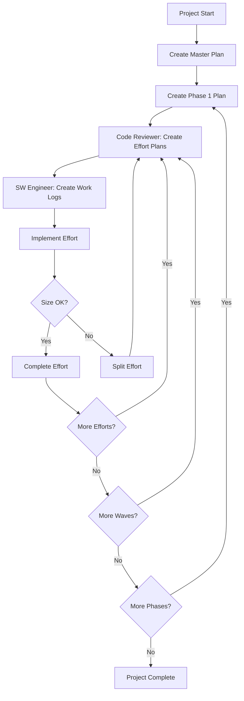

# Software Factory 2.0 Templates

This directory contains all the templates needed for Software Factory 2.0 project planning and execution.

## 📁 Available Templates

### Planning Templates

#### 1. MASTER-IMPLEMENTATION-PLAN.md
**Purpose**: Complete project overview and roadmap  
**When to Use**: At project inception  
**Created By**: Orchestrator or Architect  
**Key Sections**:
- Project overview and success metrics
- Technology stack and dependencies
- All phases with timelines
- Resource allocation
- Risk management
- Integration strategy

#### 2. PHASE-IMPLEMENTATION-PLAN.md
**Purpose**: Detailed plan for a single phase  
**When to Use**: Before starting each phase  
**Created By**: Orchestrator with Architect review  
**Key Sections**:
- Phase objectives and success criteria
- Wave structure with dependencies
- Detailed effort breakdown
- Testing and integration strategy
- Risk analysis

#### 3. EFFORT-PLANNING-TEMPLATE.md
**Purpose**: Detailed implementation plan for a single effort  
**When to Use**: Before each effort implementation  
**Created By**: Code Reviewer  
**Key Sections**:
- Requirements and acceptance criteria
- Implementation approach
- Size estimates and split contingency
- Testing requirements
- Integration points

#### 4. WORK-LOG-TEMPLATE.md
**Purpose**: Track daily progress on an effort  
**When to Use**: During effort implementation  
**Maintained By**: SW Engineer  
**Key Sections**:
- Daily progress log
- Size tracking
- Test execution results
- Issues and resolutions
- Review feedback

## 📋 Template Usage Guide

### For New Projects

1. **Start with MASTER-IMPLEMENTATION-PLAN.md**
   ```bash
   cp templates/MASTER-IMPLEMENTATION-PLAN.md ./IMPLEMENTATION-PLAN.md
   # Fill in all placeholders marked with [BRACKETS]
   ```

2. **Create Phase Plans**
   ```bash
   cp templates/PHASE-IMPLEMENTATION-PLAN.md ./phase-plans/PHASE-1-PLAN.md
   # Customize for each phase
   ```

3. **For Each Effort**
   ```bash
   # Code Reviewer creates plan
   cp templates/EFFORT-PLANNING-TEMPLATE.md efforts/phase1/wave1/effort1/IMPLEMENTATION-PLAN.md
   
   # SW Engineer tracks work
   cp templates/WORK-LOG-TEMPLATE.md efforts/phase1/wave1/effort1/work-log.md
   ```

### Template Placeholders

All templates use consistent placeholders:

| Placeholder | Description | Example |
|-------------|-------------|---------|
| `[PROJECT_NAME]` | Your project name | "idpbuilder-oci-mgmt" |
| `[PHASE]` | Phase number | "1", "2", "3" |
| `[WAVE]` | Wave number | "1", "2", "3" |
| `[EFFORT]` | Effort number | "1", "2", "3" |
| `[NUMBER]` | Numeric value | "800", "95" |
| `[DATE]` | Date value | "2024-01-15" |
| `[PERCENT]` | Percentage value | "80", "95" |
| `[NAME]` | Descriptive name | "Core Authentication" |
| `[LANGUAGE]` | Programming language | "Go", "Python" |

### Quick Start Commands

```bash
# Initialize project structure
mkdir -p efforts/phase{1..5}/wave{1..3}/effort{1..5}
mkdir -p phase-plans
mkdir -p integration
mkdir -p docs

# Copy master plan
cp templates/MASTER-IMPLEMENTATION-PLAN.md ./IMPLEMENTATION-PLAN.md

# Copy phase plans
for i in {1..5}; do
  cp templates/PHASE-IMPLEMENTATION-PLAN.md "./phase-plans/PHASE-$i-PLAN.md"
done

# Create project config from master plan
grep -E "^[A-Z_]+=" IMPLEMENTATION-PLAN.md > project.env
```

## 🔄 Template Workflow



## 📏 Size Management

All templates emphasize the 800-line limit:

1. **Estimates in Planning**: Every template requires size estimates
2. **Daily Tracking**: Work logs track size daily
3. **Split Planning**: Effort template includes split contingency
4. **Measurement Commands**: Templates include line-counter.sh commands

## 🎯 Best Practices

### DO:
- ✅ Fill in ALL placeholders before starting work
- ✅ Update work logs daily
- ✅ Measure size at every checkpoint
- ✅ Plan splits proactively at 700 lines
- ✅ Keep templates in version control

### DON'T:
- ❌ Skip size estimates
- ❌ Leave placeholders unfilled
- ❌ Modify template structure
- ❌ Ignore split contingency plans
- ❌ Proceed without completed plans

## 🔧 Customization

While templates are comprehensive, you can customize them for your project:

1. **Add Sections**: Add project-specific sections as needed
2. **Modify Metrics**: Adjust metrics to match your requirements
3. **Extend Checklists**: Add domain-specific checklist items
4. **Include Examples**: Add project-specific examples

Just remember:
- Keep the core structure intact
- Maintain size tracking sections
- Preserve review checkpoints
- Keep grading metrics visible

## 📚 Related Documentation

- `🚨-CRITICAL/001-SIZE-LIMITS.md` - Size limit rules
- `state-machines/orchestrator.md` - Orchestrator workflow
- `grading-rubrics/` - Grading criteria for each agent
- `quick-reference/` - Quick reference guides

---

**Template Version**: 2.0  
**Last Updated**: [DATE]  
**Maintained By**: Software Factory Team