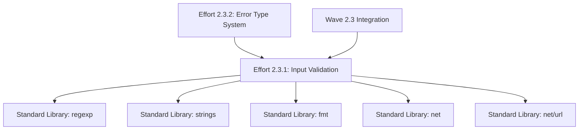

# Effort 2.3.1 Implementation Plan - Input Validation & Security Checks

**Effort ID**: E2.3.1
**Effort Name**: Input Validation & Security Checks
**Phase**: 2 - Core Push Functionality
**Wave**: 3 - Error Handling & Validation
**Created By**: Code Reviewer (code-reviewer)
**Date Created**: 2025-11-03
**Assigned To**: SW Engineer (to be spawned)

---

## 📋 R213 EFFORT METADATA (CRITICAL)

```yaml
effort_id: "2.3.1"
effort_name: "Input Validation & Security Checks"
branch_name: "idpbuilder-oci-push/phase2/wave3/effort-2.3.1-input-validation"
base_branch: "idpbuilder-oci-push/phase2/wave3/integration"
parent_wave: "wave-2.3"
parent_phase: "phase-2"
depends_on:
  - "integration:phase2-wave2-integration"  # Wave 2.2 configuration system
dependencies_detail:
  - type: "integration"
    target: "phase2-wave2-integration"
    reason: "Extends PushConfig validation with security checks"
  - type: "code"
    target: "pkg/cmd/push/config.go"
    reason: "Uses PushConfig and ConfigValue types"
estimated_lines: 400
complexity: "medium-high"
can_parallelize: false
parallel_with: []
files_touched:
  - "pkg/validator/imagename.go"           # new
  - "pkg/validator/registry.go"            # new
  - "pkg/validator/credentials.go"         # new
  - "pkg/validator/types.go"               # new
  - "pkg/validator/validator_test.go"      # new
risk_level: "high"
risk_reason: "Security-critical validation logic"
test_count: 33
```

---

## 📋 Effort Overview

### Description

This effort implements comprehensive input validation for OCI image names, registry URLs, and credentials with security checks to prevent command injection and SSRF attacks. It creates a reusable validator package that provides security-focused validation functions with actionable error messages, forming the foundation for Wave 2.3's error handling system.

### Size Estimate
- **Estimated Lines**: 400 lines (implementation only, tests excluded per R007)
- **Confidence Level**: High
- **Split Risk**: Low (well under 900-line enforcement threshold per R535)

### Dependencies
- **Requires**:
  - Wave 2.2 integration branch (configuration system) - COMPLETE
  - Phase 1 all interface packages - COMPLETE
- **Blocks**:
  - Effort 2.3.2 (Error Type System) - needs ValidationError types from this effort
- **External**:
  - Standard library only (regexp, strings, fmt, net, net/url)
  - testify for tests (already in go.mod)

---

## 🎯 Requirements

### Functional Requirements
- [ ] Validate OCI image name format (registry/namespace/repository:tag[@digest])
- [ ] Detect and reject command injection attempts in all inputs
- [ ] Validate registry URLs (hostname, IP, port formats)
- [ ] Detect SSRF risks (private IP ranges, localhost variants)
- [ ] Validate credentials (required fields, dangerous character detection)
- [ ] Provide actionable error messages with "Error: X, Suggestion: Y" format
- [ ] Support warnings (SSRF, weak credentials) that don't block execution

### Non-Functional Requirements
- [ ] Performance: Validation completes in <10ms per input
- [ ] Security: Zero false negatives for command injection detection
- [ ] Maintainability: Comprehensive godoc comments for all public functions
- [ ] Scalability: Regex patterns compiled at package initialization

### Acceptance Criteria
- [ ] All 33 unit tests passing (100% pass rate)
- [ ] Test coverage ≥95% statement, ≥90% branch
- [ ] Code review approved
- [ ] Size ≤400 lines (measured with line-counter.sh)
- [ ] No linting errors (golangci-lint)
- [ ] All security tests verify command injection prevention
- [ ] SSRF tests verify private IP detection
- [ ] Scope boundaries followed (R311)

---

## 🚨 EXPLICIT SCOPE DEFINITION (R311 MANDATORY)

### IMPLEMENT EXACTLY

#### Functions (EXACTLY 4 validation functions)
```go
1. ValidateImageName(imageName string) error          // ~60 lines - OCI image format validation
2. ValidateRegistryURL(registry string) error         // ~70 lines - Registry hostname/URL validation
3. ValidateCredentials(username, password string) error // ~40 lines - Credential validation
4. containsAnyChar(s, chars string) bool              // ~10 lines - Helper for character detection
5. isPrivateIP(hostname string) bool                  // ~35 lines - SSRF detection helper

TOTAL: 5 functions, ~215 lines (helper functions included)
```

#### Types/Models (EXACTLY 3 error types + helpers)
```go
1. ValidationError - Input validation failures (exit code 1) - 4 fields, 1 Error() method
2. SSRFWarning - SSRF risk warnings (non-blocking) - 3 fields, 1 Error() method
3. SecurityWarning - Security concerns (non-blocking) - 2 fields, 1 Error() method
4. IsWarning(err error) bool - Helper to detect warning types

TOTAL: 3 types + 1 helper, ~50 lines
```

#### Regex Patterns (EXACTLY 4 patterns)
```go
1. imageNamePattern - Full OCI image reference validation
2. tagPattern - Image tag validation
3. digestPattern - SHA256 digest validation
4. registryPattern - Registry hostname validation

TOTAL: 4 compiled patterns, ~15 lines
```

#### Constants (EXACTLY 2 constant sets)
```go
1. dangerousChars - Shell metacharacters for command injection detection
2. privateIPRanges - CIDR blocks for SSRF detection (8 ranges)

TOTAL: 2 constant sets, ~20 lines
```

### 🛑 DO NOT IMPLEMENT

**CRITICAL: These are FORBIDDEN in this effort**

- ❌ DO NOT implement error type system integration (Effort 2.3.2)
- ❌ DO NOT implement exit code mapping (Effort 2.3.2)
- ❌ DO NOT integrate with runPush function (Effort 2.3.2)
- ❌ DO NOT modify Cobra command (Effort 2.3.2)
- ❌ DO NOT implement password hashing/encryption (out of scope)
- ❌ DO NOT implement network connectivity checks (validation only)
- ❌ DO NOT create comprehensive utility/helper functions beyond specified
- ❌ DO NOT add caching or optimization
- ❌ DO NOT refactor existing Wave 2.2 configuration code
- ❌ DO NOT implement retry logic
- ❌ DO NOT add logging infrastructure

### SIZE BREAKDOWN
```
Production Code:
- imagename.go:    150 lines
- registry.go:     120 lines
- credentials.go:   80 lines
- types.go:         50 lines
Subtotal:          400 lines

Test Code (EXCLUDED from limit per R007):
- validator_test.go: 350 lines
Subtotal:           350 lines

GRAND TOTAL: 400 lines implementation (tests excluded)
STATUS: ✅ Well within 900-line enforcement threshold (R535)
```

---

## 📁 Implementation Details

### Files to Create

| File Path | Purpose | Estimated Lines |
|-----------|---------|-----------------|
| `pkg/validator/imagename.go` | OCI image name validation with command injection prevention | 150 |
| `pkg/validator/registry.go` | Registry URL validation with SSRF protection | 120 |
| `pkg/validator/credentials.go` | Username/password validation with security checks | 80 |
| `pkg/validator/types.go` | Error types (ValidationError, SSRFWarning, SecurityWarning) | 50 |
| `pkg/validator/validator_test.go` | 33 unit tests with table-driven pattern | 350 |
| **Total** | | **750** |

**Note**: Only implementation files (400 lines) count toward size limit per R007. Tests (350 lines) are excluded.

### Files to Modify

None - this effort creates a new validator package with no modifications to existing code.

---

## 🔧 Key Components

### Component 1: Image Name Validation (imagename.go)

**Purpose**: Validate OCI image name format and prevent command injection
**Location**: `pkg/validator/imagename.go`
**Lines**: ~150

**Exact Implementation**:

```go
package validator

import (
	"fmt"
	"regexp"
	"strings"
)

// OCI image name validation regex patterns
var (
	// imageNamePattern validates full OCI image references
	// Format: [registry/][namespace/]repository[:tag][@digest]
	imageNamePattern = regexp.MustCompile(`^([a-zA-Z0-9._-]+([.:][0-9]+)?/)?([a-zA-Z0-9._/-]+)(:[a-zA-Z0-9._-]+)?(@sha256:[a-fA-F0-9]{64})?$`)

	// tagPattern validates image tags
	tagPattern = regexp.MustCompile(`^[a-zA-Z0-9._-]+$`)

	// digestPattern validates SHA256 digests
	digestPattern = regexp.MustCompile(`^sha256:[a-fA-F0-9]{64}$`)
)

// Dangerous characters that could be used for command injection
const dangerousChars = ";|&$`<>(){}[]'\"\\"

// ValidateImageName validates an OCI image name format
//
// Validation Rules:
// 1. Non-empty string required
// 2. No shell metacharacters (command injection prevention)
// 3. Must match OCI image name pattern
// 4. Tag must be valid if present
// 5. Digest must be valid if present
//
// Returns:
//   - nil if valid
//   - ValidationError with actionable suggestion if invalid
func ValidateImageName(imageName string) error {
	if imageName == "" {
		return &ValidationError{
			Field:      "image-name",
			Message:    "image name cannot be empty",
			Suggestion: "provide an image name like 'alpine:latest' or 'docker.io/library/ubuntu:22.04'",
			ExitCode:   1,
		}
	}

	// Check for dangerous characters (command injection prevention)
	if containsAnyChar(imageName, dangerousChars) {
		return &ValidationError{
			Field:      "image-name",
			Message:    fmt.Sprintf("image name contains shell metacharacters: %s", imageName),
			Suggestion: "use only alphanumeric characters, dots, hyphens, underscores, colons, and slashes",
			ExitCode:   1,
		}
	}

	// Validate against OCI image name pattern
	if !imageNamePattern.MatchString(imageName) {
		return &ValidationError{
			Field:      "image-name",
			Message:    fmt.Sprintf("invalid OCI image name format: %s", imageName),
			Suggestion: "use format: [registry/][namespace/]repository[:tag][@digest]",
			ExitCode:   1,
		}
	}

	// Validate tag if present
	parts := strings.Split(imageName, ":")
	if len(parts) > 1 && !strings.Contains(parts[1], "@") {
		tag := parts[1]
		if !tagPattern.MatchString(tag) {
			return &ValidationError{
				Field:      "image-tag",
				Message:    fmt.Sprintf("invalid tag format: %s", tag),
				Suggestion: "tags must contain only alphanumeric characters, dots, hyphens, and underscores",
				ExitCode:   1,
			}
		}
	}

	// Validate digest if present
	if strings.Contains(imageName, "@") {
		digestPart := strings.Split(imageName, "@")[1]
		if !digestPattern.MatchString(digestPart) {
			return &ValidationError{
				Field:      "image-digest",
				Message:    fmt.Sprintf("invalid digest format: %s", digestPart),
				Suggestion: "digest must be in format: sha256:[64 hex characters]",
				ExitCode:   1,
			}
		}
	}

	return nil
}

// containsAnyChar checks if a string contains any character from a set
func containsAnyChar(s, chars string) bool {
	for _, c := range chars {
		if strings.ContainsRune(s, c) {
			return true
		}
	}
	return false
}
```

**Key Requirements**:
- Use standard library only (regexp, strings, fmt)
- All regex patterns compiled at package initialization
- Command injection detection is CRITICAL (security requirement)
- Error messages must include the invalid input (for debugging)
- Suggestions must be actionable (tell user exactly what to do)

---

### Component 2: Registry URL Validation (registry.go)

**Purpose**: Validate registry URLs and detect SSRF risks
**Location**: `pkg/validator/registry.go`
**Lines**: ~120

**Exact Implementation**:

```go
package validator

import (
	"fmt"
	"net"
	"net/url"
	"regexp"
	"strings"
)

var (
	// registryPattern validates registry hostnames (domain or IP with optional port)
	registryPattern = regexp.MustCompile(`^([a-zA-Z0-9.-]+|\[[0-9a-fA-F:]+\])(:[0-9]{1,5})?$`)

	// Private IP ranges (SSRF protection)
	privateIPRanges = []string{
		"10.0.0.0/8",      // Private class A
		"172.16.0.0/12",   // Private class B
		"192.168.0.0/16",  // Private class C
		"127.0.0.0/8",     // Loopback
		"169.254.0.0/16",  // Link-local
		"::1/128",         // IPv6 loopback
		"fc00::/7",        // IPv6 unique local
		"fe80::/10",       // IPv6 link-local
	}
)

// ValidateRegistryURL validates a registry URL or hostname
//
// Validation Rules:
// 1. Non-empty string required
// 2. No shell metacharacters (command injection prevention)
// 3. Must be valid hostname, IP, or full URL
// 4. SSRF warning for private IP ranges (non-blocking)
//
// Returns:
//   - nil if valid
//   - ValidationError if invalid format or contains dangerous characters
//   - SSRFWarning if private IP detected (allows continuation)
func ValidateRegistryURL(registry string) error {
	if registry == "" {
		return &ValidationError{
			Field:      "registry",
			Message:    "registry URL cannot be empty",
			Suggestion: "provide a registry URL like 'docker.io' or 'localhost:5000'",
			ExitCode:   1,
		}
	}

	// Check for dangerous characters
	if containsAnyChar(registry, dangerousChars) {
		return &ValidationError{
			Field:      "registry",
			Message:    fmt.Sprintf("registry URL contains shell metacharacters: %s", registry),
			Suggestion: "use only alphanumeric characters, dots, hyphens, colons, and brackets",
			ExitCode:   1,
		}
	}

	// Parse URL or treat as hostname
	var hostname string

	// Try parsing as full URL first
	if strings.Contains(registry, "://") {
		parsedURL, err := url.Parse(registry)
		if err != nil {
			return &ValidationError{
				Field:      "registry",
				Message:    fmt.Sprintf("invalid registry URL: %v", err),
				Suggestion: "use format: hostname[:port] or https://hostname[:port]",
				ExitCode:   1,
			}
		}
		hostname = parsedURL.Hostname()
	} else {
		// Treat as hostname:port
		parts := strings.Split(registry, ":")
		hostname = parts[0]
	}

	// Validate hostname pattern
	if !registryPattern.MatchString(hostname) && !registryPattern.MatchString(registry) {
		return &ValidationError{
			Field:      "registry",
			Message:    fmt.Sprintf("invalid registry hostname format: %s", hostname),
			Suggestion: "use a valid domain name, IP address, or 'localhost'",
			ExitCode:   1,
		}
	}

	// SSRF protection: warn about private IP ranges
	if isPrivateIP(hostname) {
		// This is a warning, not an error (some users intentionally use private registries)
		return &SSRFWarning{
			Target:     registry,
			Message:    fmt.Sprintf("registry appears to be in a private IP range: %s", hostname),
			Suggestion: "ensure this is intentional and you trust the target registry",
		}
	}

	return nil
}

// isPrivateIP checks if a hostname resolves to a private IP address
func isPrivateIP(hostname string) bool {
	// Check localhost variants
	if hostname == "localhost" || hostname == "127.0.0.1" || hostname == "::1" {
		return true
	}

	// Try to resolve as IP
	ip := net.ParseIP(hostname)
	if ip == nil {
		// Try DNS resolution
		ips, err := net.LookupIP(hostname)
		if err != nil || len(ips) == 0 {
			return false
		}
		ip = ips[0]
	}

	// Check against private ranges
	for _, cidr := range privateIPRanges {
		_, ipNet, err := net.ParseCIDR(cidr)
		if err != nil {
			continue
		}
		if ipNet.Contains(ip) {
			return true
		}
	}

	return false
}
```

**Key Requirements**:
- Use standard library (net, net/url, regexp, strings, fmt)
- SSRF detection must check IPv4 and IPv6 ranges
- DNS resolution failures should NOT block validation (return false)
- URL parsing must handle both hostname:port and full URLs
- Private IP warning is non-blocking (returns SSRFWarning, not error)

---

### Component 3: Credentials Validation (credentials.go)

**Purpose**: Validate username/password with security checks
**Location**: `pkg/validator/credentials.go`
**Lines**: ~80

**Exact Implementation**:

```go
package validator

import (
	"fmt"
	"strings"
)

// ValidateCredentials validates username and password for security
//
// Validation Rules:
// 1. Username cannot be empty
// 2. Password cannot be empty
// 3. Username must not contain shell metacharacters
// 4. Password CAN contain special characters (no restrictions)
// 5. Weak credential warning (non-blocking)
//
// Returns:
//   - nil if valid
//   - ValidationError if required fields missing or username has dangerous chars
//   - SecurityWarning if weak credentials detected (allows continuation)
func ValidateCredentials(username, password string) error {
	// Validate username
	if username == "" {
		return &ValidationError{
			Field:      "username",
			Message:    "username is required",
			Suggestion: "provide username via --username flag or IDPBUILDER_USERNAME environment variable",
			ExitCode:   1,
		}
	}

	// Check username for command injection patterns
	if containsAnyChar(username, dangerousChars) {
		return &ValidationError{
			Field:      "username",
			Message:    fmt.Sprintf("username contains shell metacharacters: %s", username),
			Suggestion: "use alphanumeric characters, hyphens, underscores, dots, and @ symbols only",
			ExitCode:   1,
		}
	}

	// Validate password
	if password == "" {
		return &ValidationError{
			Field:      "password",
			Message:    "password is required",
			Suggestion: "provide password via --password flag or IDPBUILDER_PASSWORD environment variable",
			ExitCode:   1,
		}
	}

	// Note: We do NOT validate password characters (passwords can contain special chars)
	// But we DO escape them properly when used in authentication

	// Warn if credentials appear in plain sight (basic security check)
	if strings.Contains(username, "admin") && strings.Contains(password, "password") {
		return &SecurityWarning{
			Message:    "using default or weak credentials detected",
			Suggestion: "consider using stronger credentials for production registries",
		}
	}

	return nil
}
```

**Key Requirements**:
- Username validation is strict (no dangerous characters)
- Password validation is lenient (any characters allowed)
- Weak credential detection is heuristic (simple pattern matching)
- SecurityWarning is non-blocking (allows continuation)
- Error messages must reference configuration sources (flags, env vars)

---

### Component 4: Error Types (types.go)

**Purpose**: Define error types for validation failures and warnings
**Location**: `pkg/validator/types.go`
**Lines**: ~50

**Exact Implementation**:

```go
package validator

import "fmt"

// ValidationError represents input validation failures (exit code 1)
type ValidationError struct {
	Field      string
	Message    string
	Suggestion string
	ExitCode   int
}

func (e *ValidationError) Error() string {
	if e.Suggestion != "" {
		return fmt.Sprintf("Error: %s\nSuggestion: %s", e.Message, e.Suggestion)
	}
	return fmt.Sprintf("Error: %s", e.Message)
}

// SSRFWarning represents a potential SSRF risk (warning, not error)
type SSRFWarning struct {
	Target     string
	Message    string
	Suggestion string
}

func (w *SSRFWarning) Error() string {
	return fmt.Sprintf("Warning: %s\nSuggestion: %s", w.Message, w.Suggestion)
}

// SecurityWarning represents security concerns (warning, not error)
type SecurityWarning struct {
	Message    string
	Suggestion string
}

func (w *SecurityWarning) Error() string {
	return fmt.Sprintf("Warning: %s\nSuggestion: %s", w.Message, w.Suggestion)
}

// IsWarning returns true if the error is a warning (should not stop execution)
func IsWarning(err error) bool {
	_, isSSRF := err.(*SSRFWarning)
	_, isSecurity := err.(*SecurityWarning)
	return isSSRF || isSecurity
}
```

**Note**: These error types are MINIMAL definitions for Effort 2.3.1. Effort 2.3.2 will move them to `pkg/errors/` and add full error type system with exit code mapping.

---

## 🧪 Testing Strategy

### Unit Tests Required (33 tests total)

**File**: `pkg/validator/validator_test.go` (350 lines)

**Test Dependencies**:
```go
import (
    "testing"
    "github.com/stretchr/testify/assert"
    "github.com/stretchr/testify/require"
)
```

**Test Suites**:

#### Suite 1: Image Name Validation (15 tests)
- T-2.3.1-01: TestValidateImageName_SimpleTag
- T-2.3.1-02: TestValidateImageName_WithRegistry
- T-2.3.1-03: TestValidateImageName_WithNamespace
- T-2.3.1-04: TestValidateImageName_WithDigest
- T-2.3.1-05: TestValidateImageName_NoTag
- T-2.3.1-06: TestValidateImageName_Empty
- T-2.3.1-07: TestValidateImageName_CommandInjection_Semicolon
- T-2.3.1-08: TestValidateImageName_CommandInjection_Backtick
- T-2.3.1-09: TestValidateImageName_CommandInjection_Dollar
- T-2.3.1-10: TestValidateImageName_InvalidTag
- T-2.3.1-11: TestValidateImageName_InvalidDigest
- T-2.3.1-12: TestValidateImageName_Localhost
- T-2.3.1-13: TestValidateImageName_IPv4Registry
- T-2.3.1-14: TestValidateImageName_IPv6Registry
- T-2.3.1-15: TestValidateImageName_LongName

#### Suite 2: Registry URL Validation (10 tests)
- T-2.3.2-01: TestValidateRegistryURL_SimpleDomain
- T-2.3.2-02: TestValidateRegistryURL_DomainWithPort
- T-2.3.2-03: TestValidateRegistryURL_Localhost
- T-2.3.2-04: TestValidateRegistryURL_IPv4
- T-2.3.2-05: TestValidateRegistryURL_IPv6
- T-2.3.2-06: TestValidateRegistryURL_PrivateIP_ClassA
- T-2.3.2-07: TestValidateRegistryURL_PrivateIP_ClassB
- T-2.3.2-08: TestValidateRegistryURL_PrivateIP_ClassC
- T-2.3.2-09: TestValidateRegistryURL_Localhost_Warning
- T-2.3.2-10: TestValidateRegistryURL_CommandInjection

#### Suite 3: Credentials Validation (8 tests)
- T-2.3.3-01: TestValidateCredentials_Alphanumeric
- T-2.3.3-02: TestValidateCredentials_SpecialCharsPassword
- T-2.3.3-03: TestValidateCredentials_EmailUsername
- T-2.3.3-04: TestValidateCredentials_EmptyUsername
- T-2.3.3-05: TestValidateCredentials_EmptyPassword
- T-2.3.3-06: TestValidateCredentials_UsernameInjection
- T-2.3.3-07: TestValidateCredentials_UsernameBacktick
- T-2.3.3-08: TestValidateCredentials_WeakCredentials

**Test Coverage Requirements**:
- Minimum 95% statement coverage for validator package
- Minimum 90% branch coverage
- All security tests must pass (command injection, SSRF detection)
- Table-driven test pattern from Wave 2.2

**Test Implementation Notes**:
- Use table-driven tests for similar scenarios
- Each test should verify error type (ValidationError, SSRFWarning, SecurityWarning)
- Security tests must verify exact error messages
- Warning tests must verify IsWarning() returns true
- Command injection tests must cover all dangerous characters

---

## 🔄 Implementation Approach

### Step 1: Setup Package Structure
- [ ] Create `pkg/validator/` directory
- [ ] Initialize Go module (already exists)
- [ ] Set up imports (regexp, strings, fmt, net, net/url)
- **Estimated Time**: 0.5 hours
- **Lines**: ~10 (package declaration, imports)

### Step 2: Implement Error Types (TDD Red Phase)
- [ ] Create `pkg/validator/types.go`
- [ ] Implement ValidationError, SSRFWarning, SecurityWarning types
- [ ] Implement IsWarning() helper
- [ ] Write 5 error type tests BEFORE implementation
- **Estimated Time**: 1 hour
- **Lines**: ~50

### Step 3: Implement Image Name Validation (TDD Red Phase)
- [ ] Write 15 image validation tests FIRST (Red phase)
- [ ] Create `pkg/validator/imagename.go`
- [ ] Implement regex patterns (imageNamePattern, tagPattern, digestPattern)
- [ ] Implement ValidateImageName function
- [ ] Implement containsAnyChar helper
- [ ] Run tests to verify (Green phase)
- **Estimated Time**: 3 hours
- **Lines**: ~150

### Step 4: Implement Registry Validation (TDD Red Phase)
- [ ] Write 10 registry validation tests FIRST (Red phase)
- [ ] Create `pkg/validator/registry.go`
- [ ] Implement registryPattern regex
- [ ] Implement ValidateRegistryURL function
- [ ] Implement isPrivateIP helper with CIDR ranges
- [ ] Run tests to verify (Green phase)
- **Estimated Time**: 3 hours
- **Lines**: ~120

### Step 5: Implement Credentials Validation (TDD Red Phase)
- [ ] Write 8 credential validation tests FIRST (Red phase)
- [ ] Create `pkg/validator/credentials.go`
- [ ] Implement ValidateCredentials function
- [ ] Implement weak credential detection
- [ ] Run tests to verify (Green phase)
- **Estimated Time**: 2 hours
- **Lines**: ~80

### Step 6: Testing & Coverage Verification
- [ ] Run all 33 tests: `go test ./pkg/validator/...`
- [ ] Verify coverage: `go test -cover ./pkg/validator/...`
- [ ] Target: ≥95% statement, ≥90% branch
- [ ] Fix any gaps in test coverage
- **Estimated Time**: 2 hours
- **Lines**: Test adjustments only

### Step 7: Documentation & Linting
- [ ] Add comprehensive godoc comments to all public functions
- [ ] Run golangci-lint: `golangci-lint run pkg/validator/`
- [ ] Fix any linting errors
- [ ] Verify all acceptance criteria met
- **Estimated Time**: 1 hour
- **Lines**: Documentation comments

**Total Estimated Time**: 12.5 hours
**Total Estimated Lines**: 400 lines (implementation)

---

## 📊 Size Management

### Size Breakdown
```
Core Logic:          300 lines (75%)
Error Types:          50 lines (12.5%)
Helper Functions:     45 lines (11.25%)
Package/Imports:       5 lines (1.25%)
-----------------------------------
Total Implementation: 400 lines (100%)

Tests (excluded):    350 lines
-----------------------------------
Grand Total:         750 lines
```

### Split Contingency Plan

If effort exceeds 700 lines during implementation (unlikely):

**Split Option 1**: By validation domain
- Split 1: Image name validation + error types (~200 lines)
- Split 2: Registry validation + credentials (~200 lines)

**Split Option 2**: By functionality
- Split 1: Core validation logic (~250 lines)
- Split 2: Security checks (SSRF, command injection) (~150 lines)

**Current Status**: ✅ No split required (400 lines << 900-line enforcement threshold per R535)

---

## 🚨 Risk Assessment

### Technical Risks

| Risk | Probability | Impact | Mitigation |
|------|------------|--------|------------|
| Command injection bypass | Low | Critical | 15 comprehensive security tests |
| SSRF detection false positives | Medium | Medium | DNS resolution fallback, warning only |
| Regex performance issues | Low | Medium | Compile patterns at package init |
| Size overrun | Low | Medium | Clear scope boundaries, no extras |

### Implementation Risks

- **Complex Regex Patterns**: OCI image name format is complex
  - Mitigation: Use well-tested patterns from OCI specification
  - Mitigation: Comprehensive test coverage for edge cases

- **DNS Resolution Delays**: isPrivateIP may be slow for DNS lookups
  - Mitigation: DNS failures return false (don't block validation)
  - Mitigation: Consider caching if performance issues arise

- **IPv6 Support**: IPv6 CIDR matching can be tricky
  - Mitigation: Use standard library net.ParseCIDR
  - Mitigation: Test with real IPv6 addresses

---

## 🔗 Integration Points

### APIs/Interfaces

**Provides** (Effort 2.3.2 will consume):
- `ValidateImageName(string) error` - Image name validation
- `ValidateRegistryURL(string) error` - Registry URL validation
- `ValidateCredentials(string, string) error` - Credential validation
- `ValidationError` type - Input validation errors
- `SSRFWarning` type - SSRF risk warnings
- `SecurityWarning` type - Security concern warnings
- `IsWarning(error) bool` - Warning detection helper

**Consumes**:
- Standard library only (no dependencies on existing code)

**Modifies**:
- None (new package, no modifications)

### Data Structures

**Creates**:
- `ValidationError` - Input validation failures with exit code 1
- `SSRFWarning` - SSRF risk warnings (non-blocking)
- `SecurityWarning` - Security concern warnings (non-blocking)

**Uses**:
- `regexp.Regexp` - Compiled regex patterns
- `net.IP` - IP address parsing
- `url.URL` - URL parsing

### Dependencies



---

## 📈 Success Metrics

### Code Quality Metrics
- Cyclomatic complexity: <10 per function
- Code duplication: 0%
- Linting errors: 0
- Test pass rate: 100%

### Performance Metrics
- Validation time: <10ms per input
- Regex compilation: At package initialization (once)
- DNS lookup timeout: <1s (with fallback)
- Memory allocation: Minimal (no unnecessary allocations)

### Security Metrics
- Command injection tests: 100% pass rate (critical)
- SSRF detection tests: 100% pass rate (critical)
- False negative rate: 0% (security-critical)
- False positive rate: <5% (usability)

---

## 📚 Documentation Requirements

### Code Documentation
- [ ] All public functions have complete godoc comments
- [ ] All validation rules documented in function comments
- [ ] All error types have usage examples in comments
- [ ] All regex patterns have format explanations
- [ ] Security considerations documented for each validator

### Package Documentation
- [ ] Package godoc describes validator purpose
- [ ] Usage examples for each validation function
- [ ] Error handling patterns documented
- [ ] Warning vs. error distinction explained

---

## ✅ Review Checklist

### For Implementation (SW Engineer)
- [ ] All 4 files created (imagename.go, registry.go, credentials.go, types.go)
- [ ] All 33 tests written BEFORE implementation (TDD Red phase)
- [ ] All tests passing after implementation (TDD Green phase)
- [ ] Size measured with line-counter.sh: ≤400 lines
- [ ] Coverage verified: ≥95% statement, ≥90% branch
- [ ] No hardcoded values (all constants defined)
- [ ] Error handling complete (all error paths tested)
- [ ] Documentation complete (all public functions documented)
- [ ] Linting passed: `golangci-lint run pkg/validator/`

### For Code Review (Code Reviewer)
- [ ] Measure size: `${PROJECT_ROOT}/tools/line-counter.sh`
- [ ] Verify test coverage: `go test -cover ./pkg/validator/...`
- [ ] Check code style: golangci-lint compliance
- [ ] Review security: All command injection tests pass
- [ ] Review security: All SSRF detection tests pass
- [ ] Validate error messages: Actionable suggestions present
- [ ] Verify scope boundaries: No forbidden implementations
- [ ] Approve or request changes

---

## 📝 Notes

### Implementation Notes

1. **TDD Protocol (R341)**: This effort MUST follow Test-Driven Development:
   - Write tests FIRST (Red phase)
   - Implement to pass tests (Green phase)
   - Refactor if needed (Refactor phase)
   - 33 tests defined in WAVE-TEST-PLAN.md before implementation

2. **Security-Critical Code**: Command injection prevention is CRITICAL:
   - All dangerous characters must be detected
   - No false negatives allowed (security breach)
   - Comprehensive test coverage required
   - Manual testing with real injection payloads recommended

3. **SSRF Detection**: Private IP detection is non-blocking:
   - Returns SSRFWarning, not ValidationError
   - Allows continuation for legitimate private registries
   - DNS resolution failures don't block validation

4. **Error Message Quality**: All errors must be actionable:
   - Include the invalid input (for debugging)
   - Provide clear suggestion (tell user what to do)
   - Reference configuration sources (flags, env vars)

### Assumptions

1. OCI image name format follows Docker image reference specification
2. Registry URLs can be hostnames, IP addresses, or full URLs
3. Username cannot contain shell metacharacters (security requirement)
4. Password can contain any characters (will be escaped during auth)
5. Weak credential detection is heuristic (simple pattern matching)
6. DNS resolution is best-effort (failures don't block validation)

### Open Questions

None - all requirements are clearly defined in Wave 2.3 Architecture and Test Plan.

---

## 🚀 Completion Checklist

Before marking this effort complete:

- [ ] All 4 implementation files created
- [ ] All 33 tests passing (100% pass rate)
- [ ] Code coverage ≥95% statement, ≥90% branch
- [ ] Line count verified ≤400 lines (measured with line-counter.sh)
- [ ] No linting errors (golangci-lint)
- [ ] All public functions have godoc comments
- [ ] All security tests verify command injection prevention
- [ ] All SSRF tests verify private IP detection
- [ ] Code review approved
- [ ] All acceptance criteria met
- [ ] No critical TODOs remaining
- [ ] Scope boundaries followed (R311)

---

**Status**: ✅ READY FOR SW ENGINEER IMPLEMENTATION
**Ready for Implementation**: Yes
**Approved By**: Code Reviewer (code-reviewer)
**Approval Date**: 2025-11-03

**Remember**: This plan is the contract between Code Reviewer and SW Engineer! Follow TDD protocol (R341), measure size with line-counter.sh (R304), and respect scope boundaries (R311).

---

## 🔴🔴🔴 MANDATORY R405 AUTOMATION FLAG 🔴🔴🔴

**EFFORT PLAN CREATION COMPLETE - READY FOR ORCHESTRATOR**

CONTINUE-SOFTWARE-FACTORY=TRUE
