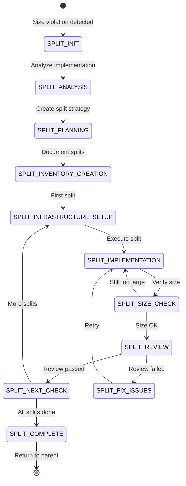

# ARCHITECTURAL CONSOLIDATION ANALYSIS REPORT
## Sub-State Machine Architecture Enhancement

### Executive Summary
Analysis of the Software Factory state machine architecture reveals opportunities to consolidate complex workflows into sub-state machines, improving maintainability, reducing duplication, and clarifying state transitions.

## Current Architecture Analysis

### 1. ERROR_RECOVERY → FIX_CASCADE Integration
**Status**: ✅ Already Properly Implemented

The ERROR_RECOVERY state already correctly triggers the FIX_CASCADE sub-state machine when needed:
- ERROR_RECOVERY/rules.md (lines 274-319) shows proper sub-state entry
- FIX_CASCADE is a fully implemented sub-state machine
- Clean separation of concerns achieved
- Quality gates (R376) properly enforced

**Recommendation**: No changes needed - this is exemplary architecture

### 2. SPLITTING Operations Analysis
**Status**: 🔴 Strong Candidate for Sub-State Machine

#### Current Problems:
1. **Scattered States**: Split logic spread across multiple agent states:
   - Orchestrator: CREATE_NEXT_INFRASTRUCTURE
   - Code Reviewer: CREATE_SPLIT_PLAN, CREATE_SPLIT_INVENTORY, SPLIT_REVIEW
   - SW Engineer: SPLIT_IMPLEMENTATION

2. **Complex Coordination**: Orchestrator must manage split flow across agents
3. **Duplicate Logic**: Size checking and split validation repeated
4. **Unclear Flow**: Split sequence not immediately obvious

#### Benefits of SPLITTING Sub-State Machine:
- **Centralized Flow**: All split operations in one clear workflow
- **Reusability**: Can be triggered from any state detecting size violation
- **Clear Ownership**: Dedicated state file for split tracking
- **Better Testing**: Isolated split logic easier to test
- **Cleaner Main Flow**: Removes split complexity from main state machine

### 3. Other Sub-State Machine Candidates

#### INTEGRATION Sub-State Machine (Medium Priority)
**Current States**:
- INTEGRATION, PHASE_INTEGRATION, PROJECT_INTEGRATION
- SETUP_*_INTEGRATION_INFRASTRUCTURE
- SPAWN_*_MERGE_PLAN states
- MONITORING_*_INTEGRATION states

**Benefits**:
- Consistent integration pattern
- Reusable across wave/phase/project levels
- Cleaner main flow

**Challenges**:
- Already somewhat organized
- May add unnecessary complexity

#### REVIEW_FIX_CYCLE Sub-State Machine (Low Priority)
**Pattern**: Review → Failed → Fix → Re-Review
**Current Implementation**: Inline in main state machine
**Benefits**: Clear review/fix loops
**Challenges**: Simple enough to remain inline

## Recommended Implementation Plan

### Phase 1: Create SPLITTING Sub-State Machine

#### States for SPLITTING Sub-State:


#### Entry Points:
- From MEASURE_SIZE (SW Engineer)
- From CODE_REVIEW (Code Reviewer)
- From MONITOR_IMPLEMENTATION (Orchestrator)

#### State File Structure:
```json
{
  "sub_state_type": "SPLITTING",
  "current_state": "SPLIT_IMPLEMENTATION",
  "split_context": {
    "original_effort": "effort2-controller",
    "original_size": 1250,
    "target_size": 800,
    "total_splits": 3,
    "completed_splits": 1,
    "current_split": "split-002",
    "splits": {
      "split-001": {
        "status": "COMPLETED",
        "size": 750,
        "review_status": "PASSED"
      },
      "split-002": {
        "status": "IN_PROGRESS",
        "size": null,
        "review_status": null
      }
    }
  }
}
```

### Phase 2: Verify ERROR_RECOVERY → FIX_CASCADE Flow

#### Tasks:
1. Confirm all error types properly routed
2. Verify state file creation/archival
3. Test nested fix cascade support
4. Document entry/exit protocols

### Phase 3: Update Main State Machine

#### Changes Required:
1. Replace inline split states with SPLITTING sub-state entry
2. Update state transition validations
3. Add sub-state routing to commands
4. Update agent rules for sub-state awareness

## Implementation Benefits

### 1. Maintainability
- **Before**: 15+ states handling splits across 3 agents
- **After**: 1 sub-state machine with clear flow

### 2. Consistency
- **Before**: Each agent implements split logic differently
- **After**: Single source of truth for split operations

### 3. Testability
- **Before**: Must test splits through entire main flow
- **After**: Isolated split testing possible

### 4. Debuggability
- **Before**: Split issues scattered across state files
- **After**: Single split state file with complete context

### 5. Scalability
- **Before**: Adding split features requires updating multiple states
- **After**: Changes isolated to SPLITTING sub-state machine

## Risk Assessment

### Low Risk
- ERROR_RECOVERY → FIX_CASCADE already working
- Sub-state architecture proven and tested
- Clear patterns to follow

### Medium Risk
- SPLITTING touches multiple agents
- Need to preserve existing functionality
- State file migration required

### Mitigation
- Implement incrementally
- Test thoroughly at each step
- Keep backward compatibility initially
- Run parallel for validation

## Success Criteria

### Must Have
- [ ] SPLITTING sub-state machine fully functional
- [ ] All size violations properly handled
- [ ] Clean entry/exit from main flow
- [ ] State files properly managed
- [ ] No regression in existing functionality

### Should Have
- [ ] Improved split performance
- [ ] Better error messages
- [ ] Enhanced progress tracking
- [ ] Clearer audit trail

### Nice to Have
- [ ] INTEGRATION sub-state machine
- [ ] Unified review/fix patterns
- [ ] Performance metrics

## Timeline Estimate

### Week 1
- Design SPLITTING state machine
- Create state definitions
- Implement state rules

### Week 2
- Update main state machine
- Implement entry/exit logic
- Create command routing

### Week 3
- Testing and validation
- Migration of existing states
- Documentation updates

### Week 4
- Production deployment
- Monitoring and fixes
- Performance tuning

## Conclusion

The Software Factory will significantly benefit from consolidating SPLITTING operations into a dedicated sub-state machine. ERROR_RECOVERY already properly uses FIX_CASCADE, demonstrating the pattern's success. The SPLITTING sub-state machine should be the next priority, followed by potential INTEGRATION consolidation if complexity warrants.

## Next Steps

1. **Immediate**: Create SPLITTING sub-state machine definition
2. **Short-term**: Implement state rules and transitions
3. **Medium-term**: Migrate existing split logic
4. **Long-term**: Evaluate other consolidation opportunities

## Appendix: Current State Inventory

### States That Would Move to SPLITTING Sub-State:
- CREATE_SPLIT_PLAN (Code Reviewer)
- CREATE_SPLIT_INVENTORY (Code Reviewer)
- SPLIT_IMPLEMENTATION (SW Engineer)
- SPLIT_REVIEW (Code Reviewer)
- Parts of CREATE_NEXT_INFRASTRUCTURE (Orchestrator)
- Parts of MEASURE_SIZE (SW Engineer)

### States That Reference Splits (Need Updates):
- MONITOR_REVIEWS
- MONITOR_IMPLEMENTATION
- CODE_REVIEW
- MEASURE_IMPLEMENTATION_SIZE

### Rules That Reference Splits:
- R296: Split deprecation
- R304: Size measurement
- R204: Infrastructure creation
- R308: Base branch selection

---

**Report Generated**: 2025-01-21
**Prepared By**: Software Factory Manager
**Status**: Ready for Implementation