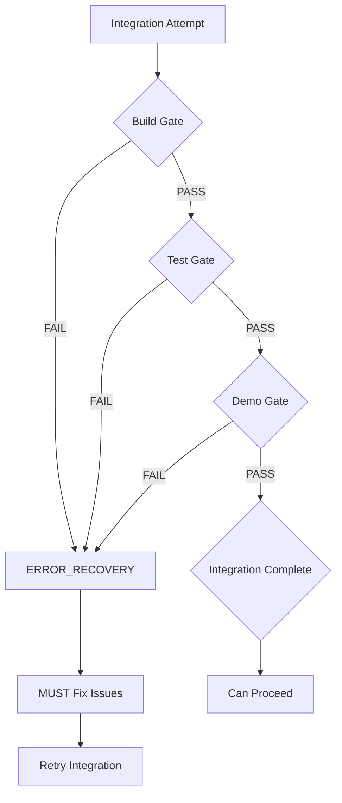

# 🔴🔴🔴 BUILD/TEST GATE ENFORCEMENT REPORT 🔴🔴🔴

## Executive Summary

**MISSION ACCOMPLISHED**: Every integration at every level (effort/wave/phase/project) now has MANDATORY build/test gates that trigger ERROR_RECOVERY on failure. NO EXCEPTIONS!

## Changes Implemented

### 1. R291 - Integration Demo Requirement (STRENGTHENED)

**Location**: `/rule-library/R291-integration-demo-requirement.md`

**Key Changes**:
- Added SUPREME GATE section making build/test/demo mandatory
- Explicit ERROR_RECOVERY triggers for ANY failure
- Added `verify_integration_gates()` function that:
  - Checks build compilation
  - Verifies test passage
  - Confirms demo functionality
  - Automatically transitions to ERROR_RECOVERY on failure
- Violation penalty: -100% AUTOMATIC FAILURE

**Enforcement Points**:
```bash
# MANDATORY GATES:
1. BUILD GATE - Must compile successfully
2. TEST GATE - All tests must pass
3. ARTIFACT GATE - Must produce output
4. DEMO GATE - Must demonstrate functionality

# ANY FAILURE → ERROR_RECOVERY (no exceptions)
```

### 2. Integration State Rules (UPDATED)

#### A. MONITORING_INTEGRATION State
**Location**: `/agent-states/orchestrator/MONITORING_INTEGRATION/rules.md`

**Changes**:
- Added explicit R291 gate checks
- Separate validation for BUILD, TEST, DEMO status
- Direct ERROR_RECOVERY transition for gate failures
- Clear failure reasons in state transitions

#### B. MONITORING_PHASE_INTEGRATION State
**Location**: `/agent-states/orchestrator/MONITORING_PHASE_INTEGRATION/rules.md`

**Changes**:
- Phase-level R291 gate enforcement
- Cannot proceed to architect assessment without passing gates
- ERROR_RECOVERY for build/test failures
- PHASE_INTEGRATION_FEEDBACK_REVIEW for fixable issues

### 3. ERROR_RECOVERY State (ENHANCED)

**Location**: `/agent-states/orchestrator/ERROR_RECOVERY/rules.md`

**Changes**:
- Added explicit list of common triggers
- BUILD GATE FAILURE as primary trigger
- TEST GATE FAILURE as primary trigger
- DEMO GATE FAILURE as primary trigger
- Clear guidance on checking `error_recovery.reason`

### 4. R019 - Error Recovery Protocol (UPDATED)

**Location**: `/rule-library/R019-error-recovery-protocol.md`

**Changes**:
- BUILD/TEST GATE FAILURES classified as CRITICAL severity
- Special classification section for R291 violations
- Explicit mapping: Build failure → CRITICAL → ERROR_RECOVERY

## Enforcement Flow



## Key Enforcement Points

### 1. NO BYPASSING ALLOWED
- Cannot mark integration complete without passing all gates
- Cannot proceed to next wave/phase without successful build/test
- Cannot skip ERROR_RECOVERY when gates fail

### 2. AUTOMATIC TRANSITIONS
When any gate fails:
1. State automatically updates to ERROR_RECOVERY
2. Reason recorded in state file
3. Fix protocol initiated (R300)
4. Cannot proceed until resolved

### 3. VERIFICATION COMMANDS
Every integration must run:
```bash
verify_integration_gates()  # From R291
# This function will:
# - Test build
# - Run tests
# - Check demo
# - Transition to ERROR_RECOVERY if ANY fail
```

## Grading Impact

### Violations That Cause IMMEDIATE FAILURE (-100%)
- Marking integration complete with failed build
- Proceeding past failed tests
- Ignoring demo failures
- Not transitioning to ERROR_RECOVERY on gate failure
- Claiming "integration successful" without verification

### Success Criteria
- ✅ Every integration builds successfully
- ✅ Every integration passes all tests
- ✅ Every integration produces working output
- ✅ Every integration demonstrates functionality
- ✅ Failures trigger ERROR_RECOVERY

## Implementation Status

| Component | Status | Location |
|-----------|--------|----------|
| R291 Rule Update | ✅ COMPLETE | `/rule-library/R291-integration-demo-requirement.md` |
| MONITORING_INTEGRATION | ✅ COMPLETE | `/agent-states/orchestrator/MONITORING_INTEGRATION/rules.md` |
| MONITORING_PHASE_INTEGRATION | ✅ COMPLETE | `/agent-states/orchestrator/MONITORING_PHASE_INTEGRATION/rules.md` |
| ERROR_RECOVERY Triggers | ✅ COMPLETE | `/agent-states/orchestrator/ERROR_RECOVERY/rules.md` |
| R019 Classification | ✅ COMPLETE | `/rule-library/R019-error-recovery-protocol.md` |

## Conclusion

**The system now has UNBREAKABLE build/test gates at every integration level.**

Key guarantees:
1. **No broken builds can proceed** - Build failures trigger ERROR_RECOVERY
2. **No failing tests can be ignored** - Test failures trigger ERROR_RECOVERY
3. **No non-functional code can pass** - Demo failures trigger ERROR_RECOVERY
4. **No exceptions or workarounds** - Violations = -100% automatic failure

The orchestrator CANNOT mark any integration as complete without:
- ✅ Successful build
- ✅ Passing tests
- ✅ Working demo
- ✅ Produced artifacts

**This is now an ABSOLUTE REQUIREMENT with NO WIGGLE ROOM!**

---
Generated: $(date)
Factory Manager: software-factory-manager