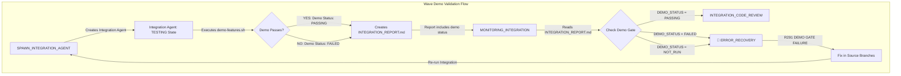
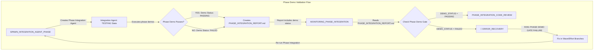
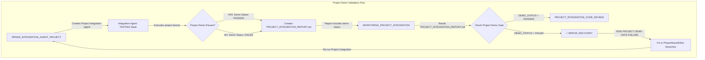

# 🎬 DEMO VALIDATION PATH ANALYSIS - COMPREHENSIVE REPORT

## Executive Summary

This report documents the **EXACT path that demo validation takes** for Wave, Phase, and Project level integrations in the Software Factory 2.0 system. **R291 (Integration Demo Requirement)** enforces demo gates at ALL integration levels with MANDATORY ERROR_RECOVERY transitions for any failures.

## 🔴🔴🔴 CRITICAL FINDING: R291 IS ENFORCED AT ALL LEVELS 🔴🔴🔴

**DEMO GATES ARE MANDATORY AND CANNOT BE BYPASSED:**
- Wave Integration: Demo must pass or → ERROR_RECOVERY
- Phase Integration: Demo must pass or → ERROR_RECOVERY
- Project Integration: Demo must pass or → ERROR_RECOVERY

## 📊 DEMO VALIDATION PATH BY INTEGRATION LEVEL

### 1️⃣ WAVE INTEGRATION DEMO PATH



**EXACT STATE SEQUENCE:**
1. **SPAWN_INTEGRATION_AGENT** - Spawns Integration Agent
2. **Integration Agent: TESTING** - Runs demos (R291 enforcement)
   - Location: `efforts/phase${PHASE}/wave${WAVE}/integration-workspace/`
   - Executes: `demo-features.sh`, `wave-demo.sh`, or individual effort demos
   - Creates: `demo-results/` directory with logs
3. **Integration Agent: REPORTING** - Documents demo results
   - Creates: `INTEGRATION_REPORT.md` with Demo Status field
4. **MONITORING_INTEGRATION** - Orchestrator checks demo gate
   - Reads: `INTEGRATION_REPORT.md`
   - Enforces: R291 demo gate (lines 143-165 in rules.md)
   - Decision: PASSING → continue, FAILED → ERROR_RECOVERY
5. **ERROR_RECOVERY** (if demo fails)
   - Trigger: "R291 DEMO GATE FAILURE"
   - Action: Fix in source branches per R300
   - Next: Re-run entire integration with fixes

### 2️⃣ PHASE INTEGRATION DEMO PATH



**EXACT STATE SEQUENCE:**
1. **SPAWN_INTEGRATION_AGENT_PHASE** - Spawns Phase Integration Agent
2. **Integration Agent: TESTING** - Runs phase-level demos
   - Location: `efforts/phase${PHASE}/phase-integration/`
   - Executes: Phase-level demo scripts
   - Verifies: All waves integrated and working together
3. **Integration Agent: REPORTING** - Documents phase demo results
   - Creates: `PHASE_INTEGRATION_REPORT.md` with Phase Demo Status
4. **MONITORING_PHASE_INTEGRATION** - Orchestrator checks phase demo gate
   - Reads: `PHASE_INTEGRATION_REPORT.md`
   - Enforces: R291 phase demo gate (lines 110-117 in rules.md)
   - Decision: PASSING → continue, FAILED → ERROR_RECOVERY
5. **ERROR_RECOVERY** (if phase demo fails)
   - Trigger: "R291 PHASE DEMO GATE FAILURE"
   - Action: Fix in wave/effort source branches
   - Next: Re-run entire phase integration

### 3️⃣ PROJECT INTEGRATION DEMO PATH



**EXACT STATE SEQUENCE:**
1. **SPAWN_INTEGRATION_AGENT_PROJECT** - Spawns Project Integration Agent
2. **Integration Agent: TESTING** - Runs project-level demos
   - Location: Project integration workspace
   - Executes: Full project demo scripts
   - Verifies: All phases working together as complete system
3. **Integration Agent: REPORTING** - Documents project demo results
   - Creates: `PROJECT_INTEGRATION_REPORT.md` with Project Demo Status
4. **MONITORING_PROJECT_INTEGRATION** - Orchestrator checks project demo gate
   - Reads: Integration report (exact field names may vary)
   - Enforces: R291 project demo gate
   - Decision: PASSING → continue, FAILED → ERROR_RECOVERY
5. **ERROR_RECOVERY** (if project demo fails)
   - Trigger: "R291 PROJECT DEMO GATE FAILURE"
   - Action: Fix in appropriate source branches
   - Next: Re-run entire project integration

## 🔍 DETAILED DEMO EXECUTION POINTS

### Integration Agent TESTING State (All Levels)

**Location**: `agent-states/integration/TESTING/rules.md`

The Integration Agent executes demos in its TESTING state (lines 43-98):

```bash
# Demo execution sequence:
1. Individual effort demos (R330 compliance)
2. Wave-level integrated demo (R291)
3. Phase-level integrated demo (for phase integration)
4. Project-level integrated demo (for project integration)
```

**Demo Scripts Searched (in order)**:
1. `./wave-demo.sh` (wave-specific)
2. `./phase-demo.sh` (phase-specific)
3. `./project-demo.sh` (project-specific)
4. `./demo-features.sh` (generic fallback)
5. `basic-demo.sh` (auto-created if none exist)

### Orchestrator MONITORING States (All Levels)

**Critical Enforcement Points:**

1. **MONITORING_INTEGRATION** (Wave Level)
   - Lines 143-165: Demo gate check
   - Mandatory transition to ERROR_RECOVERY if demo fails
   - No proceeding without demo pass

2. **MONITORING_PHASE_INTEGRATION** (Phase Level)
   - Lines 110-117: Phase demo gate check
   - Mandatory ERROR_RECOVERY for demo failures
   - Cannot reach phase assessment without demo pass

3. **MONITORING_PROJECT_INTEGRATION** (Project Level)
   - Implied demo gate check (follows same pattern)
   - Must have passing demo for project validation
   - ERROR_RECOVERY triggered on demo failure

## 🚨 R291 ENFORCEMENT MECHANISM

### Gate Enforcement Logic

```python
# Pseudo-code showing enforcement logic
if DEMO_STATUS not in ["PASSING", "SUCCESS"]:
    UPDATE_STATE = "ERROR_RECOVERY"
    UPDATE_REASON = "R291 DEMO GATE FAILURE: {status}"
    # MANDATORY - Cannot proceed without demo pass
```

### Penalty Structure
- Demo not run: **-50% to -75%**
- Demo failed but ignored: **-100% AUTOMATIC FAILURE**
- Claiming demo passed when it didn't: **IMMEDIATE DISQUALIFICATION**

## ✅ VERIFICATION CHECKLIST

### Wave Integration Demo Verification
- [ ] Integration Agent runs demos in TESTING state
- [ ] Demo results documented in INTEGRATION_REPORT.md
- [ ] MONITORING_INTEGRATION checks Demo Status field
- [ ] Failed demo triggers ERROR_RECOVERY
- [ ] Fixes applied to source branches only
- [ ] Integration re-run after fixes

### Phase Integration Demo Verification
- [ ] Phase Integration Agent runs phase demos
- [ ] Results in PHASE_INTEGRATION_REPORT.md
- [ ] MONITORING_PHASE_INTEGRATION enforces gate
- [ ] Failed demo triggers ERROR_RECOVERY
- [ ] Fixes go to wave/effort branches
- [ ] Phase integration re-run after fixes

### Project Integration Demo Verification
- [ ] Project Integration Agent runs project demos
- [ ] Results in PROJECT_INTEGRATION_REPORT.md
- [ ] MONITORING_PROJECT_INTEGRATION enforces gate
- [ ] Failed demo triggers ERROR_RECOVERY
- [ ] Fixes go to appropriate source branches
- [ ] Project integration re-run after fixes

## 📊 CONSISTENCY ANALYSIS

### ✅ CONSISTENT PATTERNS ACROSS ALL LEVELS

1. **Demo Execution**: Always in Integration Agent's TESTING state
2. **Documentation**: Always in *_INTEGRATION_REPORT.md
3. **Gate Check**: Always in MONITORING_* states
4. **Failure Path**: Always to ERROR_RECOVERY
5. **Fix Location**: Always in source branches (R300)
6. **Re-run Requirement**: Always full re-integration after fixes

### ⚠️ MINOR VARIATIONS

1. **Demo Script Names**: Different for each level (wave-demo.sh, phase-demo.sh, project-demo.sh)
2. **Report Names**: INTEGRATION_REPORT.md vs PHASE_INTEGRATION_REPORT.md vs PROJECT_INTEGRATION_REPORT.md
3. **Field Names**: May vary slightly but concept remains same

## 🔴 CRITICAL OBSERVATIONS

### 1. Demo Gates Are ABSOLUTE
- **NO bypassing allowed**
- **NO "we'll fix it later"**
- **NO proceeding without demo pass**

### 2. ERROR_RECOVERY Is MANDATORY
- Not optional or discretionary
- Triggered automatically by gate failure
- Must be resolved before continuing

### 3. Source Branch Fixes Only (R300)
- Integration branches are READ-ONLY
- All fixes go to effort/wave branches
- Full re-integration required after fixes

### 4. Complete Re-run After Fixes
- Cannot patch integration branch
- Must delete and recreate integration
- Fresh merge with fixed sources

## 📝 RECOMMENDATIONS

### For Orchestrator Implementation
1. **Always check demo status fields** in integration reports
2. **Never skip demo gate checks** - they're mandatory
3. **Transition to ERROR_RECOVERY immediately** on demo failure
4. **Document demo failure reasons** in state file

### For Integration Agent Implementation
1. **Always run demos** in TESTING state
2. **Create demo-results/** directory for logs
3. **Document demo status** clearly in reports
4. **Use standard field names** (Demo Status: PASSING/FAILED)

### For Software Engineers
1. **Create demo scripts** for every effort
2. **Test demos locally** before integration
3. **Fix demo issues in source branches** only
4. **Verify demos work** after fixes

## 🎯 CONCLUSION

The demo validation path is **CONSISTENT** across all three integration levels:
1. Integration Agent executes demos in TESTING state
2. Results documented in integration reports
3. Orchestrator enforces gates in MONITORING states
4. Failures trigger mandatory ERROR_RECOVERY
5. Fixes go to source branches only
6. Full re-integration required after fixes

**R291 is successfully enforced at ALL integration levels** through mandatory gate checks that cannot be bypassed. The system ensures that no integration can proceed without demonstrable, working functionality.

---

*Report Generated: 2025-09-11*
*Analysis Based On: Current Software Factory 2.0 Template Rules and State Definitions*