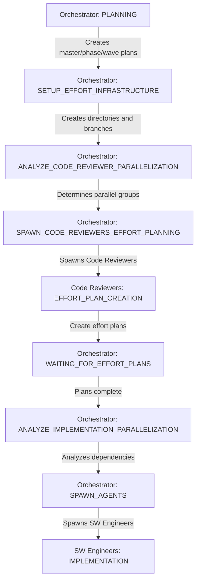

# EFFORT PLAN CREATION ANALYSIS

## Investigation Summary

This document analyzes the confusion around effort plan creation and validation in the Software Factory 2.0 system based on the user-provided transcript.

## Key Questions and Answers

### 1. Is there a rule requiring Code Reviewer to validate effort plans?

**Answer: NO - There is no rule requiring Code Reviewer validation of effort plans before SW Engineers start.**

Evidence:
- Searched for validation rules: No matches for "validation before spawn", "validate before engineer", or "plan must be validated"
- The SPAWN_AGENTS state rules do NOT mention effort plan validation
- No rule exists that blocks SW Engineer spawning pending validation

### 2. Who should create effort plans?

**Answer: CODE REVIEWERS create effort implementation plans, NOT the Orchestrator.**

Evidence from R054 (Implementation Plan Creation):
```
Code Reviewers MUST create comprehensive IMPLEMENTATION-PLAN.md files for each effort 
before SW Engineers begin work.
```

The confusion in the transcript stems from terminology:
- **Orchestrator** creates the overall "IMPLEMENTATION-PLAN.md" (master plan) in PLANNING state
- **Code Reviewers** create individual "IMPLEMENTATION-PLAN.md" files for each effort in EFFORT_PLAN_CREATION state

### 3. What is the correct workflow?

**Current System Design (Per State Machine):**



**Key Points:**
1. Infrastructure is created BEFORE Code Reviewers are spawned
2. Code Reviewers create effort plans in pre-existing directories
3. No validation gate exists between effort plan creation and SW Engineer spawning
4. SW Engineers are spawned immediately after parallelization analysis

## The Problem Identified

The transcript shows confusion because:

1. **Naming Confusion**: Both Orchestrator and Code Reviewers create files called "IMPLEMENTATION-PLAN.md"
   - Orchestrator creates master/phase/wave level plans
   - Code Reviewers create effort-level plans

2. **Missing Validation Step**: The user expected effort plan validation before SW Engineer spawning, but this doesn't exist in the current system

3. **Workflow Assumption**: The user assumed effort plans need validation before implementation begins, but the system trusts Code Reviewers to create valid plans

## Current Rules Analysis

### Rules That Exist:
- **R054**: Code Reviewers MUST create effort implementation plans
- **R219**: Code Reviewers must read dependency plans before creating effort plans
- **R211**: Code Reviewers create implementation plans from architecture
- **R214**: Code Reviewers must acknowledge wave directory metadata

### Rules That DON'T Exist:
- ❌ No rule requiring effort plan validation before SW Engineer spawning
- ❌ No rule for Code Reviewers to validate each other's plans
- ❌ No validation gate in SPAWN_AGENTS state

## Recommendations

### Option 1: Add Effort Plan Validation (NEW RULE)

Create a new rule requiring effort plan validation:

```markdown
# Rule R###: Effort Plan Validation Before Implementation

## Rule Statement
The Orchestrator MUST validate all effort implementation plans before spawning 
SW Engineers. Plans must include all required sections per R054.

## Validation Checklist:
- ✅ Technical Architecture section present
- ✅ Implementation Sequence with line estimates
- ✅ Dependencies identified (R219 compliance)
- ✅ Size Management Strategy defined
- ✅ Testing Requirements specified
- ✅ Total lines under 800

## State Machine Change:
Add new state: VALIDATE_EFFORT_PLANS between WAITING_FOR_EFFORT_PLANS and 
ANALYZE_IMPLEMENTATION_PARALLELIZATION
```

### Option 2: Clarify Naming Convention (RECOMMENDED)

Rename files to avoid confusion:

```markdown
# Naming Convention Clarification

## Orchestrator Creates:
- PROJECT-MASTER-PLAN.md (overall project)
- PHASE-{X}-PLAN.md (phase level)
- WAVE-{X}-{Y}-PLAN.md (wave level)

## Code Reviewers Create:
- EFFORT-IMPLEMENTATION-PLAN.md (in each effort directory)

This eliminates the confusion of multiple "IMPLEMENTATION-PLAN.md" files.
```

### Option 3: Add Peer Review for Effort Plans

Have Code Reviewers validate each other's plans:

```markdown
# Peer Review Protocol

1. Code Reviewer A creates effort plan
2. Code Reviewer B validates plan (different effort)
3. Validation status recorded in orchestrator-state.yaml
4. SW Engineers only spawned after validation passes
```

## Conclusion

The current system assumes Code Reviewers create valid effort plans without requiring validation. The confusion in the transcript stems from:

1. **Terminology overlap** - Multiple "IMPLEMENTATION-PLAN.md" files at different levels
2. **Missing validation step** - No explicit validation before SW Engineer spawning
3. **Trust model** - System trusts Code Reviewers to create valid plans

**Recommendation**: Implement Option 2 (naming clarification) as it's the least disruptive while addressing the core confusion. If validation is critical, add Option 1 as a new rule with corresponding state machine updates.

## Impact Analysis

### If Adding Validation (Option 1):
- **Pros**: Higher quality assurance, catches issues early
- **Cons**: Slower workflow, additional state complexity

### If Clarifying Names (Option 2):
- **Pros**: Eliminates confusion, no workflow changes needed
- **Cons**: Requires updating templates and documentation

### If Adding Peer Review (Option 3):
- **Pros**: Quality through peer review, knowledge sharing
- **Cons**: Requires multiple Code Reviewers, slower process

---

**Generated**: 2025-08-30
**Purpose**: Clarify effort plan creation and validation workflow
**Status**: Analysis Complete