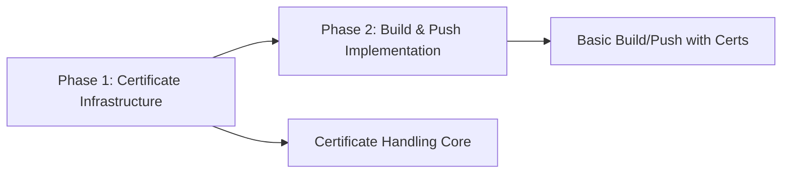

# SOFTWARE FACTORY 2.0 IMPLEMENTATION PLAN: IDPBuilder OCI Management
## Solving the Gitea Self-Signed Certificate Problem

**Project Name**: idpbuilder-oci-mvp  
**Timeline**: 2 weeks (10 business days)  
**Start Date**: TBD  
**Primary Goal**: Enable reliable image push to Gitea with self-signed certificates  
**Success Metric**: Zero certificate errors during normal operation  
**Framework Version**: Software Factory 2.0 (Latest Rules Applied)  

## Executive Summary

This MVP implementation plan focuses exclusively on solving the self-signed certificate problem that prevents reliable OCI image operations with the builtin Gitea instance. By prioritizing certificate handling and basic build/push functionality, we can deliver immediate value in 2 weeks.

## 🔴🔴🔴 CRITICAL SOFTWARE FACTORY 2.0 RULES 🔴🔴🔴

### SUPREME LAWS (Violation = Automatic Failure)
- **R006**: Orchestrator NEVER writes code - only coordinates
- **R319**: Orchestrator NEVER measures code - Code Reviewers measure ALWAYS
- **R320**: NO stub implementations - all code must be functional
- **R321**: Immediate backport during integration - no deferred fixes
- **R322**: Mandatory stop at state transitions - no automatic flow
- **R323**: Must build final artifact - no "code-only" completion
- **R151**: Parallel agents spawn with <5s timestamps
- **R283**: Project-level integration is MANDATORY

### Role Clarifications
- **Orchestrator**: ONLY coordinates, spawns agents, manages state (never writes/measures)
- **Code Reviewer**: Plans efforts, MEASURES ALL CODE, validates, detects stubs
- **SW Engineer**: Implements features, fixes issues, builds artifacts
- **Architect**: Reviews wave/phase completions, provides guidance
- **Integration Agent**: Merges branches (READ-ONLY for code)

## 🎯 Critical Workflow Corrections

### State Machine Flow (Per Latest Rules)
1. **Wave Integration → Phase Integration → PROJECT Integration** (R283 mandatory)
2. **Immediate backport during integration** (R321 - no deferred fixes)
3. **Build validation includes final artifact** (R323 required)
4. **Mandatory stops at every state transition** (R322)
5. **Parallel spawning with <5s timestamps** (R151)

### Effort Planning Protocol
1. **Code Reviewers create effort plans** (not orchestrators)
2. **Code Reviewers measure ALL code** (R319 - orchestrators NEVER measure)
3. **Code Reviewers detect stubs** (R320 - must reject)
4. **Split planning when >700 lines (soft) or >800 lines (hard)**
5. **Each effort must be independently mergeable**

### Integration Protocol (R321 Compliance)
1. **Integration branches are READ-ONLY** (merges only)
2. **ANY fix needed → immediate backport to source**
3. **No fixes in integration branches**
4. **Re-run full integration after fixes**
5. **All source branches must build independently**

## 📊 Project Statistics

| Metric | Value |
|--------|-------|
| **Total Phases** | 2 |
| **Total Weeks** | 2 |
| **Total Efforts** | 8 |
| **Estimated Lines** | ~2,000 |
| **Team Size** | 4 agents |
| **Parallel Capacity** | 3 concurrent efforts |
| **Phase 1 Efforts** | 4 (Certificate Infrastructure - Week 1) |
| **Phase 2 Efforts** | 5 (Build & Push Implementation - Week 2, including E2.2.2) |
| **Average Lines/Effort** | ~250 |

## 🏗️ Technology Stack

### Core Technologies
- **Language**: Go 1.21+
- **Framework**: Cobra CLI Framework
- **Container Build**: go-containerregistry
- **Testing**: Go testing package, Testify, Ginkgo

### Infrastructure
- **Container**: go-containerregistry (daemonless)
- **Orchestration**: Kind (Kubernetes in Docker)
- **CI/CD**: GitHub Actions
- **Registry**: Gitea OCI Registry

### Dependencies
```yaml
critical_dependencies:
  - name: github.com/google/go-containerregistry
    version: v0.19.0
    purpose: OCI image assembly and registry operations
  
  - name: github.com/spf13/cobra
    version: v1.8.1
    purpose: CLI command structure
  
  - name: github.com/spf13/viper
    version: v1.19.0
    purpose: Configuration management
    
  - name: k8s.io/client-go
    version: v0.31.0
    purpose: Kubernetes client for Kind cluster access
    
  - name: k8s.io/apimachinery
    version: v0.31.0
    purpose: Kubernetes API machinery
  
optional_dependencies:
  - name: github.com/sirupsen/logrus
    version: v1.9.3
    purpose: Structured logging
    
test_dependencies:
  - name: github.com/stretchr/testify
    version: v1.9.0
    purpose: Test assertions and mocking
    
  - name: github.com/golang/mock
    version: v1.6.0
    purpose: Mock generation for testing
```

## 🔧 Configuration

```yaml
# Software Factory 2.0 Configuration
software_factory:
  version: "2.0"
  mode: "MVP"
  rules:
    max_lines_per_effort: 800
    warning_threshold: 700
    split_threshold: 600  # Proactively split if approaching
    enforce_splits: true
    review_required: true
    test_coverage_minimum: 80

test_coverage:
  phase_1: 80%  # Certificate Infrastructure phase
  phase_2: 80%  # Build & Push Implementation phase

orchestrator:
  spawn_mode: "sequential"
  validation: "continuous"
  integration: "wave-based"
  max_parallel_efforts: 3
  max_parallel_agents: 3
  allow_parallel_waves: true

agents:
  sw_engineer:
    count: 3
    review_before_commit: true
  code_reviewer:
    validation: "immediate"
  architect:
    gates:
      - "wave_complete"
      - "phase_complete"

review_requirements:
  code_review: mandatory
  architect_review: mandatory  
  security_review: optional
  performance_review: mandatory

grading_thresholds:
  parallel_spawn_delta: 5.0  # seconds
  review_first_pass: 80     # percent
  test_coverage_min: 70
  integration_success: 95   # percent

project:
  name: "idpbuilder-oci-mvp"
  phases: 2  # Phase 1: Certificate, Phase 2: Build & Push
  waves: 4
  efforts: 8  # Including E2.2.2 for production push implementation
  estimated_lines: 2000
  
phase_distribution:
  phase_1: "50%"  # Certificate Infrastructure (1,000 lines)
  phase_2: "50%"  # Build & Push Implementation (1,000 lines)
  
success_metrics:
  primary: "Zero certificate errors"
  test_coverage: "80%"
  effort_compliance: "100% < 800 lines"
```

## 📋 Phase Overview

### Phase Distribution
```
Phase 1: Certificate Infrastructure  (50% - ~1,000 lines - Week 1)
Phase 2: Build & Push Implementation (50% - ~1,000 lines - Week 2)
```

### Phase Structure


Note: This MVP is structured as 2 focused phases to maintain clear separation between certificate infrastructure and build/push functionality.

## MVP Scope

### In Scope (MUST deliver)
✅ Certificate extraction from Kind cluster  
✅ go-containerregistry TLS trust configuration  
✅ Basic single-layer image assembly (no Dockerfile parsing)  
✅ Push to Gitea with proper certificate handling  
✅ CLI commands: build, push  
✅ --insecure flag for testing  
✅ Error messages that clearly identify cert issues  

### Out of Scope (POST-MVP)
❌ Multi-stage Dockerfiles  
❌ Build arguments and secrets  
❌ Batch operations  
❌ Controller integration  
❌ Advanced caching  
❌ Pretty CLI output  
❌ Comprehensive documentation  

## Detailed Implementation Plan

## Phase 1: Certificate Infrastructure (Days 1-5)

### Wave 1: Certificate Management Core (Days 1-2)
**Goal**: Extract and manage certificates from Kind/Gitea

#### Effort 1.1.1: Kind Certificate Extraction (Day 1)
**Size**: ~500 lines  
**Owner**: SW Engineer 1  

```go
// pkg/certs/extractor.go
package certs

// Core functionality:
// 1. Detect Kind cluster
// 2. Extract Gitea pod
// 3. Copy certificate from pod
// 4. Save to local trust store

type KindCertExtractor interface {
    ExtractGiteaCert(ctx context.Context) (*x509.Certificate, error)
    GetClusterName() (string, error)
    ValidateCertificate(cert *x509.Certificate) error
}
```

**Key Implementation Points**:
- Use kubectl to access Kind cluster
- Copy cert from `/data/gitea/https/cert.pem` in Gitea pod
- Handle missing cluster/pod gracefully
- Store in `~/.idpbuilder/certs/gitea.pem`

**Test Requirements**:
- Mock kubectl commands
- Test missing cluster scenario
- Test invalid certificate handling
- Test storage permissions

#### Effort 1.1.2: Registry TLS Trust Integration (Day 2)
**Size**: ~600 lines  
**Owner**: SW Engineer 2  

```go
// pkg/certs/trust.go
package certs

// Core functionality:
// 1. Load custom CA into x509.CertPool
// 2. Configure ggcr remote transport with TLS
// 3. Handle cert rotation
// 4. Provide --insecure override

type TrustStoreManager interface {
    AddCertificate(registry string, cert *x509.Certificate) error
    RemoveCertificate(registry string) error
    SetInsecureRegistry(registry string, insecure bool) error
    GetTrustedCerts(registry string) ([]*x509.Certificate, error)
}
```

**Key Implementation Points**:
- Maintain CA file at `~/.idpbuilder/certs/gitea.pem`
- Load CA into `tls.Config.RootCAs` for ggcr `remote.Option`
- Support cert rotation by reloading CA at operation time
- Clear error messages for permission issues

**Test Requirements**:
- Test CA pool loading from PEM
- Test permission handling
- Test cert rotation
- Test insecure mode

### Wave 2: Certificate Validation & Fallback (Days 3-5)
**Goal**: Robust certificate handling with clear diagnostics

#### Effort 1.2.1: Certificate Validation Pipeline (Day 3)
**Size**: ~400 lines  
**Owner**: SW Engineer 1  

```go
// pkg/certs/validator.go
package certs

// Core functionality:
// 1. Validate cert chain
// 2. Check expiry
// 3. Verify hostname match
// 4. Provide clear diagnostics

type CertValidator interface {
    ValidateChain(cert *x509.Certificate) error
    CheckExpiry(cert *x509.Certificate) (*time.Duration, error)
    VerifyHostname(cert *x509.Certificate, hostname string) error
    GenerateDiagnostics() (*CertDiagnostics, error)
}
```

**Key Implementation Points**:
- Clear error messages for each failure type
- Warning for soon-to-expire certs (< 30 days)
- Support wildcard certificates
- Diagnostic output for troubleshooting

**Test Requirements**:
- Test expired certificates
- Test hostname mismatches
- Test chain validation
- Test diagnostic output

#### Effort 1.2.2: Fallback Strategies (Days 4-5)
**Size**: ~400 lines  
**Owner**: SW Engineer 2  

```go
// pkg/certs/fallback.go
package certs

// Core functionality:
// 1. Auto-detect cert problems
// 2. Suggest solutions
// 3. Implement --insecure flag
// 4. Log security decisions

type FallbackHandler interface {
    HandleCertError(err error) (*FallbackStrategy, error)
    ApplyInsecureMode(config *BuildConfig) error
    LogSecurityDecision(decision string, reason string)
    GetRecommendations(err error) []string
}
```

**Key Implementation Points**:
- Never silently ignore cert errors
- Require explicit --insecure flag
- Log all security bypasses
- Provide fix recommendations

**Test Requirements**:
- Test fallback trigger conditions
- Test recommendation generation
- Test security logging
- Test --insecure flag behavior

## Phase 2: Build & Push Implementation (Days 6-10)

### Wave 1: Core Build & Push (Days 6-7)
**Goal**: Basic image assembly and registry push

#### Effort 2.1.1: go-containerregistry Image Builder (Day 6)
**Size**: ~600 lines  
**Owner**: SW Engineer 3  

```go
// pkg/build/builder.go
package build

// Core functionality:
// 1. Create single-layer from context directory
// 2. Generate minimal image config
// 3. Write OCI image tarball to local cache
// 4. Tag resulting image

type Builder interface {
    BuildImage(contextPath string, tag string) error
    ListImages() ([]Image, error)
    RemoveImage(id string) error
    TagImage(source string, target string) error
}
```

**Key Implementation Points**:
- Use `ggcr` packages: `v1/mutate`, `tarball`, `name`, `remote`
- Create a single tar layer from `contextPath` (basic exclusions)
- Store image as OCI tarball at `~/.idpbuilder/images/<tag>.tar`
- Clear progress output

**Test Requirements**:
- Test successful image assembly
- Test failure on invalid context path
- Test context handling (exclusions)
- Test tagging

#### Effort 2.1.2: Gitea Registry Client (Day 7)
**Size**: ~600 lines  
**Owner**: SW Engineer 1  

```go
// pkg/registry/gitea.go
package registry

// Core functionality:
// 1. Authenticate with Gitea
// 2. Push image with cert handling
// 3. List repository contents
// 4. Handle push errors

type GiteaRegistry interface {
    Authenticate(username, password string) error
    Push(image string, tag string) error
    List(repository string) ([]string, error)
    Delete(image string, tag string) error
}
```

**Key Implementation Points**:
- Use certs from Phase 1 via ggcr `remote.WithTransport`
- Clear error messages for auth failures
- Retry logic for transient failures
- Progress reporting during push

**Test Requirements**:
- Test authentication
- Test successful push
- Test cert integration
- Test error handling

### Wave 2: CLI Integration (Days 8-10)
**Goal**: User-friendly CLI commands with production implementation

#### Effort 2.2.1: CLI Commands - Base Implementation (Days 8-9)
**Size**: ~500 lines
**Owner**: SW Engineer 2
**Status**: COMPLETED (base structure established)

#### Effort 2.2.2: Image Persistence & Production Push (Day 10)
**Size**: ~600 lines
**Owner**: SW Engineer 3
**Type**: Follow-on Enhancement to E2.2.1  

```go
// cmd/build.go
// cmd/push.go
package cmd

// Commands:
// idpbuilder build --context ./app --tag myapp:latest
// idpbuilder push myapp:latest
// idpbuilder push --insecure myapp:latest

var buildCmd = &cobra.Command{
    Use:   "build",
    Short: "Assemble OCI image from context",
    Long:  "Assemble a single-layer OCI image from a directory using go-containerregistry; certificate handling applies during push",
    Run:   runBuild,
}

var pushCmd = &cobra.Command{
    Use:   "push",
    Short: "Push image to Gitea registry",
    Long:  "Push a container image to the builtin Gitea registry with certificate support",
    Run:   runPush,
}
```

**Key Implementation Points**:
- Clear help text
- Sensible defaults
- --insecure flag on push only
- Progress feedback

**Test Requirements**:
- Test command parsing
- Test flag handling
- Test error output
- Test help text

**E2.2.2 Implementation Details**:

```go
// pkg/storage/image_store.go - NEW in E2.2.2
type ImageStore interface {
    Save(tag string, image v1.Image) error
    Load(tag string) (v1.Image, error)
    List() ([]string, error)
}

// pkg/gitea/client.go - PRODUCTION implementation in E2.2.2
func (c *Client) Push(imageRef string, progressChan chan<- PushProgress) error {
    // Load REAL image from storage (not placeholder!)
    img, err := storage.Load(imageRef)
    if err != nil {
        return fmt.Errorf("image not found: %w", err)
    }

    // Send ACTUAL image to registry
    return remote.Write(ref, img, remote.WithAuth(auth))
}
```

**E2.2.2 Key Requirements**:
- NO stub implementations (R320 compliance)
- Real image persistence after build
- Real image loading for push
- Actual OCI manifest transmission
- Environment variable authentication
- Production-ready code ONLY

## Note: Integration Testing

Integration testing is part of the Software Factory process, not a separate effort. Tests are executed during the INTEGRATION state when efforts are merged.

## Software Factory 2.0 Agents

### Agent Overview and Authority

The Software Factory 2.0 utilizes specialized agents with distinct roles, authorities, and grading criteria. Each agent operates within strict boundaries and is evaluated on specific performance metrics.

### 1. Orchestrator Agent (@agent-orchestrator)

**Role**: Central coordination and state management ONLY  
**Authority**: Can spawn other agents, manage state transitions, enforce gates  
**Restrictions**: 
- **R006**: NEVER writes code (immediate -100% failure)
- **R319**: NEVER measures code size (immediate -100% failure)
- **R322**: MUST stop at every state transition
- Cannot make technical assessments - must delegate to specialists

**Primary Responsibilities**:
- Coordinate all implementation work across phases and waves
- Spawn specialized agents for specific tasks (per R151 timing)
- Manage orchestrator-state.json file (per R288)
- Enforce phase and wave boundaries
- Track progress via agent reports (not direct measurement)
- Handle state machine transitions with mandatory stops (R322)
- Request Code Reviewers for ALL technical assessments
- Ensure immediate backporting when issues found (R321)

**Validation Gates**:
- Wave completion gate (Code Reviewer confirms < 800 lines)
- Phase transition gate (all waves integrated)
- Integration readiness gate (architect approval)
- Split enforcement gate (Code Reviewer detects > 800 lines)
- Project integration gate (R283 - all phases merged)
- Build validation gate (R323 - artifact must exist)
- Immediate backport gate (R321 - fix sources first)

**Grading Criteria**:
- ❌ FAIL (-100%): Writing any code directly (R006)
- ❌ FAIL (-100%): Measuring code size directly (R319)
- ❌ FAIL (-50%): Not stopping at state transitions (R322)
- ❌ FAIL (-50%): Missing immediate backport (R321)
- ❌ FAIL: Allowing > 800 line efforts (per Code Reviewer)
- ❌ FAIL: Proceeding without architect approval
- ✅ PASS: 100% delegation to appropriate agents
- ✅ PASS: Correct state machine transitions with stops
- ✅ PASS: Proper gate enforcement
- ✅ PASS: R151 parallel spawn timing (<5s)

### 2. SW Engineer Agent (@agent-sw-engineer)

**Role**: Implementation of assigned efforts and building artifacts  
**Authority**: Can write code, create tests, update work logs, build artifacts  
**Restrictions**: 
- Must stay within assigned effort boundaries
- **R320**: Cannot leave stub implementations
- **R323**: Must build final artifact during validation
- Must fix issues immediately when found (R321)

**Primary Responsibilities**:
- Implement COMPLETE functionality per IMPLEMENTATION-PLAN.md (no stubs)
- Write unit and integration tests
- Maintain work-log.md with progress updates
- Self-monitor size (every 200 lines) - optional
- Stop immediately if approaching 800 lines
- Fix issues identified by Code Reviewer
- Build final deliverable artifact (R323)
- Apply fixes to source branches immediately (R321)

**Validation Requirements**:
- Continuous line count measurement using designated tools
- Test coverage minimum 80%
- All tests must pass before marking complete
- Work log must be updated with each significant change
- Must use proper git branch for effort

**Grading Criteria**:
- ❌ FAIL (-50%): Stub implementations (R320)
- ❌ FAIL (-50%): No final artifact built (R323)
- ❌ FAIL: Exceeding 800 lines in any effort
- ❌ FAIL: Test coverage below 70%
- ❌ FAIL: Working in wrong directory/branch
- ❌ FAIL: Not updating work logs
- ❌ FAIL: Deferring fixes instead of immediate backport
- ✅ PASS: All efforts < 800 lines
- ✅ PASS: Complete functionality (no stubs)
- ✅ PASS: Test coverage > 80%
- ✅ PASS: Working artifact produced

### 3. Code Reviewer Agent (@agent-code-reviewer)

**Role**: Planning efforts, measuring sizes, and validating implementations  
**Authority**: Can approve/reject code, create split plans, enforce standards, measure code  
**Restrictions**: 
- Cannot modify implementation code directly
- **R319**: MUST measure all code (primary duty)
- **R320**: MUST detect and reject stub implementations
- **R323**: MUST verify artifact build

**Primary Responsibilities**:
- Create IMPLEMENTATION-PLAN.md for efforts
- **MEASURE ALL CODE with line-counter.sh (R319 MANDATORY)**
- Detect and reject stub implementations (R320)
- Review all code before commit
- Plan and orchestrate splits when > 800 lines
- Validate test coverage
- Ensure pattern compliance
- Create work-log.md from template
- Verify final artifact exists and works (R323)
- Create backport plans for integration fixes (R321)

**Validation Gates**:
- Size validation (must be < 800 lines)
- Test coverage validation (must meet requirements)
- Pattern compliance check
- Security review
- Performance impact assessment

**Grading Criteria**:
- ❌ FAIL (-100%): Not measuring code (violates R319)
- ❌ FAIL (-50%): Passing stub implementations (R320)
- ❌ FAIL (-50%): Not verifying artifact build (R323)
- ❌ FAIL: Approving > 800 line efforts
- ❌ FAIL: Missing critical bugs
- ❌ FAIL: Incorrect split planning
- ✅ PASS: All code measured with line-counter.sh
- ✅ PASS: All stubs detected and rejected
- ✅ PASS: Artifact verified
- ✅ PASS: Effective split strategies

### 4. Architect Agent (@agent-architect)

**Role**: System-wide architectural review and decision authority  
**Authority**: Can issue STOP decisions that halt all work  
**Restriction**: Cannot make implementation changes  

**Primary Responsibilities**:
- Review wave completions for architectural integrity
- Assess phase readiness before transitions
- Evaluate system integration
- Make PROCEED/CHANGES_REQUIRED/STOP decisions
- Validate security architecture
- Assess performance implications
- Ensure pattern consistency across system

**Review Types**:
- **Wave Review**: After each wave completion
- **Phase Assessment**: Before phase transitions
- **Integration Review**: System-wide coherence check
- **Architecture Audit**: Deep pattern analysis

**Decision Framework**:
```
PROCEED: All patterns correct, integration works, performance acceptable
CHANGES_REQUIRED: Minor issues that can be fixed
STOP: Fundamental architecture violations requiring redesign
```

**Grading Criteria**:
- ❌ FAIL: False positive STOP decision
- ❌ FAIL: Missing critical architecture issue
- ❌ FAIL: Wrong trajectory assessment
- ❌ FAIL: Unclear guidance causing failures
- ✅ PASS: Accurate architecture assessments
- ✅ PASS: Clear actionable feedback
- ✅ PASS: Appropriate use of STOP authority

### 5. Integration Agent (@agent-integration)

**Role**: Merge effort branches and create integration branches  
**Authority**: Can create and merge branches, resolve conflicts  
**Restriction**: Cannot modify functional code (only merge operations)  

**Primary Responsibilities**:
- Create wave integration branches
- Merge all effort branches from a wave
- Resolve merge conflicts
- Create phase integration branches
- Validate integration success
- Ensure clean merges to main
- Maintain integration branch hygiene

**Integration Gates**:
- All effort branches must be reviewed and approved
- All tests must pass on effort branches
- Wave integration must be architect-approved
- Phase integration requires full test suite pass
- Main branch protection rules enforced

**Grading Criteria**:
- ❌ FAIL: Breaking integration branches
- ❌ FAIL: Lost code during merges
- ❌ FAIL: Incorrect merge order
- ❌ FAIL: Pushing broken code to main
- ✅ PASS: Clean integration branches
- ✅ PASS: All conflicts properly resolved
- ✅ PASS: Maintaining branch history

### Agent Interaction Protocol

#### Spawn Sequence with State Machine
```
Orchestrator States:
INIT → WAVE_START → SETUP_EFFORT_INFRASTRUCTURE
  → ANALYZE_CODE_REVIEWER_PARALLELIZATION (R234 mandatory)
  → SPAWN_CODE_REVIEWERS_EFFORT_PLANNING (R151 timing)
  → WAITING_FOR_EFFORT_PLANS
  → ANALYZE_IMPLEMENTATION_PARALLELIZATION (R234 mandatory)  
  → SPAWN_AGENTS (R151 timing)
  → MONITOR_IMPLEMENTATION
  → SPAWN_CODE_REVIEWERS_FOR_REVIEW (when complete)
  → MONITOR_REVIEWS
  → WAVE_COMPLETE (only if all pass)
  → INTEGRATION
  → [R322: STOP at each transition]
```

#### Communication Rules
1. Agents communicate via files and git operations
2. No direct agent-to-agent communication
3. Orchestrator manages all agent spawning
4. State transitions recorded in orchestrator-state.json
5. All decisions documented in appropriate logs

### Critical Gates and Enforcement

#### Wave Completion Gate
Before proceeding to next wave:
- ✅ Code Reviewer confirmed all efforts < 800 lines (R319)
- ✅ No stub implementations detected (R320)
- ✅ All tests passing with required coverage
- ✅ Wave integration branch created
- ✅ All source branches verified working (R321)
- ✅ Architect review completed
- ✅ State file updated and committed (R288)
- ✅ Orchestrator STOPPED at transition (R322)

#### Phase Transition Gate
Before starting new phase:
- ✅ All waves in phase integrated
- ✅ Phase integration branch created (merges only - R321)
- ✅ Architect phase assessment complete
- ✅ No OFF_TRACK status from architect
- ✅ All documentation updated
- ✅ Source branches independently buildable (R321)
- ✅ Orchestrator STOPPED at transition (R322)

#### Size Enforcement Gate (Code Reviewer Responsibility)
When Code Reviewer detects > 800 lines:
- 🛑 Code Reviewer marks as SIZE_VIOLATION
- 📊 Code Reviewer measures with line-counter.sh (R319)
- 📋 Code Reviewer creates split plan
- 🏗️ Orchestrator creates split infrastructure (R204)
- ✂️ Execute splits sequentially (never parallel)
- 🔄 Each split gets full review cycle
- ❌ Orchestrator NEVER measures (R319)

### Grading Metrics Summary

**Overall System Success Requires**:
- 100% of efforts < 800 lines (measured with official tool)
- 100% of efforts reviewed and approved
- 100% test coverage requirements met
- Zero false positive STOP decisions
- Zero code written by Orchestrator
- All phase dependencies respected
- Clean integration at all levels

## Resource Allocation

### Team Structure
- **Orchestrator**: 1 (coordinates all work)
- **SW Engineers**: 3 (can be spawned as needed)
- **Code Reviewer**: 1 (reviews all code)
- **Architect**: 1 (system-wide authority)
- **Integration Agent**: 1 (manages branches)

### Review Points
- Every effort completion: Code review
- Every wave completion: Architecture review
- Every phase completion: Phase assessment
- Before main merge: Final integration review

## Success Criteria

### Primary Success Definition (R323 Compliance)
**SUCCESS** means delivering a **fully functional, buildable idpbuilder binary** that:
1. ✅ **Compiles successfully** into an executable binary (`go build` produces `idpbuilder`)
2. ✅ **Binary artifact exists** at specified path (R323 mandatory)
3. ✅ **`idpbuilder build` command works** - assembles OCI image tarball from a context directory
4. ✅ **`idpbuilder push` command works** - pushes images to Gitea registry  
5. ✅ **Certificate handling works automatically** - no manual cert configuration needed
6. ✅ **Zero certificate errors during normal operation** - the core problem is SOLVED
7. ✅ **No stub implementations** - all functionality complete (R320)
8. ✅ **All fixes in source branches** - no integration-only fixes (R321)

### Must Pass (Critical Requirements)
1. ✅ **Buildable Binary**: `go build ./cmd/idpbuilder` produces working executable
2. ✅ **Working `build` Command**: Can assemble OCI image tarballs from context directories without errors
3. ✅ **Working `push` Command**: Can push to Gitea without certificate failures
4. ✅ **Automatic Certificate Extraction**: Detects and extracts Gitea certs from Kind
5. ✅ **Certificate Trust Configuration**: Configures go-containerregistry transport to trust Gitea's self-signed cert
6. ✅ **--insecure Flag**: Fallback option works when explicitly requested
7. ✅ **Clear Error Messages**: Certificate problems are clearly identified
8. ✅ **Cross-platform**: Works on Linux and Mac

### Should Pass (Quality Requirements)
1. ⭕ **Test Coverage**: 80% coverage on all code
2. ⭕ **Build Performance**: Completes in < 2 minutes
3. ⭕ **Push Performance**: Completes in < 1 minute  
4. ⭕ **Certificate Rotation**: Handles cert updates gracefully
5. ⭕ **Integration Tests**: Full end-to-end tests pass
6. ⭕ **Documentation**: README with clear usage instructions

### Nice to Have (Future Enhancements)
1. ➖ Windows support
2. ➖ Multiple registry support
3. ➖ Build cache optimization
4. ➖ Progress bars and pretty output
5. ➖ Verbose debugging mode

### Validation Checklist
The MVP is complete when a user can:
- [ ] Install the idpbuilder binary
- [ ] Run `idpbuilder create --with-gitea` successfully
- [ ] Run `idpbuilder build --context ./app --tag myapp:v1` successfully
- [ ] Run `idpbuilder push myapp:v1` successfully
- [ ] Confirm NO certificate errors occurred
- [ ] Confirm the image is visible in Gitea registry

## Risk Mitigation

### Risk 1: Kind Certificate Extraction Fails
**Mitigation**: Implement manual cert import as fallback
```bash
idpbuilder cert import --file /path/to/cert.pem
```

### Risk 2: Custom CA file permissions for TLS trust
**Mitigation**: Store CA at `~/.idpbuilder/certs/gitea.pem`, ensure readable by the process, and load via `tls.Config.RootCAs`; provide `--insecure` fallback only when explicitly requested

### Risk 3: Gitea API Changes
**Mitigation**: Test against multiple Gitea versions, use stable API endpoints

## Testing Strategy

### Unit Tests (Per Effort)
- Minimum 80% coverage
- Mock external dependencies
- Test error conditions
- Test edge cases

### Integration Tests (End of Each Phase)
- Real Kind cluster
- Real Gitea instance
- Real certificates
- Full workflow validation

### Manual Testing Checklist
- [ ] Fresh install works
- [ ] Cert extraction successful
- [ ] Build completes without errors
- [ ] Push succeeds with proper cert
- [ ] --insecure flag works
- [ ] Error messages are clear
- [ ] Cert rotation handled

## Rollout Plan

### Week 1 Deliverable
- Working certificate extraction
- Registry TLS trust integration
- Certificate validation
- Manual testing successful

### Week 2 Deliverable
- Build command working
- Push command working
- Integration tests passing
- README with quick start

### Post-MVP Roadmap
1. **Month 1**: Multi-stage Dockerfiles, build args
2. **Month 2**: Batch operations, caching
3. **Month 3**: Controller integration
4. **Month 4**: Full documentation, UX polish

## Definition of Done

### Software Factory 2.0 Completion Criteria:

#### Code Complete:
1. ✅ All functionality implemented (no stubs - R320)
2. ✅ Can extract cert from Kind/Gitea
3. ✅ Can assemble OCI image from a context directory
4. ✅ Can push to Gitea without cert errors
5. ✅ --insecure flag works as fallback

#### Build & Validation:
6. ✅ Final binary artifact built and verified (R323)
7. ✅ Integration tests pass
8. ✅ All source branches build independently (R321)
9. ✅ Project integration branch created (R283)

#### Process Compliance:
10. ✅ All efforts < 800 lines (verified by Code Reviewer)
11. ✅ Orchestrator never wrote code (R006)
12. ✅ Orchestrator never measured code (R319)
13. ✅ All state transitions had stops (R322)
14. ✅ Basic README exists

## Quick Start (Post-Implementation)

```bash
# 1. Install idpbuilder with OCI support
go install github.com/jessesanford/idpbuilder@mvp

# 2. Start IDPBuilder with Gitea
idpbuilder create --with-gitea

# 3. Assemble an image (certs handled automatically during push!)
idpbuilder build --context ./app --tag myapp:v1

# 4. Push to Gitea (no cert errors!)
idpbuilder push myapp:v1

# That's it! No manual certificate configuration needed!
```

## 📊 Implementation Summary

**Total Implementation Size**: ~2,000 lines (excludes generated code, tests, docs)  
**Total Efforts**: 8 (all < 800 lines each)  
**Total Phases**: 2 (Phase 1: Certificate Infrastructure, Phase 2: Build & Push)  
**Total Waves**: 4 (2 waves per phase)  
**Effort Distribution**:
- Phase 1 (Certificate Infrastructure): 4 efforts (~1,000 lines) - Week 1
- Phase 2 (Build & Push Implementation): 5 efforts (~1,600 lines) - Week 2

**Lines per Effort**: Average ~250 lines (well within 800-line limit)

---

**Document Version**: 2.0  
**Framework**: Software Factory 2.0 (Full Compliance)  
**Created**: 2025-08-28  
**Updated**: 2025-09-06  
**Rules Applied**: R006, R319, R320, R321, R322, R323, R151, R283, R288

**Remember**: This MVP is laser-focused on solving the certificate problem with COMPLETE functionality (no stubs) and proper Software Factory 2.0 compliance.