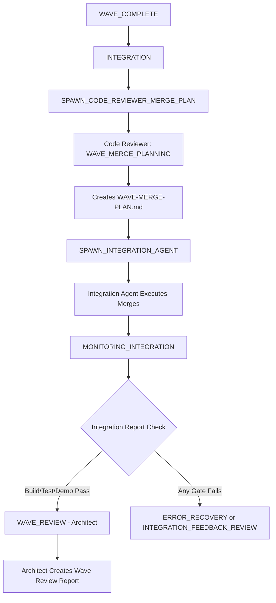

# Integration Review Flow Clarification Report

## Executive Summary

This report clarifies the roles and responsibilities of Code Reviewer and Architect agents in the integration review process, addressing the question: **"Does the Code Reviewer agent review integration work on wave and phase integrations, and if this happens before architect reviews?"**

**ANSWER**: The Code Reviewer agent does NOT review the integrated code itself. Instead:
1. Code Reviewer creates MERGE PLANS (what to merge and in what order)
2. Integration Agent executes the merges
3. Build/Test/Demo gates are enforced automatically
4. Architect performs the wave review AFTER successful integration

## Current Integration Review Flow

### 1. Wave Integration Sequence

### 2. Code Reviewer's Role in Integration

**The Code Reviewer agent has a PLANNING role, not a REVIEW role for integrations:**

#### What Code Reviewer DOES:
- **WAVE_MERGE_PLANNING state**: Creates detailed merge plan
- Analyzes branch dependencies and determines merge order
- Identifies which branches to include/exclude (e.g., splits vs originals)
- Documents expected conflicts and resolution strategies
- Creates `WAVE-MERGE-PLAN.md` with exact merge instructions

#### What Code Reviewer DOES NOT DO:
- Does NOT review the merged code after integration
- Does NOT execute any merges (R269: Code Reviewer plans, never executes)
- Does NOT assess integration quality
- Does NOT make architectural decisions about integration

#### Key Rules:
- **R269**: Code Reviewer Merge Plan No Execution
- **R262**: No Integration Branches as Sources (only original effort branches)

### 3. Integration Agent's Role

**The Integration Agent is responsible for EXECUTION:**
- Reads and follows `WAVE-MERGE-PLAN.md` exactly
- Executes git merges in specified order
- Handles merge conflicts as directed
- Runs build/test/demo verification
- Creates `INTEGRATION_REPORT.md` with results

### 4. Architect's Role in Integration Reviews

**The Architect performs HIGH-LEVEL REVIEW after integration succeeds:**

#### WAVE_REVIEW State (After Wave Integration):
- Reviews the successfully integrated wave
- Checks architectural alignment and patterns
- Verifies size compliance (R297: checks split_count first)
- Creates mandatory `PHASE-{N}-WAVE-{W}-REVIEW-REPORT.md` (R258)
- Makes one of four decisions:
  - PROCEED_NEXT_WAVE
  - PROCEED_PHASE_ASSESSMENT
  - CHANGES_REQUIRED
  - WAVE_FAILED

#### INTEGRATION_REVIEW State (Phase-Level):
- Reviews multiple waves integrated together
- Assesses system-wide compatibility
- Validates performance at scale
- Checks multi-tenancy integrity
- Makes integration-level decisions

### 5. Automated Gate Enforcement

**R291: Integration Demo Requirement enforces automatic gates:**

Before any review by Architect, the system automatically checks:
1. **BUILD GATE**: Must compile/build successfully
2. **TEST GATE**: All tests must pass
3. **DEMO GATE**: Demo must run successfully
4. **INTEGRATION STATUS**: Must be SUCCESS

If ANY gate fails → Automatic transition to ERROR_RECOVERY (no review needed)

## Key Findings

### Finding 1: No Code Review of Integrated Code
**The Code Reviewer agent does NOT review the integrated code.** Their involvement is limited to creating the merge plan BEFORE integration happens.

### Finding 2: Architect Reviews After Successful Integration
**The Architect only reviews AFTER all automated gates pass.** If build/test/demo fails, the system goes to ERROR_RECOVERY without architect involvement.

### Finding 3: Clear Separation of Concerns
- **Code Reviewer**: Plans what to merge (strategy)
- **Integration Agent**: Executes merges (implementation)
- **Automated Gates**: Verify technical success (validation)
- **Architect**: Assesses architectural quality (review)

### Finding 4: Integration Failures Bypass Reviews
When integration fails (build/test/demo), the flow goes directly to:
- **ERROR_RECOVERY**: For gate failures (R291)
- **INTEGRATION_FEEDBACK_REVIEW**: For fixable issues

No manual review happens until all technical gates pass.

## Correct Review Sequence

### For Wave Integration:

1. **WAVE_COMPLETE**: All efforts complete with passing reviews
2. **INTEGRATION**: Infrastructure setup
3. **Code Reviewer Plans**: Creates merge strategy (NOT a review)
4. **Integration Executes**: Performs merges
5. **Automated Gates**: Build/Test/Demo verification
6. **Architect Reviews**: Only if all gates pass
7. **Decision**: Proceed or require fixes

### For Phase Integration:

Similar pattern but at phase level:
1. Multiple waves ready
2. Code Reviewer creates phase merge plan
3. Integration Agent executes phase merges
4. Automated gates verify
5. Architect performs INTEGRATION_REVIEW
6. Phase-level decision

## Gaps and Ambiguities Identified

### Gap 1: No Detailed Code Review of Merged Code
**Current State**: Nobody reviews the actual merged code for quality issues that might arise from integration (beyond automated tests).

**Impact**: Potential integration-specific code quality issues might be missed.

**Recommendation**: Consider adding a post-integration code quality check, though automated tests should catch most issues.

### Gap 2: Unclear Terminology
**Issue**: The state name "INTEGRATION_FEEDBACK_REVIEW" might suggest code review, but it's actually about processing failure feedback.

**Recommendation**: Consider renaming to "INTEGRATION_FAILURE_PROCESSING" for clarity.

## Recommendations

### 1. Maintain Current Separation
The current separation is actually GOOD:
- Prevents role confusion
- Ensures clear responsibilities
- Avoids duplicate reviews
- Focuses each agent on their expertise

### 2. Trust Automated Gates
The R291 gates (build/test/demo) are sufficient for technical validation. Additional code review of integrated code would be redundant if tests are comprehensive.

### 3. Document Integration Quality in Reports
Ensure Integration Agent's `INTEGRATION_REPORT.md` includes:
- Merge conflict resolutions
- Any code changes made during integration
- Test coverage metrics
- Performance benchmarks

### 4. Clarify State Names
Consider updating state names for clarity:
- WAVE_MERGE_PLANNING → WAVE_MERGE_STRATEGY_CREATION
- INTEGRATION_FEEDBACK_REVIEW → INTEGRATION_FAILURE_ANALYSIS

## Conclusion

**The Code Reviewer agent does NOT review integrated code.** The integration review flow is:
1. Code Reviewer creates merge strategy (planning, not review)
2. Integration Agent executes merges
3. Automated gates validate technical success
4. Architect reviews only after gates pass

This separation is intentional and effective:
- **Code Reviewer**: Strategic planning of merges
- **Integration Agent**: Tactical execution of merges
- **Automated Gates**: Technical validation
- **Architect**: Architectural assessment

The system relies on comprehensive automated testing (R291) rather than manual code review of integrated code, which is appropriate for a CI/CD pipeline.

## Appendix: Key Rules Referenced

- **R258**: Mandatory Wave Review Report (Architect must create report)
- **R269**: Code Reviewer Merge Plan No Execution (plans only, never executes)
- **R291**: Integration Demo Requirement (all gates must pass)
- **R297**: Architect Split Detection Protocol (check splits before measuring)
- **R300**: Comprehensive Fix Management Protocol (fixes in effort branches)

---
*Report Generated: 2025-09-01*
*Generated by: Software Factory Manager Agent*