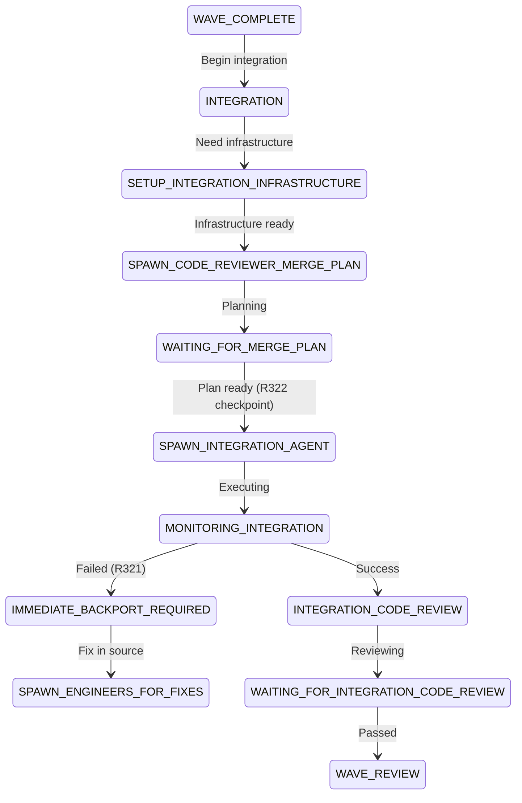

# Integration State Analysis Report

## Executive Summary

The orchestrator's integration flow has been refactored to separate concerns properly. The new state flow delegates infrastructure creation to dedicated states and uses proper planning states before execution. However, there are legacy states causing confusion that should be removed or clearly deprecated.

## 1. New Integration Planning State Architecture

### Current Wave Integration Flow (Lines 766-776 of STATE-MACHINE.md)

The new integration flow for waves follows this sequence:

```
WAVE_COMPLETE 
    → INTEGRATION (coordination only - no infrastructure creation)
    → SETUP_INTEGRATION_INFRASTRUCTURE (creates workspace per R308)
    → SPAWN_CODE_REVIEWER_MERGE_PLAN (spawns planner)
    → WAITING_FOR_MERGE_PLAN (waits for plan)
    → SPAWN_INTEGRATION_AGENT (spawns executor - R322 checkpoint)
    → MONITORING_INTEGRATION (monitors execution)
    → INTEGRATION_CODE_REVIEW (validates quality)
    → WAITING_FOR_INTEGRATION_CODE_REVIEW (waits for review)
    → WAVE_REVIEW (architect assessment)
```

### Key Changes from Legacy Pattern

1. **INTEGRATION state** is now a coordination state only - it checks for infrastructure and delegates creation
2. **SETUP_INTEGRATION_INFRASTRUCTURE** is the new dedicated state for creating integration workspaces (R308 compliant)
3. **SPAWN_CODE_REVIEWER_MERGE_PLAN** explicitly spawns a Code Reviewer for planning (not execution)
4. **R322 checkpoint** enforced at WAITING_FOR_MERGE_PLAN → SPAWN_INTEGRATION_AGENT transition

## 2. Problematic Legacy States to Remove

### States That Should Be Removed/Deprecated

1. **INTEGRATION_FEEDBACK_REVIEW** (Lines 677, 777-779, 845-846)
   - **Problem**: Redundant with IMMEDIATE_BACKPORT_REQUIRED flow
   - **Status**: Partially deprecated but still in state machine
   - **Action**: Remove completely, use IMMEDIATE_BACKPORT_REQUIRED instead

2. **BACKPORT_FIXES** (Line 716, 322, 827)
   - **Problem**: Fully deprecated per R321, replaced by immediate backport flow
   - **Status**: Marked as "FULLY DEPRECATED - DO NOT USE" but still present
   - **Action**: Remove from state machine entirely

3. **FIX_BUILD_ISSUES** (Line 712, 816-821)
   - **Problem**: Marked as deprecated, split into specialized states
   - **Status**: Still referenced in transitions
   - **Action**: Remove and ensure all transitions use new specialized states

## 3. Correct State Sequence for Wave Integration

### Infrastructure Creation State
**State**: SETUP_INTEGRATION_INFRASTRUCTURE
- **Purpose**: Create integration workspace with R308-compliant base branch
- **Responsibilities**:
  - Determine correct base branch (previous integration or main)
  - Create /efforts/phase{X}/wave{Y}/integration-workspace/
  - Clone repository with correct base
  - Create and push integration branch
  - Update state file with infrastructure metadata

### Planning Trigger State  
**State**: SPAWN_CODE_REVIEWER_MERGE_PLAN
- **Purpose**: Spawn Code Reviewer to create merge plan
- **Responsibilities**:
  - CD to integration workspace
  - Spawn Code Reviewer with merge planning task
  - Ensure plan follows R269 (no execution)
  - Stop per R313 after spawning

### Implementation Trigger State
**State**: SPAWN_INTEGRATION_AGENT
- **Purpose**: Spawn Integration Agent to execute merges
- **Responsibilities**:
  - Verify merge plan exists
  - R322 checkpoint - user must review plan
  - Spawn Integration Agent with R260 requirements
  - Pass INTEGRATION_DIR to agent
  - Stop per R313 after spawning

### Validation Trigger State
**State**: INTEGRATION_CODE_REVIEW
- **Purpose**: Spawn Code Reviewer to validate integration quality
- **Responsibilities**:
  - Check integration completion status
  - Spawn Code Reviewer for quality validation
  - Ensure build and test verification
  - Transition to waiting state

## 4. Legacy States Causing Confusion

### States with Ambiguous Purpose

1. **INTEGRATION** (Line 673)
   - **Current**: Coordination state only (after refactor)
   - **Legacy**: Used to create infrastructure directly
   - **Confusion**: Rules still reference old behavior
   - **Fix**: Update rules to clarify coordination-only purpose

2. **PHASE_INTEGRATION** (Line 692)
   - **Similar Issue**: Should delegate to SETUP_PHASE_INTEGRATION_INFRASTRUCTURE
   - **Current**: Mixed responsibilities
   - **Fix**: Make it coordination-only like INTEGRATION

3. **PROJECT_INTEGRATION** (Line 694)
   - **Similar Issue**: Should delegate to SETUP_PROJECT_INTEGRATION_INFRASTRUCTURE
   - **Current**: Mixed responsibilities
   - **Fix**: Make it coordination-only like INTEGRATION

## 5. Specific Recommendations

### Immediate Actions Required

1. **Remove Deprecated States from State Machine**:
   ```
   - Remove INTEGRATION_FEEDBACK_REVIEW completely
   - Remove BACKPORT_FIXES completely  
   - Remove FIX_BUILD_ISSUES completely
   ```

2. **Update Transition Paths**:
   ```
   - Remove line 777-779 (INTEGRATION_FEEDBACK_REVIEW transitions)
   - Remove line 827 (BACKPORT_FIXES transition)
   - Remove line 845-846 (PHASE_INTEGRATION_FEEDBACK_REVIEW transitions)
   ```

3. **Clarify INTEGRATION State Purpose**:
   - Update /agent-states/orchestrator/INTEGRATION/rules.md
   - Lines 380-454 show correct coordination-only pattern
   - Remove any references to direct infrastructure creation

4. **Standardize All Integration Levels**:
   - Wave: INTEGRATION → SETUP_INTEGRATION_INFRASTRUCTURE
   - Phase: PHASE_INTEGRATION → SETUP_PHASE_INTEGRATION_INFRASTRUCTURE  
   - Project: PROJECT_INTEGRATION → SETUP_PROJECT_INTEGRATION_INFRASTRUCTURE

### Files Requiring Updates

1. **SOFTWARE-FACTORY-STATE-MACHINE.md**:
   - Lines 677, 712, 716: Remove deprecated state definitions
   - Lines 777-779, 827, 845-846: Remove deprecated transitions
   - Line 322: Remove BACKPORT_FIXES reference
   - Lines 816-821: Remove FIX_BUILD_ISSUES transitions

2. **Agent State Directories to Remove**:
   ```bash
   /agent-states/orchestrator/INTEGRATION_FEEDBACK_REVIEW/
   /agent-states/orchestrator/PHASE_INTEGRATION_FEEDBACK_REVIEW/
   /agent-states/orchestrator/BACKPORT_FIXES/
   /agent-states/orchestrator/FIX_BUILD_ISSUES/
   ```

3. **Rules to Update**:
   - INTEGRATION state rules: Clarify coordination-only role
   - PHASE_INTEGRATION rules: Clarify coordination-only role
   - PROJECT_INTEGRATION rules: Clarify coordination-only role

## 6. Clean Integration State Flow

### Proposed Clean Wave Integration Flow



## 7. Benefits of New Architecture

1. **Clear Separation of Concerns**:
   - INTEGRATION: Coordination only
   - SETUP_*_INFRASTRUCTURE: Infrastructure creation
   - SPAWN_*_MERGE_PLAN: Planning delegation
   - SPAWN_INTEGRATION_AGENT: Execution delegation

2. **R308 Compliance**:
   - Infrastructure states enforce correct base branch selection
   - Incremental integration strategy properly implemented

3. **R322 Checkpoints**:
   - User review points clearly marked
   - Prevents automatic flow-through

4. **R321 Immediate Backporting**:
   - Clear path for fixes via IMMEDIATE_BACKPORT_REQUIRED
   - No ambiguity with deprecated states

## Conclusion

The new integration planning architecture properly separates concerns between coordination, infrastructure creation, planning, and execution. However, legacy states remain in the state machine causing confusion. Immediate removal of deprecated states and clarification of coordination-only states will complete the refactoring and eliminate ambiguity.

The orchestrator should:
1. Use INTEGRATION as coordination only
2. Delegate infrastructure to SETUP_*_INFRASTRUCTURE states
3. Delegate planning to Code Reviewer via SPAWN_*_MERGE_PLAN states
4. Delegate execution to Integration Agent
5. Never perform merges or technical work directly (R329, R006, R319)