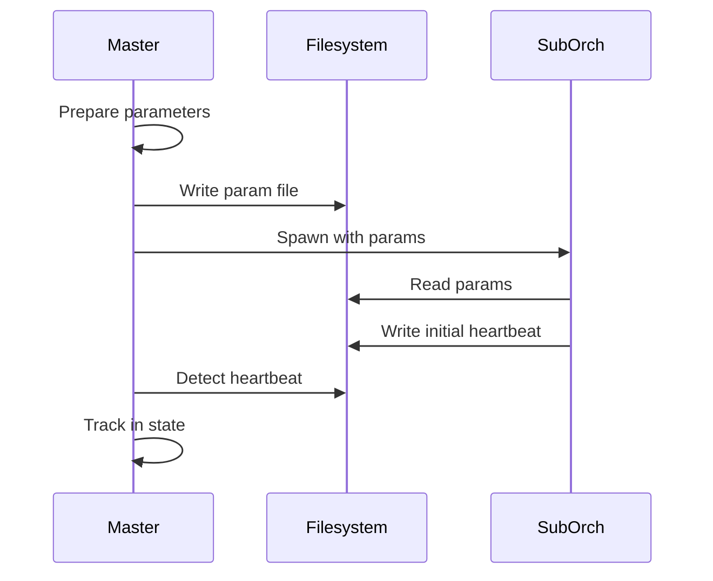
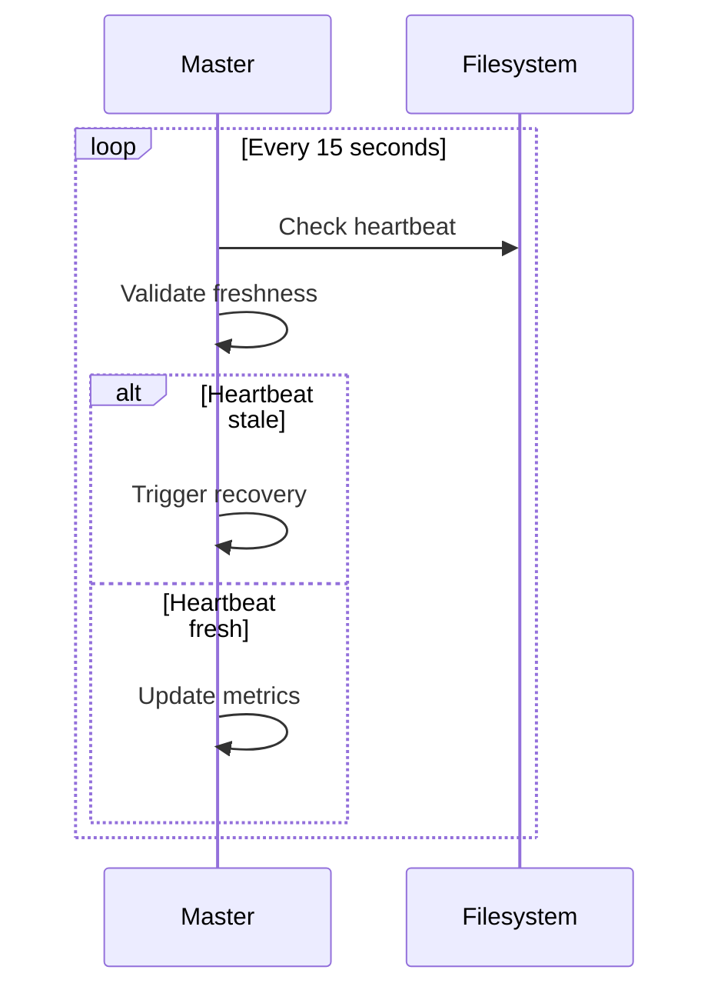
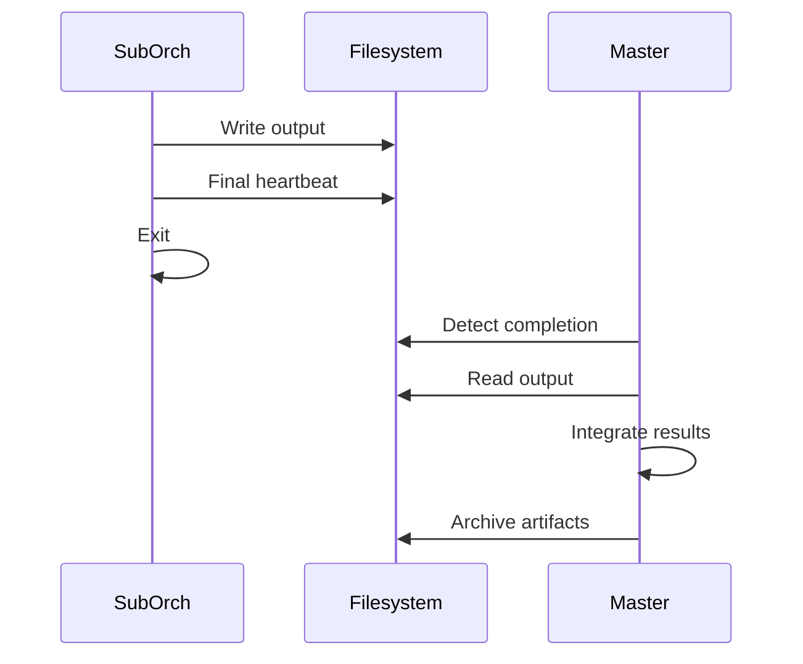

# Master-Sub Orchestrator Architecture

## Overview

The Master-Sub Orchestrator architecture enables the Software Factory to handle complex sub-state machines (FIX_CASCADE, INTEGRATION, SPLIT_COORDINATION) through independent sub-processes, ensuring scalability, fault tolerance, and clear separation of concerns.

## Architecture Principles

### 1. Process Isolation
- Each sub-orchestrator runs as an independent process
- No shared memory or direct communication between processes
- All communication through file-based contracts
- Clean process boundaries prevent cascading failures

### 2. File-Based Communication
- Parameters passed via JSON files
- Heartbeats written to designated files
- Results output to specified locations
- Checkpoints saved for recovery

### 3. Monitoring & Recovery
- Continuous heartbeat monitoring (15-second intervals)
- Automatic failure detection (2-minute timeout)
- Checkpoint-based recovery mechanisms
- Escalation procedures for systematic failures

## Component Architecture

```
┌─────────────────────────────────────────────────┐
│                MASTER ORCHESTRATOR               │
│                                                   │
│  ┌───────────┐  ┌───────────┐  ┌──────────┐    │
│  │  Spawner  │  │  Monitor  │  │ Recovery │    │
│  └─────┬─────┘  └─────┬─────┘  └────┬─────┘    │
│        │              │              │           │
│  ┌─────▼──────────────▼──────────────▼─────┐    │
│  │         Master State Management          │    │
│  └──────────────────────────────────────────┘    │
└────────────────────┬───────────────────────────┘
                     │
        ┌────────────┼────────────┐
        │            │            │
   ┌────▼────┐  ┌────▼────┐  ┌───▼─────┐
   │   FIX   │  │  INTEG  │  │  SPLIT  │
   │ CASCADE │  │  -RATION│  │  COORD  │
   └─────────┘  └─────────┘  └─────────┘
   Sub-Process  Sub-Process  Sub-Process
```

## Communication Flow

### 1. Spawning Flow


### 2. Monitoring Flow


### 3. Completion Flow


## State Management

### Master States
- `MASTER_SPAWN_SUB_ORCHESTRATOR` - Spawn a sub-orchestrator
- `MASTER_MONITOR_SUB_ORCHESTRATORS` - Monitor active subs
- `MASTER_HANDLE_SUB_COMPLETION` - Process completions
- `MASTER_RECOVER_SUB_FAILURE` - Handle failures

### Sub-Orchestrator States
Each sub-orchestrator has its own state machine:

#### FIX_CASCADE States
- `FIX_CASCADE_INIT` - Initialize fix process
- `FIX_CASCADE_SPAWN_AGENTS` - Spawn SW engineers
- `FIX_CASCADE_MONITOR_FIXES` - Monitor progress
- `FIX_CASCADE_VALIDATE` - Validate fixes
- `FIX_CASCADE_COMPLETE` - Finalize

#### INTEGRATION States
- `INTEGRATION_INIT` - Initialize integration
- `INTEGRATION_CREATE_TARGET` - Create target branch
- `INTEGRATION_MERGE_BRANCHES` - Perform merges
- `INTEGRATION_BUILD` - Build validation
- `INTEGRATION_TEST` - Test execution
- `INTEGRATION_COMPLETE` - Finalize

#### SPLIT_COORDINATION States
- `SPLIT_INIT` - Initialize split
- `SPLIT_CREATE_BRANCHES` - Create split branches
- `SPLIT_SPAWN_ENGINEER` - Spawn engineers
- `SPLIT_MEASURE_SIZE` - Validate size limits
- `SPLIT_MERGE_SPLITS` - Merge completed splits
- `SPLIT_COMPLETE` - Finalize

## Input/Output Contracts

### FIX_CASCADE Contract

**Input:**
```json
{
  "fix_id": "bug-123",
  "branches_to_fix": ["branch1", "branch2"],
  "issue_description": "Description",
  "validation_requirements": {...}
}
```

**Output:**
```json
{
  "status": "SUCCESS|FAILED|PARTIAL",
  "branches_fixed": ["branch1", "branch2"],
  "test_results": {...},
  "next_action": "CONTINUE|RETRY|ESCALATE"
}
```

### INTEGRATION Contract

**Input:**
```json
{
  "integration_type": "WAVE|PHASE|PROJECT",
  "branches_to_merge": ["effort1", "effort2"],
  "target_branch": "integration-branch",
  "validation_level": "FULL"
}
```

**Output:**
```json
{
  "status": "SUCCESS|FAILED",
  "integration_branch": "wave-1-integration",
  "merge_results": {...},
  "build_status": "SUCCESS",
  "test_status": "PASSED"
}
```

### SPLIT_COORDINATION Contract

**Input:**
```json
{
  "original_effort": "E1.1",
  "split_plan": {
    "splits": ["E1.1a", "E1.1b"],
    "dependencies": {...}
  },
  "size_limit": 700
}
```

**Output:**
```json
{
  "status": "SUCCESS|PARTIAL",
  "splits_completed": ["E1.1a", "E1.1b"],
  "line_counts": {...},
  "all_within_limit": true
}
```

## Monitoring Requirements

### Heartbeat Protocol
```json
{
  "pid": 12345,
  "status": "RUNNING|COMPLETING|FAILED",
  "progress_percentage": 75,
  "current_state": "INTEGRATION_BUILD",
  "last_update": "2025-01-21T10:30:00Z",
  "estimated_completion": "2025-01-21T10:45:00Z"
}
```

### Health Checks
- Process existence (kill -0)
- Heartbeat freshness (<2 minutes)
- Progress advancement
- Resource usage limits

### Failure Detection
| Condition | Threshold | Action |
|-----------|-----------|--------|
| No heartbeat | 2 minutes | Recovery |
| No progress | 10 minutes | Investigation |
| High memory | >2GB | Warning |
| Process dead | Immediate | Recovery |

## Recovery Strategies

### 1. Checkpoint Recovery
- Sub-orchestrators write checkpoints every 30 seconds
- On failure, can resume from last checkpoint
- Preserves completed work

### 2. Full Restart
- Used when no checkpoint available
- Starts fresh with same parameters
- Maximum 3 retry attempts

### 3. Resource-Limited Retry
- Applied when resource exhaustion detected
- Restarts with memory/CPU limits
- Prevents repeated exhaustion

### 4. Escalation
- After max retries exceeded
- Systematic failures detected
- Manual intervention required

## Implementation Guidelines

### For Master Orchestrator

1. **Spawning:**
```bash
# Prepare parameters
create_param_file "$SUB_ID" "$PARAMS"

# Spawn sub-orchestrator
claude -p . --command "/sub-orchestrate-$TYPE" \
  --params "file=/tmp/params-$SUB_ID.json" &
PID=$!

# Track in state
update_master_state "$SUB_ID" "$PID"
```

2. **Monitoring:**
```bash
# Monitor loop
while has_active_subs; do
  for SUB in $(get_active_subs); do
    check_heartbeat "$SUB"
    check_progress "$SUB"
  done
  sleep 15
done
```

3. **Completion Handling:**
```bash
# Process output
OUTPUT=$(cat "$OUTPUT_FILE")
STATUS=$(echo "$OUTPUT" | jq -r '.status')

# Update state
integrate_results "$SUB_ID" "$OUTPUT"

# Determine next action
handle_next_action "$STATUS"
```

### For Sub-Orchestrators

1. **Initialization:**
```bash
# Parse parameters
PARAMS=$(cat "$PARAM_FILE")
SUB_ID=$(echo "$PARAMS" | jq -r '.unique_id')

# Set up crash handler
trap 'handle_crash' ERR EXIT

# Write initial heartbeat
write_heartbeat "INITIALIZING"
```

2. **Execution:**
```bash
# Main loop
while [[ "$STATE" != "COMPLETE" ]]; do
  # Update heartbeat
  write_heartbeat "RUNNING" "$STATE"

  # Execute state action
  execute_state "$STATE"

  # Write checkpoint
  write_checkpoint "$STATE"

  # Transition
  STATE=$(get_next_state "$STATE")
done
```

3. **Completion:**
```bash
# Write output
write_output "$RESULTS"

# Final heartbeat
write_heartbeat "COMPLETE"

# Clean exit
exit 0
```

## Resource Management

### Limits Per Sub-Orchestrator
- Maximum runtime: 2 hours (FIX), 4 hours (INTEGRATION), 3 hours (SPLIT)
- Maximum memory: 2-4GB depending on type
- Maximum CPU: 70-90% depending on type
- Checkpoint frequency: 30 seconds

### System-Wide Limits
- Maximum concurrent sub-orchestrators: 5
- Maximum queued: 10
- Total disk usage: 1GB for artifacts
- Archive retention: 7 days

## Security Considerations

1. **Process Isolation**
   - No shared memory access
   - File permissions restricted
   - Temporary files in secure locations

2. **Input Validation**
   - All parameters validated before use
   - JSON schema validation
   - Path sanitization

3. **Resource Protection**
   - Memory limits enforced
   - CPU throttling available
   - Disk quotas applied

## Performance Optimization

1. **Parallel Execution**
   - Multiple sub-orchestrators can run concurrently
   - Independent work distributed
   - No blocking between processes

2. **Efficient Monitoring**
   - Lightweight heartbeat checks
   - Batch status updates
   - Minimal file I/O

3. **Smart Recovery**
   - Checkpoint-based resume
   - Incremental progress preservation
   - Avoid redundant work

## Troubleshooting Guide

### Common Issues

1. **Heartbeat Stale**
   - Check if process still running
   - Verify file permissions
   - Check disk space

2. **Recovery Loop**
   - Examine failure pattern
   - Check for systematic issues
   - Consider escalation

3. **Resource Exhaustion**
   - Monitor system resources
   - Apply stricter limits
   - Consider splitting work further

### Debugging Tools

```bash
# Check sub-orchestrator status
ps aux | grep "sub-orchestrate"

# Monitor heartbeat
watch -n 5 "cat /tmp/sub-*/heartbeat.json | jq"

# View logs
tail -f /tmp/sub-*.log

# Check resource usage
top -p $PID
```

## Rules Compliance

This architecture implements:
- **R377**: Master-Sub Communication Protocol
- **R378**: Sub-Orchestrator Lifecycle Management
- **R379**: Sub-Process Monitoring and Recovery
- **R313**: Mandatory Stop After Spawn
- **R206**: State Machine Validation

## Future Enhancements

1. **Distributed Execution**
   - Support for remote sub-orchestrators
   - Network-based communication option
   - Cloud-native deployment

2. **Advanced Monitoring**
   - Real-time dashboard
   - Predictive failure detection
   - Performance analytics

3. **Enhanced Recovery**
   - Machine learning for failure patterns
   - Automatic strategy selection
   - Self-healing capabilities

---

**Version**: 1.0.0
**Last Updated**: 2025-01-21
**Maintained By**: Software Factory Manager