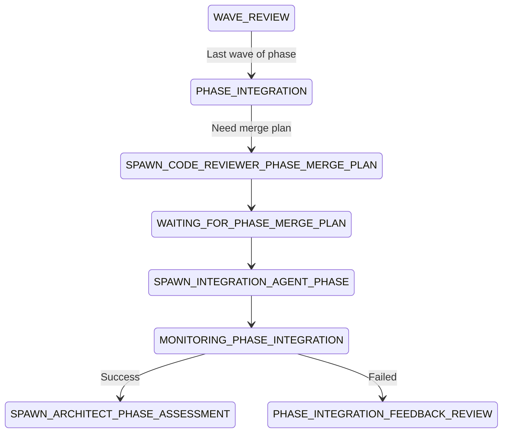

# PHASE INTEGRATION FLOW ANALYSIS - CRITICAL ISSUE IDENTIFIED

## 🔴🔴🔴 CRITICAL PROBLEM: PHASE INTEGRATION MISSING FROM NORMAL FLOW 🔴🔴🔴

### THE ISSUE
The user correctly identified a logical problem in the state machine flow:

**Current Flow (INCORRECT):**
```
WAVE_REVIEW (last wave) → SPAWN_ARCHITECT_PHASE_ASSESSMENT → Phase Assessment on INDIVIDUAL waves
```

**Expected Flow (LOGICAL):**
```
WAVE_REVIEW (last wave) → PHASE_INTEGRATION → SPAWN_ARCHITECT_PHASE_ASSESSMENT → Phase Assessment on INTEGRATED phase
```

## CURRENT STATE MACHINE ANALYSIS

### 1. PHASE_INTEGRATION State EXISTS But Only for ERROR_RECOVERY

The `PHASE_INTEGRATION` state was added (per R259 and PHASE-INTEGRATION-STATE-IMPLEMENTATION.md) but ONLY in the error recovery flow:

```
ERROR_RECOVERY → PHASE_INTEGRATION → SPAWN_ARCHITECT_PHASE_ASSESSMENT
```

This means:
- ✅ Phase integration happens AFTER failed assessment (for fixes)
- ❌ Phase integration MISSING for normal successful wave completions
- ❌ Architect assesses unintegrated waves in the normal flow

### 2. Wave Integration vs Phase Integration Inconsistency

**Wave Level (CORRECT):**
```
WAVE_COMPLETE → INTEGRATION → MONITORING_INTEGRATION → WAVE_REVIEW
```
- Waves are integrated BEFORE architect review
- Architect reviews integrated wave branch

**Phase Level (INCORRECT):**
```
WAVE_REVIEW (last) → SPAWN_ARCHITECT_PHASE_ASSESSMENT
```
- NO integration step before phase assessment
- Architect assesses individual wave branches, not integrated phase

### 3. The Logical Problem

The architect cannot properly assess a phase without seeing:
1. How all waves integrate together
2. Conflicts resolved between waves
3. Phase-level tests passing
4. Integrated codebase behavior

Currently, the architect would be assessing:
- Multiple separate wave branches
- No guarantee they work together
- No phase-level integration testing

## REQUIRED STATE MACHINE CHANGES

### Option 1: Add PHASE_INTEGRATION to Normal Flow (RECOMMENDED)



### Option 2: Use PHASE_COMPLETE for Integration (LESS CLEAR)

Rename/repurpose `PHASE_COMPLETE` to handle integration:
```
WAVE_REVIEW (last) → PHASE_COMPLETE (does integration) → SPAWN_ARCHITECT_PHASE_ASSESSMENT
```

But this is confusing because "COMPLETE" implies done, not "integrating".

## IMPACT ANALYSIS

### If We Don't Fix This:
1. **Architect Cannot Properly Assess**: Reviews disconnected waves
2. **Integration Issues Missed**: Problems only found after assessment
3. **Logical Inconsistency**: Wave review gets integration, phase review doesn't
4. **Quality Risk**: Phase might not work as integrated whole

### If We Fix This:
1. **Consistent Pattern**: Both waves and phases integrate before review
2. **Proper Assessment**: Architect reviews actual integrated phase
3. **Early Problem Detection**: Integration issues found before assessment
4. **Logical Flow**: Test integrated whole before declaring success

## EVIDENCE FROM EXISTING DOCUMENTATION

### From SOFTWARE-FACTORY-STATE-MACHINE.md:

Line 145-150 describes PHASE_COMPLETE responsibilities:
```markdown
**PHASE_COMPLETE State Responsibilities:**
- Create phase-level integration branch
- Document all phase achievements
- Prepare phase completion report
- Determine if more phases exist
```

This suggests PHASE_COMPLETE was intended to do integration, but:
1. The state comes AFTER assessment (line 394)
2. It transitions directly to CREATE_INTEGRATION_TESTING or INIT
3. No merge plan or integration agent spawning

### From PHASE-INTEGRATION-ANALYSIS.md:

The analysis confirms phase integration is MANDATORY but doesn't address that it's missing from the normal flow.

### From R282 (Phase Integration Protocol):

States phase integration MUST occur in isolated workspace, but the rule seems to assume ERROR_RECOVERY context only.

## RECOMMENDED SOLUTION

### 1. Modify State Machine Flow

**Change FROM:**
```
WAVE_REVIEW → SPAWN_ARCHITECT_PHASE_ASSESSMENT (last wave)
```

**Change TO:**
```
WAVE_REVIEW → PHASE_INTEGRATION (last wave)
PHASE_INTEGRATION → SPAWN_CODE_REVIEWER_PHASE_MERGE_PLAN
SPAWN_CODE_REVIEWER_PHASE_MERGE_PLAN → WAITING_FOR_PHASE_MERGE_PLAN
WAITING_FOR_PHASE_MERGE_PLAN → SPAWN_INTEGRATION_AGENT_PHASE
SPAWN_INTEGRATION_AGENT_PHASE → MONITORING_PHASE_INTEGRATION
MONITORING_PHASE_INTEGRATION → SPAWN_ARCHITECT_PHASE_ASSESSMENT (success)
MONITORING_PHASE_INTEGRATION → PHASE_INTEGRATION_FEEDBACK_REVIEW (failed)
```

### 2. Update PHASE_INTEGRATION State

Make it handle BOTH:
- Normal flow (integrating completed waves)
- Error recovery flow (integrating fixes)

### 3. Update Related States

- **WAVE_REVIEW**: Add logic to transition to PHASE_INTEGRATION when last wave
- **PHASE_COMPLETE**: Remove integration responsibilities (happens earlier now)
- **SPAWN_ARCHITECT_PHASE_ASSESSMENT**: Expect integrated branch, not separate waves

### 4. Create New Rule

**R284**: Mandatory Phase Integration Before Assessment
- Phase integration MUST occur before architect assessment
- Applies to both normal flow and error recovery
- Architect reviews integrated phase branch, not individual waves

## VERIFICATION NEEDED

1. Check if any existing implementations assume current (broken) flow
2. Verify integration agent can handle phase-level merges
3. Ensure phase merge plan templates exist
4. Update all agent configs to understand new flow

## CONCLUSION

The user is CORRECT - there's a critical gap in the state machine. Phase integration should happen BEFORE phase assessment, not after. The current flow has the architect assessing unintegrated waves, which defeats the purpose of integration testing and validation.

This needs immediate correction to ensure:
1. Logical consistency with wave-level pattern
2. Proper phase assessment on integrated code
3. Early detection of integration issues
4. Compliance with software engineering best practices

## PRIORITY: 🔴 CRITICAL

This is a fundamental architectural issue that affects the entire phase completion flow. It should be fixed before any production use of the Software Factory 2.0 system.