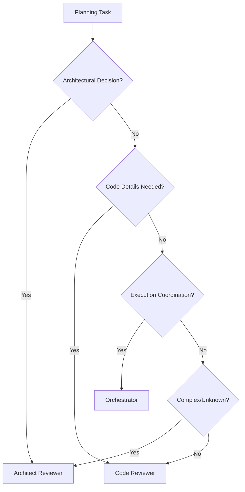

# Planning Agent Assignments

## Who Creates What: Agent Responsibilities in Planning

### Overview

The planning process involves multiple specialized agents, each responsible for different aspects of the plan. This document clarifies which agent should handle each planning task.

## Planning Stages and Agent Assignments

### Stage 1: High-Level Implementation Plan
**Responsible Agent**: @agent-architect-reviewer  
**Alternative**: @agent-code-reviewer (as Project Maintainer)

**Creates**:
- Overall phase structure
- Wave organization within phases
- Effort breakdown within waves
- Dependency mapping between phases
- Branch naming conventions
- Merge strategy

**Document Produced**: 
- `PROJECT-IMPLEMENTATION-PLAN.md`

**Key Responsibilities**:
- Architectural decisions
- Technology stack alignment
- Risk assessment
- Critical path identification

---

### Stage 2: Detailed Phase-Specific Plans
**Responsible Agent**: @agent-code-reviewer (Project Maintainer role)  
**Alternative**: @agent-architect-reviewer (for complex architectural phases)

**Creates**:
- Detailed requirements for each effort
- TDD test specifications
- Pseudo-code implementation guides
- Source branch identification
- Commit cherry-picking instructions
- Validation commands

**Documents Produced**:
- `PHASE1-SPECIFIC-IMPL-PLAN.md`
- `PHASE2-SPECIFIC-IMPL-PLAN.md`
- `PHASE3-SPECIFIC-IMPL-PLAN.md`
- etc.

**Key Responsibilities**:
- Code reuse identification
- Test coverage requirements
- Implementation approach
- Size estimation and split planning

---

### Stage 3: Plan Validation and Enhancement
**Responsible Agent**: @agent-architect-reviewer

**Reviews and Enhances**:
- Completeness of requirements
- Adequacy of test coverage
- Clarity of implementation instructions
- Feasibility of size estimates

**Documents Produced**:
- Enhancement documents
- Validation requirements
- Additional clarifications

**Key Responsibilities**:
- Gap identification
- Risk mitigation
- Cross-phase consistency
- Quality gate definition

---

### Stage 4: Execution Planning
**Responsible Agent**: @agent-orchestrator-task-master

**Creates**:
- Execution sequence
- Agent task assignments
- State management plan
- Progress tracking structure

**Documents Produced**:
- `orchestrator-state.yaml`
- `ORCHESTRATOR-TASKMASTER-EXECUTION-PLAN.md`

**Key Responsibilities**:
- Agent coordination
- State machine management
- Progress tracking
- Integration coordination

---

## Decision Tree for Agent Selection



## Agent Selection Guidelines

### Use @agent-architect-reviewer When:
- Defining overall system architecture
- Making technology stack decisions
- Identifying major components and boundaries
- Assessing architectural risks
- Reviewing phase completeness
- Validating cross-cutting concerns

### Use @agent-code-reviewer When:
- Creating detailed implementation specifications
- Identifying code reuse opportunities
- Writing test requirements
- Defining coding standards
- Planning effort splits
- Reviewing implementation quality

### Use @agent-orchestrator-task-master When:
- Coordinating multiple agents
- Managing execution state
- Tracking progress
- Handling integration
- Managing dependencies during execution
- Responding to execution issues

## Collaborative Planning Scenarios

### Scenario 1: New Project Planning
1. **Architect** creates high-level structure
2. **Code Reviewer** details each phase
3. **Architect** validates completeness
4. **Orchestrator** prepares execution

### Scenario 2: Existing Code Migration
1. **Code Reviewer** analyzes existing codebase
2. **Architect** designs migration strategy
3. **Code Reviewer** creates detailed migration plans
4. **Orchestrator** manages phased migration

### Scenario 3: Feature Addition
1. **Code Reviewer** assesses impact
2. **Architect** approves approach (if architectural impact)
3. **Code Reviewer** creates implementation plan
4. **Orchestrator** integrates with existing work

## Planning Quality Checklist

### For Architect-Created Plans:
- [ ] Architecture is sound and scalable
- [ ] Technology choices are justified
- [ ] Risks are identified and mitigated
- [ ] Dependencies are properly mapped
- [ ] Integration points are defined

### For Code Reviewer-Created Plans:
- [ ] Implementation details are explicit
- [ ] Test cases are comprehensive
- [ ] Code reuse is maximized
- [ ] Size estimates are realistic
- [ ] Validation steps are clear

### For Orchestrator Execution Plans:
- [ ] All efforts are assigned
- [ ] Dependencies are respected
- [ ] State transitions are defined
- [ ] Progress tracking is enabled
- [ ] Recovery procedures exist

## Common Anti-Patterns to Avoid

### ❌ Wrong Agent for Task
- Don't have Orchestrator create implementation details
- Don't have SW Engineer create architectural plans
- Don't have Architect write detailed test cases

### ❌ Insufficient Detail
- Vague requirements like "implement feature"
- Missing test specifications
- No validation commands
- Unclear success criteria

### ❌ Over-Planning
- Excessive detail that constrains implementation
- Rigid specifications that don't allow optimization
- Planning for unlikely scenarios

### ✅ Best Practices

1. **Right Agent for Right Task**: Match agent expertise to planning needs
2. **Iterative Refinement**: Start high-level, add detail progressively
3. **Code Reuse First**: Always check for existing implementations
4. **Explicit Over Implicit**: Clear instructions prevent ambiguity
5. **Validation at Each Stage**: Review plans before execution

## Planning Communication Flow

```
Architect ──────► High-Level Plan
     │                  │
     │                  ▼
     │            Code Reviewer
     │                  │
     │                  ▼
     │          Detailed Phase Plans
     │                  │
     ▼                  ▼
Validation ◄──────── Review
     │
     ▼
Orchestrator ──────► Execution Plan
     │
     ▼
SW Engineers ◄────── Task Assignment
```

## Summary

Effective planning requires the right agent for each task:
- **Architects** shape the system
- **Code Reviewers** detail the implementation  
- **Orchestrators** coordinate execution
- **SW Engineers** implement the plans

By following these assignments, the planning process produces clear, actionable, and achievable implementation plans.