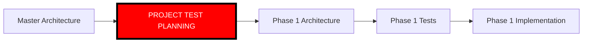
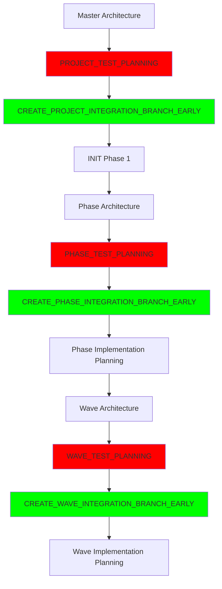

# PROJECT-LEVEL TESTING AND STORAGE SOLUTION

## Executive Summary

This document provides comprehensive recommendations for:
1. **Project-level testing timing and ownership**
2. **Test storage strategy across all phases**
3. **State machine modifications needed**
4. **Implementation approach**

## PART 1: PROJECT-LEVEL TESTING TIMING

### Current State Analysis

The system currently enforces Test-Driven Development (TDD) via R341:
- **Phase tests**: Created AFTER phase architecture, BEFORE phase implementation
- **Wave tests**: Created AFTER wave architecture, BEFORE wave implementation
- **Missing**: Project-level tests that validate cross-phase integration

### Recommendation: Project-Level Testing

#### When to Create Project-Level Tests

**TIMING: After Master Architecture, Before Phase 1 Planning**



**Rationale:**
1. Master architecture defines system-wide behaviors that need testing
2. Project tests define success criteria for entire system
3. These tests guide phase planning to ensure coverage
4. Early creation allows phases to reference project-level requirements

#### Who Creates Project-Level Tests

**OWNER: Code Reviewer in new PROJECT_TEST_PLANNING state**

```yaml
new_state: PROJECT_TEST_PLANNING
agent: code-reviewer
trigger: Master architecture complete
deliverables:
  - PROJECT-TEST-PLAN.md
  - PROJECT-TEST-HARNESS.sh
  - tests/project/*.test.* (actual test files)
  - PROJECT-DEMO-SCENARIOS.md
```

#### What Project-Level Tests Cover

```markdown
## Project-Level Test Scope

### 1. Cross-Phase Integration Tests
- Phase 1 APIs consumed by Phase 2
- Data flow between phases
- Shared resource access patterns

### 2. End-to-End System Tests
- Complete user workflows spanning phases
- System initialization and teardown
- Multi-component orchestration

### 3. System-Level Performance Tests
- Overall system throughput
- Resource utilization under load
- Scalability testing

### 4. System Security Tests
- Authentication flow across phases
- Authorization boundary testing
- Security scanning of integrated system

### 5. Deployment and Operations Tests
- System deployment validation
- Configuration management
- Monitoring and alerting
```

## PART 2: TEST STORAGE SOLUTION

### The Problem

Tests are created BEFORE integration branches exist:
- Project tests created → No project integration branch yet
- Phase tests created → No phase integration branch yet
- Wave tests created → No wave integration branch yet

But tests NEED to be in integration branches for validation.

### Recommendation: Option E - Early Integration Branch Creation

**CREATE INTEGRATION BRANCHES IMMEDIATELY AFTER TEST PLANNING**

This is the cleanest solution that solves all problems:

```bash
# New Flow
1. Architecture Complete
2. Test Planning (creates tests)
3. CREATE INTEGRATION BRANCH (new step)
4. Store tests IN integration branch
5. Implementation Planning (references tests)
6. Implementation (targets tests)
7. Integration (uses existing branch with tests)
```

#### Implementation Details

##### 1. Project-Level Test Storage

```bash
# After PROJECT_TEST_PLANNING state completes
create_project_integration_branch_early() {
    # Create branch immediately after tests are written
    cd /efforts/project/integration-workspace
    git clone $TARGET_REPO
    cd $TARGET_REPO_NAME
    
    # Create project-integration branch
    git checkout -b project-integration
    
    # Add project tests
    mkdir -p tests/project
    cp $CLAUDE_PROJECT_DIR/project-tests/* tests/project/
    
    # Commit tests to integration branch
    git add tests/project
    git commit -m "test: add project-level tests (TDD)"
    git push -u origin project-integration
    
    # Branch now exists with tests, ready for later integration
}
```

##### 2. Phase-Level Test Storage

```bash
# After PHASE_TEST_PLANNING state completes
create_phase_integration_branch_early() {
    local PHASE=$1
    
    # R308: Use previous phase as base (or main for phase 1)
    local BASE_BRANCH=$(get_phase_base_branch $PHASE)
    
    # Create phase integration branch
    cd /efforts/phase${PHASE}/integration-workspace
    git checkout -b phase-${PHASE}-integration $BASE_BRANCH
    
    # Add phase tests
    mkdir -p tests/phase${PHASE}
    cp $CLAUDE_PROJECT_DIR/phase-tests/phase-${PHASE}/* tests/phase${PHASE}/
    
    # Commit tests
    git add tests/phase${PHASE}
    git commit -m "test: add phase ${PHASE} tests (TDD)"
    git push -u origin phase-${PHASE}-integration
}
```

##### 3. Wave-Level Test Storage

```bash
# After WAVE_TEST_PLANNING state completes
create_wave_integration_branch_early() {
    local PHASE=$1
    local WAVE=$2
    
    # R308: Use previous wave as base (or phase base for wave 1)
    local BASE_BRANCH=$(get_wave_base_branch $PHASE $WAVE)
    
    # Create wave integration branch
    cd /efforts/phase${PHASE}/wave${WAVE}/integration-workspace
    git checkout -b phase-${PHASE}-wave-${WAVE}-integration $BASE_BRANCH
    
    # Add wave tests
    mkdir -p tests/phase${PHASE}/wave${WAVE}
    cp $CLAUDE_PROJECT_DIR/wave-tests/phase-${PHASE}/wave-${WAVE}/* \
       tests/phase${PHASE}/wave${WAVE}/
    
    # Commit tests
    git add tests/phase${PHASE}/wave${WAVE}
    git commit -m "test: add phase ${PHASE} wave ${WAVE} tests (TDD)"
    git push -u origin phase-${PHASE}-wave-${WAVE}-integration
}
```

### Benefits of Early Integration Branch Creation

1. **Tests are immediately tracked in git**
2. **Tests are in the correct branch from the start**
3. **No duplication or synchronization issues**
4. **Integration branches ready when needed**
5. **Clear test ownership and location**
6. **Follows R308 incremental branching**

## PART 3: STATE MACHINE MODIFICATIONS

### New States Required

#### 1. PROJECT_TEST_PLANNING State

```yaml
state: PROJECT_TEST_PLANNING
agent: orchestrator
action: Spawn Code Reviewer to create project tests
transition_from: WAITING_FOR_MASTER_ARCHITECTURE
transition_to: CREATE_PROJECT_INTEGRATION_BRANCH_EARLY
```

#### 2. CREATE_PROJECT_INTEGRATION_BRANCH_EARLY State

```yaml
state: CREATE_PROJECT_INTEGRATION_BRANCH_EARLY
agent: orchestrator
action: Create project-integration branch with tests
transition_from: PROJECT_TEST_PLANNING
transition_to: INIT (start Phase 1)
```

#### 3. CREATE_PHASE_INTEGRATION_BRANCH_EARLY State

```yaml
state: CREATE_PHASE_INTEGRATION_BRANCH_EARLY
agent: orchestrator
action: Create phase-N-integration branch with tests
transition_from: WAITING_FOR_PHASE_TEST_PLAN
transition_to: SPAWN_CODE_REVIEWER_PHASE_IMPL
```

#### 4. CREATE_WAVE_INTEGRATION_BRANCH_EARLY State

```yaml
state: CREATE_WAVE_INTEGRATION_BRANCH_EARLY
agent: orchestrator
action: Create phase-N-wave-M-integration branch with tests
transition_from: WAITING_FOR_WAVE_TEST_PLAN
transition_to: SPAWN_CODE_REVIEWER_WAVE_IMPL
```

### Modified Flow



## PART 4: TEST ORGANIZATION STRUCTURE

### Recommended Directory Structure

```
target-repository/
├── tests/
│   ├── project/                    # Project-level tests
│   │   ├── test_e2e_workflows.js
│   │   ├── test_cross_phase.py
│   │   ├── test_system_perf.sh
│   │   └── PROJECT-TEST-HARNESS.sh
│   │
│   ├── phase1/                     # Phase 1 tests
│   │   ├── test_phase1_core.js
│   │   ├── test_phase1_api.py
│   │   ├── PHASE-1-TEST-HARNESS.sh
│   │   │
│   │   ├── wave1/                  # Phase 1, Wave 1 tests
│   │   │   ├── test_feature_a.js
│   │   │   └── WAVE-1-TEST-HARNESS.sh
│   │   │
│   │   └── wave2/                  # Phase 1, Wave 2 tests
│   │       ├── test_feature_b.js
│   │       └── WAVE-2-TEST-HARNESS.sh
│   │
│   └── phase2/                     # Phase 2 tests
│       ├── test_phase2_core.js
│       ├── PHASE-2-TEST-HARNESS.sh
│       │
│       └── wave1/                  # Phase 2, Wave 1 tests
│           └── test_feature_c.js
```

### Test Execution Hierarchy

```bash
# Project Test Harness runs ALL tests
./tests/project/PROJECT-TEST-HARNESS.sh
  → Runs all phase harnesses
  → Runs project-specific tests
  → Generates comprehensive report

# Phase Test Harness runs phase + wave tests
./tests/phase1/PHASE-1-TEST-HARNESS.sh
  → Runs all wave harnesses
  → Runs phase-specific tests
  → Generates phase report

# Wave Test Harness runs wave tests
./tests/phase1/wave1/WAVE-1-TEST-HARNESS.sh
  → Runs wave-specific tests
  → Generates wave report
```

## PART 5: IMPLEMENTATION ROADMAP

### Phase 1: Core Changes

1. **Add new states to state machine**
   - PROJECT_TEST_PLANNING
   - CREATE_*_INTEGRATION_BRANCH_EARLY states

2. **Update R341 to include project-level testing**
   - Add project test requirements
   - Define project test scope

3. **Create new rule R342 for early branch creation**
   - Define when to create integration branches
   - Specify test storage requirements

### Phase 2: Agent Updates

1. **Update Orchestrator**
   - Handle new states
   - Create integration branches early
   - Track test locations

2. **Update Code Reviewer**
   - Add PROJECT_TEST_PLANNING capability
   - Generate project test templates
   - Create test harnesses

3. **Update Integration Agent**
   - Expect tests to already exist in branches
   - Run existing harnesses
   - Report results

### Phase 3: Tooling Support

1. **Create test template generators**
2. **Add test location tracking**
3. **Update line counter to exclude tests**
4. **Create test coverage aggregator**

## PART 6: BENEFITS OF THIS APPROACH

### 1. Clear Test Ownership
- Project tests → Created after master architecture
- Phase tests → Created after phase architecture
- Wave tests → Created after wave architecture
- Effort tests → Created during implementation

### 2. Git Tracking From Start
- Tests committed immediately after creation
- Full version history maintained
- No orphaned test files

### 3. Simplified Integration
- Integration branches already contain tests
- No need to copy/sync tests
- Tests run from their permanent location

### 4. TDD Compliance
- Tests exist before implementation (R341)
- Clear success criteria at every level
- No retrospective test writing

### 5. Reduced Complexity
- Single location for each test level
- No temporary storage needed
- Clear migration path

## PART 7: MIGRATION STRATEGY

### For Existing Projects

1. **Identify current test locations**
2. **Create integration branches if missing**
3. **Move tests to correct branches**
4. **Update harnesses to new paths**
5. **Verify all tests still run**

### For New Projects

1. **Follow new state flow from start**
2. **Create integration branches early**
3. **Store tests immediately in branches**
4. **Use new directory structure**

## CONCLUSION

### Recommendations Summary

1. **Project-Level Testing**
   - Create AFTER master architecture
   - Create BEFORE phase 1 planning
   - Owner: Code Reviewer
   - State: PROJECT_TEST_PLANNING

2. **Test Storage Solution**
   - Use Option E: Early Integration Branch Creation
   - Create integration branches immediately after test planning
   - Store tests directly in integration branches
   - No temporary storage or duplication

3. **Benefits**
   - Clean, simple approach
   - Immediate git tracking
   - No synchronization issues
   - Follows TDD principles
   - Minimal state machine changes

4. **Implementation Priority**
   - HIGH: Implement for all new projects
   - MEDIUM: Migrate existing projects gradually
   - Update documentation and training

This solution provides a clean, maintainable approach to test management that aligns with Software Factory 2.0's principles while solving the core timing and storage challenges.