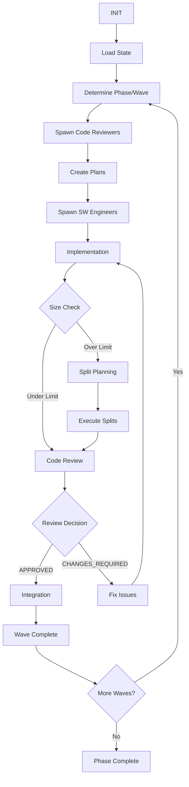

# Software Factory 2.0 Template

## 📦 System Requirements

Before running Software Factory 2.0, ensure you have all required dependencies installed:

### Required Tools
- **yq** (v4.30+) - YAML processor for state management
  - Used for reading/writing orchestrator-state.json
  - Critical for state machine operations
- **git** (v2.25+) - Version control for state persistence
  - R288 compliance requires immediate commit/push
  - Must be configured with user.name and user.email
- **jq** (v1.6+) - JSON processor for configuration
  - Used for parsing agent configurations
  - Required for hook processing
- **bash** (v4.4+) - Shell for orchestration scripts
  - All orchestration scripts require bash 4.4+ features
  - Array support and advanced string manipulation
- **curl** - For downloading dependencies
  - Used by installation scripts
  - Required for fetching external tools
- **gh** (GitHub CLI) - For PR creation and GitHub operations
  - Required for creating pull requests
  - Must be authenticated with `gh auth login`

### Optional but Recommended
- **ripgrep** (rg) - Fast file searching
  - 100x faster than grep for large codebases
  - Used by agents for code analysis
- **fd** - Modern find alternative
  - Faster and more intuitive than find
  - Used for locating effort directories
- **tree** - Directory structure visualization
  - Helpful for debugging directory layouts
  - Used in verification scripts
- **make** - Build automation (if using Makefiles)
  - Required if your project uses Makefiles
  - Used for running tests and builds

### System Requirements
- **OS**: Linux (Ubuntu 20.04+, RHEL 8+, Alpine) or macOS 11+
- **Disk Space**: 500MB for Software Factory + space for target repo clones
- **Memory**: 2GB RAM minimum
- **Permissions**: 
  - Write access to `/efforts/` directory for code work
  - Git push access to target repository
  - GitHub token with repo scope (for PR creation)

### Quick Install
```bash
# Check requirements
./utilities/check-requirements.sh

# Install missing requirements (supports apt, brew, yum)
./utilities/install-requirements.sh

# Create /efforts directory (may require sudo)
sudo mkdir -p /efforts
sudo chown $USER:$USER /efforts
```

### Manual Installation

#### yq (YAML processor)
```bash
# macOS
brew install yq

# Linux (binary)
wget https://github.com/mikefarah/yq/releases/latest/download/yq_linux_amd64 -O /usr/local/bin/yq
chmod +x /usr/local/bin/yq

# Verify
yq --version
```

#### GitHub CLI
```bash
# macOS
brew install gh

# Ubuntu/Debian
curl -fsSL https://cli.github.com/packages/githubcli-archive-keyring.gpg | sudo dd of=/usr/share/keyrings/githubcli-archive-keyring.gpg
echo "deb [arch=$(dpkg --print-architecture) signed-by=/usr/share/keyrings/githubcli-archive-keyring.gpg] https://cli.github.com/packages stable main" | sudo tee /etc/apt/sources.list.d/github-cli.list > /dev/null
sudo apt update && sudo apt install gh

# Authenticate
gh auth login
```

### Docker Option

If you prefer a containerized environment with all dependencies pre-installed:

```bash
# Build and run with Docker Compose
docker-compose up -d
docker-compose exec software-factory bash

# Or build and run with Docker directly
docker build -t software-factory:2.0 .
docker run -it -v $(pwd):/workspace -v sf-efforts:/efforts software-factory:2.0

# Inside container, run setup
./setup.sh
```

The Docker image includes all required and optional tools:
- ✅ All required tools (yq, git, jq, bash, curl, gh)
- ✅ All optional tools (ripgrep, fd, tree, make)
- ✅ Pre-configured /efforts directory
- ✅ Non-root user with sudo access

## 🚀 Quick Start

Run the interactive setup script to create your own Software Factory 2.0 project:

```bash
# First, ensure all requirements are installed
./utilities/install-requirements.sh

# Then run setup
./setup.sh
```

The setup wizard will guide you through:
1. **Project Information** - Name, description, target directory
2. **Technology Stack** - Programming language and frameworks
3. **Agent Configuration** - Which agents you need and their expertise
4. **Implementation Planning** - Generate or provide your own plan
5. **Development Constraints** - Size limits, parallelization, security

## 📋 What is Software Factory 2.0?

Software Factory 2.0 is an advanced AI agent orchestration system that manages complex software development projects through:

- **State Machine Driven Development** - Predictable, recoverable workflows
- **Multi-Agent Orchestration** - Specialized agents for different tasks
- **Automatic Size Management** - Never exceed line limits with automatic splitting
- **Context Recovery** - Survive interruptions and context loss
- **Grading System** - Performance metrics for continuous improvement
- **Pre-flight Checks** - Ensure correct environment before work begins

## 🤖 Available Agents

### Orchestrator (Required)
- Manages overall workflow and state machine
- Spawns other agents based on current needs
- Tracks progress and manages integrations
- **Never writes code** - only coordinates

### Software Engineer
- Implements features according to plans
- Maintains work logs and Git hygiene
- Monitors size limits continuously
- Handles splits when needed

### Code Reviewer
- Creates implementation plans
- Reviews code for quality and compliance
- Plans splits for oversized efforts
- Validates test coverage

### Architect
- Reviews architectural integrity
- Assesses phase transitions
- Makes PROCEED/CHANGES_REQUIRED decisions
- Ensures system-wide consistency

## 🎯 Key Features

### Pre-Flight Checks
Every agent starts with mandatory environment verification:
```yaml
✓ Agent identity confirmation
✓ Working directory verification  
✓ Git branch validation
✓ Remote tracking status
✓ Rule acknowledgment
```

### Automatic Size Management
- Continuous monitoring every 200 lines
- Automatic split planning when approaching limits
- Sequential split execution
- Integration after successful splits

### Context Recovery
- PreCompact hook creates marker file automatically
- TODO preservation across sessions
- State machine checkpoint system
- Recovery assistant for interrupted work

### Grading System
Performance metrics tracked for:
- Parallel spawn timing (<5s requirement)
- Code review first-try success rate
- Integration success rate
- Size compliance rate

## 📁 Project Structure

```
your-project/
├── rule-library/          # Rule definitions and registry
├── .claude/
│   ├── commands/          # Slash commands for agents
│   ├── agents/            # Agent configurations (SF 2.0)
│   └── settings.json      # Hooks and context management
├── agent-states/          # State-specific rules and grading
├── expertise/             # Domain expertise modules
├── utilities/             # Manual state preservation scripts
├── quick-reference/       # Quick reference guides
├── todos/                 # TODO state preservation
├── efforts/              # Individual effort branches
└── orchestrator-state.json # Current state tracking
```

## 🔧 Configuration

### project-config.yaml
Created by setup script with your choices:
```yaml
project:
  name: "your-project"
  language: "Go"
  
technology_stack:
  - Kubernetes/KCP
  - gRPC
  
constraints:
  max_lines_per_effort: 800
  test_coverage_target: 80
```

### orchestrator-state.json
Tracks current progress:
```yaml
current_phase: 1
current_wave: 2
current_state: SPAWN_AGENTS

efforts_completed: [...]
efforts_in_progress: [...]
```

## 📚 Available Commands

### Agent Commands
- `/continue-orchestrating` - Resume orchestration
- `/continue-implementing` - Resume implementation
- `/continue-reviewing` - Resume code review
- `/continue-architecting` - Resume architecture review

### System Commands
- `/check-status` - Comprehensive status check
- `/reset-state` - Reset state (3 safety levels)

## 🚨 Critical Rules

1. **Never exceed size limits** - Automatic enforcement at 800 lines
2. **Always maintain test coverage** - Configurable target (default 80%)
3. **Orchestrator never writes code** - Only coordinates
4. **Sequential split execution** - Never parallel splits
5. **Pre-flight checks mandatory** - Agents exit on wrong environment

## 🔄 Workflow



## 🛠️ Customization

### Adding Custom Expertise
1. Add expertise modules to `expertise/`
2. Update agent configurations in `.claude/agents/`
3. Reference in `project-config.yaml`

### Custom Line Counter
For language-specific line counting:
```bash
cp tools/line-counter.sh tools/my-counter.sh
# Edit to exclude your language's generated files
```

### Custom Grading Metrics
Edit grading files in `agent-states/*/GRADING/grading.md`

## 🆘 Troubleshooting

### Context Loss Recovery
1. Run `/check-status` to assess situation
2. Check `utilities/recovery-assistant.sh`
3. Load TODO state from `todos/`
4. Resume with appropriate `/continue-*` command

### Size Violations
1. Stop implementation immediately
2. Run line counter to verify
3. Plan splits with Code Reviewer
4. Execute splits sequentially

### Integration Conflicts
1. Architect reviews conflicts
2. Create resolution branch
3. Fix conflicts with SW Engineer
4. Re-run integration

## 📖 Documentation

- **Quick Reference**: `quick-reference/` - Agent-specific quick guides
- **Expertise Modules**: `expertise/` - Domain knowledge
- **State Machines**: `state-machines/` - Complete workflows
- **Rule Library**: `rule-library/` - All rules with IDs
- **State Machine Requests**: `HOW-TO-REQUEST-STATE-MACHINES.md` - Guide for requesting new state machines
- **Request Examples**: `examples/state-machine-requests/` - Successful request examples
- **Request Template**: `templates/STATE-MACHINE-REQUEST-TEMPLATE.md` - Template for new requests

## 🤝 Contributing

To contribute to Software Factory 2.0:
1. Follow the state machine workflow
2. Maintain size limits strictly
3. Document new rules in rule library
4. Update grading metrics
5. Test context recovery

## 📄 License

This template is provided as-is for use in AI-assisted software development projects.

---

**Ready to start?** Run `./setup.sh` and follow the wizard!