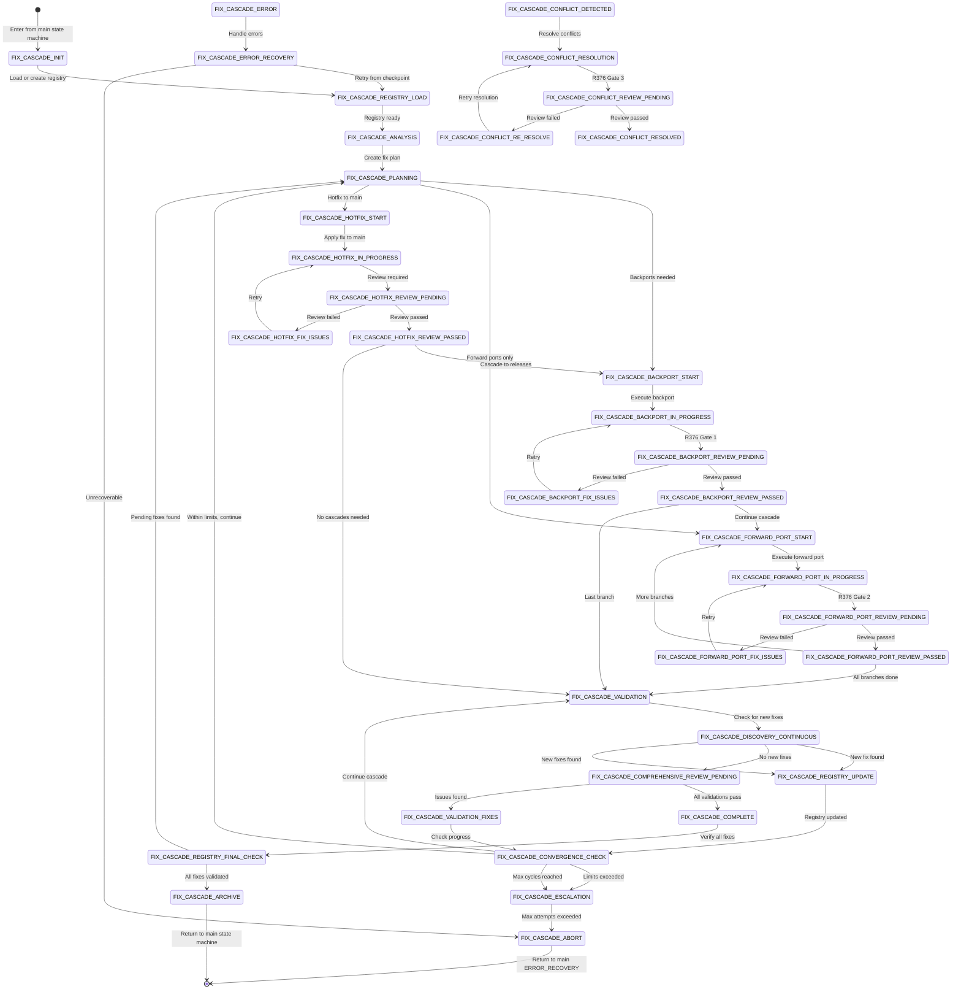

# SOFTWARE FACTORY FIX-CASCADE STATE MACHINE

## Overview
This is a **SUB-STATE MACHINE** that handles fix cascade operations including backports, forward-ports, and critical fixes across multiple branches. It operates as a diversion from the main state machine and returns control when complete.

## 🔴🔴🔴 CRITICAL: R380 FIX REGISTRY ENFORCEMENT 🔴🔴🔴
**EVERY FIX MUST BE TRACKED IN THE REGISTRY - NO EXCEPTIONS!**
- All fixes get unique IDs (FIX-001, FIX-002, etc.)
- Progressive discovery supported (find new fixes during execution)
- Finite execution guaranteed (max 20 cycles)
- Complete audit trail maintained
- Automatic recovery from interruptions

## State Machine Type
- **Type**: SUB-STATE MACHINE
- **Parent**: Main Orchestrator State Machine
- **Entry Points**: ERROR_RECOVERY, MONITORING (when fixes detected)
- **Exit Points**: FIX_CASCADE_COMPLETE → Return to parent state
- **State File**: `orchestrator-[fix-identifier]-state.json` (per R375)

## Sub-State Machine Architecture

### Entry Protocol
When entering the Fix-Cascade sub-state machine:
1. Main state machine sets `sub_state_machine.active = true`
2. Creates fix-specific state file per R375
3. Records return state in main orchestrator-state.json
4. Transfers control to FIX_CASCADE_INIT

### Exit Protocol
When exiting the Fix-Cascade sub-state machine:
1. Archives fix state file per R375
2. Updates main state with completion status
3. Clears `sub_state_machine.active`
4. Returns to recorded return state

## States



## State Definitions

### FIX_CASCADE_INIT
- **Purpose**: Initialize fix cascade sub-state machine
- **Actions**:
  - Create fix-specific state file per R375
  - Load fix requirements from trigger
  - Set up tracking structures
  - Initialize convergence metrics
- **Transitions**:
  - → FIX_CASCADE_REGISTRY_LOAD (always)

### FIX_CASCADE_ANALYSIS
- **Purpose**: Analyze the fix requirements and affected branches
- **Actions**:
  - Identify source of fix (main, release, feature)
  - Determine affected branches
  - Calculate cascade path
- **Transitions**:
  - → FIX_CASCADE_PLANNING (analysis complete)

### FIX_CASCADE_PLANNING
- **Purpose**: Create comprehensive fix cascade plan
- **Actions**:
  - Generate fix order (oldest to newest)
  - Identify potential conflicts
  - Create validation checklist
- **Transitions**:
  - → FIX_CASCADE_BACKPORT_START (backports needed)
  - → FIX_CASCADE_FORWARD_PORT_START (forward ports only)
  - → FIX_CASCADE_HOTFIX_START (hotfix to main first)

### FIX_CASCADE_BACKPORT_START
- **Purpose**: Begin backport operations
- **Actions**:
  - Select next backport target
  - Prepare backport branch
- **Transitions**:
  - → FIX_CASCADE_BACKPORT_IN_PROGRESS (target selected)

### FIX_CASCADE_BACKPORT_IN_PROGRESS
- **Purpose**: Execute backport to target branch
- **Actions**:
  - Cherry-pick or merge fix
  - Run build and tests
  - Commit changes
- **Transitions**:
  - → FIX_CASCADE_BACKPORT_REVIEW_PENDING (R376 Gate 1)
  - → FIX_CASCADE_CONFLICT_DETECTED (conflicts found)

### FIX_CASCADE_BACKPORT_REVIEW_PENDING
- **Purpose**: Quality gate for backport (R376)
- **Actions**:
  - Spawn Code Reviewer
  - Wait for review completion
- **Transitions**:
  - → FIX_CASCADE_BACKPORT_REVIEW_PASSED (review passed)
  - → FIX_CASCADE_BACKPORT_FIX_ISSUES (review failed)

### FIX_CASCADE_FORWARD_PORT_START
- **Purpose**: Begin forward port operations
- **Actions**:
  - Select next forward port target
  - Prepare forward port branch
- **Transitions**:
  - → FIX_CASCADE_FORWARD_PORT_IN_PROGRESS (target selected)

### FIX_CASCADE_FORWARD_PORT_IN_PROGRESS
- **Purpose**: Execute forward port to target branch
- **Actions**:
  - Merge or rebase fix forward
  - Run build and tests
  - Commit changes
- **Transitions**:
  - → FIX_CASCADE_FORWARD_PORT_REVIEW_PENDING (R376 Gate 2)
  - → FIX_CASCADE_CONFLICT_DETECTED (conflicts found)

### FIX_CASCADE_FORWARD_PORT_REVIEW_PENDING
- **Purpose**: Quality gate for forward port (R376)
- **Actions**:
  - Spawn Code Reviewer
  - Wait for review completion
- **Transitions**:
  - → FIX_CASCADE_FORWARD_PORT_REVIEW_PASSED (review passed)
  - → FIX_CASCADE_FORWARD_PORT_FIX_ISSUES (review failed)

### FIX_CASCADE_CONFLICT_RESOLUTION
- **Purpose**: Resolve merge/cherry-pick conflicts
- **Actions**:
  - Analyze conflict
  - Resolve preserving both changes
  - Validate resolution
- **Transitions**:
  - → FIX_CASCADE_CONFLICT_REVIEW_PENDING (R376 Gate 3)

### FIX_CASCADE_VALIDATION
- **Purpose**: Comprehensive validation of all fix branches
- **Actions**:
  - Run full test suite on all branches
  - Verify fix applied correctly
  - Check for regressions
- **Transitions**:
  - → FIX_CASCADE_COMPREHENSIVE_REVIEW_PENDING (R376 Gate 4)

### FIX_CASCADE_COMPREHENSIVE_REVIEW_PENDING
- **Purpose**: Final quality gate (R376)
- **Actions**:
  - Spawn Code Reviewer for comprehensive validation
  - Verify all branches pass
- **Transitions**:
  - → FIX_CASCADE_COMPLETE (all validations pass)
  - → FIX_CASCADE_VALIDATION_FIXES (issues found)

### FIX_CASCADE_COMPLETE
- **Purpose**: Successfully completed fix cascade
- **Actions**:
  - Update fix state with completion
  - Generate completion report
  - Prepare for archival
- **Transitions**:
  - → FIX_CASCADE_ARCHIVE (always)

### FIX_CASCADE_ARCHIVE
- **Purpose**: Archive fix state and return to main
- **Actions**:
  - Archive fix state file per R375
  - Update main state machine
  - Clear sub-state tracking
- **Transitions**:
  - → [Return to main state machine]

### FIX_CASCADE_ERROR
- **Purpose**: Handle errors during fix cascade
- **Actions**:
  - Log error details
  - Assess recovery options
- **Transitions**:
  - → FIX_CASCADE_ERROR_RECOVERY (recoverable)
  - → FIX_CASCADE_ABORT (unrecoverable)

### FIX_CASCADE_ABORT
- **Purpose**: Abort fix cascade and return to main
- **Actions**:
  - Archive partial state
  - Document failure reason
  - Return to main ERROR_RECOVERY
- **Transitions**:
  - → [Return to main ERROR_RECOVERY]

### FIX_CASCADE_REGISTRY_LOAD
- **Purpose**: Load existing registry or create new one (R380)
- **Actions**:
  - Check for existing fix registry
  - Load registry from state file if exists
  - Create new registry if first run
  - Verify registry consistency
- **Transitions**:
  - → FIX_CASCADE_ANALYSIS (registry loaded)

### FIX_CASCADE_DISCOVERY_CONTINUOUS
- **Purpose**: Check for new fixes discovered during execution (R380)
- **Actions**:
  - Scan validation results for new issues
  - Check integration reports for conflicts
  - Review build logs for failures
  - Identify any new fixes needed
- **Transitions**:
  - → FIX_CASCADE_REGISTRY_UPDATE (new fixes found)
  - → FIX_CASCADE_COMPREHENSIVE_REVIEW_PENDING (no new fixes)

### FIX_CASCADE_REGISTRY_UPDATE
- **Purpose**: Add newly discovered fixes to registry (R380)
- **Actions**:
  - Generate unique fix ID
  - Add fix to registry with metadata
  - Update convergence metrics
  - Save registry to state file
- **Transitions**:
  - → FIX_CASCADE_CONVERGENCE_CHECK (always)

### FIX_CASCADE_CONVERGENCE_CHECK
- **Purpose**: Verify cascade is progressing toward completion (R380)
- **Actions**:
  - Calculate progress rate
  - Check cycle count vs max_cycles
  - Check stalled cycles count
  - Verify timeout not exceeded
- **Transitions**:
  - → FIX_CASCADE_PLANNING (within limits)
  - → FIX_CASCADE_VALIDATION (continuing validation)
  - → FIX_CASCADE_ESCALATION (limits exceeded)

### FIX_CASCADE_ESCALATION
- **Purpose**: Handle stalled or infinite cascades (R380)
- **Actions**:
  - Generate CASCADE-ESCALATION-REPORT.md
  - Document all pending fixes
  - List blocking issues
  - Archive current state
- **Transitions**:
  - → FIX_CASCADE_ABORT (escalation confirmed)

### FIX_CASCADE_REGISTRY_FINAL_CHECK
- **Purpose**: Verify all fixes are complete before finishing (R380)
- **Actions**:
  - Check all fixes are validated or skipped
  - Verify no pending or in_progress fixes
  - Confirm 100% convergence
  - Final discovery sweep
- **Transitions**:
  - → FIX_CASCADE_ARCHIVE (all complete)
  - → FIX_CASCADE_PLANNING (pending fixes found)

## Quality Gates (R376 Enforcement)

### Gate 1: Post-Backport Review
- **State**: FIX_CASCADE_BACKPORT_REVIEW_PENDING
- **Required**: After EVERY backport operation
- **Focus**: Fix correctness, build success, test pass

### Gate 2: Post-Forward-Port Review
- **State**: FIX_CASCADE_FORWARD_PORT_REVIEW_PENDING
- **Required**: After EVERY forward port operation
- **Focus**: Integration correctness, no regressions

### Gate 3: Conflict Resolution Review
- **State**: FIX_CASCADE_CONFLICT_REVIEW_PENDING
- **Required**: After ANY conflict resolution
- **Focus**: Correct resolution, no lost code, both sides merged

### Gate 4: Comprehensive Validation
- **State**: FIX_CASCADE_COMPREHENSIVE_REVIEW_PENDING
- **Required**: Before completing fix cascade
- **Focus**: All branches build, all tests pass, fix verified, no regressions

## State File Structure

### Main Orchestrator State (orchestrator-state.json)
```json
{
  "current_state": "MONITORING",
  "sub_state_machine": {
    "active": true,
    "type": "FIX_CASCADE",
    "state_file": "orchestrator-gitea-hotfix-state.json",
    "return_state": "MONITORING",
    "started_at": "2025-01-21T10:00:00Z",
    "trigger_reason": "Critical API fix needed"
  }
}
```

### Fix-Specific State (orchestrator-[fix-id]-state.json)
```json
{
  "fix_identifier": "gitea-hotfix",
  "fix_type": "HOTFIX",
  "current_state": "FIX_CASCADE_BACKPORT_IN_PROGRESS",
  "created_at": "2025-01-21T10:00:00Z",
  "status": "IN_PROGRESS",
  "source_branch": "main",
  "target_branches": ["release-2.0", "release-1.9"],
  "fix_registry": {
    "FIX-001": {
      "discovered_at": "2025-01-21T10:00:00Z",
      "discovered_during": "initial_analysis",
      "branch": "main",
      "issue": "API authentication bypass",
      "status": "validated",
      "attempts": 1,
      "max_attempts": 3
    },
    "FIX-002": {
      "discovered_at": "2025-01-21T10:15:00Z",
      "discovered_during": "integration",
      "branch": "release-2.0",
      "issue": "Type conflict in API handler",
      "status": "in_progress",
      "attempts": 1,
      "max_attempts": 3
    }
  },
  "convergence_metrics": {
    "fixes_pending": 1,
    "fixes_completed": 1,
    "fixes_failed": 0,
    "progress_rate": 0.50,
    "cycle_count": 2,
    "max_cycles": 20,
    "last_progress_cycle": 2,
    "stalled_cycles": 0,
    "started_at": "2025-01-21T10:00:00Z",
    "total_timeout_hours": 10
  },
  "checkpoints": {
    "before_FIX_001": "abc123def",
    "after_FIX_001": "def456ghi",
    "validation_FIX_001": "passed"
  },
  "cascade_progress": {
    "backports": {
      "release-2.0": {
        "status": "COMPLETED",
        "pr_number": 123,
        "validation": "PASSED"
      },
      "release-1.9": {
        "status": "IN_PROGRESS",
        "pr_number": null,
        "validation": "PENDING"
      }
    },
    "forward_ports": {},
    "quality_gates": {
      "gate_1_backport": {
        "release-2.0": "PASSED",
        "release-1.9": "PENDING"
      }
    }
  },
  "validation_results": {},
  "errors_encountered": [],
  "notes": []
}
```

## Integration with Main State Machine

### Entry Conditions
The main state machine enters FIX_CASCADE when:
1. ERROR_RECOVERY determines a fix cascade is needed
2. MONITORING detects a critical fix requirement
3. Manual trigger via /fix-cascade command

### Return Protocol
1. Fix cascade completes successfully → Return to recorded return_state
2. Fix cascade aborts → Return to ERROR_RECOVERY
3. Nested fix discovered → Create nested sub-state machine

### Nested Sub-State Support
If a new critical issue is discovered during a fix cascade:
1. Current fix cascade can spawn a nested fix cascade
2. Nested cascade gets its own state file
3. Parent cascade waits for nested completion
4. Maximum nesting depth: 3 levels

## Rules Integration

### R375 - Fix State File Management
- Create separate state file for each fix cascade
- Archive on completion, never delete
- Keep main state clean

### R376 - Fix Cascade Quality Gates
- Enforce all 4 quality gates
- No progression without review pass
- Comprehensive validation required

### R354 - Post-Rebase Review Requirement
- Every rebase/cherry-pick requires review
- Applies to all backport/forward-port operations

### R380 - Fix Registry Management
- EVERY fix gets unique ID (FIX-001, FIX-002, etc.)
- Progressive discovery supported throughout cascade
- Finite execution guaranteed (max 20 cycles)
- Complete audit trail in registry
- Automatic recovery from interruptions

## Command Integration

### /fix-cascade
- Detects existing fix cascade or starts new
- Resumes from last checkpoint
- Handles multiple concurrent fixes

### /continue-orchestrating
- Checks for active sub-state machines
- Routes to appropriate sub-state handler
- Returns to main flow when complete

## Completion Criteria

Fix cascade is complete when:
- [ ] All fixes in registry are `validated` or `skipped` (R380)
- [ ] No fixes in `pending` or `in_progress` state (R380)
- [ ] All target branches have fix applied
- [ ] All quality gates passed (R376)
- [ ] Comprehensive validation complete
- [ ] Convergence reached 100% (R380)
- [ ] No new fixes discovered in final validation (R380)
- [ ] All checkpoints verified (R380)
- [ ] Fix state archived (R375)
- [ ] Main state updated with completion

## Error Handling

### Recoverable Errors
- Build failures → Fix and retry
- Test failures → Fix and retry
- Review failures → Address feedback and retry

### Unrecoverable Errors
- Cannot access repository → Abort
- Critical infrastructure failure → Abort
- Maximum retry limit exceeded → Abort

When aborting, always:
1. Archive partial state
2. Document failure reason
3. Return to main ERROR_RECOVERY
4. Preserve audit trail