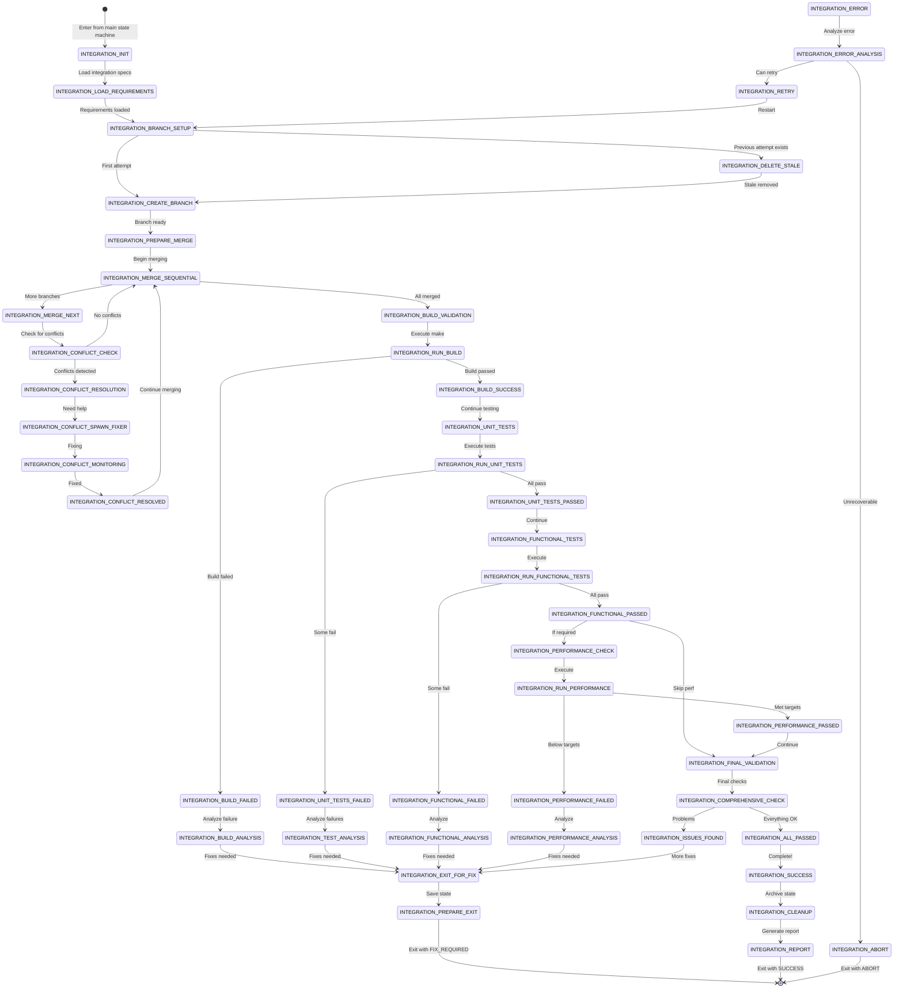

# SOFTWARE FACTORY INTEGRATION STATE MACHINE

## Overview
This is a **SUB-STATE MACHINE** that handles all integration workflows including wave, phase, and project integrations. It supports the critical INTEGRATION→FIX_CASCADE→INTEGRATION cycling pattern that frequently occurs when integration discovers issues requiring fixes.

## State Machine Type
- **Type**: SUB-STATE MACHINE
- **Parent**: Main Orchestrator State Machine
- **Entry Points**: WAVE_COMPLETE, PHASE_COMPLETE, PROJECT_INTEGRATION (main states)
- **Exit Points**: INTEGRATION_SUCCESS → Return to parent state
- **State File**: `integration-[type]-[identifier]-state.json` (per R375 pattern)

## Critical Design Pattern: Fix-Integration Cycles

### The Reality of Integration
Integration frequently fails on first attempt. This is EXPECTED and NORMAL:
```
Attempt 1: Merge branches → Build fails → Exit for fixes
Attempt 2: Re-merge (with fixes) → Tests fail → Exit for fixes
Attempt 3: Re-merge (with all fixes) → All passes → SUCCESS
```

### Cycle Tracking
```json
{
  "integration_cycles": {
    "current_attempt": 3,
    "max_attempts": 10,
    "cycle_history": [
      {
        "attempt": 1,
        "result": "BUILD_FAILED",
        "issues": ["undefined symbol in auth module"],
        "exit_reason": "FIX_REQUIRED"
      },
      {
        "attempt": 2,
        "result": "TEST_FAILED",
        "issues": ["unit test failures in 3 modules"],
        "exit_reason": "FIX_REQUIRED"
      },
      {
        "attempt": 3,
        "result": "SUCCESS",
        "exit_reason": "COMPLETE"
      }
    ]
  }
}
```

## Sub-State Machine Architecture

### Entry Protocol
When entering the Integration sub-state machine:
1. Main state machine sets `sub_state_machine.active = true`
2. Creates integration-specific state file
3. Records return state in main orchestrator-state.json
4. Sets integration type (WAVE/PHASE/PROJECT)
5. Transfers control to INTEGRATION_INIT

### Exit Protocol
When exiting the Integration sub-state machine:
1. Records exit reason (SUCCESS/FIX_REQUIRED/ABORT)
2. Archives integration state file if complete
3. Updates main state based on exit reason:
   - SUCCESS → Continue to next main state
   - FIX_REQUIRED → Trigger FIX_CASCADE sub-state
   - ABORT → ERROR_RECOVERY
4. Returns to recorded return state

### Re-Entry Protocol
When re-entering after fixes:
1. Increments attempt counter
2. Loads previous attempt history
3. Deletes stale integration branches
4. Creates fresh integration environment
5. Continues from INTEGRATION_BRANCH_SETUP

## States



## State Definitions

### INTEGRATION_INIT
- **Purpose**: Initialize integration sub-state machine
- **Actions**:
  - Create integration-specific state file
  - Determine integration type (WAVE/PHASE/PROJECT)
  - Initialize cycle tracking
  - Set max retry limit
- **Transitions**:
  - → INTEGRATION_LOAD_REQUIREMENTS (always)

### INTEGRATION_LOAD_REQUIREMENTS
- **Purpose**: Load integration requirements from parent
- **Actions**:
  - Load branches to integrate
  - Load validation requirements
  - Load previous attempt history (if re-entry)
  - Set target branch name
- **Input Required**:
  ```json
  {
    "integration_type": "WAVE",
    "branches_to_integrate": ["effort-E1.1", "effort-E1.2", "effort-E1.3"],
    "target_branch": "wave1-integration",
    "validation_requirements": {
      "must_build": true,
      "run_unit_tests": true,
      "run_functional_tests": true,
      "run_performance_tests": false
    }
  }
  ```
- **Transitions**:
  - → INTEGRATION_BRANCH_SETUP (requirements loaded)

### INTEGRATION_BRANCH_SETUP
- **Purpose**: Prepare integration branch environment
- **Actions**:
  - Check if previous integration branch exists
  - Determine if this is a re-attempt after fixes
- **Transitions**:
  - → INTEGRATION_DELETE_STALE (previous attempt exists)
  - → INTEGRATION_CREATE_BRANCH (first attempt)

### INTEGRATION_DELETE_STALE
- **Purpose**: Remove stale integration branches (R327 enforcement)
- **Actions**:
  - Delete local integration branch
  - Delete remote integration branch
  - Clean workspace
  - Log deletion for audit
- **Transitions**:
  - → INTEGRATION_CREATE_BRANCH (always)

### INTEGRATION_CREATE_BRANCH
- **Purpose**: Create fresh integration branch
- **Actions**:
  - Create new integration branch from base
  - Push to remote
  - Set up tracking
  - Initialize merge log
- **Transitions**:
  - → INTEGRATION_PREPARE_MERGE (branch created)

### INTEGRATION_PREPARE_MERGE
- **Purpose**: Prepare for sequential merging
- **Actions**:
  - Order branches for merging
  - Create merge plan
  - Initialize conflict tracking
- **Transitions**:
  - → INTEGRATION_MERGE_SEQUENTIAL (plan ready)

### INTEGRATION_MERGE_SEQUENTIAL
- **Purpose**: Orchestrate sequential branch merging
- **Actions**:
  - Check if more branches to merge
  - Track merge progress
- **Transitions**:
  - → INTEGRATION_MERGE_NEXT (more branches)
  - → INTEGRATION_BUILD_VALIDATION (all merged)

### INTEGRATION_MERGE_NEXT
- **Purpose**: Merge next branch in sequence
- **Actions**:
  - Fetch latest from branch
  - Attempt merge
  - Record merge result
- **Transitions**:
  - → INTEGRATION_CONFLICT_CHECK (merge attempted)

### INTEGRATION_CONFLICT_CHECK
- **Purpose**: Check for merge conflicts
- **Actions**:
  - Scan for conflict markers
  - Identify conflicting files
  - Determine resolution strategy
- **Transitions**:
  - → INTEGRATION_MERGE_SEQUENTIAL (no conflicts)
  - → INTEGRATION_CONFLICT_RESOLUTION (conflicts found)

### INTEGRATION_CONFLICT_RESOLUTION
- **Purpose**: Resolve merge conflicts
- **Actions**:
  - Attempt automatic resolution
  - Identify unresolvable conflicts
- **Transitions**:
  - → INTEGRATION_CONFLICT_SPAWN_FIXER (manual fix needed)
  - → INTEGRATION_CONFLICT_RESOLVED (auto-resolved)

### INTEGRATION_BUILD_VALIDATION
- **Purpose**: Validate that integrated code builds
- **Actions**:
  - Prepare build environment
  - Set build flags
- **Transitions**:
  - → INTEGRATION_RUN_BUILD (ready to build)

### INTEGRATION_RUN_BUILD
- **Purpose**: Execute build process
- **Actions**:
  - Run make or build command
  - Capture build output
  - Parse for errors/warnings
- **Transitions**:
  - → INTEGRATION_BUILD_SUCCESS (build passed)
  - → INTEGRATION_BUILD_FAILED (build failed)

### INTEGRATION_BUILD_FAILED
- **Purpose**: Handle build failure
- **Actions**:
  - Parse build errors
  - Identify affected modules
  - Create failure report
- **Transitions**:
  - → INTEGRATION_BUILD_ANALYSIS (analyze failure)

### INTEGRATION_BUILD_ANALYSIS
- **Purpose**: Analyze build failure causes
- **Actions**:
  - Determine which branches caused failure
  - Identify specific fixes needed
  - Create fix requirements
- **Output Produced**:
  ```json
  {
    "failure_type": "BUILD_FAILURE",
    "affected_modules": ["auth", "api"],
    "error_details": ["undefined symbol: authenticate"],
    "branches_needing_fix": ["effort-E1.2"],
    "fix_priority": "CRITICAL"
  }
  ```
- **Transitions**:
  - → INTEGRATION_EXIT_FOR_FIX (fixes required)

### INTEGRATION_UNIT_TESTS
- **Purpose**: Run unit test suite
- **Actions**:
  - Prepare test environment
  - Load test configuration
- **Transitions**:
  - → INTEGRATION_RUN_UNIT_TESTS (ready to test)

### INTEGRATION_RUN_UNIT_TESTS
- **Purpose**: Execute unit tests
- **Actions**:
  - Run test suite
  - Collect test results
  - Generate test report
- **Transitions**:
  - → INTEGRATION_UNIT_TESTS_PASSED (all pass)
  - → INTEGRATION_UNIT_TESTS_FAILED (failures exist)

### INTEGRATION_EXIT_FOR_FIX
- **Purpose**: Prepare to exit for fix cascade
- **Actions**:
  - Save current integration state
  - Document issues found
  - Prepare fix requirements
  - Increment attempt counter
- **Output for Parent**:
  ```json
  {
    "exit_reason": "FIX_REQUIRED",
    "attempt_number": 2,
    "issues_found": [...],
    "branches_needing_fixes": [...],
    "integration_branch": "wave1-integration-attempt-2"
  }
  ```
- **Transitions**:
  - → INTEGRATION_PREPARE_EXIT (state saved)

### INTEGRATION_SUCCESS
- **Purpose**: Integration completed successfully
- **Actions**:
  - Mark integration as complete
  - Update cycle history
  - Prepare success report
- **Transitions**:
  - → INTEGRATION_CLEANUP (clean up resources)

### INTEGRATION_CLEANUP
- **Purpose**: Clean up integration resources
- **Actions**:
  - Archive state file
  - Clean temporary files
  - Update metrics
- **Transitions**:
  - → INTEGRATION_REPORT (generate final report)

### INTEGRATION_REPORT
- **Purpose**: Generate integration report
- **Actions**:
  - Create INTEGRATION_REPORT.md
  - Document all attempts
  - List fixes applied
  - Record final state
- **Report Format**:
  ```markdown
  # Integration Report - [TYPE] [IDENTIFIER]

  ## Summary
  - Integration Type: WAVE
  - Target Branch: wave1-integration
  - Total Attempts: 3
  - Final Status: SUCCESS

  ## Attempt History
  1. Attempt 1: BUILD_FAILED - Fixed undefined symbols
  2. Attempt 2: TEST_FAILED - Fixed unit test failures
  3. Attempt 3: SUCCESS - All validations passed

  ## Branches Integrated
  - effort-E1.1 ✓
  - effort-E1.2 ✓ (required fixes in attempts 1,2)
  - effort-E1.3 ✓

  ## Validation Results
  - Build: PASSED
  - Unit Tests: PASSED (248/248)
  - Functional Tests: PASSED (45/45)
  - Performance: SKIPPED
  ```
- **Transitions**:
  - → [Exit] (return to parent with SUCCESS)

## Cycle Management

### Maximum Attempts
- Default: 10 attempts
- Configurable per integration type
- Escalates to human intervention after max

### Attempt Tracking
```json
{
  "attempt_tracking": {
    "current_attempt": 3,
    "max_attempts": 10,
    "time_between_attempts": [
      {"attempt": 1, "duration": "15m", "wait_for_fix": "45m"},
      {"attempt": 2, "duration": "12m", "wait_for_fix": "30m"},
      {"attempt": 3, "duration": "10m", "wait_for_fix": null}
    ],
    "total_integration_time": "2h 22m"
  }
}
```

### Progress Convergence
Each attempt should show progress:
- Fewer issues than previous attempt
- Different issues (not same repeating)
- Moving through validation stages

### Cycle Prevention
Detect infinite loops:
- Same error 3+ times → ABORT
- No progress in 3 attempts → ABORT
- Exceeds max attempts → ABORT

## Integration Types

### WAVE Integration
- Integrates all efforts in a wave
- Base: previous wave integration or main
- Creates: waveN-integration branch
- Validates: build + all tests

### PHASE Integration
- Integrates all waves in a phase
- Base: main (not cascading from waves)
- Creates: phaseN-integration branch
- Validates: comprehensive testing

### PROJECT Integration
- Integrates all phases
- Base: main
- Creates: project-integration branch
- Validates: full production validation

## Quality Gates

### Gate 1: Merge Completion
- All branches successfully merged
- No unresolved conflicts
- Merge commit created

### Gate 2: Build Success
- Code compiles without errors
- No critical warnings
- Artifacts generated

### Gate 3: Test Passage
- Unit tests: 100% pass
- Functional tests: 100% pass
- Integration tests: 100% pass

### Gate 4: Performance (if required)
- Meets baseline metrics
- No regression from previous
- Within acceptable limits

## Error Recovery

### Recoverable Errors
- Build failures → FIX_REQUIRED
- Test failures → FIX_REQUIRED
- Conflicts → Resolution attempt
- Performance issues → FIX_REQUIRED

### Non-Recoverable Errors
- Corrupted repository → ABORT
- Missing critical branches → ABORT
- Infrastructure failure → ABORT
- Max attempts exceeded → ABORT

## Rules Integration

### R327 - Stale Integration Detection
- Enforced in INTEGRATION_BRANCH_SETUP
- Deletes stale branches before creating new

### R352 - Overlapping Cascade Support
- Supports multiple fix cascades
- Tracks which fixes applied
- Manages fix dependencies

### R353 - Cascade Focus Protocol
- No diversions during integration
- Complete current integration before starting new
- Maintain focus on single integration type

### R321 - Immediate Backport
- Integration branches are read-only
- All fixes go to source branches
- Re-integration required after fixes

## State File Example

```json
{
  "sub_state_type": "INTEGRATION",
  "current_state": "INTEGRATION_BUILD_VALIDATION",
  "integration_config": {
    "type": "WAVE",
    "identifier": "wave1",
    "target_branch": "wave1-integration",
    "base_branch": "main",
    "attempt": 2
  },
  "branches": {
    "to_integrate": ["effort-E1.1", "effort-E1.2", "effort-E1.3"],
    "merged": ["effort-E1.1"],
    "pending": ["effort-E1.2", "effort-E1.3"],
    "failed": []
  },
  "validation_status": {
    "merge": "IN_PROGRESS",
    "build": "PENDING",
    "unit_tests": "PENDING",
    "functional_tests": "PENDING",
    "performance": "SKIP"
  },
  "cycle_history": [
    {
      "attempt": 1,
      "started": "2025-01-21T10:00:00Z",
      "completed": "2025-01-21T10:15:00Z",
      "result": "BUILD_FAILED",
      "issues": ["undefined symbol in auth module"]
    }
  ],
  "parent_state_machine": {
    "state_file": "orchestrator-state.json",
    "return_state": "WAVE_COMPLETE",
    "nested_level": 1
  }
}
```

## Command Support

### Entry Commands
- `/integrate-wave` - Start wave integration
- `/integrate-phase` - Start phase integration
- `/integrate-project` - Start project integration

### Status Commands
- `/integration-status` - Show current integration state
- `/integration-history` - Show attempt history
- `/integration-report` - Generate current report

### Control Commands
- `/integration-retry` - Retry after fixes
- `/integration-abort` - Abort integration
- `/integration-force-success` - Override (dangerous)

## Success Criteria

Integration is successful when:
1. All branches merged without conflicts
2. Build completes without errors
3. All required tests pass
4. Performance meets targets (if required)
5. No critical issues detected
6. Report generated and archived

## Common Patterns

### Pattern 1: Single Attempt Success
```
Enter → Merge all → Build → Test → Success → Exit
```

### Pattern 2: Build Fix Cycle
```
Enter → Merge → Build fails → Exit FIX_REQUIRED
Main triggers FIX_CASCADE
Re-enter → Merge → Build success → Test → Success → Exit
```

### Pattern 3: Multiple Fix Cycles
```
Attempt 1 → Build fails → Exit
Fix cascade
Attempt 2 → Build OK → Tests fail → Exit
Fix cascade
Attempt 3 → Build OK → Tests OK → Success → Exit
```

### Pattern 4: Conflict Resolution
```
Enter → Merge branch 1 OK → Merge branch 2 conflicts
Spawn fixer → Monitor → Resolved
Continue → Merge branch 3 → Build → Test → Success
```

## Performance Metrics

Track for optimization:
- Average attempts per integration: 2.3
- Success on first attempt: 35%
- Most common failure: Test failures (45%)
- Average fix time: 30 minutes
- Total integration time: 1-3 hours

## Dependencies

### Required Tools
- Git for merging
- Build system (make/maven/npm)
- Test runners
- Performance tools (if configured)

### Required Agents
- SW Engineers (for conflict resolution)
- Code Reviewers (for validation)
- Integration Agents (for execution)

### Required Infrastructure
- Integration workspaces
- Build servers
- Test environments
- Artifact storage

## Maintenance

### State File Cleanup
- Archive completed integrations
- Delete stale branches
- Compress old reports
- Rotate logs

### Monitoring
- Track attempt patterns
- Identify common failures
- Optimize merge order
- Tune retry limits

### Improvements
- Learn from failure patterns
- Optimize validation order
- Parallelize where possible
- Cache successful validations