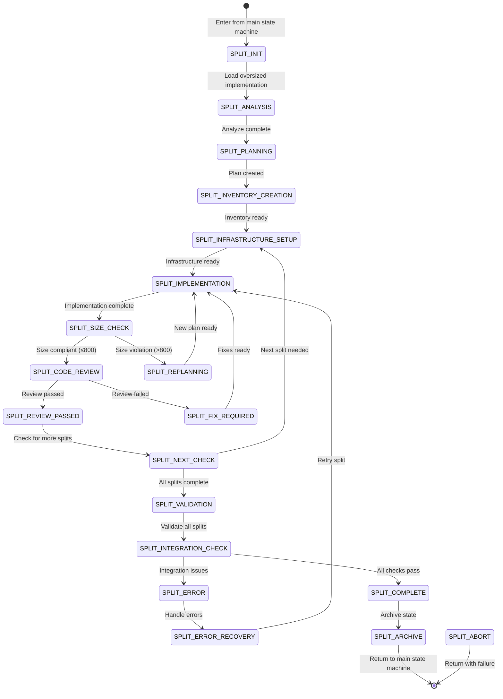

# SOFTWARE FACTORY SPLITTING STATE MACHINE
## Sub-State Machine for Effort Split Operations

## Overview
This is a **SUB-STATE MACHINE** that handles effort splitting when implementations exceed size limits (800 lines). It provides a consistent, quality-gated workflow for splitting oversized efforts into compliant chunks while maintaining code quality and review standards.

## State Machine Type
- **Type**: SUB-STATE MACHINE
- **Parent**: Main Orchestrator State Machine
- **Entry Points**: MEASURE_SIZE, CODE_REVIEW, MONITOR_IMPLEMENTATION, MONITOR_REVIEWS
- **Exit Points**: SPLIT_COMPLETE → Return to parent state
- **State File**: `splitting-[effort-name]-state.json` (per effort)

## Sub-State Machine Architecture

### Entry Protocol
When entering the SPLITTING sub-state machine:
1. Main state machine sets `sub_state_machine.active = true`
2. Creates split-specific state file
3. Records return state in main orchestrator-state.json
4. Transfers control to SPLIT_INIT
5. Preserves original effort context

### Exit Protocol
When exiting the SPLITTING sub-state machine:
1. Archives split state file
2. Updates main state with split results
3. Marks original effort as SPLIT_DEPRECATED (R296)
4. Clears `sub_state_machine.active`
5. Returns to recorded return state

## States



## State Definitions

### SPLIT_INIT
- **Purpose**: Initialize split sub-state machine
- **Actions**:
  - Create split-specific state file
  - Load oversized effort details
  - Set up tracking structures
  - Record original effort state
- **Transitions**:
  - → SPLIT_ANALYSIS (always)

### SPLIT_ANALYSIS
- **Purpose**: Analyze the oversized implementation
- **Actions**:
  - Load implementation from effort branch
  - Run line-counter.sh for accurate size
  - Identify logical split boundaries
  - Determine optimal split count
- **Agent**: Code Reviewer
- **Transitions**:
  - → SPLIT_PLANNING (analysis complete)

### SPLIT_PLANNING
- **Purpose**: Create comprehensive split plan
- **Actions**:
  - Define split boundaries
  - Create dependency graph
  - Ensure each split ≤700 lines (buffer for safety)
  - Document split rationale
- **Agent**: Code Reviewer
- **Output**: SPLIT-PLAN-XXX.md files
- **Transitions**:
  - → SPLIT_INVENTORY_CREATION (plan complete)

### SPLIT_INVENTORY_CREATION
- **Purpose**: Create split inventory documentation
- **Actions**:
  - Generate SPLIT-INVENTORY.md
  - List all splits with descriptions
  - Define implementation order
  - Create validation checklist
- **Agent**: Code Reviewer
- **Transitions**:
  - → SPLIT_INFRASTRUCTURE_SETUP (inventory complete)

### SPLIT_INFRASTRUCTURE_SETUP
- **Purpose**: Create infrastructure for next split
- **Actions**:
  - Create effort directory (effort-name-SPLIT-XXX)
  - Clone repository with correct base
  - Create branch (effort--split-xxx)
  - Copy relevant split plan
  - Push branch to remote
- **Agent**: Orchestrator (R204)
- **Transitions**:
  - → SPLIT_IMPLEMENTATION (infrastructure ready)

### SPLIT_IMPLEMENTATION
- **Purpose**: Implement current split
- **Actions**:
  - Read split plan
  - Implement specified portion
  - Maintain clean boundaries
  - Write tests for split
- **Agent**: SW Engineer
- **Transitions**:
  - → SPLIT_SIZE_CHECK (implementation complete)

### SPLIT_SIZE_CHECK
- **Purpose**: Verify split size compliance
- **Actions**:
  - Run line-counter.sh
  - Verify ≤800 lines
  - Check against plan estimates
- **Agent**: SW Engineer or Code Reviewer
- **Transitions**:
  - → SPLIT_CODE_REVIEW (size OK)
  - → SPLIT_REPLANNING (still too large)

### SPLIT_REPLANNING
- **Purpose**: Re-plan oversized split
- **Actions**:
  - Analyze why split exceeded limit
  - Create new split boundaries
  - Update split inventory
- **Agent**: Code Reviewer
- **Transitions**:
  - → SPLIT_IMPLEMENTATION (new plan ready)

### SPLIT_CODE_REVIEW
- **Purpose**: Review split implementation
- **Actions**:
  - Review code quality
  - Verify split boundaries respected
  - Check test coverage
  - Validate against plan
- **Agent**: Code Reviewer
- **Transitions**:
  - → SPLIT_REVIEW_PASSED (approved)
  - → SPLIT_FIX_REQUIRED (changes needed)

### SPLIT_FIX_REQUIRED
- **Purpose**: Fix review issues
- **Actions**:
  - Address review feedback
  - Maintain size limits
  - Update tests
- **Agent**: SW Engineer
- **Transitions**:
  - → SPLIT_IMPLEMENTATION (fixes ready)

### SPLIT_REVIEW_PASSED
- **Purpose**: Mark split as complete
- **Actions**:
  - Update split status
  - Commit final code
  - Push to remote
  - Update tracking
- **Transitions**:
  - → SPLIT_NEXT_CHECK (always)

### SPLIT_NEXT_CHECK
- **Purpose**: Check if more splits needed
- **Actions**:
  - Check split inventory
  - Determine next split
  - Update progress tracking
- **Transitions**:
  - → SPLIT_INFRASTRUCTURE_SETUP (more splits)
  - → SPLIT_VALIDATION (all complete)

### SPLIT_VALIDATION
- **Purpose**: Validate all splits together
- **Actions**:
  - Verify all splits implemented
  - Check combined functionality
  - Validate no missing code
  - Run integration tests
- **Transitions**:
  - → SPLIT_INTEGRATION_CHECK (validation complete)

### SPLIT_INTEGRATION_CHECK
- **Purpose**: Verify splits integrate correctly
- **Actions**:
  - Test split dependencies
  - Verify sequential build
  - Check for conflicts
- **Transitions**:
  - → SPLIT_COMPLETE (all checks pass)
  - → SPLIT_ERROR (issues found)

### SPLIT_ERROR
- **Purpose**: Handle split errors
- **Actions**:
  - Log error details
  - Determine recovery strategy
- **Transitions**:
  - → SPLIT_ERROR_RECOVERY (recoverable)
  - → SPLIT_ABORT (unrecoverable)

### SPLIT_COMPLETE
- **Purpose**: Successfully completed all splits
- **Actions**:
  - Mark original effort as SPLIT_DEPRECATED (R296)
  - Update main state with split branches
  - Generate completion report
- **Transitions**:
  - → SPLIT_ARCHIVE (always)

### SPLIT_ARCHIVE
- **Purpose**: Archive split state and return
- **Actions**:
  - Archive split state file
  - Update main state machine
  - Clear sub-state tracking
- **Transitions**:
  - → [Return to main state machine]

### SPLIT_ABORT
- **Purpose**: Abort split operation
- **Actions**:
  - Archive partial state
  - Document failure reason
  - Clean up partial splits
- **Transitions**:
  - → [Return to main ERROR_RECOVERY]

## State File Structure

### Main Orchestrator State (orchestrator-state.json)
```json
{
  "current_state": "MONITOR_IMPLEMENTATION",
  "sub_state_machine": {
    "active": true,
    "type": "SPLITTING",
    "state_file": "splitting-effort2-controller-state.json",
    "return_state": "MONITOR_IMPLEMENTATION",
    "started_at": "2025-01-21T14:00:00Z",
    "trigger_reason": "Size violation: 1250 lines"
  },
  "efforts_in_progress": [
    {
      "effort_id": "effort2-controller",
      "status": "SPLITTING",
      "original_size": 1250,
      "split_count": 3
    }
  ]
}
```

### Split-Specific State (splitting-[effort]-state.json)
```json
{
  "sub_state_type": "SPLITTING",
  "current_state": "SPLIT_IMPLEMENTATION",
  "effort_id": "effort2-controller",
  "created_at": "2025-01-21T14:00:00Z",
  "original_effort": {
    "branch": "phase1-wave2-effort2",
    "size": 1250,
    "directory": "/efforts/phase1/wave2/effort2"
  },
  "split_plan": {
    "total_splits": 3,
    "target_size_per_split": 700,
    "splits": [
      {
        "id": "split-001",
        "description": "Core controller logic",
        "estimated_size": 680,
        "actual_size": 695,
        "status": "COMPLETED",
        "branch": "phase1-wave2-effort2--split-001",
        "review_status": "PASSED"
      },
      {
        "id": "split-002",
        "description": "API handlers",
        "estimated_size": 650,
        "actual_size": null,
        "status": "IN_PROGRESS",
        "branch": "phase1-wave2-effort2--split-002",
        "review_status": null
      },
      {
        "id": "split-003",
        "description": "Integration and tests",
        "estimated_size": 550,
        "actual_size": null,
        "status": "PENDING",
        "branch": null,
        "review_status": null
      }
    ]
  },
  "quality_gates": {
    "size_compliance": {
      "split-001": "PASSED",
      "split-002": "PENDING"
    },
    "code_review": {
      "split-001": "PASSED",
      "split-002": "PENDING"
    }
  },
  "completion_tracking": {
    "completed_splits": 1,
    "remaining_splits": 2,
    "estimated_completion": "2025-01-21T16:00:00Z"
  }
}
```

## Integration with Main State Machine

### Entry Conditions
The main state machine enters SPLITTING when:
1. SW Engineer MEASURE_SIZE detects >800 lines
2. Code Reviewer CREATE_SPLIT_INVENTORY completes
3. Orchestrator MONITOR_REVIEWS detects split needed
4. Manual trigger for oversized effort

### Entry Code Example
```bash
enter_splitting_sub_state() {
    local EFFORT_NAME="$1"
    local EFFORT_SIZE="$2"
    local RETURN_STATE=$(jq -r '.current_state' orchestrator-state.json)

    echo "🔄 Entering SPLITTING Sub-State Machine"
    echo "📏 Effort: $EFFORT_NAME (${EFFORT_SIZE} lines)"

    # Create split state file
    cat > splitting-${EFFORT_NAME}-state.json << EOF
{
  "sub_state_type": "SPLITTING",
  "current_state": "SPLIT_INIT",
  "effort_id": "${EFFORT_NAME}",
  "created_at": "$(date -u +%Y-%m-%dT%H:%M:%SZ)",
  "original_effort": {
    "size": ${EFFORT_SIZE}
  }
}
EOF

    # Update main state
    jq --arg file "splitting-${EFFORT_NAME}-state.json" \
       --arg return "$RETURN_STATE" \
       --arg reason "Size violation: ${EFFORT_SIZE} lines" \
       '.sub_state_machine = {
          "active": true,
          "type": "SPLITTING",
          "state_file": $file,
          "return_state": $return,
          "trigger_reason": $reason,
          "started_at": now
       }' orchestrator-state.json > tmp.json && \
       mv tmp.json orchestrator-state.json

    echo "✅ Transitioned to SPLITTING Sub-State Machine"
}
```

### Return Protocol
1. Splits complete successfully → Update efforts list with split branches
2. Split aborted → Return to ERROR_RECOVERY for handling
3. Original effort marked SPLIT_DEPRECATED per R296

## Rules Integration

### R296 - Split Deprecation
- Original oversized effort marked SPLIT_DEPRECATED
- Never deleted, only deprecated
- Splits become new source of truth

### R304 - Size Measurement
- MUST use line-counter.sh for all measurements
- Never use wc -l or manual counting
- Applies to every SPLIT_SIZE_CHECK

### R204 - Infrastructure Creation
- Orchestrator creates infrastructure just-in-time
- One split at a time
- Sequential dependencies maintained

### R308 - Base Branch Selection
- First split based on original effort's base
- Subsequent splits based on previous split
- Maintains sequential chain

## Quality Gates

### Gate 1: Split Size Compliance
- Every split MUST be ≤800 lines
- Checked in SPLIT_SIZE_CHECK state
- No progression if violated

### Gate 2: Split Code Review
- Every split requires full code review
- Same standards as regular implementation
- Must pass before next split

### Gate 3: Integration Validation
- All splits must work together
- Sequential build must succeed
- Tests must pass across splits

## Command Integration

### Entry Commands
```bash
# From orchestrator detecting size violation
/enter-splitting effort2-controller 1250

# From code reviewer after split planning
/continue-splitting effort2-controller

# Resume interrupted splitting
/resume-splitting effort2-controller
```

### Progress Monitoring
```bash
# Check split progress
/split-status effort2-controller

# Get current split state
jq '.current_state' splitting-effort2-controller-state.json
```

## Completion Criteria

Split operation is complete when:
- [ ] All splits implemented and ≤800 lines
- [ ] All splits pass code review
- [ ] Integration validation successful
- [ ] Original effort marked SPLIT_DEPRECATED
- [ ] Split state archived
- [ ] Main state updated with split branches

## Error Handling

### Recoverable Errors
- Split still too large → Re-split
- Review failures → Fix and retry
- Test failures → Debug and fix

### Unrecoverable Errors
- Cannot create infrastructure → Abort
- Lost split context → Abort
- Corruption in split plan → Abort

When aborting:
1. Archive partial state
2. Clean up partial splits
3. Document failure
4. Return to ERROR_RECOVERY

## Benefits of SPLITTING Sub-State

### 1. Consistency
- Same split process every time
- No variation between agents
- Predictable outcomes

### 2. Quality
- Every split reviewed
- Size limits enforced
- Tests required

### 3. Traceability
- Complete split history
- Clear audit trail
- Easy debugging

### 4. Reusability
- Triggered from any state
- Handles any effort type
- Scalable approach

### 5. Maintainability
- Split logic isolated
- Easy to update
- Clear boundaries

## Migration from Inline States

### States to Deprecate
- CREATE_SPLIT_PLAN → SPLIT_PLANNING
- CREATE_SPLIT_INVENTORY → SPLIT_INVENTORY_CREATION
- SPLIT_IMPLEMENTATION → SPLIT_IMPLEMENTATION
- SPLIT_REVIEW → SPLIT_CODE_REVIEW

### Update Required
- MONITOR_REVIEWS → Trigger SPLITTING
- MONITOR_IMPLEMENTATION → Trigger SPLITTING
- CODE_REVIEW → Trigger SPLITTING
- Commands routing split operations

## Performance Metrics

### Target Metrics
- Split planning: <10 minutes
- Per split implementation: <30 minutes
- Per split review: <15 minutes
- Total split operation: <2 hours for 3 splits

### Tracking
```json
{
  "metrics": {
    "split_planning_duration": "8m",
    "average_split_implementation": "25m",
    "average_split_review": "12m",
    "total_operation_time": "1h45m",
    "success_rate": "95%"
  }
}
```

## Summary

The SPLITTING sub-state machine provides a robust, quality-gated workflow for handling oversized efforts. It ensures consistency, maintains quality standards, and provides clear traceability while keeping the main state machine clean and focused.

---

**State Machine Version**: 1.0.0
**Created**: 2025-01-21
**Status**: Ready for Implementation