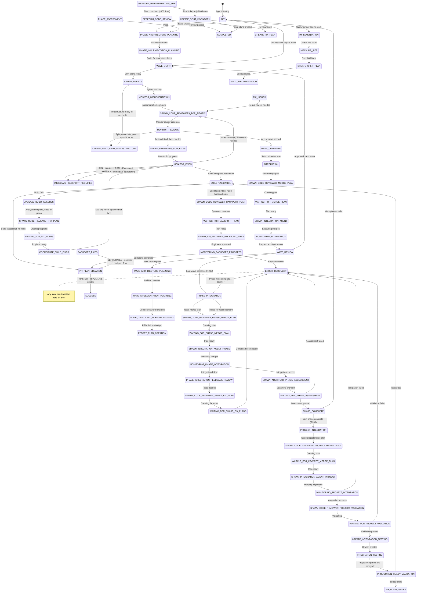

# Software Factory 2.0 - State Machine Definition

## 🚨 CRITICAL: This is the SINGLE SOURCE OF TRUTH for Valid States

**RULE R206**: Agents MUST validate transitions against this file. Any state not listed here is INVALID.

## 🔴🔴🔴 SUPREME LAW R233: ALL STATES REQUIRE IMMEDIATE ACTION 🔴🔴🔴

**STATES ARE VERBS, NOT DESTINATIONS!**
- Every state name is a command to execute
- Upon entering ANY state, you MUST immediately perform that action
- NO announcements about "being in" a state
- NO waiting or pausing after state entry
- ONLY terminal states (SUCCESS, HARD_STOP) may stop execution

See rule-library/R233-all-states-immediate-action.md for complete requirements.

## 🔴🔴🔴 SUPREME LAW R313: MANDATORY STOP AFTER SPAWNING AGENTS 🔴🔴🔴

**CONTEXT PRESERVATION LAW - PREVENTS RULE LOSS!**

The orchestrator MUST STOP IMMEDIATELY after ANY spawn state to preserve context:
- Record what was spawned in state file
- Save TODOs and commit state changes
- EXIT with clear continuation instructions
- This prevents agent responses from overflowing context and causing rule forgetting

**SPAWN STATES REQUIRING MANDATORY STOP:**
- SPAWN_AGENTS, SPAWN_CODE_REVIEWERS_EFFORT_PLANNING, SPAWN_CODE_REVIEWERS_FOR_REVIEW
- SPAWN_ENGINEERS_FOR_FIXES, SPAWN_INTEGRATION_AGENT
- All SPAWN_ARCHITECT_* and SPAWN_CODE_REVIEWER_* states

See rule-library/R313-mandatory-stop-after-spawn.md for complete requirements.

## 🔴🔴🔴 SUPREME LAW R321: IMMEDIATE BACKPORT DURING INTEGRATION 🔴🔴🔴

**ALL FIXES DURING INTEGRATION MUST BE IMMEDIATELY BACKPORTED TO SOURCE BRANCHES!**
- Integration branches are READ-ONLY for code - they can only receive merges
- ANY fix needed during integration triggers IMMEDIATE_BACKPORT_REQUIRED state
- Source branches must be fixed BEFORE continuing integration
- Deferred backporting (BACKPORT_FIXES state) is DEPRECATED

See rule-library/R321-immediate-backport-during-integration.md for complete requirements.

## 🔴🔴🔴 SUPREME LAW R234: MANDATORY STATE TRAVERSAL - NO SKIPPING! 🔴🔴🔴

**THIS IS THE HIGHEST LAW - SUPERSEDES ALL OTHER RULES!**

The following sequences MUST be traversed EXACTLY - skipping ANY state = -100% GRADE:

### CRITICAL MANDATORY SEQUENCE:
```
SETUP_EFFORT_INFRASTRUCTURE
    ↓ (CANNOT SKIP)
ANALYZE_CODE_REVIEWER_PARALLELIZATION
    ↓ (CANNOT SKIP)
SPAWN_CODE_REVIEWERS_EFFORT_PLANNING
    ↓ (CANNOT SKIP)
WAITING_FOR_EFFORT_PLANS
    ↓ (CANNOT SKIP)
ANALYZE_IMPLEMENTATION_PARALLELIZATION
    ↓ (CANNOT SKIP)
SPAWN_AGENTS
```

**FORBIDDEN TRANSITIONS (AUTOMATIC FAILURE):**
- ❌ SETUP_EFFORT_INFRASTRUCTURE → SPAWN_AGENTS
- ❌ SETUP_EFFORT_INFRASTRUCTURE → ANALYZE_IMPLEMENTATION_PARALLELIZATION
- ❌ Any attempt to skip states for "efficiency"

See rule-library/R234-mandatory-state-traversal-supreme-law.md for complete enforcement.

## State Machine Overview



## Phase Completion Gate

**CRITICAL**: The orchestrator MUST NOT transition to SUCCESS without architect phase assessment. This ensures:
1. All waves of the phase are properly integrated
2. Phase-level architecture is validated
3. No premature completion before architect approval

**The Phase Assessment Flow (R285 - Mandatory Integration First):**
1. WAVE_REVIEW determines this is the last wave of the phase
2. Transitions to PHASE_INTEGRATION (not directly to assessment)
3. Phase integration creates merge plan and executes all wave merges
4. MONITORING_PHASE_INTEGRATION verifies integration success
5. Transitions to SPAWN_ARCHITECT_PHASE_ASSESSMENT with integrated branch
6. Architect assesses the INTEGRATED phase work (not individual waves)
7. If PASS → PHASE_COMPLETE (phase assessment passed)
8. If FAIL → ERROR_RECOVERY to fix issues
9. If MORE_PHASES → PHASE_COMPLETE → INIT (next phase planning)
10. If LAST_PHASE → PHASE_COMPLETE → PROJECT_INTEGRATION → ... → PR_PLAN_CREATION → SUCCESS

## 🔴🔴🔴 Project Integration Gate (R283) 🔴🔴🔴

**CRITICAL**: Before final validation, ALL phases MUST be integrated into a single project-level branch. This ensures:
1. All phases work together as a cohesive system
2. No inter-phase conflicts exist
3. The complete project is validated as a whole

**The Project Integration Flow (R283 - Mandatory Project Integration):**
1. PHASE_COMPLETE determines this is the last phase
2. Transitions to PROJECT_INTEGRATION (not directly to testing)
3. PROJECT_INTEGRATION → SPAWN_CODE_REVIEWER_PROJECT_MERGE_PLAN
4. Code Reviewer creates merge plan for all phase integration branches
5. WAITING_FOR_PROJECT_MERGE_PLAN → SPAWN_INTEGRATION_AGENT_PROJECT
6. Integration Agent merges all phase branches sequentially
7. MONITORING_PROJECT_INTEGRATION verifies all phases merged
8. SPAWN_CODE_REVIEWER_PROJECT_VALIDATION for comprehensive validation
9. WAITING_FOR_PROJECT_VALIDATION → If PASS → CREATE_INTEGRATION_TESTING
10. If FAIL → ERROR_RECOVERY to fix project-level issues
11. CREATE_INTEGRATION_TESTING uses the project integration branch (not individual efforts)

**Decision Logic in WAVE_REVIEW (R258 Report-Based):**
```
// First verify wave review report exists (R258)
verify_wave_review_report(phase, wave)

// Decision based on report's DECISION field
switch(report.DECISION) {
    case "PROCEED_NEXT_WAVE":
        next_state = WAVE_START  // Continue to next wave
        break
    case "PROCEED_PHASE_ASSESSMENT":
        next_state = SPAWN_ARCHITECT_PHASE_ASSESSMENT  // Last wave complete
        break
    case "CHANGES_REQUIRED":
        next_state = ERROR_RECOVERY  // Fix issues first
        break
    case "WAVE_FAILED":
        next_state = ERROR_RECOVERY  // Major rework needed
        break
}
```

**PHASE_COMPLETE State Responsibilities:**
- Create phase-level integration branch
- Document all phase achievements
- Prepare phase completion report
- Determine if more phases exist
- Transition to PROJECT_INTEGRATION (last phase) or INIT (more phases)
- NEVER transition directly to SUCCESS (must validate first)

**Final Integration Flow (R271-R280, R283):**
PHASE_COMPLETE → PROJECT_INTEGRATION → [Code Reviewer Merge Plan] → 
[Integration Agent Merges All Phases] → [Code Reviewer Validation] → 
CREATE_INTEGRATION_TESTING → INTEGRATION_TESTING → 
PRODUCTION_READY_VALIDATION → BUILD_VALIDATION → [FIX_BUILD_ISSUES if needed] → 
[SPAWN_CODE_REVIEWER_BACKPORT_PLAN if fixes applied] → 
[WAITING_FOR_BACKPORT_PLAN] → [SPAWN_SW_ENGINEER_BACKPORT_FIXES] → 
[MONITORING_BACKPORT_PROGRESS] → PR_PLAN_CREATION → SUCCESS

**Key Points:**
- Software Factory NEVER merges to main (R280)
- All validation happens in integration-testing branch (R272)
- MASTER-PR-PLAN.md provides instructions for humans (R279)
- SUCCESS only after proving software works (R271)

## Integration Feedback Cycle (R238, R300)

**CRITICAL**: Integration failures MUST be detected and fixed through a proper feedback cycle:

### Wave Integration Feedback Flow (R321 Enforced):
1. **MONITORING_INTEGRATION** checks for INTEGRATION_REPORT.md
2. If integration FAILED or BLOCKED:
   - → **IMMEDIATE_BACKPORT_REQUIRED** (R321: fix in source branches immediately)
   - → **SPAWN_ENGINEERS_FOR_FIXES** (spawn engineers for source fixes)
   - → **MONITORING_FIX_PROGRESS** (track source branch fixes)
   - → **WAVE_COMPLETE** (once source branches fixed)
   - → **INTEGRATION** (re-run FULL integration with fixed sources)
3. If integration SUCCESS:
   - → **WAVE_REVIEW** (proceed normally)

### Phase Integration Feedback Flow (R321 Enforced):
1. **MONITORING_PHASE_INTEGRATION** checks for PHASE_INTEGRATION_REPORT.md
2. If phase integration FAILED:
   - → **IMMEDIATE_BACKPORT_REQUIRED** (R321: fix in source branches immediately)
   - → **SPAWN_ENGINEERS_FOR_FIXES** (fix effort branches)
   - → **MONITORING_FIX_PROGRESS** (track source fixes)
   - → **PHASE_INTEGRATION** (re-run with fixed sources)
3. If phase integration SUCCESS:
   - → **SPAWN_ARCHITECT_PHASE_ASSESSMENT** (proceed)

**Key Points:**
- NEVER ignore integration failures (R238)
- Fix plans must be distributed to effort directories (R239)
- Engineers execute fixes, not orchestrator (R300)

## 🔴🔴🔴 CRITICAL: INTEGRATION RE-RUN AFTER FIXES 🔴🔴🔴

**After fixes are reviewed and approved (from MONITORING_FIX_PROGRESS flow):**
1. **MONITORING_FIX_PROGRESS** → **SPAWN_CODE_REVIEWERS_FOR_REVIEW** (review fixes)
2. **SPAWN_CODE_REVIEWERS_FOR_REVIEW** → **MONITOR_REVIEWS** (monitor reviews)
3. **MONITOR_REVIEWS** → **WAVE_COMPLETE** (reviews pass)
4. **WAVE_COMPLETE** → **INTEGRATION** (RE-RUN FULL INTEGRATION)
5. **INTEGRATION** → **MONITORING_INTEGRATION** (monitor new attempt)

**NEVER:**
- Skip from MONITORING_FIX_PROGRESS directly to MONITORING_INTEGRATION ❌
- Manually copy fixed files to integration workspace ❌
- Bypass the full integration re-run ❌

**The integration MUST be completely re-executed after fixes!**
- All fixes must be reviewed before retry
- Maximum retry limit prevents infinite loops

## Code Review Gate (R222)

**CRITICAL R232 & R233 ENFORCEMENT**: 

**R232 - MONITOR State Requirements**: Before ANY transition from MONITOR_* states, the orchestrator MUST:
1. Check TodoWrite for pending items
2. Process ALL pending items IMMEDIATELY
3. NO "I will..." statements - only "I am..." with action
4. VIOLATION = AUTOMATIC FAILURE

**R233 - Immediate Action in ALL States**: Every state transition requires:
1. Immediate action upon entry - no announcements
2. Active work starting within the first line of response
3. States are VERBS to execute, not places to rest
4. Even "waiting" states must actively poll, not passively wait

**CRITICAL**: The transition from `MONITOR_REVIEWS` to `WAVE_COMPLETE` is BLOCKED unless:
1. ALL implementations are COMPLETE
2. ALL Code Reviews have been SPAWNED for completed implementations
3. ALL Code Reviews have PASSED (no REJECTED or FAILED states)
4. ALL efforts are ≤800 lines (verified by Code Reviewer)
5. NO efforts are in FIX_ISSUES state
6. NO efforts are BLOCKED

**The Implementation-Review Flow:**
1. SW Engineer completes implementation → sets implementation_status: COMPLETE
2. **ORCHESTRATOR IN MONITOR_IMPLEMENTATION DETECTS THIS → MUST SPAWN CODE REVIEWER**
3. Code Reviewer reviews the implementation
4. If PASSED → effort marked complete with review_status: PASSED
5. If FAILED → Orchestrator spawns SW Engineer to FIX_ISSUES
6. If NEEDS_SPLIT → Code Reviewer creates split plan
   → **ORCHESTRATOR creates split infrastructure (R204)**
   → ORCHESTRATOR spawns SW Engineer for sequential splits

If any review fails or cannot be run:
1. Orchestrator spawns SW Engineer to FIX_ISSUES state
2. SW Engineer fixes the issues identified
3. SW Engineer completes fixes → implementation_status: COMPLETE again
4. **ORCHESTRATOR DETECTS AND SPAWNS CODE REVIEWER AGAIN**
5. Code Reviewer re-runs the review
6. If review passes → back to MONITOR_REVIEWS → check all efforts
7. If review fails → back to step 1 (FIX_ISSUES)
8. This cycle continues until ALL reviews pass
9. Only then can transition to WAVE_COMPLETE occur

**The Review-Fix Loop:**
```
MONITOR_IMPLEMENTATION detects implementation COMPLETE → SPAWN_CODE_REVIEWERS_FOR_REVIEW → CODE_REVIEW
    ↓ (if fails)
SPAWN_ENGINEERS_FOR_FIXES → FIX_ISSUES → implementation COMPLETE
    ↓ (detected in MONITOR_IMPLEMENTATION)
SPAWN_CODE_REVIEWERS_FOR_REVIEW → CODE_REVIEW (re-run)
```

## Split Infrastructure Flow

**🔴🔴🔴 CRITICAL: ORCHESTRATOR CREATES SPLIT INFRASTRUCTURE JUST-IN-TIME (R204) 🔴🔴🔴**

When an effort exceeds size limits, the split flow is:

1. **SW Engineer**: Detects >800 lines → reports to orchestrator
2. **Orchestrator**: Spawns Code Reviewer for CREATE_SPLIT_PLAN
3. **Code Reviewer**: Creates SPLIT-INVENTORY.md and SPLIT-PLAN-XXX.md files
4. **Code Reviewer**: Commits and pushes split plans to too-large branch
5. **🔴 ORCHESTRATOR - JUST-IN-TIME CREATION 🔴**:
   - **First split**: Creates infrastructure for split-001 ONLY
     - Directory: effort-name-SPLIT-001
     - Clone: Based on same base as original effort (R308)
     - Branch: effort--split-001
     - Copy: SPLIT-PLAN-001.md from too-large branch
     - Push: Branch to remote
   - Spawns SW Engineer for split-001 implementation
   - Monitors until split-001 complete
   - **Next split**: Transitions to CREATE_NEXT_SPLIT_INFRASTRUCTURE
     - Creates infrastructure for split-002 ONLY
     - Clone: Based on split-001 branch (SEQUENTIAL!)
     - Branch: effort--split-002
     - Continues pattern for each subsequent split
6. **Orchestrator**: Spawns SW Engineer for each split implementation
7. **SW Engineer**: Implements one split at a time in just-created infrastructure
8. **Orchestrator**: After all splits complete, marks original as SPLIT_DEPRECATED (R296)

**WHO DOES WHAT:**
- **Code Reviewer**: Creates split PLANS (documentation)
- **Orchestrator**: Creates split INFRASTRUCTURE (directories/repos)
- **SW Engineer**: IMPLEMENTS in existing infrastructure

## Phase 1 Special Flow

**CRITICAL**: Phase 1 has no PHASE_ASSESSMENT since it's the initial phase. The flow is:

1. **Orchestrator**: `INIT` → `SPAWN_ARCHITECT_PHASE_PLANNING`
2. **Architect**: Creates Phase 1 Architecture Plan (R210)
3. **Orchestrator**: `WAITING_FOR_ARCHITECTURE_PLAN` → `SPAWN_CODE_REVIEWER_PHASE_IMPL`
4. **Code Reviewer**: Creates Phase 1 Implementation Plan from Architecture (R211)
5. **Orchestrator**: `WAITING_FOR_IMPLEMENTATION_PLAN` → `WAVE_START`

Then for each wave in Phase 1:
1. **Orchestrator**: `WAVE_START` → `SPAWN_ARCHITECT_WAVE_PLANNING`
2. **Architect**: Creates Wave Architecture Plan (R210)
3. **Orchestrator**: `WAITING_FOR_ARCHITECTURE_PLAN` → `SPAWN_CODE_REVIEWER_WAVE_IMPL`
4. **Code Reviewer**: Creates Wave Implementation Plan (R211)
5. **Orchestrator**: `INJECT_WAVE_METADATA` (R213)
6. **Orchestrator**: `WAITING_FOR_IMPLEMENTATION_PLAN` → `SETUP_EFFORT_INFRASTRUCTURE`
7. **Orchestrator**: Creates effort directories, branches, remote tracking
8. **Orchestrator**: `SETUP_EFFORT_INFRASTRUCTURE` → `ANALYZE_CODE_REVIEWER_PARALLELIZATION`
9. **Orchestrator**: MANDATORY - Analyzes wave plan parallelization metadata (R218 + R151)
10. **Orchestrator**: `ANALYZE_CODE_REVIEWER_PARALLELIZATION` → `SPAWN_CODE_REVIEWERS_EFFORT_PLANNING`
11. **Code Reviewers**: Create individual effort implementation plans in their directories
12. **Orchestrator**: `WAITING_FOR_EFFORT_PLANS` → `ANALYZE_IMPLEMENTATION_PARALLELIZATION`
13. **Orchestrator**: MANDATORY - Analyzes effort plans for SW Engineer parallelization
14. **Orchestrator**: `ANALYZE_IMPLEMENTATION_PARALLELIZATION` → `SPAWN_AGENTS`

## Orchestrator States

The orchestrator coordinates all work and manages the overall flow.

### Valid States:
- **INIT** - Initial state, loading configuration
- **WAVE_START** - Beginning a new wave of efforts
- **SETUP_EFFORT_INFRASTRUCTURE** - Creating effort directories, branches, and remote tracking
- **ANALYZE_CODE_REVIEWER_PARALLELIZATION** - Analyzing wave plan to determine Code Reviewer spawn strategy (MANDATORY)
- **SPAWN_CODE_REVIEWERS_EFFORT_PLANNING** - Spawning code reviewers to create effort plans
- **WAITING_FOR_EFFORT_PLANS** - Waiting for code reviewers to complete effort plans
- **ANALYZE_IMPLEMENTATION_PARALLELIZATION** - Analyzing effort plans to determine SW Engineer spawn strategy (MANDATORY)
- **SPAWN_AGENTS** - Spawning SW engineers for implementation
- **SPAWN_ARCHITECT_PHASE_PLANNING** - Request architect to create phase architecture (R210)
- **SPAWN_ARCHITECT_WAVE_PLANNING** - Request architect to create wave architecture (R210)
- **SPAWN_CODE_REVIEWER_PHASE_IMPL** - Request code reviewer to create phase implementation from architecture (R211)
- **SPAWN_CODE_REVIEWER_WAVE_IMPL** - Request code reviewer to create wave implementation from architecture (R211)
- **WAITING_FOR_ARCHITECTURE_PLAN** - Waiting for architect to complete architecture plan
- **WAITING_FOR_IMPLEMENTATION_PLAN** - Waiting for code reviewer to complete implementation plan
- **INJECT_WAVE_METADATA** - Injecting R213 wave metadata into plans
- **MONITOR_IMPLEMENTATION** - Actively monitoring SW Engineers implementing features
- **MONITOR_REVIEWS** - Actively monitoring Code Reviewers performing reviews and handling split needs
- **MONITOR_FIXES** - Actively monitoring SW Engineers fixing review issues or build failures
  - ⚠️ R232: MUST process all pending TodoWrite items before considering transition
  - ⚠️ R021: CANNOT stop in this state - must continue working
- **CREATE_NEXT_SPLIT_INFRASTRUCTURE** - Creating infrastructure for the next split in sequence (R204 just-in-time)
  - Creates ONLY the next split's directory, clone, and branch
  - Bases new split on previously completed split (sequential dependency)
- **WAVE_COMPLETE** - All efforts completed AND all reviews passed (BLOCKED if any fail)
- **INTEGRATION** - Setting up integration infrastructure
- **SPAWN_CODE_REVIEWER_MERGE_PLAN** - Spawning Code Reviewer to create merge plan
- **WAITING_FOR_MERGE_PLAN** - Waiting for Code Reviewer merge plan completion
- **SPAWN_INTEGRATION_AGENT** - Spawning Integration Agent to execute merges
- **MONITORING_INTEGRATION** - Monitoring Integration Agent progress and checking for reports (R238)
- **INTEGRATION_FEEDBACK_REVIEW** - Analyzing integration failure reports to identify fixes needed
- **SPAWN_CODE_REVIEWER_FIX_PLAN** - Spawning Code Reviewer to create fix plans for failures
- **WAITING_FOR_FIX_PLANS** - Waiting for Code Reviewer to complete fix plans
- **DISTRIBUTE_FIX_PLANS** - Distributing fix plans to effort directories (R239)
- **SPAWN_ENGINEERS_FOR_FIXES** - Spawning SW Engineers to implement integration fixes
- **MONITORING_FIX_PROGRESS** - Monitoring engineers implementing fixes
- **SPAWN_CODE_REVIEWERS_FOR_REVIEW** - Spawning Code Reviewers to review fixed code
- **WAVE_REVIEW** - Architect reviewing wave (R258: Must create wave review report)
- **SPAWN_ARCHITECT_PHASE_ASSESSMENT** - Request architect to assess complete phase (last wave only)
- **WAITING_FOR_PHASE_ASSESSMENT** - Waiting for architect phase assessment decision
- **PHASE_COMPLETE** - Phase assessment passed, handling phase-level integration
- **PHASE_INTEGRATION** - Setting up phase integration infrastructure (normal flow from WAVE_REVIEW or after ERROR_RECOVERY fixes)
- **PROJECT_INTEGRATION** - Setting up project-level integration for all phases (R283)
- **SPAWN_CODE_REVIEWER_PROJECT_MERGE_PLAN** - Spawning Code Reviewer to create project merge plan
- **WAITING_FOR_PROJECT_MERGE_PLAN** - Waiting for Code Reviewer project merge plan
- **SPAWN_INTEGRATION_AGENT_PROJECT** - Spawning Integration Agent to merge all phases
- **MONITORING_PROJECT_INTEGRATION** - Monitoring project-level integration progress
- **SPAWN_CODE_REVIEWER_PROJECT_VALIDATION** - Spawning Code Reviewer for project validation
- **WAITING_FOR_PROJECT_VALIDATION** - Waiting for project validation results
- **CREATE_INTEGRATION_TESTING** - Creating integration-testing branch from project integration (R272)
- **INTEGRATION_TESTING** - Final validation in integration-testing branch (R271)
- **PRODUCTION_READY_VALIDATION** - Validating software is production-ready (R273-R275)
- **BUILD_VALIDATION** - Final build and deployment verification (R277)
- **FIX_BUILD_ISSUES** - (DEPRECATED - Split into specialized states) Coordinating fixes for build failures
- **ANALYZE_BUILD_FAILURES** - Orchestrator analyzing build errors and categorizing failures
- **COORDINATE_BUILD_FIXES** - Orchestrator distributing fix work to SW Engineers with proper tracking
- **IMMEDIATE_BACKPORT_REQUIRED** - R321 enforcement: fixing source branches immediately when integration issues found
- **BACKPORT_FIXES** - (FULLY DEPRECATED - use new backport flow) Legacy state - DO NOT USE
- **SPAWN_CODE_REVIEWER_BACKPORT_PLAN** - Spawn Code Reviewer to create backport plan
- **WAITING_FOR_BACKPORT_PLAN** - Waiting for Code Reviewer to complete backport plan
- **SPAWN_SW_ENGINEER_BACKPORT_FIXES** - Spawn SW Engineers to implement backport fixes
- **MONITORING_BACKPORT_PROGRESS** - Monitor SW Engineers implementing backports
- **PR_PLAN_CREATION** - Generating MASTER-PR-PLAN.md for human PRs (R279)
- **SPAWN_CODE_REVIEWER_PHASE_MERGE_PLAN** - Spawning Code Reviewer for phase merge plan
- **WAITING_FOR_PHASE_MERGE_PLAN** - Waiting for Code Reviewer phase merge plan
- **SPAWN_INTEGRATION_AGENT_PHASE** - Spawning Integration Agent for phase merges
- **MONITORING_PHASE_INTEGRATION** - Monitoring Integration Agent phase progress and checking reports (R238)
- **PHASE_INTEGRATION_FEEDBACK_REVIEW** - Analyzing phase integration failures (R282)
- **SPAWN_CODE_REVIEWER_PHASE_FIX_PLAN** - Spawning Code Reviewer for phase-level fix plans
- **WAITING_FOR_PHASE_FIX_PLANS** - Waiting for phase-level fix plans
- **ERROR_RECOVERY** - Handling errors and issues
- **SUCCESS** - Successful completion (terminal - only after phase approved)
- **HARD_STOP** - Critical failure (terminal)

### Valid Transitions:
```
INIT → WAVE_START (if plans already exist)
INIT → SPAWN_ARCHITECT_PHASE_PLANNING (Phase 1 start OR after phase assessment pass)
WAVE_START → SPAWN_ARCHITECT_WAVE_PLANNING (if no wave architecture)
WAVE_START → SPAWN_CODE_REVIEWER_WAVE_IMPL (if wave architecture exists)
WAVE_START → SETUP_EFFORT_INFRASTRUCTURE (if wave implementation plan exists)
SPAWN_ARCHITECT_PHASE_PLANNING → WAITING_FOR_ARCHITECTURE_PLAN
SPAWN_ARCHITECT_WAVE_PLANNING → WAITING_FOR_ARCHITECTURE_PLAN
WAITING_FOR_ARCHITECTURE_PLAN → SPAWN_CODE_REVIEWER_PHASE_IMPL
WAITING_FOR_ARCHITECTURE_PLAN → SPAWN_CODE_REVIEWER_WAVE_IMPL
SPAWN_CODE_REVIEWER_PHASE_IMPL → WAITING_FOR_IMPLEMENTATION_PLAN
SPAWN_CODE_REVIEWER_WAVE_IMPL → INJECT_WAVE_METADATA
INJECT_WAVE_METADATA → WAITING_FOR_IMPLEMENTATION_PLAN
WAITING_FOR_IMPLEMENTATION_PLAN → WAVE_START (for phase plans)
WAITING_FOR_IMPLEMENTATION_PLAN → SETUP_EFFORT_INFRASTRUCTURE (for wave plans)
SETUP_EFFORT_INFRASTRUCTURE → ANALYZE_CODE_REVIEWER_PARALLELIZATION (R234 MANDATORY)
ANALYZE_CODE_REVIEWER_PARALLELIZATION → SPAWN_CODE_REVIEWERS_EFFORT_PLANNING (R234 MANDATORY)
SPAWN_CODE_REVIEWERS_EFFORT_PLANNING → WAITING_FOR_EFFORT_PLANS (R234 MANDATORY)
WAITING_FOR_EFFORT_PLANS → ANALYZE_IMPLEMENTATION_PARALLELIZATION (R234 MANDATORY)
ANALYZE_IMPLEMENTATION_PARALLELIZATION → SPAWN_AGENTS (R234 MANDATORY SEQUENCE COMPLETE)
SPAWN_AGENTS → MONITOR_IMPLEMENTATION
MONITOR_IMPLEMENTATION → SPAWN_CODE_REVIEWERS_FOR_REVIEW (implementation complete)
SPAWN_CODE_REVIEWERS_FOR_REVIEW → MONITOR_REVIEWS (monitor review progress)
MONITOR_REVIEWS → CREATE_NEXT_SPLIT_INFRASTRUCTURE (split plan exists, need next split)
MONITOR_REVIEWS → SPAWN_ENGINEERS_FOR_FIXES (review failed, fixes needed)
MONITOR_REVIEWS → WAVE_COMPLETE (ALL reviews passed)
CREATE_NEXT_SPLIT_INFRASTRUCTURE → SPAWN_AGENTS (infrastructure ready for next split)
MONITOR_FIXES → SPAWN_CODE_REVIEWERS_FOR_REVIEW (fixes complete, re-review needed)
MONITOR_FIXES → IMMEDIATE_BACKPORT_REQUIRED (R321 - Integration fixes need backporting)
SPAWN_ENGINEERS_FOR_FIXES → MONITOR_FIXES (monitor fix progress)
WAVE_COMPLETE → INTEGRATION
INTEGRATION → SPAWN_CODE_REVIEWER_MERGE_PLAN
SPAWN_CODE_REVIEWER_MERGE_PLAN → WAITING_FOR_MERGE_PLAN
WAITING_FOR_MERGE_PLAN → SPAWN_INTEGRATION_AGENT
SPAWN_INTEGRATION_AGENT → MONITORING_INTEGRATION
MONITORING_INTEGRATION → WAVE_REVIEW (integration success)
MONITORING_INTEGRATION → IMMEDIATE_BACKPORT_REQUIRED (integration failed - R321)
IMMEDIATE_BACKPORT_REQUIRED → SPAWN_ENGINEERS_FOR_FIXES (spawn engineers for source fixes)
INTEGRATION_FEEDBACK_REVIEW → SPAWN_CODE_REVIEWER_FIX_PLAN (DEPRECATED - use IMMEDIATE_BACKPORT_REQUIRED)
INTEGRATION_FEEDBACK_REVIEW → ERROR_RECOVERY (DEPRECATED - use IMMEDIATE_BACKPORT_REQUIRED)
SPAWN_CODE_REVIEWER_FIX_PLAN → WAITING_FOR_FIX_PLANS
WAITING_FOR_FIX_PLANS → DISTRIBUTE_FIX_PLANS (plans ready)
WAITING_FOR_FIX_PLANS → ERROR_RECOVERY (timeout)
DISTRIBUTE_FIX_PLANS → SPAWN_ENGINEERS_FOR_FIXES
SPAWN_ENGINEERS_FOR_FIXES → MONITORING_FIX_PROGRESS
MONITORING_FIX_PROGRESS → SPAWN_CODE_REVIEWERS_FOR_REVIEW (fixes complete)
MONITORING_FIX_PROGRESS → ERROR_RECOVERY (timeout)
SPAWN_CODE_REVIEWERS_FOR_REVIEW → MONITOR_REVIEWS (re-enter review cycle)
WAVE_REVIEW → WAVE_START (next wave, not last)
WAVE_REVIEW → PHASE_INTEGRATION (last wave of phase - R285)
SPAWN_ARCHITECT_PHASE_ASSESSMENT → WAITING_FOR_PHASE_ASSESSMENT
WAITING_FOR_PHASE_ASSESSMENT → PHASE_COMPLETE (assessment passed)
WAITING_FOR_PHASE_ASSESSMENT → ERROR_RECOVERY (assessment failed)
PHASE_COMPLETE → PROJECT_INTEGRATION (last phase complete - R283)
PHASE_COMPLETE → INIT (more phases exist)
PROJECT_INTEGRATION → SPAWN_CODE_REVIEWER_PROJECT_MERGE_PLAN
SPAWN_CODE_REVIEWER_PROJECT_MERGE_PLAN → WAITING_FOR_PROJECT_MERGE_PLAN
WAITING_FOR_PROJECT_MERGE_PLAN → SPAWN_INTEGRATION_AGENT_PROJECT
SPAWN_INTEGRATION_AGENT_PROJECT → MONITORING_PROJECT_INTEGRATION
MONITORING_PROJECT_INTEGRATION → SPAWN_CODE_REVIEWER_PROJECT_VALIDATION (integration success)
MONITORING_PROJECT_INTEGRATION → ERROR_RECOVERY (integration failed)
SPAWN_CODE_REVIEWER_PROJECT_VALIDATION → WAITING_FOR_PROJECT_VALIDATION
WAITING_FOR_PROJECT_VALIDATION → CREATE_INTEGRATION_TESTING (validation passed)
WAITING_FOR_PROJECT_VALIDATION → ERROR_RECOVERY (validation failed)
CREATE_INTEGRATION_TESTING → INTEGRATION_TESTING
INTEGRATION_TESTING → PRODUCTION_READY_VALIDATION
PRODUCTION_READY_VALIDATION → BUILD_VALIDATION (tests pass)
PRODUCTION_READY_VALIDATION → FIX_BUILD_ISSUES (test failures or issues found)
BUILD_VALIDATION → PR_PLAN_CREATION (build successful, no fixes needed)
BUILD_VALIDATION → FIX_BUILD_ISSUES (build failures found)
BUILD_VALIDATION → SPAWN_CODE_REVIEWER_BACKPORT_PLAN (build succeeded after inline fixes)
FIX_BUILD_ISSUES → BUILD_VALIDATION (retry after fixes)
FIX_BUILD_ISSUES → IMMEDIATE_BACKPORT_REQUIRED (fixes need immediate backporting - R321)
SPAWN_CODE_REVIEWER_BACKPORT_PLAN → WAITING_FOR_BACKPORT_PLAN (reviewer spawned)
WAITING_FOR_BACKPORT_PLAN → SPAWN_SW_ENGINEER_BACKPORT_FIXES (plan ready)
SPAWN_SW_ENGINEER_BACKPORT_FIXES → MONITORING_BACKPORT_PROGRESS (engineers spawned)
MONITORING_BACKPORT_PROGRESS → PR_PLAN_CREATION (backports complete)
MONITORING_BACKPORT_PROGRESS → ERROR_RECOVERY (backports failed)
BACKPORT_FIXES → PR_PLAN_CREATION (FULLY DEPRECATED - DO NOT USE)
IMMEDIATE_BACKPORT_REQUIRED → SPAWN_CODE_REVIEWER_BACKPORT_PLAN (need plan first)
IMMEDIATE_BACKPORT_REQUIRED → SPAWN_ENGINEERS_FOR_FIXES (legacy direct spawn)
PR_PLAN_CREATION → SUCCESS (MASTER-PR-PLAN.md ready)
ERROR_RECOVERY → PHASE_INTEGRATION (phase assessment fixes complete - R259)
ERROR_RECOVERY → SPAWN_AGENTS (retry standard errors)
ERROR_RECOVERY → INTEGRATION (wave review fixes complete)
ERROR_RECOVERY → HARD_STOP (unrecoverable)
PHASE_INTEGRATION → SPAWN_CODE_REVIEWER_PHASE_MERGE_PLAN
SPAWN_CODE_REVIEWER_PHASE_MERGE_PLAN → WAITING_FOR_PHASE_MERGE_PLAN
WAITING_FOR_PHASE_MERGE_PLAN → SPAWN_INTEGRATION_AGENT_PHASE
SPAWN_INTEGRATION_AGENT_PHASE → MONITORING_PHASE_INTEGRATION
MONITORING_PHASE_INTEGRATION → SPAWN_ARCHITECT_PHASE_ASSESSMENT (integration success)
MONITORING_PHASE_INTEGRATION → IMMEDIATE_BACKPORT_REQUIRED (integration failed - R321)
PHASE_INTEGRATION_FEEDBACK_REVIEW → SPAWN_CODE_REVIEWER_PHASE_FIX_PLAN (DEPRECATED - use IMMEDIATE_BACKPORT_REQUIRED)
PHASE_INTEGRATION_FEEDBACK_REVIEW → ERROR_RECOVERY (DEPRECATED - use IMMEDIATE_BACKPORT_REQUIRED)
SPAWN_CODE_REVIEWER_PHASE_FIX_PLAN → WAITING_FOR_PHASE_FIX_PLANS
WAITING_FOR_PHASE_FIX_PLANS → ERROR_RECOVERY (complex phase fixes needed)
ANY → ERROR_RECOVERY (on error)
```

## SW Engineer States

SW Engineers implement code according to plans.

### Valid States:
- **INIT** - Initial state, reading plan
- **IMPLEMENTATION** - Writing code
- **MEASURE_SIZE** - Checking line count
- **FIX_ISSUES** - Addressing review feedback
- **SPLIT_IMPLEMENTATION** - Working on splits
- **TEST_WRITING** - Writing tests
- **REQUEST_REVIEW** - Request Code Reviewer to re-review after fixes
- **COMPLETED** - Work complete (terminal)
- **BLOCKED** - Blocked by issue (terminal)

### Valid Transitions:
```
INIT → IMPLEMENTATION
IMPLEMENTATION → MEASURE_SIZE
MEASURE_SIZE → TEST_WRITING (under limit)
MEASURE_SIZE → SPLIT_IMPLEMENTATION (over limit)
SPLIT_IMPLEMENTATION → MEASURE_SIZE
FIX_ISSUES → IMPLEMENTATION
IMPLEMENTATION → REQUEST_REVIEW (after fixes)
REQUEST_REVIEW → COMPLETED (review requested, waiting for orchestrator)
TEST_WRITING → COMPLETED
ANY → BLOCKED (on blocking issue)
```

## Code Reviewer States

Code Reviewers create plans and review implementations.

### Valid States:
- **INIT** - Initial state
- **PHASE_IMPLEMENTATION_PLANNING** - Creating phase implementation from architecture (R211)
- **WAVE_IMPLEMENTATION_PLANNING** - Creating wave implementation from architecture (R211)
- **WAVE_DIRECTORY_ACKNOWLEDGMENT** - Acknowledging wave directory from metadata (R214)
- **EFFORT_PLAN_CREATION** - Creating effort implementation plan
- **WAVE_MERGE_PLANNING** - Creating wave merge plan (R269, R270)
- **PHASE_MERGE_PLANNING** - Creating phase merge plan (R269, R270)
- **CODE_REVIEW** - (DEPRECATED - Split into specialized states) Reviewing implementation
- **MEASURE_IMPLEMENTATION_SIZE** - Code Reviewer measuring implementation size with line-counter.sh
- **PERFORM_CODE_REVIEW** - Code Reviewer performing comprehensive review after size compliance verified
- **CREATE_SPLIT_INVENTORY** - Code Reviewer creating split plans for oversized implementation
- **CREATE_SPLIT_PLAN** - Planning splits for oversized effort
- **SPLIT_REVIEW** - Reviewing split implementation
- **VALIDATION** - Final validation
- **COMPLETED** - Review complete (terminal)

### Valid Transitions:
```
INIT → PHASE_IMPLEMENTATION_PLANNING (from orchestrator request)
INIT → WAVE_IMPLEMENTATION_PLANNING (from orchestrator request)
INIT → WAVE_MERGE_PLANNING (from orchestrator for integration)
INIT → PHASE_MERGE_PLANNING (from orchestrator for phase integration)
INIT → EFFORT_PLAN_CREATION
INIT → CODE_REVIEW
PHASE_IMPLEMENTATION_PLANNING → COMPLETED
WAVE_IMPLEMENTATION_PLANNING → WAVE_DIRECTORY_ACKNOWLEDGMENT
WAVE_DIRECTORY_ACKNOWLEDGMENT → EFFORT_PLAN_CREATION
EFFORT_PLAN_CREATION → COMPLETED
WAVE_MERGE_PLANNING → COMPLETED
PHASE_MERGE_PLANNING → COMPLETED
CODE_REVIEW → VALIDATION (approved)
CODE_REVIEW → CREATE_SPLIT_PLAN (over size)
CREATE_SPLIT_PLAN → SPLIT_REVIEW (ready to review splits)
SPLIT_REVIEW → VALIDATION
VALIDATION → COMPLETED
```

## Architect States

Architects review waves and phases for compliance.

### Valid States:
- **INIT** - Initial state
- **PHASE_ARCHITECTURE_PLANNING** - Creating phase architecture plan (R210)
- **WAVE_ARCHITECTURE_PLANNING** - Creating wave architecture plan (R210)
- **PHASE_DIRECTORY_ACKNOWLEDGMENT** - Acknowledging phase directory structure (R212)
- **WAVE_REVIEW** - Reviewing completed wave
- **PHASE_ASSESSMENT** - Assessing phase readiness
- **INTEGRATION_REVIEW** - Reviewing integration branches
- **ARCHITECTURE_AUDIT** - Deep architecture review
- **ARCHITECTURE_VALIDATION** - Validating architecture consistency
- **DECISION** - Making go/no-go decision (terminal)

### Valid Transitions:
```
INIT → PHASE_ARCHITECTURE_PLANNING (Phase 1 start OR from orchestrator after PHASE_ASSESSMENT pass)
INIT → WAVE_ARCHITECTURE_PLANNING (from orchestrator for wave planning)
INIT → WAVE_REVIEW
INIT → PHASE_ASSESSMENT (for Phase 2+)
INIT → INTEGRATION_REVIEW
PHASE_ARCHITECTURE_PLANNING → PHASE_DIRECTORY_ACKNOWLEDGMENT
PHASE_DIRECTORY_ACKNOWLEDGMENT → DECISION
WAVE_ARCHITECTURE_PLANNING → DECISION
WAVE_REVIEW → DECISION (if fail/pass without architecture request)
WAVE_REVIEW → WAVE_ARCHITECTURE_PLANNING (if pass with architecture request)
PHASE_ASSESSMENT → DECISION (if fail)
PHASE_ASSESSMENT → PHASE_ARCHITECTURE_PLANNING (if pass)
INTEGRATION_REVIEW → ARCHITECTURE_AUDIT
ARCHITECTURE_AUDIT → ARCHITECTURE_VALIDATION
ARCHITECTURE_VALIDATION → DECISION
```

## State Validation Examples

### ✅ Valid Transitions

```bash
# Orchestrator
"WAVE_COMPLETE" → "INTEGRATION"  # Valid
"MONITOR_REVIEWS" → "WAVE_COMPLETE"      # Valid
"ERROR_RECOVERY" → "SPAWN_AGENTS" # Valid (retry)
"INTEGRATION" → "WAVE_REVIEW"     # Valid
"WAVE_REVIEW" → "PHASE_INTEGRATION" # Valid (last wave - R285)
"WAITING_FOR_PHASE_ASSESSMENT" → "PHASE_COMPLETE" # Valid (passed)
"PHASE_COMPLETE" → "PROJECT_INTEGRATION" # Valid (last phase - R283)
"PHASE_COMPLETE" → "INIT"         # Valid (more phases)
"PROJECT_INTEGRATION" → "SPAWN_CODE_REVIEWER_PROJECT_MERGE_PLAN" # Valid
"MONITORING_PROJECT_INTEGRATION" → "SPAWN_CODE_REVIEWER_PROJECT_VALIDATION" # Valid
"WAITING_FOR_PROJECT_VALIDATION" → "CREATE_INTEGRATION_TESTING" # Valid (passed)
"PR_PLAN_CREATION" → "SUCCESS"    # Valid (plan complete)

# SW Engineer  
"IMPLEMENTATION" → "MEASURE_SIZE" # Valid
"MEASURE_SIZE" → "TEST_WRITING"   # Valid (under limit)
"MEASURE_SIZE" → "SPLIT_IMPLEMENTATION" # Valid (over limit)
"FIX_ISSUES" → "IMPLEMENTATION"  # Valid
"IMPLEMENTATION" → "REQUEST_REVIEW" # Valid (after fixes)

# Code Reviewer
"CODE_REVIEW" → "VALIDATION"      # Valid
"CODE_REVIEW" → "CREATE_SPLIT_PLAN" # Valid (over size)
"EFFORT_PLAN_CREATION" → "COMPLETED" # Valid
"SPLIT_REVIEW" → "VALIDATION"     # Valid

# Architect
"WAVE_REVIEW" → "DECISION"        # Valid
"INTEGRATION_REVIEW" → "ARCHITECTURE_AUDIT" # Valid
"PHASE_ASSESSMENT" → "DECISION"   # Valid
```

### ❌ Invalid Transitions

```bash
# WRONG - State doesn't exist
"WAVE_COMPLETE" → "WAITING_FOR_COFFEE"  # No such state!
"MONITOR_IMPLEMENTATION" → "HAVING_LUNCH"        # Not a real state!
"IMPLEMENTATION" → "DEBUGGING"    # Debugging isn't a state!

# WRONG - Wrong agent type
"IMPLEMENTATION" → "WAVE_REVIEW"  # SW Engineer can't review waves!
"CODE_REVIEW" → "SPAWN_AGENTS"    # Code Reviewer can't spawn!
"WAVE_REVIEW" → "IMPLEMENTATION"  # Architect can't implement!

# WRONG - Typo
"WAVE_COMPELTE" → "INTEGRATION"   # Typo in state name!
"IMPLEMENATION" → "MEASURE_SIZE"  # Typo in IMPLEMENTATION!
"INTERGRATION" → "WAVE_REVIEW"    # Typo in INTEGRATION!

# WRONG - Made up state
"MONITOR_REVIEWS" → "THINKING_ABOUT_IT"   # Not a real state!
"CODE_REVIEW" → "COFFEE_BREAK"    # No breaks in state machine!
"WAVE_START" → "PROCRASTINATING"  # No procrastination state!

# WRONG - Invalid sequence
"INIT" → "WAVE_COMPLETE"          # Can't skip to completion!
"SPAWN_AGENTS" → "SUCCESS"        # Can't jump to terminal!
"BLOCKED" → "IMPLEMENTATION"      # Can't leave terminal state!
"WAVE_REVIEW" → "SUCCESS"         # Can't skip phase assessment!
"INTEGRATION" → "SUCCESS"         # Must go through phase assessment!
"PHASE_COMPLETE" → "SUCCESS"      # Must go through integration testing first!
```

### 📝 Validation Code Examples

#### Example 1: Orchestrator Validating Transition
```bash
# Before transition
CURRENT_STATE="WAVE_COMPLETE"
TARGET_STATE="INTEGRATION"

# Validate
if grep -q "## Orchestrator States" -A 50 SOFTWARE-FACTORY-STATE-MACHINE.md | \
   grep -q "- **$TARGET_STATE**"; then \
    echo "✅ Valid transition to $TARGET_STATE"; \
    echo "current_state: $TARGET_STATE" > state.yaml; \
else \
    echo "❌ INVALID STATE: $TARGET_STATE does not exist!"; \
    exit 1; \
fi
```

#### Example 2: SW Engineer Checking Valid States
```bash
# List all valid states for SW Engineer
echo "Valid SW Engineer states:"
sed -n '/## SW Engineer States/,/## Code Reviewer States/p' \
    SOFTWARE-FACTORY-STATE-MACHINE.md | \
    grep "^- \*\*" | \
    sed 's/- \*\*//' | \
    sed 's/\*\*.*//'
```

#### Example 3: Code Reviewer Split Detection
```bash
# Code Reviewer detecting need for split state (per R304)
# Find project root and use line-counter.sh with mandatory -b parameter
PROJECT_ROOT=$(git rev-parse --show-toplevel 2>/dev/null || echo "$CLAUDE_PROJECT_DIR")
BASE_BRANCH=$(grep "current_phase_integration:" $PROJECT_ROOT/orchestrator-state.yaml -A 2 | grep "branch:" | awk '{print $2}')
CURRENT_BRANCH=$(git branch --show-current)
# Line counter auto-detects base branch - no parameters needed
LINE_COUNT=$($PROJECT_ROOT/tools/line-counter.sh | grep "Total" | awk '{print $NF}')

if [ "$LINE_COUNT" -gt 800 ]; then \
    # Validate CREATE_SPLIT_PLAN exists
    if grep -q "## Code Reviewer States" -A 50 SOFTWARE-FACTORY-STATE-MACHINE.md | \
       grep -q "- **CREATE_SPLIT_PLAN**"; then \
        echo "Transitioning to CREATE_SPLIT_PLAN"; \
        CURRENT_STATE="CREATE_SPLIT_PLAN"; \
    else \
        echo "❌ CREATE_SPLIT_PLAN state missing!"; \
        exit 1; \
    fi; \
fi
```

#### Example 4: Architect Decision Validation
```bash
# Architect making decision - must be valid terminal state
DECISION="DECISION"  # Terminal state for architect

# Validate it's a terminal state
if grep -q "## Architect States" -A 50 SOFTWARE-FACTORY-STATE-MACHINE.md | \
   grep -q "- **$DECISION**.*terminal"; then \
    echo "✅ Valid terminal state"; \
    echo "decision: PROCEED" > decision.yaml; \
else \
    echo "❌ Invalid decision state"; \
    exit 1; \
fi
```

## State Machine Rules

1. **Validation Required** (R206): Always validate target state exists before transition
2. **Agent-Specific**: Each agent type has its own valid states
3. **No Creation**: Never create new states not in this document
4. **Terminal States**: SUCCESS, HARD_STOP, COMPLETED, BLOCKED, DECISION are terminal
5. **Error Recovery**: Any state can transition to ERROR_RECOVERY on error

## How to Validate Transitions

```bash
# 1. Read this file
STATE_MACHINE="SOFTWARE-FACTORY-STATE-MACHINE.md"

# 2. Check if target state exists for your agent type
AGENT_TYPE="orchestrator"  # or sw-engineer, code-reviewer, architect
TARGET_STATE="INTEGRATION"

# 3. Validate
if grep -q "## $AGENT_TYPE States" -A 50 "$STATE_MACHINE" | grep -q "- **$TARGET_STATE**"; then
    echo "✅ Valid state"
else
    echo "❌ Invalid state"
    exit 1
fi
```

## State File Locations

Each agent type has state-specific rule files:

```
agent-states/
├── orchestrator/
│   ├── INIT/rules.md
│   ├── WAVE_START/rules.md
│   ├── SPAWN_AGENTS/rules.md
│   └── ...
├── sw-engineer/
│   ├── IMPLEMENTATION/rules.md
│   ├── MEASURE_SIZE/rules.md
│   └── ...
├── code-reviewer/
│   ├── EFFORT_PLAN_CREATION/rules.md
│   ├── CODE_REVIEW/rules.md
│   └── ...
└── architect/
    ├── WAVE_REVIEW/rules.md
    ├── PHASE_ASSESSMENT/rules.md
    └── ...
```

## Critical Reminders

- 🚨 **This file is the ONLY source of valid states**
- 🚨 **R206 requires validation against this file**
- 🚨 **Never transition to unlisted states**
- 🚨 **Check for typos - they cause failures**
- 🚨 **Each agent has different valid states**

## Summary

Before ANY state transition:
1. Check this file for valid states
2. Verify state exists for your agent type
3. Validate transition is allowed
4. Only then update current_state
5. Exit with error if validation fails

This prevents system corruption and ensures proper flow through the factory.