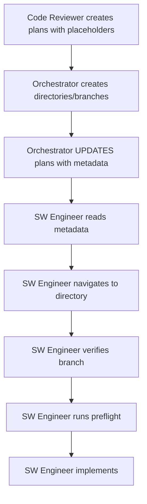

# Split Flow Sequence - Complete Orchestration

## Overview
This document details the EXACT sequence of events for handling splits when an effort exceeds 800 lines. Three agents must coordinate perfectly following rules R199, R202, R204, and R205.

## The Complete Flow

### 🔴 Step 1: Size Violation Detected
**Agent**: SW Engineer or Code Reviewer
**Trigger**: Effort exceeds 800 lines
**Action**: Stop immediately, report to orchestrator

### 🟠 Step 2: Code Reviewer Creates Split Plans
**Agent**: Code Reviewer (SINGLE reviewer per R199)
**Rules**: R199 (single reviewer), R201 (800 line limit)

The Code Reviewer:
1. Analyzes the entire codebase
2. Creates logical groupings under 700 lines each
3. Creates `SPLIT-INVENTORY.md` (master list)
4. Creates timestamped split plans per R301:
   - `SPLIT-PLAN-{effort}-split001-{timestamp}.md`
   - `SPLIT-PLAN-{effort}-split002-{timestamp}.md`
   - `SPLIT-PLAN-{effort}-split003-{timestamp}.md`

**Critical**: Each split plan includes a PLACEHOLDER for orchestrator metadata:
```markdown
# SPLIT-PLAN-api-types-split001-20250120-143000.md
## Split 001 of 3
**Planner**: Code Reviewer ABC

<!-- ⚠️ ORCHESTRATOR METADATA PLACEHOLDER - DO NOT REMOVE ⚠️ -->
<!-- The orchestrator will add infrastructure metadata below -->
<!-- END PLACEHOLDER -->

## Files in This Split
- api/types.go (400 lines)
- api/helpers.go (250 lines)
```

### 🟡 Step 3: Orchestrator Creates Infrastructure
**Agent**: Orchestrator
**Rules**: R204 (create all infrastructure), R196 (orchestrator creates everything)

The Orchestrator:
1. Reads all split plans
2. For EACH split:
   - Creates directory: `efforts/phase1/wave1/api-types--split-001/`
   - Creates branch: `phase1/wave1/api-types--split-from--phase1-wave1-api-types-001`
   - Sets up remote tracking
   - Copies split plan to the directory
   - **UPDATES the split plan with metadata**:

```bash
# Find the timestamped split plan
SPLIT_PLAN=$(ls -t SPLIT-PLAN-*-split001-*.md | head -1)
cat >> "$SPLIT_PLAN" << EOF

## 🚨 SPLIT INFRASTRUCTURE METADATA (Added by Orchestrator)
**WORKING_DIRECTORY**: /workspaces/efforts/phase1/wave1/api-types--split-001
**BRANCH**: phase1/wave1/api-types--split-from--phase1-wave1-api-types-001
**REMOTE**: origin/phase1/wave1/api-types--split-from--phase1-wave1-api-types-001
**BASE_BRANCH**: main
**SPLIT_NUMBER**: 001
**TOTAL_SPLITS**: 3

### SW Engineer Instructions (R205)
1. READ this metadata FIRST
2. cd to WORKING_DIRECTORY above
3. Verify branch matches BRANCH above
4. ONLY THEN proceed with preflight checks
EOF
```

### 🟢 Step 4: SW Engineer Implements Splits
**Agent**: SW Engineer (SINGLE engineer per R202)
**Rules**: R202 (single engineer), R205 (split navigation)

The SW Engineer:
1. Starts in the original too-large effort directory
2. Reads `SPLIT-INVENTORY.md` for overview
3. For EACH split SEQUENTIALLY:

#### 4a. Navigate to Split (R205 - BEFORE preflight!)
```bash
# Read the split plan
SPLIT_PLAN="SPLIT-PLAN-001.md"

# Extract metadata
WORKING_DIR=$(grep "WORKING_DIRECTORY:" "$SPLIT_PLAN" | cut -d: -f2- | xargs)
EXPECTED_BRANCH=$(grep "^BRANCH:" "$SPLIT_PLAN" | head -1 | cut -d: -f2- | xargs)

# Navigate to the directory
cd "$WORKING_DIR"

# Verify branch
CURRENT_BRANCH=$(git branch --show-current)
if [ "$CURRENT_BRANCH" != "$EXPECTED_BRANCH" ]; then
    echo "❌ FATAL: Wrong branch!"
    exit 1
fi
```

#### 4b. NOW Run Preflight Checks
```bash
# Only AFTER navigation, run R001 preflight checks
if [[ $(pwd) != */efforts/phase*/wave*/* ]]; then
    # This will now PASS because we're in the right directory
fi
```

#### 4c. Implement the Split
- Follow the split plan exactly
- Stay under 700 lines
- Commit and push
- Move to next split

### 🔵 Step 5: Integration
**Agent**: Orchestrator
**Action**: Merge splits back in order

## Critical Sequencing Rules

### ❌ WRONG Sequences

#### Wrong: Preflight Before Navigation
```bash
# SW Engineer starts preflight immediately
if [[ $(pwd) != */efforts/* ]]; then
    exit 1  # FAILS because still in wrong directory!
fi
```

#### Wrong: Missing Metadata
```bash
# Orchestrator creates infrastructure but doesn't update split plan
# SW Engineer has no idea where to navigate
```

#### Wrong: Multiple Engineers
```bash
# Orchestrator spawns different engineer for each split
# Causes conflicts and context loss
```

### ✅ CORRECT Sequence



## Rule Coordination

| Step | Agent | Primary Rule | Secondary Rules |
|------|-------|-------------|-----------------|
| Plan splits | Code Reviewer | R199 (single reviewer) | R201 (size limit) |
| Create infrastructure | Orchestrator | R204 (create all) | R196 (orchestrator owns) |
| Update metadata | Orchestrator | R204 (update plans) | - |
| Navigate to split | SW Engineer | R205 (navigate first) | R202 (single engineer) |
| Verify location | SW Engineer | R205 (verify branch) | R177 (directory enforcement) |
| Preflight checks | SW Engineer | R001 (preflight) | R176 (workspace isolation) |
| Implement | SW Engineer | R201 (size limit) | R054 (follow plan) |

## Failure Points and Recovery

### 1. Missing Metadata
**Symptom**: SW Engineer can't find WORKING_DIRECTORY in split plan
**Cause**: Orchestrator didn't update the split plan
**Fix**: Orchestrator must re-run R204 infrastructure creation with updates

### 2. Directory Not Found
**Symptom**: SW Engineer navigates but directory doesn't exist
**Cause**: Orchestrator failed to create infrastructure
**Fix**: Orchestrator must create ALL infrastructure before spawning

### 3. Branch Mismatch
**Symptom**: SW Engineer in directory but wrong branch
**Cause**: Infrastructure setup incomplete
**Fix**: Orchestrator must ensure branch creation and checkout

### 4. Preflight Fails After Navigation
**Symptom**: Even after navigation, preflight checks fail
**Cause**: Navigated to wrong directory or branch naming issue
**Fix**: Verify metadata accuracy in split plan

## Validation Checklist

Before starting splits, verify:
- [ ] Code Reviewer is single reviewer (check .split-reviewer-lock)
- [ ] All split plans created with placeholders
- [ ] Orchestrator created ALL directories
- [ ] Orchestrator created ALL branches with tracking
- [ ] Orchestrator UPDATED all split plans with metadata
- [ ] SW Engineer reads R205 rule
- [ ] SW Engineer navigates BEFORE preflight
- [ ] Single SW Engineer handles ALL splits

## Summary

The key insight is that **R205 (navigation) MUST happen BEFORE R001 (preflight checks)**. This is achieved by:
1. Code Reviewer creates plans with placeholders
2. Orchestrator adds navigation metadata to plans
3. SW Engineer reads metadata and navigates FIRST
4. Only then does SW Engineer run normal checks

This ensures the SW Engineer is always in the correct location before any validation occurs, preventing all downstream issues.