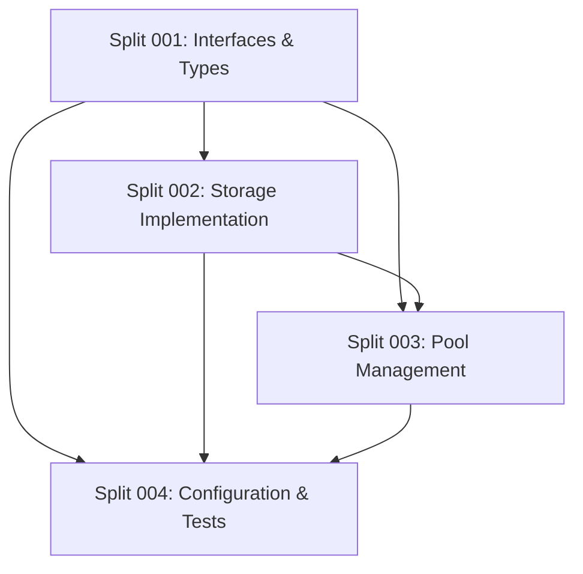

# Complete Split Inventory for E3.1.4-trust-store

**Sole Planner**: Code Reviewer Agent
**Full Path**: phase3/wave1/E3.1.4-trust-store
**Parent Branch**: idpbuidler-oci-mgmt/phase3/wave1/E3.1.4-trust-store
**Total Size**: 1514 lines
**Splits Required**: 4
**Created**: 2025-08-27 02:35:00

## SPLIT INTEGRITY NOTICE
ALL splits below belong to THIS effort ONLY: phase3/wave1/E3.1.4-trust-store
NO splits should reference efforts outside this path!

## Split Overview Table

| Split | Name | Target Size | Actual Size | Status | Priority |
|-------|------|------------|-------------|---------|----------|
| 001 | Core Interfaces & Types | 350 lines | TBD | Planned | P0 - Foundation |
| 002 | Storage Implementation | 380 lines | TBD | Planned | P1 - Core |
| 003 | Pool Management | 390 lines | TBD | Planned | P1 - Core |
| 004 | Configuration & Tests | 394 lines | TBD | Planned | P2 - Integration |

## File Distribution Matrix

| Original File | Lines | Split 001 | Split 002 | Split 003 | Split 004 |
|--------------|-------|-----------|-----------|-----------|-----------|
| storage.go | 556 | interfaces.go (100) | storage.go (250), watch.go (80) | - | - |
| pool.go | 524 | types.go (120) | - | pool.go (200), validation.go (100) | - |
| config.go | 431 | errors.go (50) | - | - | config.go (200), loader.go (80) |
| storage_test.go | 259 | types_test.go (80) | storage_test.go (50) | pool_test.go (90) | integration_test.go (114) |
| **New Files** | - | interfaces.go, types.go, errors.go | watch.go | validation.go | loader.go, integration_test.go |

## Deduplication Verification

### Function/Type Ownership
| Component | Split 001 | Split 002 | Split 003 | Split 004 |
|-----------|-----------|-----------|-----------|-----------|
| Certificate struct | ✅ | ❌ | ❌ | ❌ |
| CertificateStore interface | ✅ | ❌ | ❌ | ❌ |
| FilesystemStore impl | ❌ | ✅ | ❌ | ❌ |
| CertPoolManager | ✅ (interface) | ❌ | ✅ (impl) | ❌ |
| CertificateConfig | ❌ | ❌ | ❌ | ✅ |
| File watching | ❌ | ✅ | ❌ | ❌ |
| Validation logic | ✅ (interface) | ❌ | ✅ (impl) | ❌ |
| Environment loading | ❌ | ❌ | ❌ | ✅ |

## Implementation Dependencies

## Branch Strategy

| Split | Branch Name | Base Branch |
|-------|------------|-------------|
| 001 | `idpbuidler-oci-mgmt/phase3/wave1/E3.1.4-trust-store-split-001` | `main` |
| 002 | `idpbuidler-oci-mgmt/phase3/wave1/E3.1.4-trust-store-split-002` | `split-001` |
| 003 | `idpbuidler-oci-mgmt/phase3/wave1/E3.1.4-trust-store-split-003` | `split-002` |
| 004 | `idpbuidler-oci-mgmt/phase3/wave1/E3.1.4-trust-store-split-004` | `split-003` |

## Size Tracking

### Target vs Limit
- **Hard Limit**: 800 lines per split
- **Safety Target**: 400 lines per split (50% margin)
- **Total Budget**: 1600 lines (4 × 400)
- **Original Size**: 1514 lines
- **Buffer Available**: 86 lines

### Measurement Protocol
1. Measure after every 50 lines added
2. Use `tools/line-counter.sh` exclusively
3. Stop immediately if approaching 400 lines
4. Never exceed 450 lines (final safety)

## Quality Gates

### Per-Split Requirements
- [ ] Compiles independently
- [ ] Under 400 lines (measured)
- [ ] Unit tests included
- [ ] Interfaces unchanged (after Split 001)
- [ ] No circular dependencies

### Integration Requirements
- [ ] All splits integrate cleanly
- [ ] Full test suite passes
- [ ] Performance unchanged
- [ ] Feature parity maintained
- [ ] Documentation complete

## Risk Registry

| Risk | Impact | Mitigation |
|------|--------|-----------|
| Split exceeds size | HIGH | 50% safety margin, frequent measurement |
| Interface changes | HIGH | Lock interfaces in Split 001 |
| Integration failure | MEDIUM | Clear dependency order, integration tests |
| Lost functionality | HIGH | Comprehensive test coverage |
| Circular dependencies | HIGH | Strict layering, interface segregation |

## Implementation Checklist

### Split 001: Core Interfaces & Types
- [ ] Create types.go with all structs
- [ ] Create interfaces.go with all interfaces
- [ ] Create errors.go with error types
- [ ] Add types_test.go with validation
- [ ] Verify <350 lines total
- [ ] Ensure clean compilation

### Split 002: Storage Implementation  
- [ ] Import Split 001 interfaces
- [ ] Create storage.go with filesystem impl
- [ ] Create watch.go for file monitoring
- [ ] Add storage_test.go
- [ ] Verify <380 lines total
- [ ] Test storage operations

### Split 003: Pool Management
- [ ] Import Splits 001 & 002
- [ ] Create pool.go with manager impl
- [ ] Create validation.go with validators
- [ ] Add pool_test.go
- [ ] Verify <390 lines total
- [ ] Test concurrent operations

### Split 004: Configuration & Tests
- [ ] Import all previous splits
- [ ] Create config.go with configuration
- [ ] Create loader.go for config loading
- [ ] Add integration_test.go
- [ ] Verify <394 lines total
- [ ] Run full integration tests

## Verification Matrix

| Verification | Split 001 | Split 002 | Split 003 | Split 004 |
|-------------|-----------|-----------|-----------|-----------|
| Size Check | [ ] | [ ] | [ ] | [ ] |
| Compilation | [ ] | [ ] | [ ] | [ ] |
| Unit Tests | [ ] | [ ] | [ ] | [ ] |
| Integration | N/A | [ ] | [ ] | [ ] |
| Code Review | [ ] | [ ] | [ ] | [ ] |
| Merge Ready | [ ] | [ ] | [ ] | [ ] |

## Notes for Orchestrator

1. **Sequential Implementation Required**: Splits must be implemented in order due to dependencies
2. **Single SW Engineer**: Assign one engineer to all splits for consistency
3. **Review Points**: Code review after each split before proceeding
4. **Size Monitoring**: Enforce measurement every 50-100 lines
5. **Integration Testing**: Full test after Split 004 before merging to parent

## Recovery Instructions

If any split fails or exceeds size:
1. Stop implementation immediately
2. Re-evaluate split boundaries
3. Consider creating sub-splits if needed
4. Update this inventory with new plan
5. Resume from last successful split