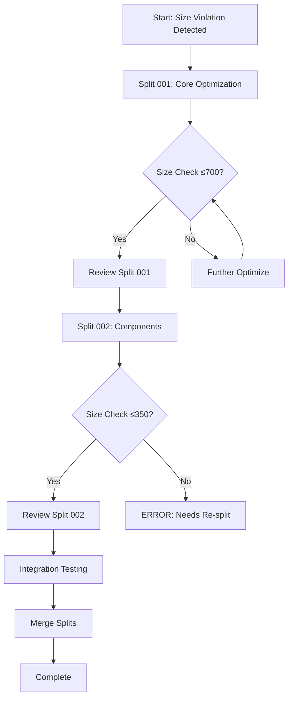

# Complete Split Inventory for effort2-optimizer

**Sole Planner**: Code Reviewer Instance code-reviewer-533480
**Full Path**: phase2/wave2/effort2-optimizer
**Parent Branch**: idpbuidler-oci-mgmt/phase2/wave2/effort2-optimizer
**Total Size**: 864 lines (current implementation)
**Splits Required**: 2
**Created**: 2025-08-26 14:40:00

⚠️ **SPLIT INTEGRITY NOTICE** ⚠️
ALL splits below belong to THIS effort ONLY: phase2/wave2/effort2-optimizer
NO splits should reference efforts outside this path!

## Current State Analysis

### Existing Code Distribution
| Component | File | Current Lines | Issues |
|-----------|------|---------------|--------|
| Analyzer | pkg/oci/optimizer/analyzer.go | 496 | Verbose, can be optimized |
| Optimizer | pkg/oci/optimizer/optimizer.go | 368 | References undefined types |
| Executor | pkg/oci/optimizer/executor.go | 0 | Not implemented (breaking build) |
| GraphBuilder | pkg/oci/optimizer/graph.go | 0 | Not implemented (breaking build) |
| **Total** | | **864** | **Build broken, size exceeded** |

## Split Boundaries (NO OVERLAPS)

| Split | Component Focus | Target Lines | Actual Lines | Files | Status |
|-------|----------------|--------------|--------------|-------|--------|
| 001 | Core + Analyzer | 700 | TBD | analyzer.go, optimizer.go | Planned |
| 002 | Execution + Graph | 350 | TBD | executor.go, graph.go | Planned |

## Detailed Split Breakdown

### Split 001: Core Optimizer with Analyzer
**Branch**: `idpbuidler-oci-mgmt/phase2/wave2/effort2-optimizer-split-001`
**Working Directory**: `efforts/phase2/wave2/effort2-optimizer/split-001/`

**Scope**:
- Optimize and reduce analyzer.go from 496 to ~380 lines
- Fix and complete optimizer.go from 368 to ~320 lines
- Add minimal stub implementations for Executor and GraphBuilder
- Ensure compilation succeeds

**Optimization Tasks**:
1. Consolidate duplicate helper functions in analyzer
2. Extract constants and patterns to reduce repetition
3. Simplify verbose error handling patterns
4. Add stub types to fix compilation

### Split 002: Execution and Graph Components  
**Branch**: `idpbuidler-oci-mgmt/phase2/wave2/effort2-optimizer-split-002`
**Working Directory**: `efforts/phase2/wave2/effort2-optimizer/split-002/`

**Scope**:
- Implement complete Executor (~180 lines)
- Implement complete GraphBuilder (~120 lines)
- Add integration logic (~50 lines)
- Create test stubs for components

**Implementation Tasks**:
1. Build worker pool for parallel execution
2. Implement stage scheduling logic
3. Create dependency graph algorithms
4. Add topological sorting

## Deduplication Matrix

| File/Module | Split 001 | Split 002 | Notes |
|-------------|-----------|-----------|-------|
| analyzer.go | ✅ | ❌ | Optimized in 001 |
| optimizer.go | ✅ | ❌ | Fixed with stubs in 001 |
| executor.go | ❌ (stub only) | ✅ | Stub in 001, full in 002 |
| graph.go | ❌ (stub only) | ✅ | Stub in 001, full in 002 |
| *_test.go files | Partial | Partial | Split by component |

## Dependencies Between Splits

### Split 001 → Split 002
- Split 001 defines interfaces for Executor and GraphBuilder
- Split 002 implements the full functionality
- Integration through well-defined interfaces

### Split 002 → Split 001
- Uses interfaces defined in Split 001
- No modifications to Split 001 code
- Pure implementation of contracts

## Execution Sequence



## Size Verification Strategy

### For Split 001
```bash
# After optimization
cd efforts/phase2/wave2/effort2-optimizer/split-001
$PROJECT_ROOT/tools/line-counter.sh -c idpbuidler-oci-mgmt/phase2/wave2/effort2-optimizer-split-001
# Must show ≤700 lines
```

### For Split 002
```bash
# After implementation
cd efforts/phase2/wave2/effort2-optimizer/split-002
$PROJECT_ROOT/tools/line-counter.sh -c idpbuidler-oci-mgmt/phase2/wave2/effort2-optimizer-split-002
# Must show ≤350 lines
```

## Integration Plan

### Post-Split Integration
1. Merge split-001 branch to parent
2. Merge split-002 branch to parent
3. Run integration tests
4. Verify combined size still under limits
5. Update effort tracking

## Risk Assessment

| Risk | Probability | Impact | Mitigation |
|------|------------|--------|------------|
| Over-optimization breaks functionality | Low | High | Comprehensive tests |
| Split 002 exceeds size | Medium | Medium | Conservative estimates |
| Integration issues | Low | Medium | Clear interfaces |
| Further splits needed | Low | High | Aggressive optimization |

## Verification Checklist

### Pre-Split
- [x] Size violation confirmed (864 > 800)
- [x] Build currently broken (missing types)
- [x] Split boundaries identified
- [x] No file duplication between splits

### During Split
- [ ] Split 001 optimizations preserve functionality
- [ ] Split 001 compiles successfully
- [ ] Split 001 size ≤700 lines
- [ ] Split 002 implements missing components
- [ ] Split 002 size ≤350 lines

### Post-Split
- [ ] Both splits integrate correctly
- [ ] Original functionality preserved
- [ ] Combined size under limit
- [ ] All tests passing
- [ ] No code duplication

## Notes for SW Engineers

### Split 001 Engineer
- Focus on optimization without breaking functionality
- Preserve all test coverage
- Add minimal stubs for Executor/GraphBuilder
- Target 650 lines to leave buffer

### Split 002 Engineer
- Implement full Executor and GraphBuilder
- Follow interfaces from Split 001
- Keep implementation lean
- Target 300 lines to leave buffer

---

**Created by**: Code Reviewer code-reviewer-533480
**Date**: 2025-08-26
**Status**: Ready for Execution