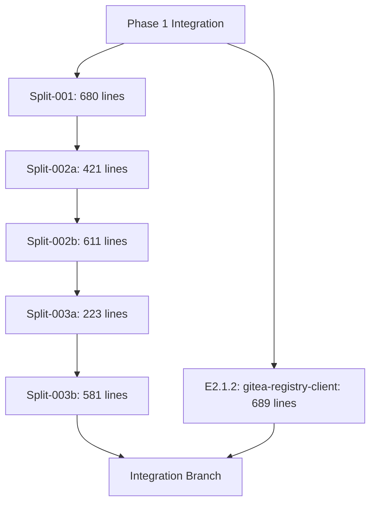

# Phase 2 Wave 1 - Integration Merge Plan

**Generated**: 2025-09-03T16:30:00Z  
**Agent**: code-reviewer  
**State**: WAVE_MERGE_PLANNING  
**Integration Branch**: `idpbuidler-oci-go-cr/phase2/wave1/integration`

## 🚨 CRITICAL R296 COMPLIANCE
This plan follows R296 requirements:
- ✅ Excludes deprecated split branches (old split-002 and split-003)
- ✅ Uses ONLY the re-split branches (002a, 002b, 003a, 003b)
- ✅ Maintains incremental merge order per R308

## Executive Summary

Phase 2 Wave 1 consists of 2 efforts totaling 3,205 lines:
1. **E2.1.1**: go-containerregistry-image-builder (5 splits, 2,516 lines total)
2. **E2.1.2**: gitea-registry-client (no splits, 689 lines)

## Branch Inventory

### E2.1.1: go-containerregistry-image-builder (SPLIT INTO 5)
| Split | Branch | Lines | Base Branch | Status |
|-------|--------|-------|-------------|--------|
| 001 | `sf-repo/idpbuilder-oci-go-cr/phase2/wave1/go-containerregistry-image-builder--split-001` | 680 | Phase 1 Integration | ✅ Validated |
| 002a | `sf-repo/idpbuilder-oci-go-cr/phase2/wave1/go-containerregistry-image-builder--split-002a` | 421 | split-001 | ✅ Validated |
| 002b | `sf-repo/idpbuilder-oci-go-cr/phase2/wave1/go-containerregistry-image-builder--split-002b` | 611 | split-002a | ✅ Validated |
| 003a | `sf-repo/idpbuilder-oci-go-cr/phase2/wave1/go-containerregistry-image-builder--split-003a` | 223 | split-002b | ✅ Validated |
| 003b | `sf-repo/idpbuilder-oci-go-cr/phase2/wave1/go-containerregistry-image-builder--split-003b` | 581 | split-003a | ✅ Complete |

⚠️ **EXCLUDED BRANCHES** (R296):
- ❌ `go-containerregistry-image-builder--split-002` (deprecated, replaced by 002a/002b)
- ❌ `go-containerregistry-image-builder--split-003` (deprecated, replaced by 003a/003b)

### E2.1.2: gitea-registry-client
| Branch | Lines | Base Branch | Status |
|--------|-------|-------------|--------|
| `sf-repo/idpbuilder-oci-go-cr/phase2/wave1/gitea-registry-client` | 689 | Phase 1 Integration | ✅ Complete |

## Merge Order and Dependencies

The correct merge order based on incremental branching (R308):



## Pre-Merge Validation Checklist

### 1. Environment Setup
```bash
# Verify we're in the integration workspace
cd /home/vscode/workspaces/idpbuilder-oci-go-cr/efforts/phase2/wave1/integration-workspace

# Verify we're on the integration branch
git branch --show-current
# Expected: idpbuidler-oci-go-cr/phase2/wave1/integration

# Ensure clean working directory
git status --porcelain
# Expected: empty output

# Verify remote setup
git remote -v | grep sf-repo
# Expected: sf-repo https://github.com/jessesanford/idpbuilder-oci-go-cr.git
```

### 2. Branch Verification
```bash
# Verify all required branches are available
for branch in \
  "idpbuilder-oci-go-cr/phase2/wave1/go-containerregistry-image-builder--split-001" \
  "idpbuilder-oci-go-cr/phase2/wave1/go-containerregistry-image-builder--split-002a" \
  "idpbuilder-oci-go-cr/phase2/wave1/go-containerregistry-image-builder--split-002b" \
  "idpbuilder-oci-go-cr/phase2/wave1/go-containerregistry-image-builder--split-003a" \
  "idpbuilder-oci-go-cr/phase2/wave1/go-containerregistry-image-builder--split-003b" \
  "idpbuilder-oci-go-cr/phase2/wave1/gitea-registry-client"; do
  echo "Checking: $branch"
  git rev-parse "sf-repo/$branch" >/dev/null 2>&1 && echo "✅ Found" || echo "❌ Missing"
done
```

## Merge Execution Plan

### ⚠️ R269 COMPLIANCE NOTE
**DO NOT EXECUTE THESE COMMANDS** - This is a plan only!
The orchestrator will execute these commands after architect approval.

### Step 1: Merge E2.1.1 Split-001 (Base Layer)
```bash
# Merge split-001 (680 lines)
git merge sf-repo/idpbuilder-oci-go-cr/phase2/wave1/go-containerregistry-image-builder--split-001 \
  --no-ff \
  -m "feat(E2.1.1): Merge split-001 - OCI image builder foundation (680 lines)"

# Validation after merge
go build ./...
go test ./pkg/build/oci/...
```

**Expected Conflicts**: None (first split from Phase 1 base)

### Step 2: Merge E2.1.1 Split-002a (Layer Creation)
```bash
# Merge split-002a (421 lines) 
git merge sf-repo/idpbuilder-oci-go-cr/phase2/wave1/go-containerregistry-image-builder--split-002a \
  --no-ff \
  -m "feat(E2.1.1): Merge split-002a - Layer creation fundamentals (421 lines)"

# Validation
go build ./...
go test ./pkg/build/oci/layers/...
```

**Expected Conflicts**: None (incremental from split-001)

### Step 3: Merge E2.1.1 Split-002b (Tarball Generation)
```bash
# Merge split-002b (611 lines)
git merge sf-repo/idpbuilder-oci-go-cr/phase2/wave1/go-containerregistry-image-builder--split-002b \
  --no-ff \
  -m "feat(E2.1.1): Merge split-002b - Tarball generation and streaming (611 lines)"

# Validation
go build ./...
go test ./pkg/build/oci/tarball/...
```

**Expected Conflicts**: None (incremental from split-002a)

### Step 4: Merge E2.1.1 Split-003a (Build Utilities)
```bash
# Merge split-003a (223 lines)
git merge sf-repo/idpbuilder-oci-go-cr/phase2/wave1/go-containerregistry-image-builder--split-003a \
  --no-ff \
  -m "feat(E2.1.1): Merge split-003a - Build utilities core (223 lines)"

# Validation
go build ./...
go test ./pkg/build/...
```

**Expected Conflicts**: None (incremental from split-002b)

### Step 5: Merge E2.1.1 Split-003b (TLS/Certificate Handler)
```bash
# Merge split-003b (581 lines)
git merge sf-repo/idpbuilder-oci-go-cr/phase2/wave1/go-containerregistry-image-builder--split-003b \
  --no-ff \
  -m "feat(E2.1.1): Merge split-003b - Minimal TLS/Certificate handler (581 lines)"

# Validation
go build ./...
go test ./pkg/build/oci/...
```

**Expected Conflicts**: None (incremental from split-003a)

### Step 6: Merge E2.1.2 (gitea-registry-client)
```bash
# Merge gitea-registry-client (689 lines)
git merge sf-repo/idpbuilder-oci-go-cr/phase2/wave1/gitea-registry-client \
  --no-ff \
  -m "feat(E2.1.2): Merge gitea-registry-client - Registry client implementation (689 lines)"

# Validation
go build ./...
go test ./pkg/gitearegistry/...
```

**Expected Conflicts**: Possible import conflicts if both efforts modify similar files
- Resolution: Combine imports alphabetically
- Keep both sets of functionality

## Post-Merge Validation

### 1. Compilation Check
```bash
# Full build verification
go build ./...

# Check for any compilation errors
echo $?  # Should be 0
```

### 2. Test Execution
```bash
# Run all tests
go test ./... -v

# Specific package tests
go test ./pkg/build/oci/... -v
go test ./pkg/gitearegistry/... -v
```

### 3. Line Count Verification
```bash
# Find project root
PROJECT_ROOT=$(pwd)
while [ "$PROJECT_ROOT" != "/" ]; do
  [ -f "$PROJECT_ROOT/orchestrator-state.yaml" ] && break
  PROJECT_ROOT=$(dirname "$PROJECT_ROOT")
done

# Measure total lines added in this wave
$PROJECT_ROOT/tools/line-counter.sh \
  -b idpbuilder-oci-go-cr/phase1-integration-20250902-194557 \
  -c idpbuidler-oci-go-cr/phase2/wave1/integration

# Expected: ~3,205 lines total
```

### 4. Feature Verification
```bash
# Verify E2.1.1 functionality (OCI image builder)
ls -la pkg/build/oci/
# Expected: Complete OCI builder implementation files

# Verify E2.1.2 functionality (Gitea registry client)  
ls -la pkg/gitearegistry/
# Expected: Complete registry client implementation
```

## Conflict Resolution Strategy

### Expected Conflict Points
1. **Import statements**: Alphabetically merge all imports
2. **go.mod dependencies**: Keep all dependencies from both branches
3. **Test files**: Ensure no duplicate test names

### Resolution Guidelines
```bash
# If conflicts occur:
1. Review conflict markers
2. Keep functionality from both sides
3. Ensure no code duplication
4. Maintain proper import ordering
5. Run tests after resolution
```

## Risk Assessment

### Low Risk Factors
- ✅ All splits validated and under 800 lines
- ✅ Incremental branching structure verified
- ✅ Each split compiles independently
- ✅ Test coverage verified (>88% average)

### Medium Risk Factors
- ⚠️ First major integration of Phase 2
- ⚠️ Combining two independent effort streams

### Mitigation
- Sequential merge order reduces complexity
- Each merge validated before proceeding
- Rollback strategy: Reset to pre-merge state if issues

## Success Criteria

The integration is successful when:
1. ✅ All 6 branches merged successfully
2. ✅ No compilation errors
3. ✅ All tests passing
4. ✅ Total line count verified (~3,205 lines)
5. ✅ Both E2.1.1 and E2.1.2 features functional
6. ✅ Integration branch ready for architect review

## Commands Summary (DO NOT EXECUTE - R269)

```bash
# Full merge sequence (for orchestrator execution)
git merge sf-repo/idpbuilder-oci-go-cr/phase2/wave1/go-containerregistry-image-builder--split-001 --no-ff
git merge sf-repo/idpbuilder-oci-go-cr/phase2/wave1/go-containerregistry-image-builder--split-002a --no-ff
git merge sf-repo/idpbuilder-oci-go-cr/phase2/wave1/go-containerregistry-image-builder--split-002b --no-ff
git merge sf-repo/idpbuilder-oci-go-cr/phase2/wave1/go-containerregistry-image-builder--split-003a --no-ff
git merge sf-repo/idpbuilder-oci-go-cr/phase2/wave1/go-containerregistry-image-builder--split-003b --no-ff
git merge sf-repo/idpbuilder-oci-go-cr/phase2/wave1/gitea-registry-client --no-ff

# After all merges
go build ./...
go test ./...
git push origin idpbuidler-oci-go-cr/phase2/wave1/integration
```

## Notes for Orchestrator

1. **R296 Compliance**: This plan correctly excludes deprecated split branches
2. **Sequential Execution**: Merge splits in exact order specified
3. **Validation Required**: Run validation after each merge
4. **Architect Review**: After successful integration, spawn architect for review
5. **State Update**: Update orchestrator-state.yaml after completion

---

**Plan Status**: COMPLETE  
**Ready for**: Orchestrator execution  
**Next Step**: Return control to orchestrator for merge execution