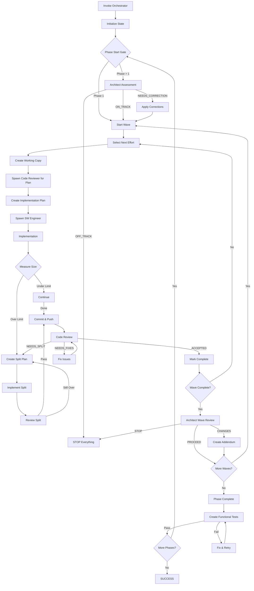

# Orchestrator Master Operations Guide

## Executive Summary

This document provides a complete operational blueprint for setting up and running the Software Factory using the @agent-orchestrator-task-master as the central coordinator. It covers all files, directory structures, agent interactions, and workflows required to successfully implement efforts across multiple phases and waves.

## System Architecture Overview

```
┌─────────────────────────────────────────────────────────────┐
│                    OPERATOR (You)                            │
│  - Sets up directory structure                               │
│  - Provides configuration files                              │
│  - Invokes orchestrator with /continue-orchestrating         │
└─────────────────────────────────────────────────────────────┘
                            │
                            ▼
┌─────────────────────────────────────────────────────────────┐
│         ORCHESTRATOR (orchestrator-task-master)              │
│  - Reads state machine and plans                             │
│  - Manages state file                                        │
│  - Spawns and coordinates agents                             │
│  - Never writes code (coordination only)                     │
└─────────────────────────────────────────────────────────────┘
                            │
        ┌───────────────────┼───────────────────┐
        ▼                   ▼                   ▼
┌──────────────┐   ┌──────────────┐   ┌──────────────┐
│  ARCHITECT   │   │CODE REVIEWER │   │ SW ENGINEER  │
│  architect-  │   │    code-     │   │     sw-      │
│   reviewer   │   │   reviewer   │   │   engineer   │
└──────────────┘   └──────────────┘   └──────────────┘
```

## Part 1: Directory Structure Setup

### Optimal Directory Layout

```
/workspaces/
├── [project-name]/                       # Your project repository
│   ├── .claude/
│   │   ├── agents/                       # Agent configurations
│   │   ├── commands/
│   │   │   └── continue-orchestrating.md
│   │   └── CLAUDE.md                     # Global rules for all agents
│   │
│   └── orchestrator/                     # All orchestrator docs
│       ├── SOFTWARE-FACTORY-STATE-MACHINE.md
│       ├── PROJECT-IMPLEMENTATION-PLAN.md
│       ├── ORCHESTRATOR-TASKMASTER-EXECUTION-PLAN.md
│       ├── orchestrator-state.yaml       # STATE FILE (version controlled)
│       │
│       ├── PHASE1-SPECIFIC-IMPL-PLAN.md
│       ├── PHASE2-SPECIFIC-IMPL-PLAN.md
│       ├── PHASE[N]-SPECIFIC-IMPL-PLAN.md
│       │
│       ├── SW-ENGINEER-EXPLICIT-INSTRUCTIONS.md
│       ├── SW-ENGINEER-STARTUP-REQUIREMENTS.md
│       ├── TEST-DRIVEN-VALIDATION-REQUIREMENTS.md
│       │
│       ├── CODE-REVIEWER-COMPREHENSIVE-GUIDE.md
│       ├── CODE-REVIEWER-QUICK-REFERENCE.md
│       ├── CODE-REVIEWER-EFFORT-PLANNING-INSTRUCTIONS.md
│       │
│       ├── WAVE-COMPLETION-ARCHITECT-REVIEW-PROTOCOL.md
│       ├── PHASE-START-ARCHITECT-REVIEW-PROTOCOL.md
│       ├── ARCHITECT-REVIEWER-WAVE-INSTRUCTIONS.md
│       │
│       ├── EFFORT-SPLIT-CONTINUOUS-EXECUTION-PROTOCOL.md
│       ├── ORCHESTRATOR-EFFORT-PLANNING-PROTOCOL.md
│       ├── PHASE-COMPLETION-FUNCTIONAL-TESTING.md
│       │
│       └── phase{X}/                     # Review artifacts
│           └── wave{Y}/
│               └── effort{Z}/
│                   └── code-review/
│
├── efforts/                               # Working copies for implementation
│   └── phase{X}/
│       └── wave{Y}/
│           └── effort{Z}-{name}/          # Working copy
│               ├── .git/
│               ├── [source directories]
│               ├── EFFORT-IMPLEMENTATION-PLAN-*.md
│               └── WORK-LOG.md
│
├── tools/                                 # Shared utilities
│   └── line-counter.sh                   # Code size measurement tool
│
└── tests/                                 # Test environments
    └── phase{X}-functional/
        └── test-harness.sh
```

## Part 2: Critical Files and Their Purposes

### Configuration Files (Read at Startup)

| File | Purpose | When Read | Who Reads |
|------|---------|-----------|-----------|
| **SOFTWARE-FACTORY-STATE-MACHINE.md** | Complete workflow definition | FIRST - at startup | Orchestrator |
| **PROJECT-IMPLEMENTATION-PLAN.md** | Master plan with all efforts | Initial state creation | Orchestrator |
| **ORCHESTRATOR-TASKMASTER-EXECUTION-PLAN.md** | HOW to execute tasks | Always at startup | Orchestrator |
| **orchestrator-state.yaml** | Current progress tracking | Continuously | Orchestrator |
| **.claude/CLAUDE.md** | Global agent rules | Before tasking agents | Orchestrator (to reference) |

### Phase Plans (Referenced Throughout)

| File | Content | When Used | Created By |
|------|---------|-----------|------------|
| **PHASE{1-N}-SPECIFIC-IMPL-PLAN.md** | Detailed effort requirements, library choices, reuse mandates | When starting efforts in that phase | Code Reviewer as Senior Maintainer |
| **PHASE{X}-IMPLEMENTATION-ADDENDUM-WAVE{Y}-*.md** | Architectural corrections | If created after wave review | Architect Reviewer |
| **PHASE{X}-COURSE-CORRECTION-*.md** | Feature gap corrections | If created after phase assessment | Architect Reviewer |

#### Phase Planning Workflow
1. **Before Phase Start**: Orchestrator spawns Code Reviewer as Senior Maintainer
2. **Code Reviewer Creates**: PHASE[X]-SPECIFIC-IMPL-PLAN.md with:
   - Specific library versions
   - Reuse enforcement from previous phases
   - Critical code snippets (10-30 lines max)
   - Interface contracts
3. **Orchestrator Uses Plan**: To break down into waves and efforts
4. **SW Engineers Follow**: The detailed guidance without reimplementing

### Agent Instruction Files

#### For SW Engineers
| File | Purpose | When Provided |
|------|---------|---------------|
| **SW-ENGINEER-EXPLICIT-INSTRUCTIONS.md** | Core implementation rules | Every task |
| **SW-ENGINEER-STARTUP-REQUIREMENTS.md** | Startup protocol | Every task |
| **TEST-DRIVEN-VALIDATION-REQUIREMENTS.md** | Testing requirements | Every task |
| **EFFORT-IMPLEMENTATION-PLAN-*.md** | Specific effort plan | Created by Code Reviewer |

#### For Code Reviewers
| File | Purpose | When Provided |
|------|---------|---------------|
| **CODE-REVIEWER-EFFORT-PLANNING-INSTRUCTIONS.md** | How to create effort plans | Planning tasks |
| **CODE-REVIEWER-COMPREHENSIVE-GUIDE.md** | Review process | Review tasks |
| **CODE-REVIEWER-QUICK-REFERENCE.md** | Quick checks | Review tasks |

#### For Architects
| File | Purpose | When Provided |
|------|---------|---------------|
| **ARCHITECT-REVIEWER-WAVE-INSTRUCTIONS.md** | Review protocols | Wave/phase reviews |
| **WAVE-COMPLETION-ARCHITECT-REVIEW-PROTOCOL.md** | Wave review process | Wave completion |
| **PHASE-START-ARCHITECT-REVIEW-PROTOCOL.md** | Phase assessment | Phase start |

## Part 3: State Machine Workflow

### Complete State Flow



## Part 4: Orchestrator State File

### orchestrator-state.yaml Structure

```yaml
# Current position in state machine
current_phase: 1
current_wave: 1
current_state: "WAVE_START"

# Effort tracking
efforts_completed:
  - phase: 1
    wave: 1
    effort: 1
    name: "api-types-core"
    status: "COMPLETE"
    lines: 650
    branch: "phase1/wave1/effort1-api-types-core"
    splits: []

efforts_in_progress:
  - phase: 1
    wave: 1
    effort: 2
    name: "synctarget-types"
    status: "IMPLEMENTATION"
    assigned_agent: "sw-engineer"
    working_dir: "/workspaces/efforts/phase1/wave1/effort2-synctarget-types"

efforts_pending:
  - phase: 1
    wave: 1
    effort: 3
    name: "negotiated-types"

# Review outcomes
phase_assessments:
  - phase: 2
    assessment: "ON_TRACK"
    date: "2025-01-20"
    notes: "Feature coverage aligned with plan"

wave_reviews:
  - wave: "1.1"
    decision: "PROCEED"
    issues: []
    
# Architectural addendums
addendums:
  - wave: "2.3"
    file: "PHASE2-IMPLEMENTATION-ADDENDUM-WAVE3-validation-fix.md"
    reason: "Validation framework adjustment"
```

## Part 5: Agent Interaction Protocols

### 0. Spawning Code Reviewer for Phase Planning (Senior Maintainer Mode)

**CRITICAL**: Before starting any phase, create detailed implementation plans.

```markdown
Task @agent-code-reviewer:

Act as SENIOR PROJECT MAINTAINER to create Phase [X] detailed implementation plan.

⚠️ CRITICAL RULES:
1. DO NOT write complete implementations (max 30 lines per complex section)
2. MUST enforce reuse from previous phases
3. MUST select specific library versions
4. MUST prevent duplication

CONTEXT:
- Project: [PROJECT_NAME]
- Phase: [X] - [PHASE_NAME]
- Previous Phase Status: [COMPLETE/NA]
- Base Branch: [phase(X-1)-integration or main]

REQUIRED READING:
1. PROJECT-IMPLEMENTATION-PLAN.md
2. phase-plans/PHASE-IMPL-PLAN-TEMPLATE.md
3. PLANNING-AGENT-ASSIGNMENTS.md (your maintainer role)
4. Previous phase plans if exist

DELIVERABLE: PHASE[X]-SPECIFIC-IMPL-PLAN.md with:
- Library selections with versions
- Reuse enforcement from previous phases
- Critical code snippets (10-30 lines only)
- Interface contracts
- Wave/effort breakdown
- Forbidden duplications list

Reference: agent-instructions/code-reviewer-phase-planning.md
```

### 1. Spawning Code Reviewer for Effort Planning

```markdown
Task @agent-code-reviewer:

MANDATORY STARTUP: Follow /workspaces/[project]/orchestrator/STARTUP-REQUIREMENTS.md

PURPOSE: Create implementation plan for Effort E{X}.{Y}.{Z}

CONTEXT:
- Working directory: /workspaces/efforts/phase{X}/wave{Y}/effort{Z}-{name}
- Branch: phase{X}/wave{Y}/effort{Z}-{name}

INSTRUCTIONS:
1. READ: /workspaces/[project]/phase-plans/PHASE{X}-SPECIFIC-IMPL-PLAN.md
2. ANALYZE: Requirements for this effort
3. CREATE: EFFORT-IMPLEMENTATION-PLAN-E{X}.{Y}.{Z}.md
4. CREATE: WORK-LOG.md from template

DELIVERABLES:
- Implementation plan with step-by-step instructions
- Work log template for tracking progress
```

### 2. Spawning SW Engineer for Implementation

```markdown
Task @agent-sw-engineer:

MANDATORY STARTUP: Follow /workspaces/[project]/orchestrator/SW-ENGINEER-STARTUP-REQUIREMENTS.md

PURPOSE: Implement Effort E{X}.{Y}.{Z}

CONTEXT:
- Working directory: /workspaces/efforts/phase{X}/wave{Y}/effort{Z}-{name}
- Branch: phase{X}/wave{Y}/effort{Z}-{name}

INSTRUCTIONS:
1. READ: EFFORT-IMPLEMENTATION-PLAN-E{X}.{Y}.{Z}.md
2. READ: /workspaces/[project]/orchestrator/SW-ENGINEER-EXPLICIT-INSTRUCTIONS.md
3. IMPLEMENT: Follow the plan exactly
4. MEASURE: Run line counter after each logical change
5. UPDATE: WORK-LOG.md as you progress
6. COMMIT: When complete and under size limit

SIZE LIMIT: {configured_limit} lines (excluding generated code)
```

### 3. Spawning Architect for Reviews

```markdown
Task @agent-architect-reviewer:

MANDATORY STARTUP: Verify environment

PURPOSE: Review Wave {X}.{Y} for architectural consistency

REVIEW:
1. READ: orchestrator-state.yaml (efforts_completed section)
2. CHECK: All efforts for architectural alignment
3. ASSESS: Multi-tenancy, workspace isolation, patterns
4. DECIDE: PROCEED / CHANGES_REQUIRED / STOP

OUTPUT: Clear decision with specific issues if any
```

## Part 6: Size Management Protocol

### Continuous Measurement

```bash
# After every logical change
/workspaces/tools/line-counter.sh -c {branch}

# Thresholds
WARNING: {warning_threshold} lines
HARD_STOP: {max_threshold} lines
```

### Split Protocol

When effort exceeds limit:

1. **Code Reviewer Creates Split Plan**
2. **Sequential Implementation** (NEVER parallel)
3. **Each Split Gets Review**
4. **Recursive if Still Over Limit**

## Part 7: Critical Success Factors

### 🎯 MUST DO

1. **Version Control State File**: Commit orchestrator-state.yaml frequently
2. **Measure Continuously**: After every logical change
3. **Review Everything**: Including splits
4. **Follow Gates**: Never skip phase/wave reviews
5. **Document Issues**: In state file and review artifacts

### ⛔ NEVER DO

1. **Parallel Splits**: Always sequential
2. **Skip Reviews**: Every effort needs review
3. **Ignore Size**: Measure continuously
4. **Mix Workspaces**: Keep efforts isolated
5. **Orchestrator Writes Code**: Coordination only

## Part 8: Phase Completion Functional Testing

### Critical Gate Before Phase Transition

Per **PHASE-COMPLETION-FUNCTIONAL-TESTING.md**, EVERY phase must pass functional tests before transitioning to the next phase.

### Testing Workflow

1. **When Phase Complete**:
   ```bash
   # All waves done, create test environment
   TEST_DIR="/workspaces/tests/phase${PHASE_NUM}-functional"
   mkdir -p "$TEST_DIR"
   cd "$TEST_DIR"
   git checkout phase${PHASE_NUM}-integration
   ```

2. **Task Code Reviewer to Create Test Harness**:
   ```markdown
   Task @agent-code-reviewer to design functional test harness
   Reference: protocols/PHASE-COMPLETION-FUNCTIONAL-TESTING.md
   Create interactive test script showing all phase features work
   ```

3. **Run Tests**:
   - Execute test harness
   - Verify all features work
   - Document results
   - Tests MUST PASS to proceed

4. **If Tests Fail**:
   - Task SW Engineer to fix issues
   - Re-run tests
   - Cannot proceed until PASSED

### Why This Matters

- **Quality Gate**: Ensures phase truly complete
- **User Validation**: Stakeholders can verify features
- **Regression Prevention**: Catch integration issues early
- **Clear Demonstration**: Shows working functionality

## Part 9: Troubleshooting Guide

### Common Issues and Solutions

| Issue | Cause | Solution |
|-------|-------|----------|
| Effort >limit after implementation | Not measuring during | Implement split protocol |
| Architectural drift | Skipped wave review | Run architect review immediately |
| Merge conflicts | Working in wrong branch | Verify workspace isolation |
| Lost progress | State not committed | Commit orchestrator-state.yaml frequently |
| Agent confusion | Missing startup protocol | Always include startup requirements |

## Part 9: Performance Metrics

### Track These KPIs

```yaml
metrics:
  velocity:
    efforts_per_day: Calculate from state file
    
  quality:
    first_pass_reviews: Track in state file
    split_frequency: Indicates planning quality
    
  compliance:
    size_violations: Should be 0
    gate_skips: Must be 0
    
  progress:
    feature_coverage: (Completed / Total) × 100
    phase_completion: Track milestones
```

## Part 10: Operational Checklist

### Daily Operations

- [ ] Check orchestrator-state.yaml is current
- [ ] Verify no stuck efforts in progress
- [ ] Review any architectural addendums
- [ ] Commit state file changes
- [ ] Run `/continue-orchestrating` to resume

### Wave Completion

- [ ] All efforts marked complete
- [ ] Architect review scheduled
- [ ] State file updated
- [ ] Integration branch prepared

### Phase Completion

- [ ] All waves complete
- [ ] Create functional test harness per PHASE-COMPLETION-FUNCTIONAL-TESTING.md
- [ ] Task Code Reviewer to design interactive test script
- [ ] Run functional tests and verify all features work
- [ ] Tests must PASS before proceeding to next phase
- [ ] Phase assessment scheduled after tests pass
- [ ] Integration branch created
- [ ] Documentation updated

## Summary

This operations guide provides everything needed to run the Software Factory successfully. The key is maintaining discipline around the state machine, measurement protocols, and review gates. The orchestrator coordinates but never implements - maintaining this separation of concerns is critical for system integrity.