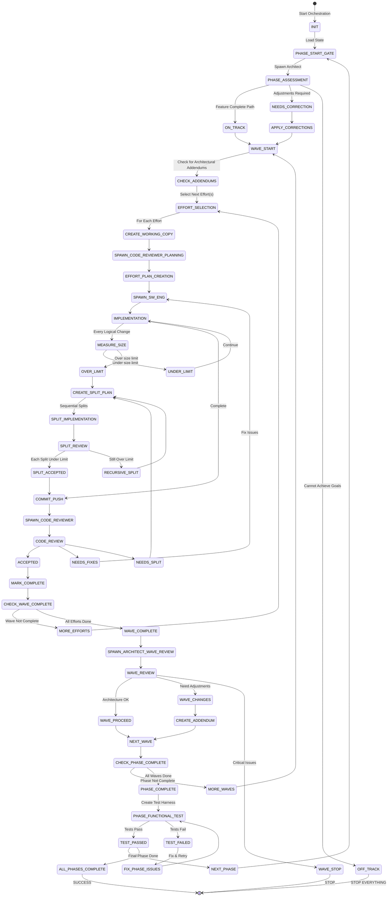

# Software Factory State Machine

## Overview

This document describes the complete state machine for iterative/incremental software development using multiple agent types coordinated by an orchestrator. The system implements multiple efforts across phases and waves with quality gates and review loops.

## State Machine Diagram



## Agent Types and Responsibilities

| Agent Type | Symbol | Primary States | Responsibilities |
|------------|--------|---------------|------------------|
| **Orchestrator** | 🎯 | INIT, EFFORT_SELECTION, CHECK_WAVE_COMPLETE | Coordinates all agents, manages state, enforces gates |
| **Architect Reviewer** | 🏗️ | PHASE_ASSESSMENT, WAVE_REVIEW | Reviews architecture, assesses feature completeness |
| **Code Reviewer** | 👁️ | EFFORT_PLAN_CREATION, CODE_REVIEW | Creates effort plans, reviews implementation |
| **SW Engineer** | 💻 | IMPLEMENTATION, SPLIT_IMPLEMENTATION | Implements code, fixes issues |

## Major State Loops

### 1. Phase Loop (Outermost)
```
┌─────────────────────────────────────────────┐
│ PHASE_START_GATE → Assessment → Phase Work  │
│         ↑                            ↓       │
│         └──── Phase Complete ← ──────┘       │
└─────────────────────────────────────────────┘
```

**Gates**: 
- Phase Start: Feature completeness assessment
- Phase End: Functional testing per PHASE-COMPLETION-FUNCTIONAL-TESTING.md
- Phase Transition: Integration branch creation + test pass

### 2. Wave Loop (Per Phase)
```
┌─────────────────────────────────────────────┐
│ WAVE_START → Efforts → Wave Review          │
│      ↑                        ↓             │
│      └──── Next Wave ← ───────┘             │
└─────────────────────────────────────────────┘
```

**Gates**:
- Wave Start: Check for addendums
- Wave End: Architectural consistency review

### 3. Effort Loop (Per Wave)
```
┌─────────────────────────────────────────────┐
│ EFFORT_SELECT → Plan → Implement → Review   │
│       ↑                              ↓      │
│       └──── Next Effort ← ───────────┘      │
└─────────────────────────────────────────────┘
```

**Gates**:
- Effort Start: Code Reviewer creates plan
- Effort End: Code review must pass

### 4. Split Loop (When Over Size Limit)
```
┌─────────────────────────────────────────────┐
│ MEASURE → Split Plan → Implement → Review   │
│     ↑                                ↓       │
│     └─── Still Over Limit? ← ────────┘       │
└─────────────────────────────────────────────┘
```

**Characteristics**:
- SEQUENTIAL execution (never parallel)
- Recursive if splits still over limit
- Each split gets full review

### 5. Fix Loop (Review Failures)
```
┌─────────────────────────────────────────────┐
│ REVIEW → Issues Found → Fix → Review Again  │
│    ↑                              ↓         │
│    └──── Still Issues? ← ─────────┘         │
└─────────────────────────────────────────────┘
```

## State Transition Table

| Current State | Trigger | Next State | Agent | Action |
|--------------|---------|------------|-------|--------|
| INIT | Start | PHASE_START_GATE | 🎯 | Load orchestrator state |
| PHASE_START_GATE | Phase > 1 | PHASE_ASSESSMENT | 🏗️ | Assess feature completeness |
| PHASE_ASSESSMENT | Assessment done | ON_TRACK/NEEDS_CORRECTION/OFF_TRACK | 🏗️ | Provide decision |
| OFF_TRACK | Critical gap | STOP | 🎯 | Halt implementation |
| WAVE_START | New wave | CHECK_ADDENDUMS | 🎯 | Read architectural addendums |
| EFFORT_SELECTION | Effort chosen | CREATE_WORKING_COPY | 🎯 | Setup working copy |
| CREATE_WORKING_COPY | Ready | SPAWN_CODE_REVIEWER_PLANNING | 🎯 | Task Code Reviewer |
| EFFORT_PLAN_CREATION | Plan ready | SPAWN_SW_ENG | 👁️ | Create implementation plan |
| IMPLEMENTATION | Code written | MEASURE_SIZE | 💻 | Run size measurement |
| MEASURE_SIZE | Over limit | CREATE_SPLIT_PLAN | 👁️ | Design split strategy |
| CODE_REVIEW | Issues found | NEEDS_FIXES | 👁️ | Document issues |
| WAVE_COMPLETE | All efforts done | SPAWN_ARCHITECT_WAVE_REVIEW | 🎯 | Request architecture review |
| WAVE_REVIEW | Critical issues | WAVE_STOP | 🏗️ | Stop implementation |
| PHASE_COMPLETE | All waves done | PHASE_FUNCTIONAL_TEST | 🎯 | Create test harness per protocol |
| PHASE_FUNCTIONAL_TEST | Tests created | TEST_PASSED/TEST_FAILED | 👁️ | Run functional tests |
| TEST_FAILED | Issues found | FIX_PHASE_ISSUES | 💻 | Fix failing tests |
| TEST_PASSED | Tests successful | NEXT_PHASE | 🎯 | Proceed to next phase |

## Parallelization Rules

### Can Run in Parallel ✅
```yaml
# Independent efforts with no dependencies
wave_efforts:
  parallel: [effort1, effort2, effort3]  # If truly independent
  
# Independent test suites
testing:
  parallel: [unit_tests, integration_tests, e2e_tests]
```

### Must Run Sequentially ⛔
```yaml
critical_sequences:
  - base_framework → dependent_features
  - core_engine → extensions
  - ALL SPLITS  # Never parallel
```

## Quality Gates and Checkpoints

### 1. Size Gates (Continuous)
| Measurement Point | Warning Threshold | Hard Stop | Action |
|------------------|-------------------|-----------|--------|
| Every logical change | Configurable | Configurable | Plan for split if approaching |
| Before commit | - | Max allowed | MUST split |
| After split | - | Max allowed | Recursive split required |

### 2. Review Gates (Per Effort)
| Review Type | When | Pass Criteria |
|------------|------|---------------|
| Code Review | After implementation | No critical issues |
| Split Review | Each split branch | Under size limit + quality |
| Fix Review | After fixes | Issues resolved |

### 3. Architecture Gates (Per Wave/Phase)
| Gate Type | When | Decisions |
|-----------|------|-----------|
| Wave Completion | End of each wave | PROCEED / CHANGES / STOP |
| Phase Start | Before new phase | ON_TRACK / CORRECTION / OFF_TRACK |

## State Machine Implementation

### Orchestrator Main Loop
```python
class OrchestratorStateMachine:
    def __init__(self):
        self.state = "INIT"
        self.phase = 1
        self.wave = 1
        self.effort = 1
        
    def run(self):
        while self.state != "SUCCESS" and self.state != "STOP":
            self.state = self.transition(self.state)
            
    def transition(self, current_state):
        transitions = {
            "INIT": self.initialize,
            "PHASE_START_GATE": self.phase_start_review,
            "WAVE_START": self.start_wave,
            "EFFORT_SELECTION": self.select_effort,
            "CREATE_WORKING_COPY": self.create_workspace,
            "SPAWN_CODE_REVIEWER_PLANNING": self.task_plan_creation,
            "SPAWN_SW_ENG": self.task_implementation,
            "CODE_REVIEW": self.review_code,
            "CHECK_WAVE_COMPLETE": self.check_wave,
            "WAVE_COMPLETE": self.wave_review,
            "CHECK_PHASE_COMPLETE": self.check_phase,
            "PHASE_FUNCTIONAL_TEST": self.create_functional_tests,
            "TEST_FAILED": self.handle_test_failure,
        }
        return transitions[current_state]()
```

### Agent Spawn Protocol
```python
def spawn_agent(agent_type, task):
    """
    Spawn appropriate agent with task
    """
    agents = {
        "architect": "architect-reviewer",
        "code_reviewer": "code-reviewer", 
        "sw_engineer": "sw-engineer",
        "orchestrator": "orchestrator-task-master"
    }
    
    # Ensure startup protocol
    task = f"""
    MANDATORY STARTUP:
    - Print timestamp
    - Verify environment
    - Read instruction files
    
    {task}
    """
    
    return Task(agent=agents[agent_type], prompt=task)
```

## Failure Recovery States

### Recovery Mechanisms
| Failure Type | Recovery State | Recovery Action |
|-------------|---------------|-----------------|
| Size violation | CREATE_SPLIT_PLAN | Split into smaller branches |
| Review failure | NEEDS_FIXES | Task SW-Eng to fix |
| Architecture drift | WAVE_CHANGES | Apply addendum |
| Feature gap | NEEDS_CORRECTION | Adjust phase plans |
| Critical failure | OFF_TRACK | Stop and reassess |

## Success Criteria

### Phase Success
```yaml
phase_complete:
  - all_waves: COMPLETE
  - functional_tests: PASSED  # Per PHASE-COMPLETION-FUNCTIONAL-TESTING.md
  - integration_branch: CREATED
  - architect_review: PASSED
  - tests: PASSING
```

### Wave Success
```yaml
wave_complete:
  - all_efforts: COMPLETE
  - architect_review: PROCEED or PROCEED_WITH_CHANGES
  - no_blockers: TRUE
```

### Effort Success
```yaml
effort_complete:
  - implementation: DONE
  - size: Within limit
  - review: ACCEPTED
  - tests: PASSING
  - committed: TRUE
  - pushed: TRUE
```

## Measurement and Tracking

### State Metrics
```yaml
orchestrator_state:
  current_phase: X
  current_wave: Y
  efforts_completed: N
  efforts_remaining: M
  
  phase_assessments:
    - phase: X
      assessment: ON_TRACK
      confidence: 0.95
      
  wave_reviews:
    - wave: "X.Y"
      decision: PROCEED
      issues: 0
      
  effort_metrics:
    - effort: "E.X.Y.Z"
      lines: XXX
      review_status: ACCEPTED
      split_count: 0
```

### Performance Indicators
| Metric | Target | Measurement |
|--------|--------|-------------|
| Feature Coverage | 100% | (Implemented / Required) × 100 |
| Size Compliance | 100% | Efforts within limit / Total |
| Review Pass Rate | >80% | First-pass reviews / Total |
| Architectural Drift | 0 | STOP decisions |

## Anti-Patterns to Avoid

### ❌ Never Do This
1. **Parallel Splits**: Splits depend on each other
2. **Skip Reviews**: Every effort needs review
3. **Ignore Size**: Measure continuously
4. **Skip Gates**: All gates are mandatory
5. **Mix Workspaces**: Agents confined to assigned workspace

### ✅ Always Do This
1. **Measure Early**: After every logical change
2. **Plan Splits**: Before hitting size limit
3. **Review Everything**: Including splits
4. **Check Gates**: Phase start and wave end
5. **Track State**: Commit orchestrator-state.yaml

## Terminal States

### SUCCESS State
```yaml
conditions:
  - final_phase: COMPLETE
  - all_waves: COMPLETE
  - all_tests: PASSING
  - feature_coverage: 100%
  - final_review: ACCEPTED
```

### STOP States
```yaml
stop_conditions:
  - phase_assessment: OFF_TRACK
  - wave_review: STOP
  - critical_architecture_violation: TRUE
  - unrecoverable_error: TRUE
```

## Continuous Execution Protocol

The state machine MUST continue execution without stopping between states unless reaching a terminal state (SUCCESS or STOP). This is critical for:

1. **Split Handling**: Continue through all splits
2. **Fix Cycles**: Complete all fixes
3. **Wave Completion**: Finish all efforts
4. **Phase Transitions**: Move to next phase

```python
# Continuous execution example
while not is_terminal_state(current_state):
    current_state = execute_transition(current_state)
    commit_state()  # Persist progress
    
    # Only stop for critical gates
    if current_state in ["OFF_TRACK", "WAVE_STOP"]:
        break
```

This state machine ensures systematic, quality-controlled progress through all efforts while maintaining architectural integrity and working toward feature-complete functionality.