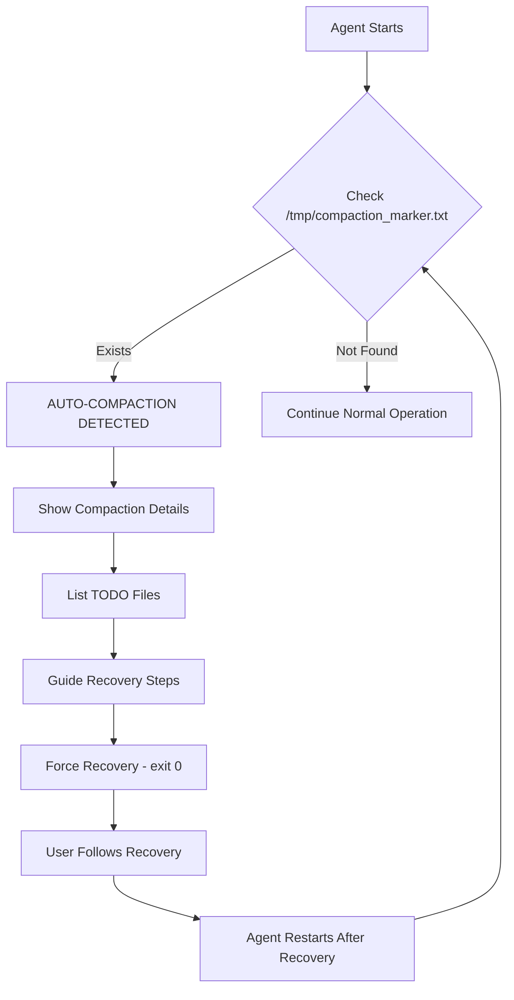

# 🔄 AUTOMATIC COMPACTION DETECTION SYSTEM

## 🎯 THE KEY POINT: IT'S AUTOMATIC!

**Compaction detection in Software Factory 2.0 is FULLY AUTOMATIC through mandatory pre-flight checks.**

Agents don't need to be told to check for compaction - they do it automatically as their FIRST action in EVERY response per Rule R186.

## 📋 How It Works

### 1. Automatic Marker Creation (PreCompact Hook)
When Claude Code triggers compaction (manual or automatic), the PreCompact hook in `.claude/settings.json` automatically:
- Creates `/tmp/compaction_marker.txt`
- Records compaction time, working directory, git branch
- Preserves TODO state information
- No user action required - this is automatic

### 2. Automatic Detection (R186 Compliance)
EVERY agent has this as CHECK 0 in their pre-flight sequence:
```bash
# CHECK 0: AUTOMATIC COMPACTION DETECTION (MANDATORY FIRST CHECK!)
echo "Checking for compaction marker..."
if [ -f /tmp/compaction_marker.txt ]; then
    echo "⚠️ AUTO-COMPACTION DETECTED - Context was compressed"
    # ... automatic recovery steps ...
fi
```

This runs AUTOMATICALLY at the start of EVERY agent response - no manual checking needed!

### 3. Automatic Recovery Guidance
When compaction is detected, agents automatically:
1. Alert about the compaction
2. Show preserved TODO files
3. Guide through recovery steps
4. Force recovery before continuing (exit 0)
5. Clear the marker after processing

## 🚨 Rule R186: Mandatory Compaction Detection

**Rule R186.0.0 - Mandatory Compaction Detection in Pre-Flight Checks**
- **Criticality**: BLOCKING
- **Requirement**: Every agent MUST check for `/tmp/compaction_marker.txt` as their FIRST pre-flight check
- **Location**: CHECK 0 in all agent pre-flight sequences
- **Enforcement**: Automatic via agent configuration files

## 📁 Implementation Locations

### Agent Files with Automatic Detection:
- `/workspaces/software-factory-2.0-template/.claude/agents/orchestrator.md`
- `/workspaces/software-factory-2.0-template/.claude/agents/sw-engineer.md`
- `/workspaces/software-factory-2.0-template/.claude/agents/code-reviewer.md`
- `/workspaces/software-factory-2.0-template/.claude/agents/architect.md`

Each file has compaction detection as CHECK 0 in pre-flight checks.

### Hook Configuration:
- `/workspaces/software-factory-2.0-template/.claude/settings.json`
  - PreCompact hook creates the marker automatically

## 🔍 What Each Agent Detects

### Orchestrator
```bash
if [ -f /tmp/compaction_marker.txt ]; then
    # Shows latest orchestrator-*.todo files
    # Guides to reload orchestrator-state.yaml
    # Forces TODO recovery before continuing
fi
```

### SW Engineer
```bash
if [ -f /tmp/compaction_marker.txt ]; then
    # Shows latest sw-eng-*.todo files
    # Guides to reload IMPLEMENTATION-PLAN.md
    # Forces work-log.md review
fi
```

### Code Reviewer
```bash
if [ -f /tmp/compaction_marker.txt ]; then
    # Shows latest code-reviewer-*.todo files
    # Determines if planning or reviewing
    # Forces context recovery
fi
```

### Architect
```bash
if [ -f /tmp/compaction_marker.txt ]; then
    # Shows latest architect-*.todo files
    # Guides to reload orchestrator-state.yaml
    # Determines review type needed
fi
```

## ✅ Why This Is Better Than Manual

### Old Way (Manual):
1. User had to remember to check for compaction
2. User had to run recovery scripts manually
3. Easy to forget and lose context
4. Inconsistent recovery process

### New Way (Automatic):
1. ✅ Agents check automatically - no user action needed
2. ✅ Detection happens BEFORE any work starts
3. ✅ Consistent recovery process every time
4. ✅ Cannot be forgotten or skipped
5. ✅ Enforced by R186 compliance

## 📊 Recovery Flow



## 🎯 Key Behaviors

1. **Always First**: Compaction check is ALWAYS Check 0
2. **Cannot Skip**: Pre-flight checks are mandatory
3. **Forces Recovery**: exit 0 prevents work until recovered
4. **Agent-Specific**: Each agent knows its own TODO pattern
5. **Self-Cleaning**: Marker deleted after processing

## 📝 Manual Utilities Still Available

While detection is automatic, manual utilities in `/utilities/` provide:
- Enhanced state preservation (`pre-compact.sh`)
- Interactive recovery assistance (`recovery-assistant.sh`)
- Manual TODO management (`todo-preservation.sh`)
- Comprehensive snapshots (`state-snapshot.sh`)

These are OPTIONAL enhancements - basic recovery works automatically.

## 🚀 Summary

**COMPACTION DETECTION IS AUTOMATIC IN SF 2.0!**

- No manual checking required
- No scripts to remember to run
- Agents handle it automatically
- Recovery guidance built into every agent
- Compliance enforced by R186

The system just works - agents detect, alert, and guide recovery automatically!