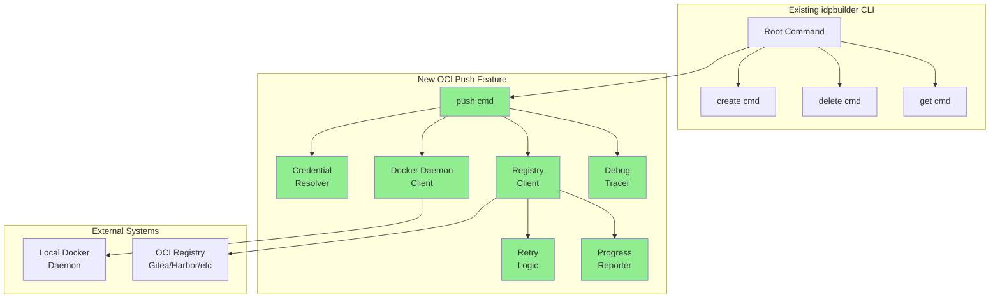
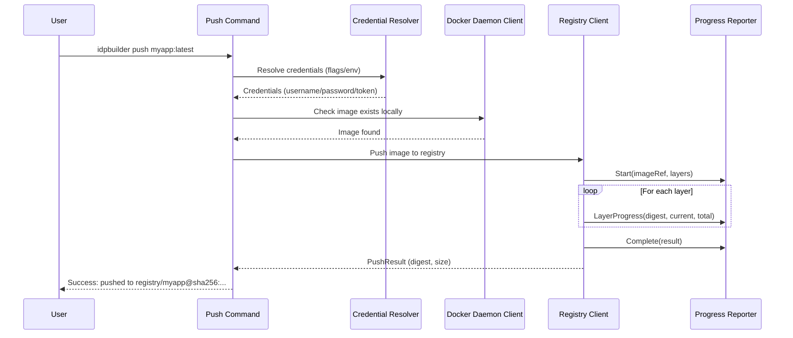
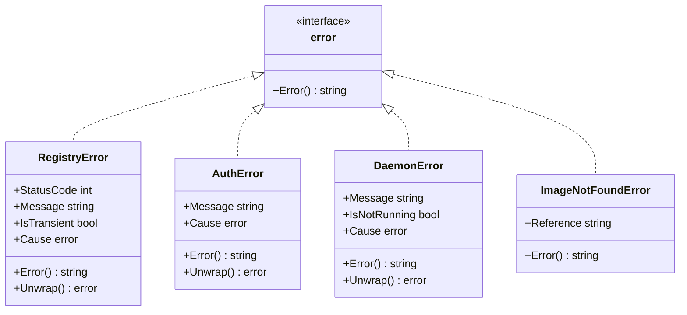

# Change Proposal: idpbuilder OCI Push Command

> **Status**: READY_FOR_REVIEW
> **Generated**: 2025-12-19T05:30:00Z
> **Last Updated**: 2025-12-19T05:30:00Z
> **Target Repository**: https://github.com/jessesanford/idpbuilder.git
> **Target Branch**: main
> **Rule Reference**: R878 (PR Change Proposal Generation Protocol)

---

## Purpose of This Document

This document introduces the complete body of changes being proposed for adding OCI image push capability to idpbuilder. It is designed to be read **before** reviewing any individual Pull Requests.

**For PR Reviewers**: You already understand the existing idpbuilder codebase. This proposal explains:
- WHY these changes are being made
- HOW they integrate with existing idpbuilder code
- WHAT architectural decisions were made and why
- WHERE the changes touch the codebase

---

## Table of Contents

1. [Executive Summary](#1-executive-summary)
2. [Goals and Non-Goals](#2-goals-and-non-goals)
3. [Design Overview](#3-design-overview)
4. [Integration with Existing Code](#4-integration-with-existing-code)
5. [Key Architectural Decisions](#5-key-architectural-decisions)
6. [PR Sequence Overview](#6-pr-sequence-overview)
7. [Testing Strategy](#7-testing-strategy)
8. [Alternatives Considered](#8-alternatives-considered)
9. [Risks and Mitigations](#9-risks-and-mitigations)
10. [Appendix: Detailed Diagrams](#10-appendix-detailed-diagrams)

---

## 1. Executive Summary

### What is Being Changed?

This change set adds a new `idpbuilder push` command that enables users to push Docker images from their local Docker daemon to OCI-compliant registries. The primary use case is pushing locally-built images to the Gitea OCI registry that idpbuilder provisions, enabling a complete local development workflow where users can build, push, and deploy container images without external registry dependencies.

### Why is This Change Needed?

Currently, idpbuilder users who want to deploy custom applications to their local Kubernetes cluster must either use an external registry or manually configure local registry access. This creates friction in the development workflow and requires additional infrastructure setup. The `push` command completes the "build locally, run locally" story by providing a seamless path from `docker build` to deployment in the idpbuilder-provisioned environment. The feature is gated behind a feature flag (`OCIPushConfigSpec.Enabled`) to ensure safe, incremental adoption.

### Scope Summary

| Metric | Value |
|--------|-------|
| **Total PRs** | 11 |
| **Files Modified** | ~25 files |
| **Lines Added** | ~2,600 |
| **Lines Removed** | ~0 (additive changes only) |
| **New Dependencies** | `github.com/google/go-containerregistry` |
| **Breaking Changes** | No - all changes gated by feature flag |

---

## 2. Goals and Non-Goals

### Goals

What this change set aims to accomplish:

- **G1**: Enable users to push Docker images to OCI-compliant registries via `idpbuilder push IMAGE --registry URL`
- **G2**: Provide seamless authentication with flags (--username, --password, --token) and environment variable fallback
- **G3**: Deliver production-ready error handling with retry logic for transient network failures
- **G4**: Integrate with idpbuilder's existing logging and CLI infrastructure
- **G5**: Gate all new functionality behind a feature flag for safe incremental rollout

### Non-Goals

Explicit boundaries - what this change set will NOT do:

- **NG1**: Multi-image push or batch operations (single image per invocation only)
- **NG2**: Image building or modification (accepts images as-is from Docker daemon)
- **NG3**: Credential caching or keychain integration (per-invocation credentials only)
- **NG4**: Registry mirroring or multi-destination push
- **NG5**: Fancy progress bars or TUI (simple stderr progress reporting)

### Success Criteria

How we know this change is successful:

- [ ] `idpbuilder push myapp:latest --registry https://gitea.cnoe.localtest.me:8443` successfully pushes image
- [ ] Credentials from flags override environment variables (REQ-014 through REQ-018)
- [ ] Transient network errors trigger up to 10 retries with exponential backoff
- [ ] Exit codes follow POSIX conventions: 0 (success), 1 (error), 2 (not found), 130 (interrupted)
- [ ] No credentials appear in any log output at any level
- [ ] All tests pass with >= 80% coverage

---

## 3. Design Overview

### High-Level Architecture



**Legend**: Green = New components, White = Existing components

### Component Responsibilities

| Component | Responsibility | New/Modified |
|-----------|---------------|--------------|
| Push Command (`pkg/cmd/push/push.go`) | CLI entry point, flag parsing, orchestration | New |
| Credential Resolver (`pkg/cmd/push/credentials.go`) | Resolve auth from flags/env vars | New |
| Registry Client (`pkg/registry/`) | OCI push operations via go-containerregistry | New |
| Daemon Client (`pkg/daemon/`) | Read images from local Docker daemon | New |
| Retry Logic (`pkg/registry/retry.go`) | Exponential backoff for transient errors | New |
| Progress Reporter (`pkg/registry/progress.go`) | Stderr progress output | New |
| Debug Tracer (`pkg/cmd/push/tracer.go`) | HTTP request/response logging | New |
| Feature Flag (`pkg/api/v1alpha1/localbuild_types.go`) | Gate all new functionality | Modified |

### Data Flow



---

## 4. Integration with Existing Code

### Touchpoints with Legacy Code

This section maps how the new code integrates with what already exists.

#### Entry Points

Where new code plugs into existing code:

| Existing File | Integration Point | What Changes |
|---------------|-------------------|--------------|
| `pkg/cmd/root.go` | `rootCmd.AddCommand()` | New push command registered |
| `pkg/api/v1alpha1/localbuild_types.go` | `PackageConfigsSpec` struct | New `OCIPush OCIPushConfigSpec` field |
| `pkg/api/v1alpha1/zz_generated.deepcopy.go` | Auto-generated | Regenerated via `make generate` |
| `go.mod` | Dependencies | `go-containerregistry` added |

#### Extension Points

Where existing code is extended (not replaced):

| Existing Interface/Type | Extension Method | Purpose |
|------------------------|------------------|---------|
| `PackageConfigsSpec` | New `OCIPush` field | Feature flag configuration |
| Cobra root command | New subcommand | Push CLI entry point |
| `pkg/logger` infrastructure | Logger injection | Debug/info logging |

#### No Breaking Changes To

These existing behaviors remain unchanged:

- All existing `idpbuilder create`, `delete`, `get` commands work identically
- Existing cluster provisioning workflow unchanged
- Existing Gitea registry configuration unchanged
- No changes to existing API types beyond additive field
- Feature defaults to OFF - no behavioral changes unless explicitly enabled

### Dependency Management

#### New Dependencies

| Dependency | Version | Purpose | Justification |
|------------|---------|---------|---------------|
| `github.com/google/go-containerregistry` | v0.20.x | OCI registry operations | Pure Go OCI client, CNCF ecosystem standard (used by ko, crane), supports all OCI-compliant registries, includes Docker daemon support |

#### Existing Dependency Changes

None - all existing dependencies remain at their current versions.

---

## 5. Key Architectural Decisions

### Decision 1: Feature Flag Gating (OCIPushConfigSpec)

**Context**: We need to safely merge 11 PRs incrementally without enabling untested functionality.

**Decision**: All new OCI push code paths are gated behind `config.PackageConfigs.OCIPush.Enabled` which defaults to `false` via Go's zero value and `omitempty` JSON tag.

**Consequences**:
- Positive: Safe incremental PR merging; each PR can be merged without enabling new functionality
- Positive: Clear activation path when feature is ready for use
- Negative: Slightly more complex code paths with feature flag checks

**Alternatives Rejected**: See [Section 8](#8-alternatives-considered)

### Decision 2: go-containerregistry Library

**Context**: We need a reliable OCI registry client that supports authentication, streaming, and all OCI-compliant registries.

**Decision**: Use `github.com/google/go-containerregistry` for all OCI operations.

**Consequences**:
- Positive: Battle-tested library used by major CNCF projects (crane, ko)
- Positive: Pure Go implementation with no CGO dependencies
- Positive: Built-in Docker daemon integration via `v1/daemon` package
- Negative: Adds ~5MB to binary size (acceptable for capabilities gained)

### Decision 3: Interface-Driven Design with Composition

**Context**: We need testable components that can be mocked in unit tests and wrapped with additional behavior (retry, progress).

**Decision**: Define interfaces (`RegistryClient`, `DaemonClient`, `ProgressReporter`) with concrete implementations wrapped via composition.

**Consequences**:
- Positive: Easy to mock in unit tests
- Positive: Retry logic wraps registry client transparently
- Positive: Progress reporting injected without modifying core push logic
- Negative: More files and types to maintain

### Decision 4: Credential Resolution Priority Chain

**Context**: Users may provide credentials via CLI flags, environment variables, or both.

**Decision**: CLI flags always take precedence over environment variables. If both flag and env var are set, the flag value wins.

**Consequences**:
- Positive: Predictable, documented behavior matching common CLI conventions
- Positive: Environment variables allow CI/CD configuration without command modification
- Negative: Users must understand precedence rules

### Decision 5: Retry Logic for Transient Errors Only

**Context**: Network operations may fail transiently (timeouts, connection refused) or permanently (authentication failure).

**Decision**: Retry only transient errors (network issues) with exponential backoff (1s, 2s, 4s... max 30s, up to 10 attempts). Never retry authentication errors.

**Consequences**:
- Positive: Resilient to network flakiness without masking real errors
- Positive: Fast failure on auth errors (no 10x delay)
- Negative: Requires error classification logic

---

## 6. PR Sequence Overview

### Dependency Graph

```mermaid
graph LR
    PR0[PR #0<br/>This Proposal]
    PR1[PR #1<br/>E1.0.1 Feature Flag]
    PR2[PR #2<br/>E1.1.1 Credentials]
    PR3[PR #3<br/>E1.1.2 Registry Interface]
    PR4[PR #4<br/>E1.1.3 Daemon Interface]
    PR5[PR #5<br/>E1.2.1 Push Command]
    PR6[PR #6<br/>E1.2.2 Registry Client]
    PR7[PR #7<br/>E1.2.3 Daemon Client]
    PR8[PR #8<br/>E1.3.1 Retry Logic]
    PR9[PR #9<br/>E1.3.2 Progress Reporter]
    PR10[PR #10<br/>E1.3.3 Integration Tests]
    PR11[PR #11<br/>E1.4.1 Debug Tracer]

    PR0 --> PR1
    PR1 --> PR2
    PR2 --> PR3
    PR3 --> PR4
    PR4 --> PR5
    PR5 --> PR6
    PR6 --> PR7
    PR7 --> PR8
    PR8 --> PR9
    PR9 --> PR10
    PR10 --> PR11
```



### PR Summary Table

| PR # | Effort ID | Title | Key Changes | Dependencies |
|------|-----------|-------|-------------|--------------|
| 0 | N/A | This Change Proposal | Documentation introducing all changes | None |
| 1 | E1.0.1 | Feature Flag Foundation | `OCIPushConfigSpec` struct, field in `PackageConfigsSpec` | None |
| 2 | E1.1.1 | Credential Resolution System | `CredentialResolver` interface, `Credentials` struct, tests | PR #1 |
| 3 | E1.1.2 | Registry Client Interface | `RegistryClient` interface, `PushResult`, error types, mocks | PR #2 |
| 4 | E1.1.3 | Docker Daemon Client Interface | `DaemonClient` interface, `ImageInfo`, error types, mocks | PR #3 |
| 5 | E1.2.1 | Push Command Skeleton | Cobra command, flag parsing, CLI entry point | PR #4 |
| 6 | E1.2.2 | Registry Client Implementation | `DefaultClient` using go-containerregistry, auth handling | PR #5 |
| 7 | E1.2.3 | Daemon Client Implementation | `DefaultDaemonClient` for local image access | PR #6 |
| 8 | E1.3.1 | Retry Logic | `RetryableClient` wrapper, exponential backoff | PR #7 |
| 9 | E1.3.2 | Progress Reporter | `StderrProgressReporter` implementation | PR #8 |
| 10 | E1.3.3 | Integration Tests | E2E tests with idpbuilder cluster | PR #9 |
| 11 | E1.4.1 | Debug Tracer | HTTP request/response logging, --log-level flag | PR #10 |

### Merge Strategy

- **Strategy**: Sequential merge (PR #1 first, then #2, etc.)
- **Reason**: Each PR builds on the previous one; feature flag in PR #1 gates all subsequent code
- **Note**: All PRs have been layered per R870 - each merges cleanly after its dependencies

---

## 7. Testing Strategy

### Test Levels

| Level | Coverage | Key Test Cases |
|-------|----------|----------------|
| Unit Tests | ~85% | Credential resolution, error classification, retry logic, progress formatting |
| Integration Tests | ~70% | Push workflow with mocked registry, flag precedence, exit codes |
| E2E Tests | Functional | Full push to Gitea registry on idpbuilder cluster |

### Key Test Scenarios

1. **Credential Flag Precedence (Property P1.1)**: Verify flags override environment variables for all credential types
2. **Retry Exhaustion (Property P1.2)**: Verify exactly 10 retries for transient errors, then failure
3. **No Credential Logging (Property P1.3)**: Verify credentials never appear in log output at any level
4. **Exit Code Correctness (Property P1.3)**: Verify POSIX exit codes for all error scenarios
5. **Authentication Error Fast Failure**: Verify auth errors fail immediately without retry

### Demo Validation

The following demonstrations validate the implementation:

1. **Primary Demo**: `idpbuilder push myapp:latest --registry https://gitea.cnoe.localtest.me:8443 --username giteaAdmin --password <password>` successfully pushes and returns digest
2. **Flag Precedence Demo**: Environment credentials set, flag credentials different - flag values used
3. **Error Recovery Demo**: Network timeout occurs - retry with exponential backoff, eventual success
4. **Debug Mode Demo**: `--log-level debug` shows HTTP request/response details (credentials redacted)

---

## 8. Alternatives Considered

### Alternative 1: Skopeo Integration

**Description**: Shell out to `skopeo` binary for image push operations instead of using go-containerregistry.

**Pros**:
- Mature, well-tested tool
- Already supports multiple registry types

**Cons**:
- External binary dependency
- Harder to integrate with Go codebase
- Less control over error handling and retry logic
- Requires skopeo installation on user machines

**Why Rejected**: Adding an external binary dependency conflicts with idpbuilder's philosophy of being a self-contained tool. Using a Go library provides better integration, error handling, and user experience.

### Alternative 2: Docker CLI Wrapper

**Description**: Use `docker push` via `os/exec` after authenticating via `docker login`.

**Pros**:
- Familiar to users
- Reuses existing Docker infrastructure

**Cons**:
- Requires Docker CLI (not just daemon)
- Complex credential management (docker login persists credentials)
- Harder to capture detailed errors
- No control over retry behavior

**Why Rejected**: Using Docker CLI introduces security concerns with persistent credential storage and reduces our ability to provide a polished user experience with retry logic and progress reporting.

### Alternative 3: No Feature Flag (Direct Integration)

**Description**: Integrate push command directly without feature flag gating.

**Pros**:
- Simpler code paths
- Immediate availability to users

**Cons**:
- Risk of incomplete feature being used in production
- Harder to incrementally merge PRs safely
- No clean rollback path if issues discovered

**Why Rejected**: Safe incremental merging is critical for this multi-PR feature. The feature flag adds minimal complexity while providing significant safety benefits.

---

## 9. Risks and Mitigations

| Risk | Likelihood | Impact | Mitigation |
|------|------------|--------|------------|
| go-containerregistry API changes | Low | Medium | Pin to specific version in go.mod |
| Docker daemon unavailable | Medium | Low | Clear error message with exit code 2, suggest starting Docker |
| Registry authentication edge cases | Medium | Medium | Comprehensive test coverage, follow OCI spec exactly |
| Credential logging accident | Low | High | Property-based test P1.3 validates no credentials in output |
| Feature flag left disabled | Low | Low | Documentation clearly explains activation |
| Network flakiness in tests | Medium | Medium | Use `testing.Short()` guards for CI environments |

### Rollback Plan

If critical issues are discovered post-merge:

1. **Immediate**: Feature remains disabled by default - users unaffected unless they explicitly enabled it
2. **If enabled and broken**: Users can disable via config (`ociPush.enabled: false`)
3. **Code rollback**: Revert PR sequence in reverse order if necessary
4. **Detection**: Monitor for issues via GitHub issues, user reports

---

## 10. Appendix: Detailed Diagrams

### A. Package Structure

```
pkg/
+-- api/v1alpha1/
|   +-- localbuild_types.go        # OCIPushConfigSpec added
|   +-- zz_generated.deepcopy.go   # Regenerated
+-- cmd/
|   +-- root.go                    # push command registered
|   +-- push/
|       +-- push.go                # Main command implementation
|       +-- credentials.go         # Credential resolution
|       +-- credentials_test.go
|       +-- tracer.go              # Debug logging
+-- registry/
|   +-- client.go                  # RegistryClient interface
|   +-- client_test.go
|   +-- registry.go                # DefaultClient implementation
|   +-- registry_test.go
|   +-- retry.go                   # RetryableClient wrapper
|   +-- retry_test.go
|   +-- progress.go                # StderrProgressReporter
|   +-- progress_test.go
+-- daemon/
    +-- client.go                  # DaemonClient interface
    +-- client_test.go
    +-- daemon.go                  # DefaultDaemonClient implementation
    +-- daemon_test.go

tests/
+-- e2e/
    +-- push/
        +-- push_test.go           # E2E integration tests
        +-- debug_test.go          # Debug mode tests
```

### B. Error Type Hierarchy



### C. Feature Flag Configuration

```yaml
# Example idpbuilder configuration with OCI push enabled
apiVersion: cnoe.io/v1alpha1
kind: LocalBuild
metadata:
  name: my-idpbuilder
spec:
  packageConfigs:
    # Existing configurations...

    # NEW: OCI Push feature flag
    ociPush:
      enabled: true  # Default is false (omitempty)
```

### D. CLI Flag Summary

| Flag | Short | Type | Default | Env Variable | Description |
|------|-------|------|---------|--------------|-------------|
| `--registry` | `-r` | string | `https://gitea.cnoe.localtest.me:8443` | `IDPBUILDER_REGISTRY_URL` | Target registry URL |
| `--username` | `-u` | string | (none) | `IDPBUILDER_REGISTRY_USERNAME` | Registry username |
| `--password` | `-p` | string | (none) | `IDPBUILDER_REGISTRY_PASSWORD` | Registry password |
| `--token` | `-t` | string | (none) | `IDPBUILDER_REGISTRY_TOKEN` | Registry token (bearer auth) |
| `--insecure` | | bool | false | `IDPBUILDER_REGISTRY_INSECURE` | Skip TLS verification |
| `--log-level` | | string | `info` | | Logging level (debug, info, warn) |

---

## Document History

| Version | Date | Author | Changes |
|---------|------|--------|---------|
| 1.0 | 2025-12-19 | Architect Agent | Initial proposal synthesized from planning documents |

---

## Approval

| Role | Name/Agent | Status | Date |
|------|-----------|--------|------|
| Architect | Architect Agent | Approved | 2025-12-19 |
| Human Reviewer | (pending) | Pending | - |

---

**Note**: This proposal should be reviewed before any implementation PRs. It serves as the introduction and context for all subsequent code changes.

---

*Generated by Software Factory 3.0 - Rule R878*
