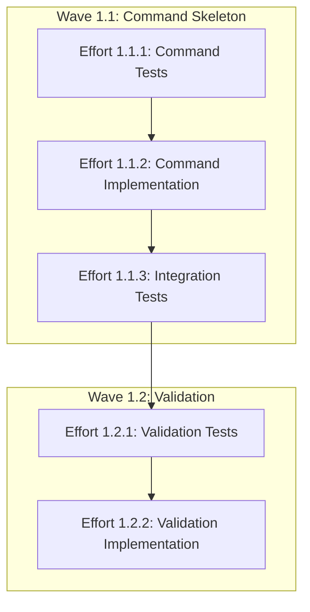

# PHASE 1 ARCHITECTURE - FOUNDATION & COMMAND STRUCTURE
**Generated by Software Factory 2.0 Architect Agent**
**Date**: 2025-09-22
**Project**: idpbuilder-push
**Methodology**: TEST-DRIVEN DEVELOPMENT (TDD)

## Phase 1 Overview

### Objectives
Phase 1 establishes the foundation for the `idpbuilder push` command, implementing the command skeleton, basic structure, and input validation. This phase strictly follows TDD methodology with tests written FIRST before any implementation.

### Scope
- Command registration and CLI structure
- Basic flag handling (--username, --password, --insecure)
- Input validation framework
- Error handling patterns
- Test infrastructure setup
- **Target**: 800 LOC total

### Success Criteria
- ✅ Push command successfully registered with Cobra
- ✅ All flags properly parsed and validated
- ✅ 100% test coverage for command structure
- ✅ Tests written BEFORE implementation (TDD compliance)
- ✅ Clear error messages for invalid inputs
- ✅ Integration with existing idpbuilder command tree

## Wave Breakdown

### Wave 1.1: Command Skeleton with TDD
**Duration**: 1-2 days
**Total LOC**: ~500
**Parallelizable**: No (foundational)

#### Objectives
- Establish push command structure following TDD
- Implement comprehensive test suite first
- Create minimal command implementation to pass tests
- Integrate with existing Cobra command tree

#### Efforts

##### Effort 1.1.1: Write Command Tests
**Size**: 150 LOC
**Type**: Test Development (RED Phase)
**Dependencies**: None
**Branch**: `phase1-wave1-command-tests`

**Deliverables**:
- `cmd/push/root_test.go` - Comprehensive command tests

**Test Coverage Required**:
```go
// Test scenarios to implement FIRST:
- Command registration with parent command
- Flag definitions (--username, --password, --insecure)
- Required arguments validation (image, registry)
- Help text and usage documentation
- Flag shorthand support
- Environment variable support
- Default value behavior
```

**Key Interfaces to Test**:
```go
// Expected command behavior (define through tests)
type PushCommand interface {
    Execute(args []string) error
    ValidateArgs() error
    ParseFlags() (*PushConfig, error)
}

// Configuration structure (test-driven)
type PushConfig struct {
    Image      string
    Registry   string
    Username   string
    Password   string
    Insecure   bool
}
```

##### Effort 1.1.2: Implement Command Skeleton
**Size**: 200 LOC
**Type**: Implementation (GREEN Phase)
**Dependencies**: Effort 1.1.1
**Branch**: `phase1-wave1-command-impl`

**Deliverables**:
- `cmd/push/root.go` - Push command implementation
- `cmd/push/config.go` - Configuration structures

**Implementation Requirements**:
```go
// Minimal implementation to pass tests
var pushCmd = &cobra.Command{
    Use:   "push IMAGE REGISTRY",
    Short: "Push OCI image to Gitea registry",
    Long:  `Push an OCI image to the configured Gitea registry...`,
    Args:  cobra.ExactArgs(2),
    RunE:  runPush,
}

// Flag definitions
func init() {
    pushCmd.Flags().StringP("username", "u", "", "Registry username")
    pushCmd.Flags().StringP("password", "p", "", "Registry password")
    pushCmd.Flags().BoolP("insecure", "k", false, "Skip TLS verification")
}
```

##### Effort 1.1.3: Integration Tests
**Size**: 150 LOC
**Type**: Test Enhancement (RED-GREEN)
**Dependencies**: Effort 1.1.2
**Branch**: `phase1-wave1-integration-tests`

**Deliverables**:
- `cmd/push/integration_test.go` - Full CLI context tests

**Test Scenarios**:
```go
// Integration test cases
- Full command execution flow
- Flag precedence (CLI > ENV > defaults)
- Error propagation and messages
- Help text generation
- Command discovery in CLI
- Subcommand interaction
```

### Wave 1.2: Input Validation & Error Handling
**Duration**: 1 day
**Total LOC**: ~300
**Parallelizable**: After Wave 1.1

#### Objectives
- Implement comprehensive input validation
- Establish error handling patterns
- Create reusable validation utilities
- Ensure consistent error messaging

#### Efforts

##### Effort 1.2.1: Validation Tests
**Size**: 150 LOC
**Type**: Test Development (RED Phase)
**Dependencies**: Wave 1.1 completion
**Branch**: `phase1-wave2-validation-tests`

**Deliverables**:
- `pkg/oci/validation_test.go` - Validation test suite

**Test Coverage**:
```go
// Validation scenarios to test FIRST
- Image path formats (local files, directories)
- Registry URL validation (https://gitea.cnoe.localtest.me)
- Username/password requirements
- Special character handling
- Path traversal prevention
- Size limit checks
- Malformed input rejection
```

**Validation Interface (test-driven)**:
```go
type Validator interface {
    ValidateImagePath(path string) error
    ValidateRegistryURL(url string) error
    ValidateCredentials(username, password string) error
    SanitizeInput(input string) string
}
```

##### Effort 1.2.2: Implement Validation
**Size**: 150 LOC
**Type**: Implementation (GREEN-REFACTOR)
**Dependencies**: Effort 1.2.1
**Branch**: `phase1-wave2-validation-impl`

**Deliverables**:
- `pkg/oci/validation.go` - Validation implementation
- `pkg/oci/errors.go` - Error types and messages

**Key Components**:
```go
// Error types for consistent handling
type ValidationError struct {
    Field   string
    Value   string
    Message string
}

// Validation functions
func ValidateImagePath(path string) error
func ValidateRegistryURL(url string) error
func ValidateCredentials(username, password string) error
```

## Dependency Graph



## Interface Definitions

### Command Interface
```go
package push

// PushCommand defines the contract for push operations
type PushCommand interface {
    // Execute runs the push command with given arguments
    Execute(args []string) error

    // ValidateArgs ensures required arguments are present
    ValidateArgs() error

    // ParseFlags extracts configuration from flags
    ParseFlags() (*PushConfig, error)
}

// PushConfig holds all configuration for push operation
type PushConfig struct {
    Image      string // Local image path or reference
    Registry   string // Target registry URL
    Username   string // Registry authentication username
    Password   string // Registry authentication password
    Insecure   bool   // Skip TLS verification for self-signed certs
}
```

### Validation Interface
```go
package oci

// Validator defines input validation contract
type Validator interface {
    // ValidateImagePath checks if image path is valid
    ValidateImagePath(path string) error

    // ValidateRegistryURL verifies registry URL format
    ValidateRegistryURL(url string) error

    // ValidateCredentials checks credential format
    ValidateCredentials(username, password string) error

    // SanitizeInput removes dangerous characters
    SanitizeInput(input string) string
}

// ValidationError provides detailed validation failure info
type ValidationError struct {
    Field   string // Field that failed validation
    Value   string // Actual value provided
    Message string // Human-readable error message
    Code    string // Machine-readable error code
}
```

## Testing Strategy

### TDD Enforcement
1. **RED Phase**: Write failing tests first
2. **GREEN Phase**: Minimal code to pass tests
3. **REFACTOR Phase**: Improve code quality

### Test Categories
- **Unit Tests**: Individual function behavior
- **Integration Tests**: Component interaction
- **E2E Tests**: Full command execution

### Coverage Requirements
- Phase 1 Target: 100% coverage
- Critical Paths: 100% required
- Error Paths: 100% required

## Integration Points

### With Existing IDPBuilder
- Register push command under root command
- Use existing logging infrastructure (logr)
- Follow existing error patterns
- Reuse configuration loading if available

### Future Phase Preparation
- Interfaces defined for Phase 2 authentication
- Validation framework extensible for Phase 3 OCI operations
- Error types support Phase 4 enhancements

## Risk Mitigation

### Technical Risks
1. **Command Registration Conflicts**
   - Mitigation: Check existing commands first
   - Test with full idpbuilder CLI

2. **Flag Naming Collisions**
   - Mitigation: Use standard conventions
   - Align with existing idpbuilder flags

3. **Validation Complexity**
   - Mitigation: Start simple, extend gradually
   - Focus on critical validations first

## Parallelization Opportunities

### Within Phase 1
- Wave 1.1 must complete sequentially (foundational)
- Wave 1.2 efforts can parallelize after Wave 1.1

### For Future Phases
- All interfaces defined enable Phase 2 parallelization
- Validation framework supports concurrent development
- Command structure allows independent feature additions

## Deliverables Checklist

### Wave 1.1 Deliverables
- [ ] `cmd/push/root_test.go` - Command tests (150 LOC)
- [ ] `cmd/push/root.go` - Command implementation (200 LOC)
- [ ] `cmd/push/integration_test.go` - Integration tests (150 LOC)

### Wave 1.2 Deliverables
- [ ] `pkg/oci/validation_test.go` - Validation tests (150 LOC)
- [ ] `pkg/oci/validation.go` - Validation implementation (150 LOC)

### Documentation
- [ ] Command usage documentation
- [ ] Developer documentation for interfaces
- [ ] TDD compliance evidence (test-first commits)

## Success Metrics

### Functional Metrics
- Push command appears in `idpbuilder --help`
- All flags parse correctly
- Validation rejects invalid inputs
- Clear error messages displayed

### Quality Metrics
- 100% test coverage achieved
- All tests written before implementation
- Zero linting errors
- All code reviewed

### TDD Compliance
- Test commits precede implementation commits
- Each effort shows RED-GREEN-REFACTOR cycle
- Coverage never drops below target

## Timeline

### Wave 1.1: Days 1-2
- Day 1 AM: Effort 1.1.1 (Command Tests)
- Day 1 PM: Effort 1.1.2 (Implementation)
- Day 2 AM: Effort 1.1.3 (Integration Tests)

### Wave 1.2: Day 2-3
- Day 2 PM: Effort 1.2.1 (Validation Tests)
- Day 3 AM: Effort 1.2.2 (Validation Implementation)

### Buffer: Day 3 PM
- Integration testing
- Documentation updates
- Review and refinement

## Phase 1 Completion Criteria

1. **Command Structure**: Push command fully integrated
2. **Flag Handling**: All flags working correctly
3. **Validation**: Input validation comprehensive
4. **Test Coverage**: 100% coverage achieved
5. **TDD Compliance**: All tests written first
6. **Documentation**: Usage and developer docs complete
7. **Integration**: Works with existing idpbuilder

## Notes for Implementation Teams

### Critical Requirements
- MUST follow TDD - tests first, always
- MUST respect 800 LOC limit per effort
- MUST maintain independent mergeability
- MUST NOT delete existing code

### Best Practices
- Commit tests before implementation
- Keep commits small and focused
- Write clear commit messages
- Update documentation as you go
- Run tests frequently

### Coordination Points
- Wave 1.1 must complete before Wave 1.2
- Efforts within a wave can parallelize where noted
- Integration branch after each wave
- Architect review after phase completion

---

*This Phase 1 Architecture document provides the blueprint for foundation and command structure implementation. All efforts must follow TDD methodology with tests written FIRST.*