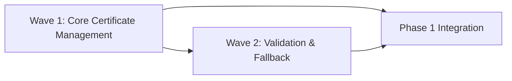

# Phase 1: Certificate Infrastructure Implementation Plan

## 📌 Phase Overview

**Phase Number**: 1  
**Phase Name**: Certificate Infrastructure  
**Duration**: 1 week (5 business days)  
**Start Date**: TBD  
**Target Completion**: TBD + 5 days  
**Total Waves**: 2  
**Total Efforts**: 4  
**Target Lines**: 1,900 (±10%)  

### Phase Mission
Establish robust certificate extraction and trust management infrastructure that enables secure communication with Gitea's self-signed certificate registry, providing the foundation for all subsequent OCI operations.

### Phase Dependencies
- **Requires**: None (first phase)
- **Blocks**: Phase 2 (Build & Push Implementation)
- **External**: Kind cluster must be running with Gitea installed

## 🎯 Success Criteria

### Mandatory Requirements
- [ ] All efforts under 800 lines (measured by line-counter.sh)
- [ ] Test coverage ≥ 80%
- [ ] All code reviews passed
- [ ] Architect review passed
- [ ] Integration tests passing
- [ ] Certificate operations work without manual intervention

### Deliverables
- [ ] Kind certificate extraction module fully functional
- [ ] Registry TLS trust configuration working with go-containerregistry
- [ ] Certificate validation pipeline with clear diagnostics
- [ ] Fallback strategies implemented with --insecure flag
- [ ] Comprehensive error messages for certificate issues

### Quality Gates
| Gate | Threshold | Current | Status |
|------|-----------|---------|--------|
| Code Coverage | 80% | - | 🔴 |
| Review Pass Rate | 80% | - | 🔴 |
| Build Success | 100% | - | 🔴 |
| Integration Tests | 100% | - | 🔴 |
| Cert Extraction Success | 100% | - | 🔴 |

## 🌊 Wave Structure

### Wave Sequence
```
Wave 1: Certificate Management Core ──────── (Parallel: Yes - 2 efforts)
Wave 2: Certificate Validation & Fallback ── (Parallel: Yes - 2 efforts) [Depends on Wave 1]
```

### Wave Dependencies


## 🌊 Wave 1: Certificate Management Core

**Scope**: Extract certificates from Kind/Gitea and integrate with go-containerregistry  
**Can Parallelize**: Yes  
**Max Parallel Efforts**: 2  
**Total Efforts**: 2  
**Estimated Lines**: 1,100  

### Objectives
- Extract certificates from Kind cluster's Gitea pod
- Configure go-containerregistry with custom TLS trust
- Establish local certificate storage structure

### Dependencies
- **Internal**: None
- **External**: Kind cluster with Gitea must be running

### Effort Breakdown

#### E1.1.1: Kind Certificate Extraction
**Estimated Size**: 500 lines  
**Assignee**: SW Engineer 1  
**Reviewer**: Code Reviewer 1  

**Requirements**:
- [ ] Detect Kind cluster presence and configuration
- [ ] Extract Gitea pod information from cluster
- [ ] Copy certificate from `/data/gitea/https/cert.pem` in pod
- [ ] Save certificate to local trust store at `~/.idpbuilder/certs/gitea.pem`
- [ ] Handle missing cluster/pod scenarios gracefully

**Deliverables**:
- `pkg/certs/extractor.go` - Core certificate extraction logic
- `pkg/certs/kind_client.go` - Kind cluster interaction utilities
- `pkg/certs/storage.go` - Local certificate storage management
- `pkg/certs/errors.go` - Custom error types for certificate operations

**Key Interfaces**:
```go
type KindCertExtractor interface {
    ExtractGiteaCert(ctx context.Context) (*x509.Certificate, error)
    GetClusterName() (string, error)
    ValidateCertificate(cert *x509.Certificate) error
    StoreCertificate(cert *x509.Certificate, path string) error
}

type CertificateStorage interface {
    Store(name string, cert *x509.Certificate) error
    Load(name string) (*x509.Certificate, error)
    Exists(name string) bool
    Remove(name string) error
}
```

**Test Requirements**:
- Unit tests with mocked kubectl commands
- Test missing cluster scenario handling
- Test invalid certificate handling
- Test storage permission errors
- Test certificate parsing errors

**Success Metrics**:
- Test coverage ≥ 80%
- No TODO comments remaining
- All linting rules pass
- Certificate extraction succeeds in CI environment

#### E1.1.2: Registry TLS Trust Integration
**Estimated Size**: 600 lines  
**Assignee**: SW Engineer 2  
**Reviewer**: Code Reviewer 1  

**Requirements**:
- [ ] Load custom CA into x509.CertPool
- [ ] Configure go-containerregistry remote transport with TLS
- [ ] Handle certificate rotation by reloading at operation time
- [ ] Provide --insecure override capability
- [ ] Clear error messages for permission/configuration issues

**Deliverables**:
- `pkg/certs/trust.go` - Trust store management implementation
- `pkg/certs/transport.go` - Custom transport configuration for ggcr
- `pkg/certs/pool.go` - Certificate pool management
- `pkg/certs/config.go` - TLS configuration structures

**Key Interfaces**:
```go
type TrustStoreManager interface {
    AddCertificate(registry string, cert *x509.Certificate) error
    RemoveCertificate(registry string) error
    SetInsecureRegistry(registry string, insecure bool) error
    GetTrustedCerts(registry string) ([]*x509.Certificate, error)
    GetTransportOptions(registry string) ([]remote.Option, error)
}

type TransportConfigurer interface {
    ConfigureTransport(baseTransport http.RoundTripper, tlsConfig *tls.Config) http.RoundTripper
    GetTLSConfig(registry string) (*tls.Config, error)
    SetInsecureSkipVerify(skip bool)
}
```

**Test Requirements**:
- Test CA pool loading from PEM files
- Test permission handling for certificate files
- Test certificate rotation scenarios
- Test insecure mode operation
- Test transport configuration with mock registries

**Success Metrics**:
- Test coverage ≥ 80%
- Successful integration with go-containerregistry
- Certificate rotation works without restart
- Clear error messages for all failure modes

### Wave 1 Integration Plan
1. Merge effort branches to `phase1/wave1-integration`
2. Run integration test suite with real Kind cluster
3. Perform architect review of certificate architecture
4. Address any integration issues
5. Prepare for Wave 2 dependencies

## 🌊 Wave 2: Certificate Validation & Fallback

**Scope**: Robust certificate validation with clear diagnostics and fallback strategies  
**Can Parallelize**: Yes  
**Max Parallel Efforts**: 2  
**Total Efforts**: 2  
**Estimated Lines**: 800  

### Objectives
- Implement comprehensive certificate validation pipeline
- Provide clear diagnostic messages for certificate issues
- Implement fallback strategies with explicit --insecure flag

### Dependencies
- **Internal**: Wave 1 complete (certificate extraction and trust management)
- **External**: None

### Effort Breakdown

#### E1.2.1: Certificate Validation Pipeline
**Estimated Size**: 400 lines  
**Assignee**: SW Engineer 1  
**Reviewer**: Code Reviewer 1  

**Requirements**:
- [ ] Validate certificate chain completeness
- [ ] Check certificate expiry with configurable warning threshold
- [ ] Verify hostname matching with wildcard support
- [ ] Generate clear diagnostic output for troubleshooting
- [ ] Support multiple validation modes (strict/permissive)

**Deliverables**:
- `pkg/certs/validator.go` - Core validation logic
- `pkg/certs/chain.go` - Certificate chain validation
- `pkg/certs/diagnostics.go` - Diagnostic information generation
- `pkg/certs/hostname.go` - Hostname verification utilities

**Key Interfaces**:
```go
type CertValidator interface {
    ValidateChain(cert *x509.Certificate) error
    CheckExpiry(cert *x509.Certificate) (*time.Duration, error)
    VerifyHostname(cert *x509.Certificate, hostname string) error
    GenerateDiagnostics() (*CertDiagnostics, error)
    SetValidationMode(mode ValidationMode)
}

type CertDiagnostics struct {
    Subject         string
    Issuer          string
    SerialNumber    string
    NotBefore       time.Time
    NotAfter        time.Time
    DaysUntilExpiry int
    IsExpired       bool
    IsSelfSigned    bool
    ValidationErrors []string
}
```

**Test Requirements**:
- Test expired certificate detection
- Test hostname mismatch scenarios
- Test chain validation with incomplete chains
- Test diagnostic output generation
- Test wildcard certificate handling

**Success Metrics**:
- Test coverage ≥ 80%
- All validation scenarios covered
- Clear error messages for each failure type
- Diagnostic output helps troubleshooting

#### E1.2.2: Fallback Strategies
**Estimated Size**: 400 lines  
**Assignee**: SW Engineer 2  
**Reviewer**: Code Reviewer 1  

**Requirements**:
- [ ] Auto-detect certificate problems and categorize them
- [ ] Suggest specific solutions for each problem type
- [ ] Implement --insecure flag with security warnings
- [ ] Log all security bypass decisions with reasons
- [ ] Provide actionable recommendations for fixing issues

**Deliverables**:
- `pkg/certs/fallback.go` - Fallback strategy implementation
- `pkg/certs/recommendations.go` - Issue-specific recommendations
- `pkg/certs/security_log.go` - Security decision logging
- `pkg/certs/insecure.go` - Insecure mode handling

**Key Interfaces**:
```go
type FallbackHandler interface {
    HandleCertError(err error) (*FallbackStrategy, error)
    ApplyInsecureMode(config *BuildConfig) error
    LogSecurityDecision(decision string, reason string)
    GetRecommendations(err error) []string
    RequiresUserConfirmation() bool
}

type FallbackStrategy struct {
    Type            FallbackType
    RequiresFlag    bool
    SecurityImpact  SecurityLevel
    Recommendations []string
    WarningMessage  string
}
```

**Test Requirements**:
- Test fallback trigger conditions
- Test recommendation generation for various errors
- Test security logging functionality
- Test --insecure flag behavior
- Test user confirmation flows

**Success Metrics**:
- Test coverage ≥ 80%
- Never silently ignore certificate errors
- All security bypasses are logged
- Recommendations are actionable and clear

### Wave 2 Integration Plan
1. Verify Wave 1 integration is stable
2. Merge effort branches to `phase1/wave2-integration`
3. Run comprehensive certificate validation tests
4. Test fallback scenarios with various certificate issues
5. Perform security review of fallback mechanisms
6. Update documentation with certificate handling guide

## 🔄 Phase Integration Strategy

### Pre-Integration Checklist
- [ ] All waves complete and integrated
- [ ] All unit tests passing (>80% coverage)
- [ ] Integration tests with real Kind cluster passing
- [ ] Certificate extraction works automatically
- [ ] TLS trust configuration verified
- [ ] Validation pipeline provides clear diagnostics
- [ ] Fallback strategies documented and tested
- [ ] No critical TODOs remaining
- [ ] Security review complete

### Integration Steps
1. **Create Phase Branch**
   ```bash
   git checkout -b phase1-integration
   ```

2. **Merge Wave Branches**
   ```bash
   git merge phase1/wave1-integration
   git merge phase1/wave2-integration
   ```

3. **Run Full Test Suite**
   ```bash
   make test-unit
   make test-integration
   make test-certificates
   ```

4. **Architect Review**
   - Request architect review of certificate infrastructure
   - Present certificate handling architecture
   - Demonstrate automatic extraction and trust configuration
   - Address any architectural concerns
   - Get approval for Phase 2

5. **Prepare for Phase 2**
   - Document certificate APIs for Phase 2 consumption
   - Ensure all interfaces are stable
   - Create integration guide for build/push operations

## 📊 Risk Analysis

### Technical Risks
| Risk | Probability | Impact | Mitigation |
|------|------------|--------|------------|
| Kind API changes | Low | High | Version pin Kind client libraries |
| Certificate format variations | Medium | Medium | Support multiple certificate formats |
| Permission issues on cert storage | Medium | Low | Fallback to user-writable locations |
| Certificate rotation during operation | Low | Medium | Reload certificates at operation time |
| go-containerregistry API changes | Low | High | Pin dependency version |

### Sequencing Risks
- **Wave 1 Incomplete**: Blocks all Wave 2 validation work
- **Integration Issues**: May require rework of trust configuration
- **Review Rejections**: Could trigger effort splits if over 800 lines

### Mitigation Strategies
1. **Proactive Splitting**: Monitor line counts continuously
2. **Early Integration**: Test certificate operations after each effort
3. **Parallel Reviews**: Start code reviews before full completion
4. **Mock Testing**: Use mock certificates for unit tests

## 📈 Metrics and Tracking

### Progress Tracking
```yaml
wave_1:
  efforts_planned: 2
  efforts_completed: 0
  efforts_in_progress: 0
  lines_estimated: 1100
  lines_actual: 0
  
wave_2:
  efforts_planned: 2
  efforts_completed: 0
  efforts_in_progress: 0
  lines_estimated: 800
  lines_actual: 0
```

### Quality Metrics
- **Code Coverage**: Target 80%, Current: 0%
- **Review Pass Rate**: Target 80%, Current: 0%
- **Bug Density**: Target <2/KLOC, Current: 0
- **Technical Debt**: Target <8 hours, Current: 0

### Performance Metrics
- **Certificate Extraction Time**: Target <2 seconds
- **Trust Configuration Time**: Target <100ms
- **Validation Pipeline Time**: Target <50ms per cert
- **Memory Usage**: Target <50 MB

## 🧪 Testing Strategy

### Test Levels
1. **Unit Tests** (Effort Level)
   - Coverage target: 80%
   - Framework: Go testing package + testify
   - Location: `pkg/certs/*_test.go`

2. **Integration Tests** (Wave Level)
   - Coverage target: 70%
   - Framework: Ginkgo
   - Location: `tests/integration/certs/`

3. **End-to-End Tests** (Phase Level)
   - Coverage target: 60%
   - Framework: Custom test harness
   - Location: `tests/e2e/certificate_flow/`

### Test Priorities
- P0: Certificate extraction must work with real Kind cluster
- P1: TLS trust configuration must work with go-containerregistry
- P2: Validation must catch expired/invalid certificates
- P3: Fallback strategies must require explicit flags

## 📚 Documentation Requirements

### Code Documentation
- All public APIs must have comprehensive godoc comments
- Complex certificate operations need detailed inline comments
- Configuration options must be documented with examples
- Error codes must be catalogued with solutions

### User Documentation
- [ ] Certificate extraction guide
- [ ] Trust configuration tutorial
- [ ] Troubleshooting certificate issues
- [ ] Security implications of --insecure flag

### Developer Documentation
- [ ] Certificate architecture diagrams
- [ ] Sequence diagrams for extraction flow
- [ ] Trust configuration flow charts
- [ ] Integration guide for Phase 2

## 🔒 Security Considerations

### Security Requirements
- [ ] Never bypass certificate validation silently
- [ ] Require explicit --insecure flag for bypasses
- [ ] Log all security-relevant decisions
- [ ] Protect stored certificates with appropriate permissions
- [ ] Validate certificate chains properly

### Security Checklist
- [ ] No hardcoded certificate bypasses
- [ ] No automatic trust of self-signed certificates
- [ ] Certificate storage uses secure permissions (0600)
- [ ] Audit logging for security decisions
- [ ] Clear warnings when security is reduced

## 🚀 Deployment Considerations

### Deployment Requirements
- [ ] Certificate extraction works in CI/CD environments
- [ ] Trust configuration persists across sessions
- [ ] Certificate rotation handled gracefully
- [ ] Fallback mechanisms documented
- [ ] Monitoring of certificate expiry

### Deployment Checklist
- [ ] All certificate tests passing
- [ ] Performance benchmarks met
- [ ] Documentation complete
- [ ] Security review passed
- [ ] Integration guide ready for Phase 2

## 📝 Notes and Assumptions

### Assumptions
- Kind cluster is already running with Gitea installed
- Gitea certificate is at standard location `/data/gitea/https/cert.pem`
- User has kubectl access to the Kind cluster
- go-containerregistry v0.19.0 API is stable
- Certificate storage at `~/.idpbuilder/certs/` is acceptable

### Open Questions
- Should we support multiple certificate formats (PEM, DER)?
- How often should certificates be reloaded?
- Should we implement certificate pinning?

### Decisions Made
- **Local Storage**: Certificates stored at `~/.idpbuilder/certs/` for simplicity
- **Rotation Strategy**: Reload certificates at each operation for freshness
- **Security Default**: Require explicit --insecure flag, never default to insecure

## 🔄 Phase Retrospective (Post-Completion)

### What Went Well
- [ ] To be filled after phase completion

### What Could Be Improved
- [ ] To be filled after phase completion

### Lessons Learned
- [ ] To be filled after phase completion

### Action Items for Phase 2
- [ ] To be filled after phase completion

---

**Phase Plan Version**: 1.0  
**Created**: 2025-09-06  
**Last Updated**: 2025-09-06  
**Owner**: Orchestrator Agent  
**Status**: Ready for Implementation

**Remember**: 
- Efforts MUST stay under 800 lines
- Test coverage is mandatory at 80%
- Reviews are not optional
- Integration requires architect approval
- Certificate operations must work without manual intervention