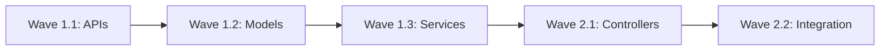

# Phase [X]: [Phase Name] - Detailed Implementation Plan

## Phase Overview
**Duration:** [X] days  
**Critical Path:** [YES/NO] - [Explanation why this phase is/isn't critical]  
**Base Branch:** `[previous-phase-integration or main]`  
**Target Integration Branch:** `phase[X]-integration`  
**Prerequisites:** [List required completions from previous phases]

---

## Critical Libraries & Dependencies (MAINTAINER SPECIFIED)

### Required Libraries
```yaml
# MAINTAINER MUST SPECIFY exact versions and reasons
core_libraries:
  - name: "[library-name]"
    version: "[specific-version]"
    reason: "[Why this library over alternatives]"
    usage: "[Where/how it will be used]"
    
  - name: "[another-library]"
    version: "[version]"
    reason: "[justification]"
    shared_with_phases: [1, 2]  # CRITICAL: Reuse from earlier phases
```

### Interfaces to Reuse (MANDATORY)
```yaml
# MUST reference interfaces/contracts from earlier phases
reused_from_previous:
  phase1:
    - "pkg/api/types.go: CoreInterface"
    - "pkg/contracts/base.go: ServiceContract"
  phase2:
    - "pkg/services/registry.go: RegistryInterface"
    
forbidden_duplications:
  - "DO NOT create new logging system - use pkg/logger"
  - "DO NOT implement separate error types - use pkg/errors"
  - "DO NOT build parallel configuration - use pkg/config"
```

---

## Wave [X].[Y]: [Wave Name/Description]

### Overview
**Focus:** [Primary goal of this wave]  
**Dependencies:** [What must be complete before this wave]  
**Parallelizable:** [YES/NO - Can efforts run concurrently?]

### E[X].[Y].[Z]: [Effort Name]
**Branch:** `phase[X]/wave[Y]/effort[Z]-[descriptive-name]`  
**Duration:** [X] hours  
**Estimated Lines:** [XXX] lines  
**Agent Assignment:** [Single/Parallel]

#### Source Material
```markdown
# Option 1: Reusing existing code
- Primary: `origin/feature/[branch-with-implementation]`
- Secondary: `origin/feature/[fallback-branch]`
- Commits: [List specific commits if known]

# Option 2: Porting from external source
- Source: `[external-repo]/[path]`
- Reference: [Documentation/Design doc URL]

# Option 3: New development
- Design Doc: [Link to design document]
- Reference Implementation: [If any]
```

#### Specific Commits to Cherry-Pick
```bash
# List exact commits or indicate new development
git cherry-pick [commit-hash]  # Description of what this commit does

# Or for new development:
# NEW DEVELOPMENT - No existing commits to cherry-pick
```

#### Requirements
1. **MUST** implement:
   - [Specific component/feature]
   - [Another requirement]
   
2. **MUST** reuse from Phase [N]:
   - [Specific interface/type to reuse]
   - [Shared utility/helper]

3. **MUST NOT**:
   - [Anti-pattern to avoid]
   - [Thing not to implement here]

4. **SHOULD** (nice to have):
   - [Optional feature 1]
   - [Optional feature 2]

#### Implementation Guidance

##### Directory Structure
```
pkg/
├── [module]/
│   ├── [component].go      # ~[XX] lines
│   ├── [component]_test.go # ~[XX] lines
│   └── interfaces.go       # REUSE from Phase [N]
```

##### Key Design Decisions (Maintainer Specified)
```markdown
1. **Pattern Choice**: [Repository/Factory/Observer/etc]
   - WHY: [Reasoning for this pattern]
   - HOW: [Brief implementation approach]

2. **Error Handling**: [Strategy]
   - Use [specific error library/pattern]
   - Consistent with Phase [N] approach

3. **Concurrency Model**: [If applicable]
   - [Goroutines/Channels/Mutex approach]
   - Based on [performance requirement]
```

##### Critical Implementation Details

###### ONLY FOR COMPLEX SECTIONS - Maintainer Provides Code Snippets
```[language]
// MAINTAINER NOTE: This specific logic is critical for [reason]
// DO NOT DEVIATE from this implementation

func criticalComplexFunction() error {
    // [10-30 lines of complex logic that MUST be implemented exactly]
    // This ensures [specific requirement/compatibility]
    
    return nil
}

// SW ENGINEER: Implement the rest following this pattern
```

##### Interface Contracts (MANDATORY REUSE)
```[language]
// MUST implement this interface from Phase [N]
type SharedInterface interface {
    // From pkg/[module]/interfaces.go (Phase [N])
    ExistingMethod() error
    
    // NEW in this phase
    ExtendedMethod() error
}
```

#### Test Requirements (TDD)
```[language]
// test/[component]/[name]_test.[ext]

// Test Suite 1: Basic Functionality
func Test[ComponentName](t *testing.T) {
    testCases := []struct {
        name     string
        input    interface{}
        expected interface{}
        wantErr  bool
    }{
        {
            name:     "should successfully [do something]",
            input:    [specific input],
            expected: [specific output],
            wantErr:  false,
        },
        {
            name:     "should handle [error condition]",
            input:    [error input],
            expected: nil,
            wantErr:  true,
        },
        {
            name:     "should handle [edge case]",
            input:    [edge case input],
            expected: [expected output],
            wantErr:  false,
        },
    }
    
    for _, tc := range testCases {
        t.Run(tc.name, func(t *testing.T) {
            // Test implementation
        })
    }
}

// Test Suite 2: Integration
func TestIntegration[ComponentName](t *testing.T) {
    // Test integration with Phase [N] components
}

// Test Suite 3: Performance (if applicable)
func Benchmark[ComponentName](b *testing.B) {
    // Benchmark critical paths
}
```

#### Pseudo-Code Implementation
```
FUNCTION implement_[effort_name]():
    // Step 1: Setup/Initialization
    IMPORT reused_components FROM Phase[N]
    VALIDATE interfaces_match
    
    // Step 2: Core Implementation
    IF reusing_existing_code:
        CHERRY_PICK specified_commits
        RESOLVE_CONFLICTS with_strategy
        ADAPT_CODE to_current_structure
    ELSE:
        IMPLEMENT core_logic:
            USE maintainer_provided_snippets FOR complex_parts
            FOLLOW design_patterns FROM Phase[N]
            [DETAILED PSEUDO CODE]
    
    // Step 3: Integration
    WIRE_UP with_existing_components
    ADD error_handling USING Phase[N]_patterns
    ADD logging USING existing_logger
    ADD metrics
    
    // Step 4: Validation
    RUN tests
    CHECK coverage >= [X]%
    VERIFY performance
    MEASURE line_count < 800
```

#### Size Estimation and Split Strategy
```yaml
estimated_lines: [X]
split_threshold: 800

if_exceeds_threshold:
  suggested_splits:
    - Part 1: [Logical component 1] (~X lines)
    - Part 2: [Logical component 2] (~X lines)
    - Part 3: [Tests and documentation] (~X lines)
  
  split_criteria:
    - Each split must build independently
    - Maintain logical cohesion
    - Tests stay with implementation
```

#### Validation Commands
```bash
# Build validation
[build command] || exit 1

# Test execution
[test command] || exit 1

# Coverage check
[coverage command]
# Requirement: >[X]% coverage for this phase

# Lint/Format check
[lint command] || exit 1

# Line count verification
./tools/line-counter.sh -c $(git branch --show-current)
# MUST be < 800 lines (unless exception granted)

# Performance validation (if applicable)
[benchmark command]
# Must meet: [specific performance criteria]

# Integration test (if applicable)
[integration test command]
```

#### Success Criteria
- [ ] All interfaces from Phase [N] properly extended
- [ ] No code duplication with previous phases
- [ ] All tests pass (>[X]% coverage)
- [ ] Build succeeds without warnings
- [ ] Line count within limit (<800 or exception documented)
- [ ] Lint checks pass
- [ ] Performance benchmarks meet targets (if applicable)
- [ ] Documentation updated
- [ ] Integration tests pass (if applicable)
- [ ] Code review completed and approved

#### Rollback Plan
```bash
# If effort fails validation
git checkout [base-branch]
git branch -D [effort-branch]
# Document failure reason in orchestrator-state.yaml
# Retry with fixes or escalate to architect
```

---

## Wave [X].[Y+1]: [Next Wave Name]

[Continue pattern for all waves...]

---

## Phase-Wide Constraints

### Architecture Decisions (Maintainer Specified)
```markdown
1. **Database Access Pattern**
   - MUST use repository pattern established in Phase [N]
   - MUST use the shared connection pool
   - NO direct SQL outside repositories

2. **API Versioning**
   - Follow v1alpha1 → v1beta1 → v1 progression
   - Maintain backward compatibility

3. **Concurrency Limits**
   - Max goroutines: [X]
   - Channel buffer sizes: [Y]
   - Based on Phase [N] performance tests
```

### Cross-Wave Dependencies


---

## Branch Strategy

### Working Branches
```bash
# Wave integration after all efforts complete
git checkout -b phase[X]/wave[Y]-integration
git merge --no-ff phase[X]/wave[Y]/effort1-[name]
git merge --no-ff phase[X]/wave[Y]/effort2-[name]
# ... merge all efforts

# Phase integration after all waves complete
git checkout -b phase[X]-integration
git merge --no-ff phase[X]/wave1-integration
git merge --no-ff phase[X]/wave2-integration
# ... merge all waves
```

### Merge Requirements
- All efforts in wave must be complete
- All tests passing
- Architecture review approved
- Line counts verified

---

## Testing Strategy

### Phase-Level Testing
1. **Unit Tests**: Each effort must include
2. **Integration Tests**: After each wave
3. **Functional Tests**: End of phase (per PHASE-COMPLETION-FUNCTIONAL-TESTING.md)

### Performance Benchmarks
```yaml
benchmarks:
  - operation: "[Operation name]"
    target: "[X]ms p99 latency"
    load: "[Y] requests/second"
```

---

## Risk Mitigation

### Technical Risks
| Risk | Mitigation | Owner |
|------|------------|-------|
| [Library incompatibility] | [Use vendored version] | Maintainer |
| [Performance degradation] | [Implement caching layer] | SW Engineer |
| [API breaking changes] | [Version properly] | Code Reviewer |

---

## Maintainer Notes

### Critical Success Factors
```markdown
1. **ABSOLUTE REQUIREMENTS**
   - Reuse Phase [N] authentication system
   - Maintain API compatibility
   - Stay under line limits

2. **FORBIDDEN ACTIONS**
   - Do NOT refactor Phase [N] code
   - Do NOT introduce new frameworks
   - Do NOT skip integration tests

3. **Performance Considerations**
   - Cache [specific data] aggressively
   - Batch [operations] in groups of [X]
   - Use connection pooling for [resource]
```

### Complex Algorithm (Maintainer Provides)
```[language]
// CRITICAL: This algorithm MUST be implemented exactly as shown
// It handles [specific edge case] that took weeks to debug

func complexCriticalAlgorithm(input DataType) (OutputType, error) {
    // [20-30 lines of complex, critical logic]
    // DO NOT MODIFY without consulting maintainer
    
    // SW ENGINEER: You implement the surrounding code
    // but this core algorithm must remain exactly as specified
}
```

---

## Handoff Instructions

### For Orchestrator
1. Break each effort into working directories
2. Ensure no effort exceeds 800 lines
3. Task Code Reviewer to create IMPLEMENTATION-PLAN.md for each
4. Enforce sequential wave completion

### For SW Engineer
1. Follow implementation guidance strictly
2. Reuse specified components - no exceptions
3. Only implement assigned effort scope
4. Include tests as specified

### For Code Reviewer
1. Verify reuse of specified interfaces
2. Check line counts continuously
3. Ensure no duplication with previous phases
4. Validate test coverage meets requirements

---

## Phase Completion Checklist
- [ ] All waves complete
- [ ] All efforts under line limit
- [ ] All specified interfaces reused
- [ ] Test coverage targets met
- [ ] Integration tests passing
- [ ] Functional tests created
- [ ] Performance benchmarks achieved
- [ ] No code duplication with previous phases
- [ ] Documentation updated
- [ ] Phase integration branch created
- [ ] Architecture review passed