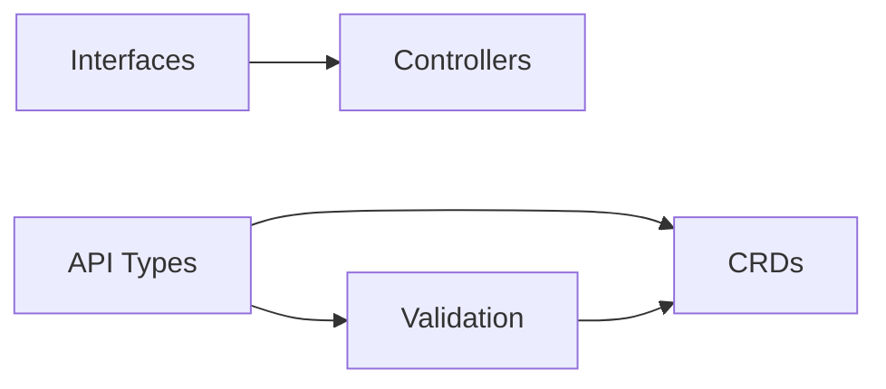

# Phase 1: Foundation & API Contracts - Detailed Implementation Plan

## Phase Overview
**Duration:** [X] days  
**Critical Path:** [YES/NO] - [Explanation]  
**Base Branch:** `main`  
**Target Integration Branch:** `phase1-integration`

---

## Wave 1.1: Core API Types & Schemas

### E1.1.1: Core API Types
**Branch:** `/phase1/wave1/effort1-api-types-core`  
**Duration:** [X] hours  
**Agent:** Single agent
**Dependencies:** None

#### Source Material:
```markdown
# If reusing existing code:
- Primary: `origin/feature/[existing-api-branch]`
- Secondary: `origin/feature/[fallback-branch]`

# If porting from another project:
- Reference: `[external-repo]/apis/`
```

#### Specific Commits to Cherry-Pick:
```bash
# From existing branches (if applicable)
# git log --oneline origin/feature/[branch] | grep -i api
# abc123def  # Core API type definitions
# 456ghi789  # API validation logic

# Or indicate new development:
# NEW DEVELOPMENT - No existing commits
```

#### Requirements:
1. **MUST** create base API group structure:
   - `apis/[project]/v1alpha1/`
   - `apis/[module]/v1alpha1/`

2. **MUST** implement core types:
   - `Config` - Configuration type
   - `Status` - Base status type
   - `Identifier` - Resource identification

3. **MUST** include standard Kubernetes patterns:
   - TypeMeta and ObjectMeta
   - DeepCopy methods
   - Validation webhooks (if applicable)

#### Test Requirements (TDD):
```go
// test/apis/core_types_test.go
func TestCoreAPITypes(t *testing.T) {
    tests := []struct {
        name     string
        input    interface{}
        expected interface{}
        wantErr  bool
    }{
        {
            name:  "valid config creation",
            input: &Config{Name: "test"},
            expected: &Config{
                Name:   "test",
                Status: "initialized",
            },
            wantErr: false,
        },
        {
            name:    "invalid config - missing name",
            input:   &Config{},
            wantErr: true,
        },
    }
    
    for _, tt := range tests {
        t.Run(tt.name, func(t *testing.T) {
            // Implementation
        })
    }
}

// Validation tests
func TestAPIValidation(t *testing.T) {
    // Test field validation
    // Test cross-field dependencies
    // Test default values
}
```

#### Pseudo-Code Implementation:
```
FUNCTION implement_api_types():
    // Step 1: Create directory structure
    CREATE_DIRS([
        "apis/[project]/v1alpha1",
        "apis/[project]/v1beta1",
    ])
    
    // Step 2: Generate or copy base types
    IF cherry_pick_available:
        CHERRY_PICK(commits_list)
        RESOLVE_CONFLICTS(prefer_newer)
    ELSE:
        GENERATE_TYPES(from_schema)
    
    // Step 3: Add deepcopy generation
    ADD_DEEPCOPY_TAGS()
    RUN("make generate")
    
    // Step 4: Implement validation
    FOR each_type IN api_types:
        CREATE validation_webhook(type)
        ADD validation_tests(type)
```

#### Validation Commands:
```bash
# After cherry-pick or implementation
make generate
git diff --exit-code  # Ensure generation is clean

# Build validation
go build ./apis/...

# Test validation
go test ./apis/... -v

# Lint check
golangci-lint run ./apis/...

# Line count check
/workspaces/[project]/tools/line-counter.sh -c $(git branch --show-current)
# MUST be < 800 lines
```

#### Success Criteria:
- [ ] All API types compile
- [ ] DeepCopy methods generated
- [ ] All validation tests pass
- [ ] Under 800 lines
- [ ] No lint errors
- [ ] Can be imported by other packages

---

### E1.1.2: Interface Definitions
**Branch:** `/phase1/wave1/effort2-interfaces`  
**Duration:** [X] hours  
**Agent:** Single agent
**Dependencies:** E1.1.1 (can run in parallel if no type dependencies)

#### Requirements:
1. **MUST** define core interfaces:
   - `Controller` interface
   - `Reconciler` interface
   - `Client` interface

2. **MUST** follow interface segregation principle
3. **MUST** include comprehensive documentation

#### Test Requirements (TDD):
```go
// test/interfaces/interface_test.go
func TestInterfaceCompliance(t *testing.T) {
    // Ensure concrete types implement interfaces
    var _ Controller = (*BaseController)(nil)
    var _ Reconciler = (*BaseReconciler)(nil)
}
```

---

## Wave 1.2: Schemas and Contracts

### E1.2.1: CRD Definitions
**Branch:** `/phase1/wave2/effort1-crds`  
**Duration:** [X] hours  
**Dependencies:** E1.1.1, E1.1.2

[Continue pattern for remaining efforts...]

---

## Wave Dependency Graph



## Dependency Table

| Effort | Depends On | Can Parallelize With | Blocks |
|--------|------------|---------------------|--------|
| E1.1.1 | None | E1.1.2 | E1.2.1, E1.1.3 |
| E1.1.2 | None | E1.1.1 | E1.2.2 |
| E1.1.3 | E1.1.1 | None | E1.2.1 |
| E1.2.1 | E1.1.1, E1.1.3 | E1.2.2 | Phase 2 |
| E1.2.2 | E1.1.2 | E1.2.1 | Phase 2 |

## Integration Strategy

### Wave 1 Integration:
```bash
# After all Wave 1 efforts complete
git checkout main
git checkout -b phase1/wave1-integration

# Merge in order of dependencies
git merge --no-ff phase1/wave1/effort1-api-types-core
git merge --no-ff phase1/wave1/effort2-interfaces
git merge --no-ff phase1/wave1/effort3-validation

# Validate integration
make test
make build
```

### Phase 1 Final Integration:
```bash
# After all waves complete
git checkout main
git checkout -b phase1-integration

# Merge waves
git merge --no-ff phase1/wave1-integration
git merge --no-ff phase1/wave2-integration

# Final validation
make test-all
make build-all
make integration-test
```

## Risk Mitigation

| Risk | Mitigation | Contingency |
|------|------------|-------------|
| API breaking changes | Version from start (v1alpha1) | Support multiple versions |
| Merge conflicts | Isolated namespaces | Manual resolution protocol |
| Failed validation | Comprehensive tests | Rollback and fix |

## Notes for Orchestrator

1. **Parallelization**: E1.1.1 and E1.1.2 can run simultaneously
2. **Critical Path**: E1.1.1 blocks most of Phase 2
3. **Review Requirements**: All API changes need architecture review
4. **Documentation**: Generate after each wave completes